<picture>
  <source media="(prefers-color-scheme: dark)" srcset="brand/abstract-logo-white.svg">
  
</picture>

# Abstract Security — Google Cloud templates

Everything needed to send Google Cloud logs to Abstract. Each template lists what it creates and what it never touches; you deploy it in your own account, with your own credentials.

## Guided setup (recommended)

One walkthrough creates and checks everything, in order: project, permissions, pipeline, Data Access, Google Workspace and alerts. Nothing changes until you say yes.

```bash
git clone https://github.com/IamABS3C/abstract-gcp-templates.git && cd abstract-gcp-templates
cloudshell launch-tutorial WALKTHROUGH.md     # in Cloud Shell: opens the walkthrough beside the terminal
./scripts/abstract-gcp-setup.sh               # anywhere with gcloud; add --check to verify only
```

## Templates

| | Template | Scope | Deploy |
|---|---|---|---|
| | **Set up first** | | |
| 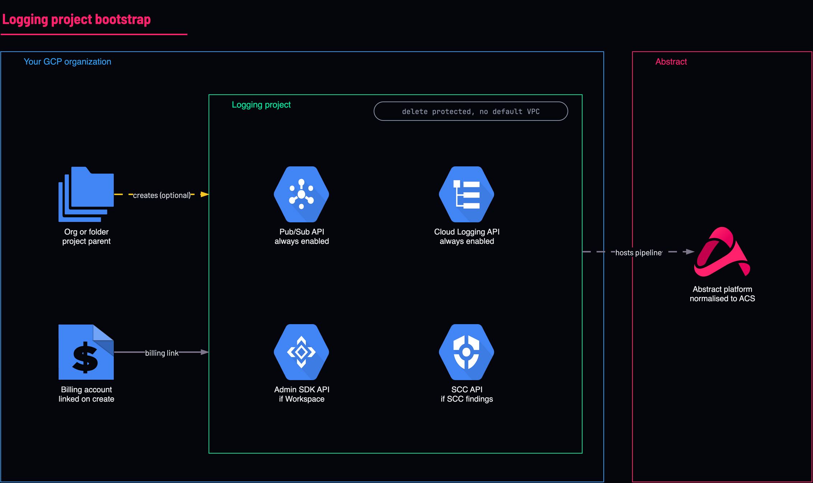 | **Logging project** | Project | [](https://shell.cloud.google.com/cloudshell/editor?cloudshell_git_repo=https://github.com/IamABS3C/abstract-gcp-templates&cloudshell_git_branch=main&cloudshell_workspace=deployments/01-logging-project&cloudshell_tutorial=TUTORIAL.md) |
| 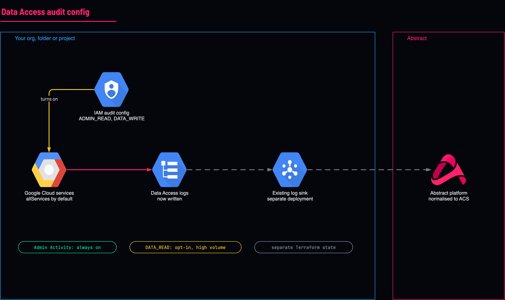 | **Data Access audit logging** | Organization | [](https://shell.cloud.google.com/cloudshell/editor?cloudshell_git_repo=https://github.com/IamABS3C/abstract-gcp-templates&cloudshell_git_branch=main&cloudshell_workspace=deployments/03-data-access&cloudshell_tutorial=TUTORIAL.md) |
| | **Sources** | | |
| 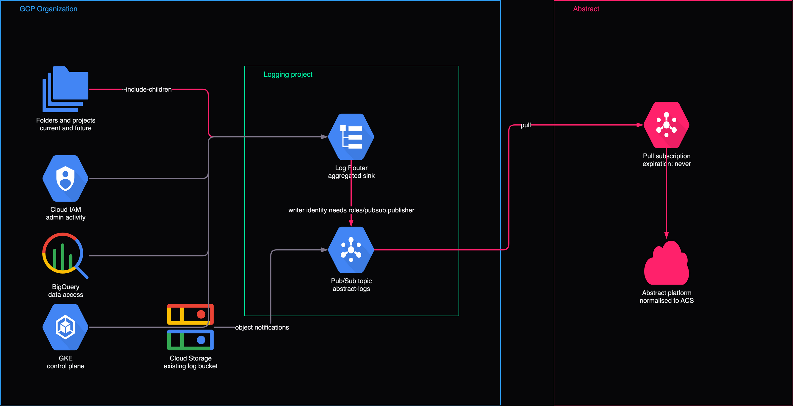 | **Audit logs, whole organization** | Organization | [](https://shell.cloud.google.com/cloudshell/editor?cloudshell_git_repo=https://github.com/IamABS3C/abstract-gcp-templates&cloudshell_git_branch=main&cloudshell_workspace=deployments/02-audit-logs-organization&cloudshell_tutorial=TUTORIAL.md) |
| 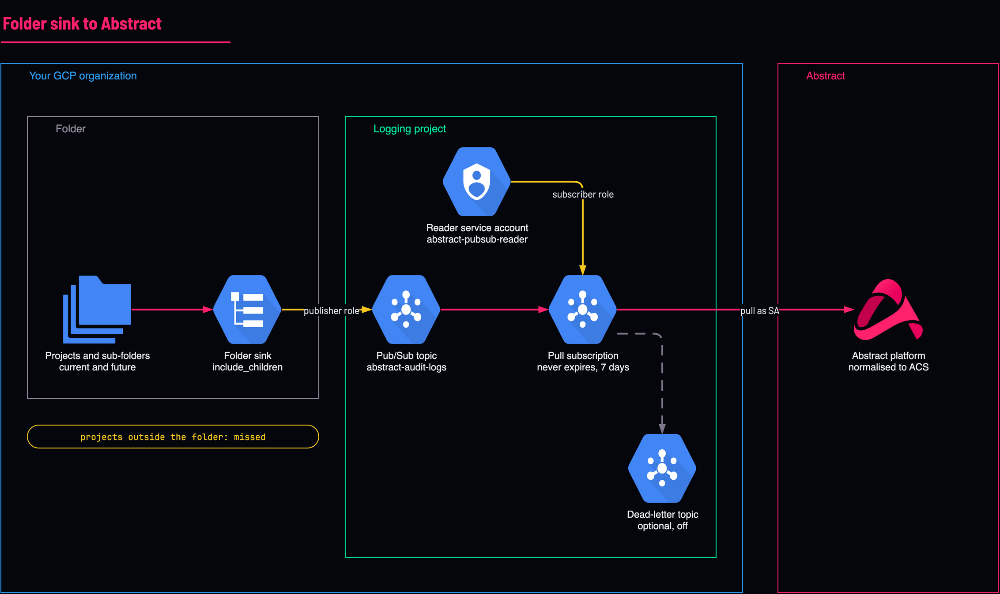 | **Audit logs, one folder** | Folder | [](https://shell.cloud.google.com/cloudshell/editor?cloudshell_git_repo=https://github.com/IamABS3C/abstract-gcp-templates&cloudshell_git_branch=main&cloudshell_workspace=deployments/02-audit-logs-folder&cloudshell_tutorial=TUTORIAL.md) |
| 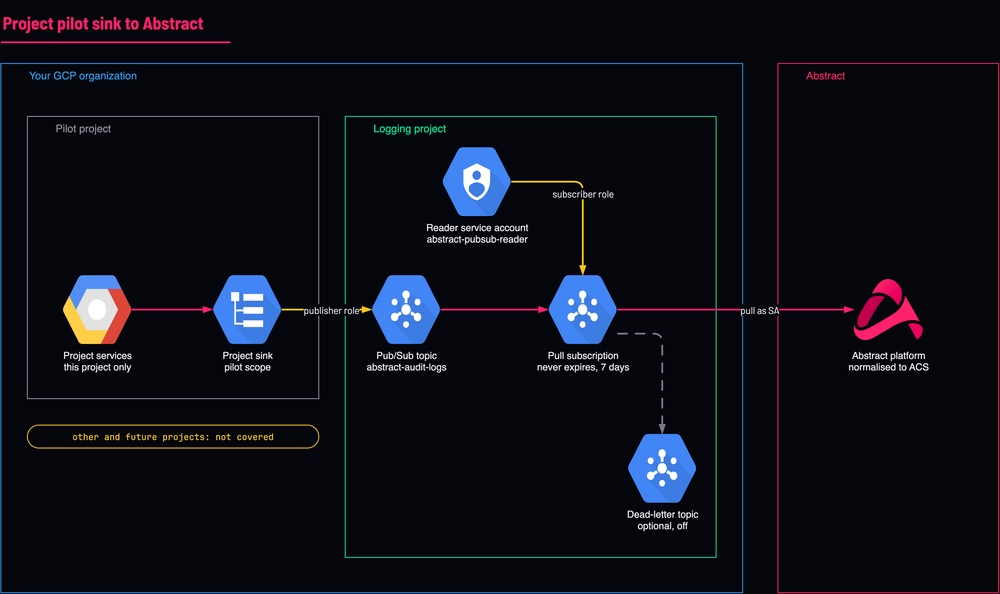 | **Audit logs, one project** | Project | [](https://shell.cloud.google.com/cloudshell/editor?cloudshell_git_repo=https://github.com/IamABS3C/abstract-gcp-templates&cloudshell_git_branch=main&cloudshell_workspace=deployments/02-audit-logs-project&cloudshell_tutorial=TUTORIAL.md) |
| 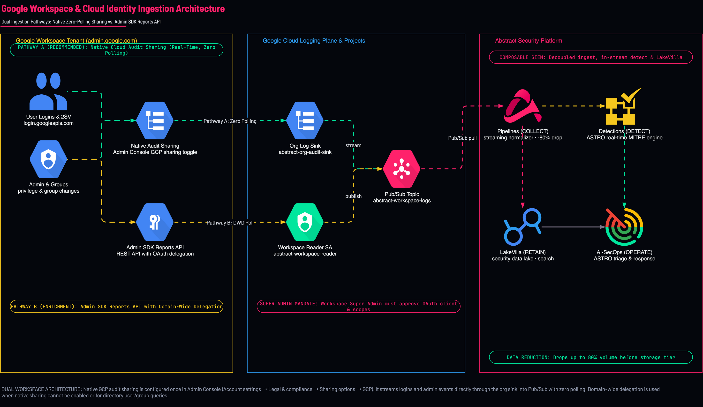 | **Google Workspace logs** | Project | [](https://shell.cloud.google.com/cloudshell/editor?cloudshell_git_repo=https://github.com/IamABS3C/abstract-gcp-templates&cloudshell_git_branch=main&cloudshell_workspace=deployments/04-workspace&cloudshell_tutorial=TUTORIAL.md) |
| 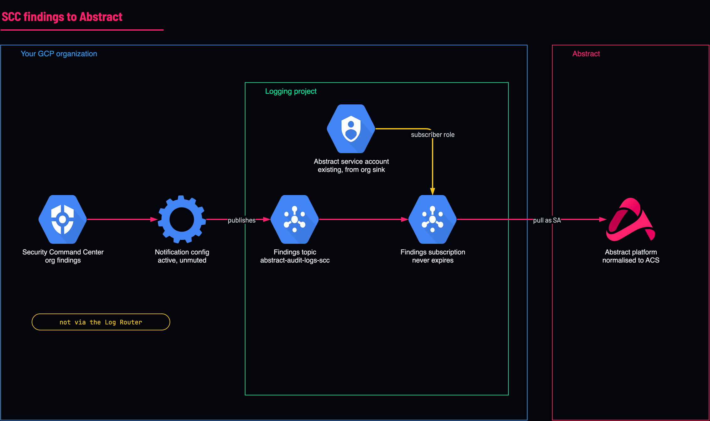 | **Security Command Center findings** | Organization | [](https://shell.cloud.google.com/cloudshell/editor?cloudshell_git_repo=https://github.com/IamABS3C/abstract-gcp-templates&cloudshell_git_branch=main&cloudshell_workspace=deployments/06-scc-findings&cloudshell_tutorial=TUTORIAL.md) |
| 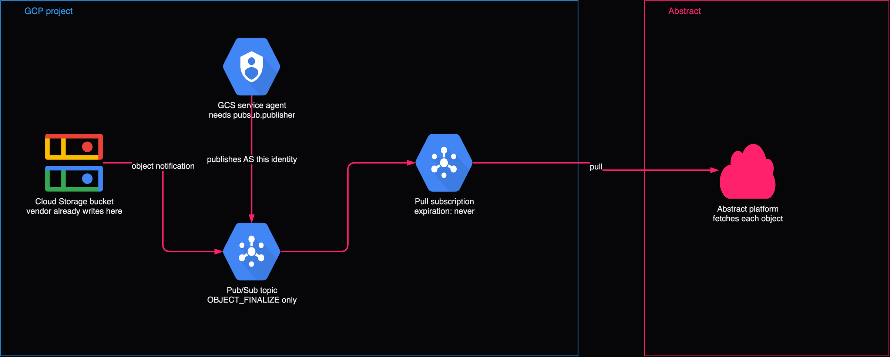 | **Logs in a Cloud Storage bucket** | Project | [](https://shell.cloud.google.com/cloudshell/editor?cloudshell_git_repo=https://github.com/IamABS3C/abstract-gcp-templates&cloudshell_git_branch=main&cloudshell_workspace=deployments/08-bucket-logs&cloudshell_tutorial=TUTORIAL.md) |
| 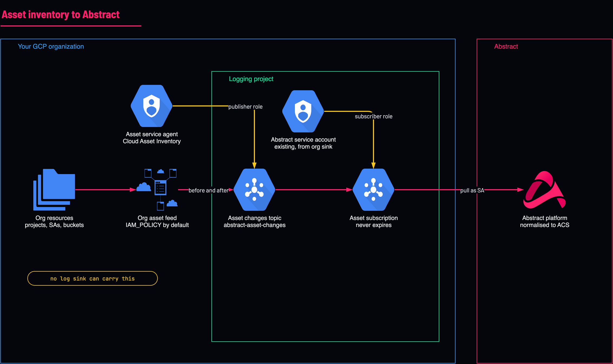 | **Asset and IAM changes** | Organization | [](https://shell.cloud.google.com/cloudshell/editor?cloudshell_git_repo=https://github.com/IamABS3C/abstract-gcp-templates&cloudshell_git_branch=main&cloudshell_workspace=deployments/07-asset-inventory&cloudshell_tutorial=TUTORIAL.md) |
| 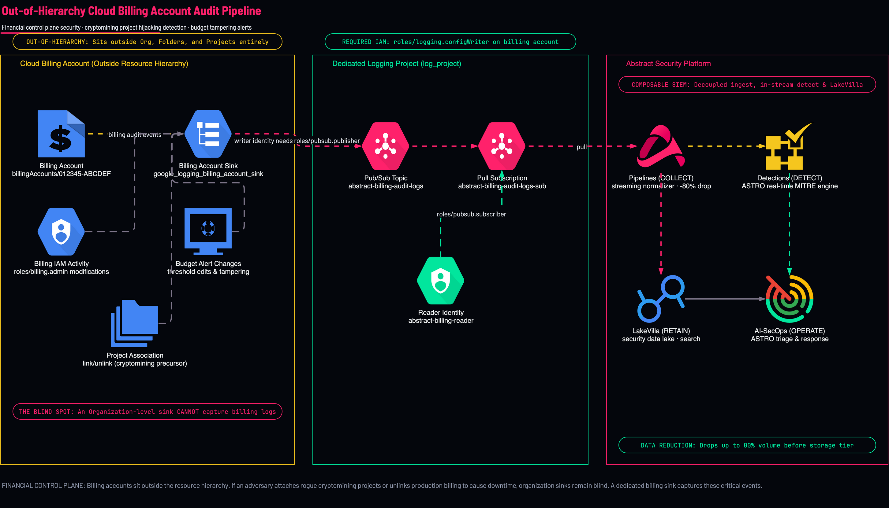 | **Billing account audit logs** | Billing account | [](https://shell.cloud.google.com/cloudshell/editor?cloudshell_git_repo=https://github.com/IamABS3C/abstract-gcp-templates&cloudshell_git_branch=main&cloudshell_workspace=deployments/10-billing-account&cloudshell_tutorial=TUTORIAL.md) |
| 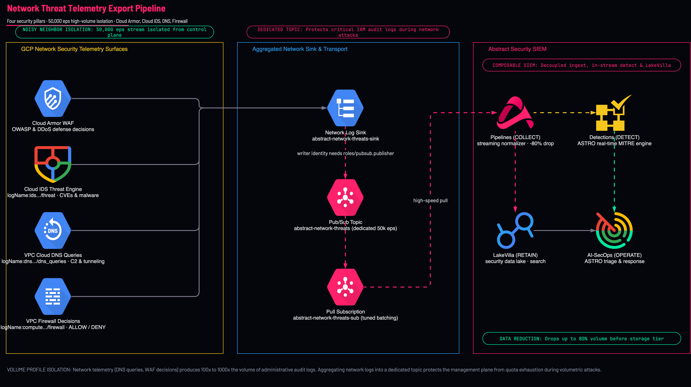 | **Network threat & security logs** (reach Pub/Sub; not yet stored by Abstract, no parser yet) | Organization | [](https://shell.cloud.google.com/cloudshell/editor?cloudshell_git_repo=https://github.com/IamABS3C/abstract-gcp-templates&cloudshell_git_branch=main&cloudshell_workspace=deployments/11-network-threats&cloudshell_tutorial=TUTORIAL.md) |
| | **Monitoring** | | |
| 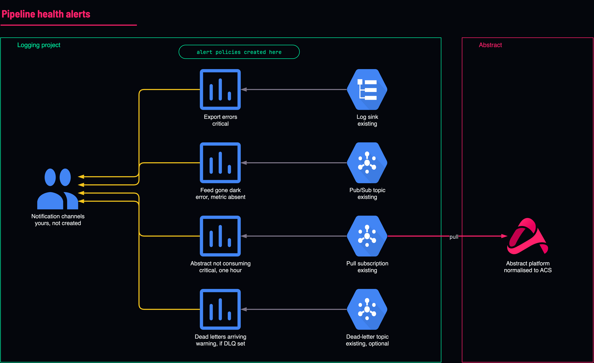 | **Pipeline health alerts** | Project | [](https://shell.cloud.google.com/cloudshell/editor?cloudshell_git_repo=https://github.com/IamABS3C/abstract-gcp-templates&cloudshell_git_branch=main&cloudshell_workspace=deployments/05-health-alerts&cloudshell_tutorial=TUTORIAL.md) |
| | **Archive** | | |
| 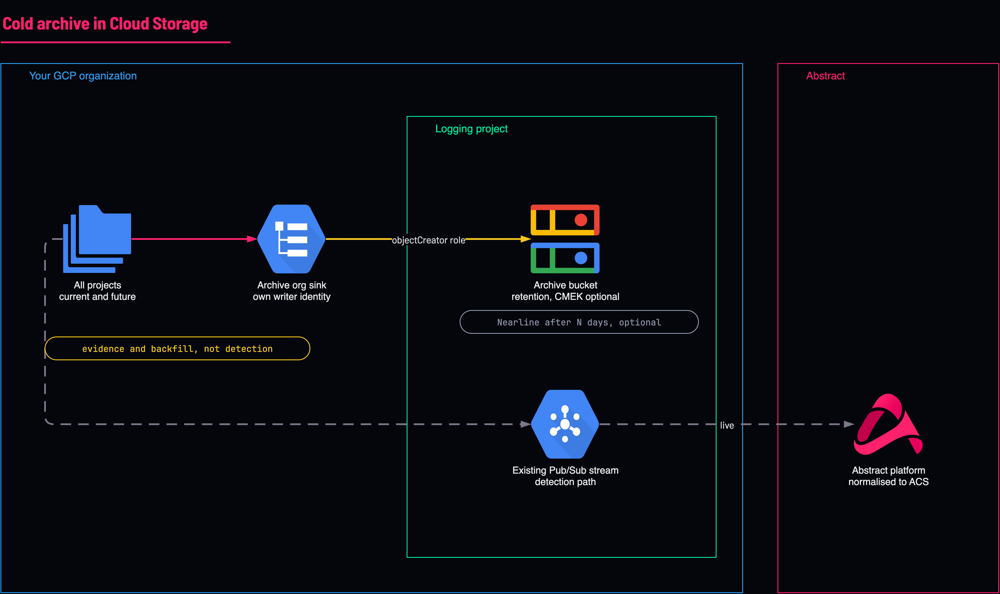 | **Log archive bucket** | Organization | [](https://shell.cloud.google.com/cloudshell/editor?cloudshell_git_repo=https://github.com/IamABS3C/abstract-gcp-templates&cloudshell_git_branch=main&cloudshell_workspace=deployments/09-log-archive&cloudshell_tutorial=TUTORIAL.md) |

**Open in Cloud Shell** clones this repository into your own Cloud Shell and opens the template's step-by-step tutorial beside the terminal.

## Or from Google Cloud Shell

```bash
git clone https://github.com/IamABS3C/abstract-gcp-templates.git && cd abstract-gcp-templates
export ORG_ID=<org-id>
export LOG_PROJECT=<log-project-id>

# Read-only preflight: roles/logging.configWriter at the organization is the blocker.
scripts/preflight.sh --project "$LOG_PROJECT" --org-id "$ORG_ID"

cd deployments/02-audit-logs-organization
terraform init
terraform plan  -var org_id="$ORG_ID" -var log_project="$LOG_PROJECT"
terraform apply -var org_id="$ORG_ID" -var log_project="$LOG_PROJECT"

# Or without Terraform: dry run by default, add --confirm to apply.
# scripts/deploy-abstract-gcp.sh --scope organization \
#   --scope-id "$ORG_ID" --log-project "$LOG_PROJECT"
```

Each template's parameters, permissions and checks are in the file itself and in `docs/`.

## Architecture & Interactive Diagrams

- [Architecture Design & Decisions Guide](docs/ARCHITECTURE.md): Complete breakdown of log scopes, quotas, regional residency, VPC-SC boundaries, and Draw.io visual models.
- [Identity Threat Detection & Authentication Auditing Guide](docs/IDENTITY-AND-AUTHENTICATION-GUIDE.md): Enterprise reference for Google Workspace logins (`login.googleapis.com`), service account impersonation (`iamcredentials`), Workload Identity Federation (`sts`), static key leakage detection, OneUptime auditing principles, and production SIEM detection rules.
- **Draw.io Desktop & Web Integration**: Open and customize any architecture diagram in this repository directly in your desktop Draw.io application or via diagrams.net:
  ```bash
  ./scripts/open-diagram.sh 04-identity-auth-oneuptime          # Opens in macOS Draw.io Desktop
  ./scripts/open-diagram.sh 11-network-threats --web            # Opens in diagrams.net
  ```


<details><summary>Renamed folders (for older copies)</summary>

`deployments/00-assessment` → `deployments/00-preflight`  
`deployments/06-bootstrap` → `deployments/01-logging-project`  
`deployments/01-organization` → `deployments/02-audit-logs-organization`  
`deployments/02-folder` → `deployments/02-audit-logs-folder`  
`deployments/03-project-pilot` → `deployments/02-audit-logs-project`  
`deployments/05-audit-config` → `deployments/03-data-access`  
`deployments/10-monitoring` → `deployments/05-health-alerts`  
`deployments/07-scc-findings` → `deployments/06-scc-findings`  
`deployments/11-asset-inventory` → `deployments/07-asset-inventory`  
`deployments/09-gcs-notifications` → `deployments/08-bucket-logs`  
`deployments/08-gcs-archive` → `deployments/09-log-archive`  

Move your `backend.tf`, `terraform.tfvars`, `.terraform/` and any local state into the new folder before `plan`. State keys keep the old names, so remote state is still found.

</details>
