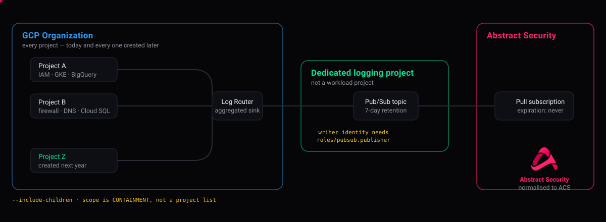
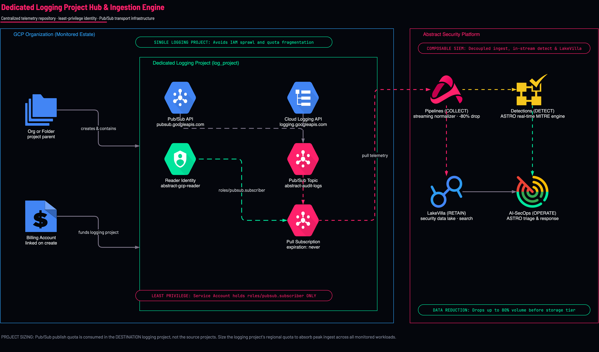
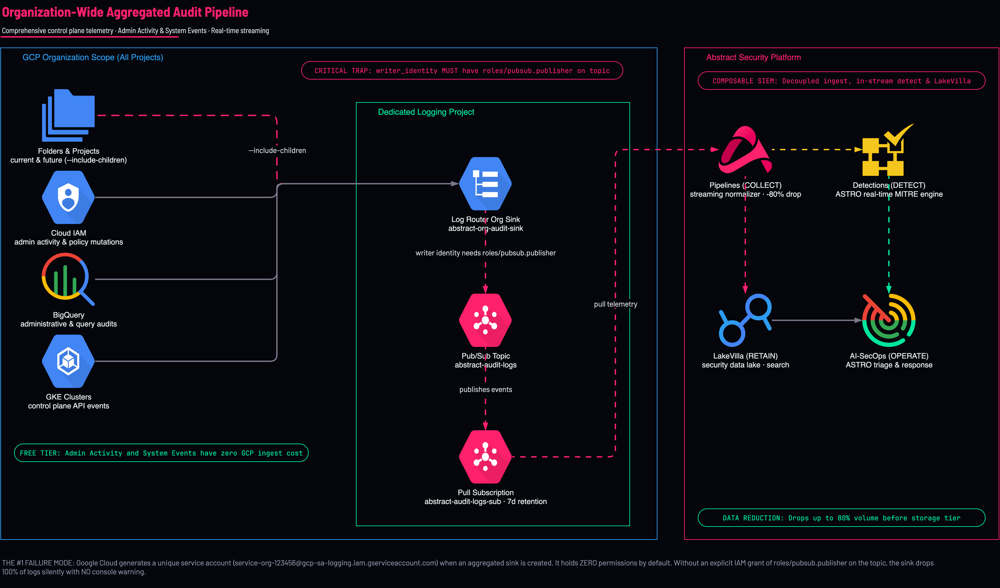
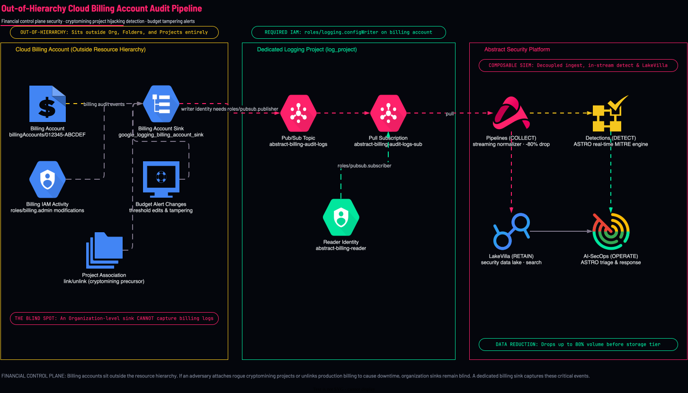
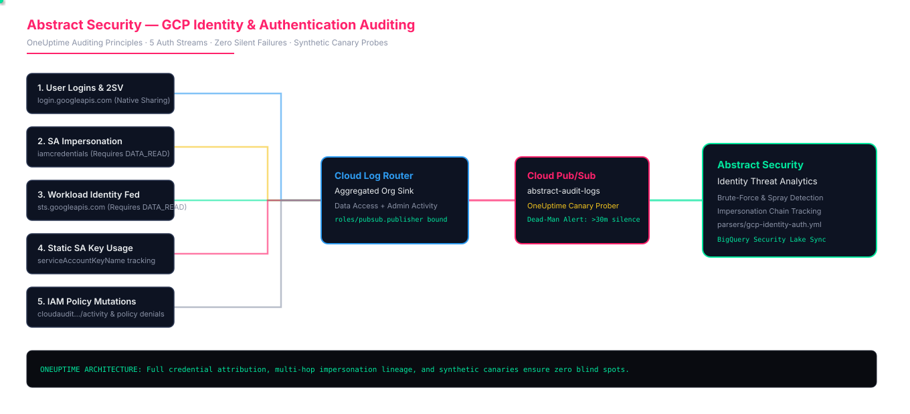

# Google Cloud & Workspace Master Security Onboarding

<walkthrough-tutorial-duration duration="35"></walkthrough-tutorial-duration>

## Overview & Architecture

Welcome to the **Abstract Security Google Cloud Platform (GCP) and Google Workspace Master Onboarding Walkthrough**.

This interactive guide walks you through a complete security assessment of your Google Cloud estate, guides architectural decisions, and deploys production-grade telemetry pipelines to stream all audit logs, network threat events, billing activities, posture findings, and identity changes to Abstract Security.

```
┌─────────────────────────────────────────────────────────────────────────────┐
│                       Google Cloud Resource Hierarchy                       │
│                                                                             │
│   ┌─────────────────────────────────────────────────────────────────────┐   │
│   │                     Organization (ID: $ORG_ID)                      │   │
│   │  • Aggregated Log Sink (Admin Activity, Policy Denied, System Events)│   │
│   │  • Data Access Audit Config (BigQuery, Cloud Storage, Cloud KMS)    │   │
│   │  • Security Command Center (SCC Findings Notification Config)       │   │
│   │  • Cloud Asset Inventory (Real-Time Resource & IAM Diff Feeds)      │   │
│   └──────────────────────────────────┬──────────────────────────────────┘   │
│                                      │                                       │
│          ┌───────────────────────────┴───────────────────────────┐           │
│          ▼                                                       ▼           │
│   ┌──────────────┐                                        ┌──────────────┐   │
│   │ Folders / OU │                                        │ Workload Proj│   │
│   │ (Subtree)    │                                        │ (Compute, GKE│   │
│   └──────┬───────┘                                        │  Cloud Armor)│   │
│          ▼                                                       └──────┬───────┘   │
│   ┌──────────────┐                                                      │   │
│   │ Child Projs  │                                                      │   │
│   └──────┬───────┘                                                      │   │
│          │                                                              │   │
│          └───────────────────────────┬──────────────────────────────────┘   │
│                                      │                                       │
│                                      ▼                                       │
│               ┌──────────────────────────────────────────────┐              │
│               │     Centralized Security Logging Project     │              │
│               │             ($LOG_PROJECT)                   │              │
│               │                                              │              │
│               │  ┌──────────────────┐  ┌──────────────────┐  │              │
│               │  │  Pub/Sub Topics  │  │  Subscriptions   │  │              │
│               │  │  • audit-logs    ├──┼─► • audit-sub    ├──┼──┐           │
│               │  │  • network-threat├──┼─► • network-sub  │  │  │           │
│               │  │  • scc-findings  ├──┼─► • scc-sub      │  │  │           │
│               │  │  • asset-changes ├──┼─► • asset-sub    │  │  │           │
│               │  └──────────────────┘  └──────────────────┘  │  │           │
│               │                                              │  │           │
│               │  ┌────────────────────────────────────────┐  │  │           │
│               │  │ Long-term GCS Archive (Retention Lock) │  │  │           │
│               │  └────────────────────────────────────────┘  │  │           │
│               └──────────────────────────────────────────────┘  │           │
│                                                                 │           │
│   ┌──────────────────────────┐                                  │           │
│   │  Billing Account (Logs)  │ (Out-of-Hierarchy Sink)          │           │
│   └─────────────┬────────────┘                                  │           │
│                 └───────────────────────────────────────────────┘           │
└──────────────────────────────────────┬──────────────────────────────────────┘
                                       │ Abstract Service Account Pull
                                       ▼
                     ┌───────────────────────────────────┐
                     │         Abstract Security         │
                     │  • SIEM & Security Analytics      │
                     │  • Normalization (ECS / OCSF)     │
                     │  • Real-time Threat Detection     │
                     └───────────────────────────────────┘
```

### Real-Time Telemetry Dataflow Architecture



> [!TIP]
> **Architecture & Diagnostic References**:
> - 📘 **Architecture & Dataflow**: [Master GCP Telemetry Dataflow Reference](docs/DATAFLOW-AND-ARCHITECTURE-REFERENCE.md)
> - 🛠️ **Troubleshooting**: [Master Troubleshooting & Diagnostic Runbook](docs/TROUBLESHOOTING-GUIDE.md)
> - 🎨 **Draw.io Desktop Launcher**:
>   - Desktop: `./scripts/open-diagram.sh gcp-orgwide-audit-logs`
>   - Browser: `./scripts/open-diagram.sh gcp-orgwide-audit-logs --web`

### What You Can Choose in This Guide
1. **Interactive Guided Automation**: Run turnkey scripts that test permissions and deploy resources interactively.
2. **Modular OpenTofu / Terraform Roots**: Deploy individual, hardened templates in `deployments/*`.
3. **Google Cloud Infrastructure Manager**: Run managed, declarative GitOps deployments directly on Google Cloud.

Make all helper scripts executable to begin:

```bash
chmod +x scripts/*.sh tests/*.sh
```

Click **Start** to proceed to the Estate Assessment.

---

## 1. Automated Estate Security Audit

**What it does.** Runs a comprehensive, non-destructive discovery and security audit of your entire Google Cloud estate.

**Why.** You should never deploy security pipelines blindly. The assessment inspects your hierarchy level, identifies existing logging projects, discovers active log sinks, audits Data Access configurations, checks network logging policies, and evaluates billing accounts.

Run the assessment script:

```bash
./scripts/audit-gcp-estate.sh
```

### What the Audit Evaluates:
- **Identity & Organization**: Discovers your active account, Organization ID, Folders, and total Project count.
- **Logging Project Candidates**: Checks for existing projects dedicated to security, audit, or SIEM telemetry.
- **IAM Permission Preflight**: Tests whether you hold `roles/logging.configWriter` (the #1 onboarding blocker), `roles/resourcemanager.organizationAdmin`, and Pub/Sub Admin.
- **Org Policy Constraints**: Verifies if `iam.disableServiceAccountKeyCreation` is enforced.
- **Data Access Coverage**: Tests if BigQuery, Cloud Storage, or Cloud KMS have data-plane logging enabled.
- **Network Telemetry**: Checks Cloud Armor WAF on Backend Services, Cloud IDS endpoints, Cloud DNS VPC query policies, and Firewall rule logging.
- **Out-of-Hierarchy Billing**: Detects billing accounts and verifies whether billing audit sinks exist.
- **Security Command Center & Assets**: Audits finding notifications and real-time asset change feeds.

### Diagnostic Verification Checkpoint:

Verify that the estate audit discovered your authenticated principal and target organization:

```bash
# Verify your active GCP identity and discovered Organization ID:
echo "Active Identity: $(gcloud config get-value account 2>/dev/null)"
echo "Configured Organization ID: ${ORG_ID:-<not-set>}"
```

> [!NOTE]
> If `ORG_ID` is empty or access is denied during discovery, see [Troubleshooting Scenario 02: Org & Folder Sinks](docs/TROUBLESHOOTING-GUIDE.md#scenario-02-org--folder-aggregated-sinks) to verify your resource hierarchy bindings.

> [!TIP]
> **Reference Documentation**:
> - [Google Cloud Resource Hierarchy](https://cloud.google.com/resource-manager/docs/cloud-platform-resource-hierarchy)
> - [Google Cloud Asset Inventory Overview](https://cloud.google.com/asset-inventory/docs/overview)

---

## 2. Architecture Strategy: Logging Project & Topology

**What it does.** Guides the architectural decision between a centralized logging project versus per-project logging, and sets up your target project.

<p align="center">
  
</p>

### Centralized Logging Project vs. Per-Project Sprawl

| Strategy | Advantages | Trade-offs & Risks | Recommendation |
|---|---|---|---|
| **Centralized Logging Project (Recommended)** | • Single IAM boundary<br>• Centralized Pub/Sub quota pool<br>• One integration to connect in Abstract<br>• Zero risk of omitting new projects | Requires org-level permissions to configure. | **Standard for 99% of estates.** Recommended. |
| **Per-Project Logging** | Independent administration per project team. | • Sinks capped at 200 per project<br>• Massive IAM key sprawl<br>• Silent failure blindness<br>• Future projects omitted by default | Pilot / sandbox testing only. Avoid in production. |

### When Should You Split Logging Projects?
Only split logging projects when constrained by:
1. **Data Residency Compliance**: EU logs must not transit or rest in US regions. Use one logging project per region with `resource.location` sink filters.
2. **Pub/Sub Regional Quota**: Publish throughput exceeds 100,000 messages/sec in a single project/region.
3. **Strict Separation of Duties**: Highly regulated environments where the SOC and workload teams cannot share a GCP project.

### Free Tier vs. Billing Requirements
- **Cloud Logging & Pub/Sub**: Both operate on GCP Free Tier for audit log feeds. You can deploy this entire logging pipeline on a project with **billing disabled**!
- **Infrastructure Manager & Cloud Build**: Require an **open billing account** to enable `cloudbuild.googleapis.com`.

### Choose Your Project Path:
To create or designate your centralized logging project:
- **Interactive Script**: Run `./scripts/abstract-gcp-setup.sh --step 3`
- **Terraform / OpenTofu**: Use [`deployments/01-logging-project`](deployments/01-logging-project)

```bash
export LOG_PROJECT="your-central-logging-project-id"
export ORG_ID="your-gcp-org-id"
gcloud config set project "$LOG_PROJECT"
```

### Diagnostic Verification Checkpoint:

Verify that the centralized logging project exists and has required service APIs enabled:

```bash
gcloud projects describe "$LOG_PROJECT" --format="table(projectId,projectNumber,lifecycleState)"
gcloud services list --project="$LOG_PROJECT" --enabled \
  --filter="name:(pubsub.googleapis.com OR logging.googleapis.com OR cloudresourcemanager.googleapis.com)"
```

> [!TIP]
> For quota sizing and regional placement considerations, consult [Master GCP Telemetry Dataflow Reference](docs/DATAFLOW-AND-ARCHITECTURE-REFERENCE.md#21-centralized-logging-project-01-logging-project) and [Troubleshooting Scenario 01](docs/TROUBLESHOOTING-GUIDE.md#scenario-01-centralized-logging-project).

> [!NOTE]
> **Reference Documentation**:
> - [Design Patterns for Exporting Logging Data](https://cloud.google.com/architecture/design-patterns-for-exporting-logging-data)
> - [Architecture: Centralized Log Storage](https://cloud.google.com/architecture/centralized-logging-architecture)

---

## 3. Governance, IAM & Service Account Key Policies

**What it does.** Verifies exact IAM permissions and tests Google Cloud Organization Policies before building infrastructure.

### The #1 Blocker: Organization `logging.configWriter`
To create an aggregated sink covering all projects in your organization, the deployer **must hold `roles/logging.configWriter` at the Organization level**.
*Project Owner or Editor is NOT sufficient.*

Check who holds it in your organization:

```bash
gcloud organizations get-iam-policy "$ORG_ID" \
  --flatten="bindings[].members" \
  --filter="bindings.role:roles/logging.configWriter" \
  --format="table(bindings.members)"
```

### Service Account Key Organization Policy
Abstract Security pulls telemetry from Google Cloud Pub/Sub via a dedicated, least-privilege service account authenticated with a private key.
If your organization enforces the constraint `constraints/iam.disableServiceAccountKeyCreation`, key creation will fail.

Check effective enforcement on your logging project:

```bash
gcloud resource-manager org-policies describe iam.disableServiceAccountKeyCreation \
  --project="$LOG_PROJECT" --effective --format='value(booleanPolicy.enforced)'
```

If enforced, request an organizational policy exemption for Abstract's service account or configure the key in a folder/project exempt from the constraint.

Run the deep preflight test:

```bash
./scripts/preflight.sh --project "$LOG_PROJECT" --org-id "$ORG_ID"
```

### Diagnostic Verification Checkpoint:

Verify your identity holds `roles/logging.configWriter` at the Organization level and that key creation is unblocked:

```bash
# 1. Verify you hold roles/logging.configWriter at Organization level (the #1 blocker)
gcloud organizations get-iam-policy "$ORG_ID" \
  --flatten="bindings[].members" \
  --filter="bindings.role:roles/logging.configWriter AND bindings.members:$(gcloud config get-value account)" \
  --format="table(bindings.role,bindings.members)"

# 2. Check effective SA Key policy enforcement on $LOG_PROJECT
gcloud resource-manager org-policies describe iam.disableServiceAccountKeyCreation \
  --project="$LOG_PROJECT" --effective --format='value(booleanPolicy.enforced)'
```

> [!WARNING]
> If `roles/logging.configWriter` is not returned, the deployment will fail with a 403 error. See [Master Troubleshooting Guide: Step 2](docs/TROUBLESHOOTING-GUIDE.md#step-2-log-router-sink-configuration--hierarchy-inheritance) and [Permissions Reference](docs/PERMISSIONS.md#the-one-that-blocks-people).

> [!TIP]
> See our complete permissions matrix in [docs/PERMISSIONS.md](docs/PERMISSIONS.md).
> Official Google Docs: [Cloud Logging Access Control Guide](https://cloud.google.com/logging/docs/access-control).

---

## 4. Core Audit Log Pipeline (Admin Activity & System Events)

**What it does.** Creates the primary Pub/Sub topic, durable pull subscription, and the aggregated log sink.

<p align="center">
  
</p>

```
Log Sources (All Projects) ──► Aggregated Org Sink ──► Pub/Sub Topic ──► Subscription ──► Abstract Security
                                    │                      ▲
                                    └─ roles/pubsub.publisher ─┘
                                       (THE CRITICAL BINDING)
```

### Components Created:
1. **Pub/Sub Topic**: `abstract-audit-logs` in `$LOG_PROJECT`.
2. **Pub/Sub Subscription**: `abstract-audit-logs-sub` (never expires, 7-day message retention, 60s ack deadline).
3. **Aggregated Log Sink**: `abstract-org-audit-sink` at Organization scope with `includeChildren = true`.
4. **Sink Publisher IAM Grant**: Grants `roles/pubsub.publisher` on the topic to the sink's unique `writer_identity`.
5. **Subscriber Service Account**: `abstract-pubsub-reader` with `roles/pubsub.subscriber` on the subscription ONLY.

> [!WARNING]
> **The Critical Trap (#1 Failure Mode in GCP Logging)**:
> When Google Cloud creates an aggregated sink, it assigns it a unique service account (`serviceAccount:service-org-123456@gcp-sa-logging.iam.gserviceaccount.com`).
> **This identity holds zero permissions by default.** Without an explicit `roles/pubsub.publisher` IAM grant on the destination topic, the sink fails silently—reporting no errors in the console while delivering zero messages!

### Deploy the Core Pipeline:

**Option A — Interactive Script**:
```bash
./scripts/abstract-gcp-setup.sh --step 4
./scripts/abstract-gcp-setup.sh --step 5
```

**Option B — OpenTofu / Terraform**:
```bash
cd deployments/02-audit-logs-organization
cp terraform.tfvars.example terraform.tfvars
# Set org_id and log_project in terraform.tfvars
tofu init && tofu apply
cd ../..
```

*(If operating at Folder or Project scope, use `deployments/02-audit-logs-folder` or `deployments/02-audit-logs-project`).*

### Diagnostic Verification Checkpoint:

Confirm the aggregated sink, topic, writer permissions, and pull subscription are operational:

```bash
# 1. Verify aggregated sink has includeChildren=true
gcloud logging sinks describe abstract-org-audit-sink --organization="$ORG_ID" \
  --format="yaml(name,destination,includeChildren,writerIdentity)"

# 2. Verify sink writerIdentity holds roles/pubsub.publisher on the topic (The Critical Binding)
SINK_WRITER=$(gcloud logging sinks describe abstract-org-audit-sink --organization="$ORG_ID" --format="value(writerIdentity)")
echo "Sink Writer Service Account: ${SINK_WRITER}"
gcloud pubsub topics get-iam-policy abstract-audit-logs --project="$LOG_PROJECT" \
  --flatten="bindings[].members" \
  --filter="bindings.role:roles/pubsub.publisher AND bindings.members:${SINK_WRITER}" \
  --format="table(bindings.role,bindings.members)"

# 3. Verify the pull subscription exists and has a 7-day retention window
gcloud pubsub subscriptions describe abstract-audit-logs-sub --project="$LOG_PROJECT" \
  --format="table(name,ackDeadlineSeconds,messageRetentionDuration)"
```

> [!CAUTION]
> If `roles/pubsub.publisher` is missing from the topic IAM policy, the sink will fail silently. Follow [Troubleshooting Guide: Step 3 (The #1 Silent Failure Trap)](docs/TROUBLESHOOTING-GUIDE.md#step-3-sink-writer-identity--pubsub-topic-permissions-the-1-silent-failure-trap) to grant it immediately.

> [!NOTE]
> **Reference Documentation**:
> - [Aggregated Sinks in Cloud Logging](https://cloud.google.com/logging/docs/export/aggregated_sinks)
> - [Pub/Sub Subscriber Overview](https://cloud.google.com/pubsub/docs/pull)
> - [Master GCP Telemetry Dataflow Reference](docs/DATAFLOW-AND-ARCHITECTURE-REFERENCE.md#22-organization-wide-aggregated-audit-log-sink-02-audit-logs-organization)

---

## 5. Data Access Audit Logging (The High-Signal vs Cost Decision)

**What it does.** Configures data-plane auditing for sensitive services (BigQuery, Cloud Storage, Cloud KMS) and routes them through the sink.

### The Two-Switch Rule
Data Access logs are **off by default** in Google Cloud. Turning them on requires two separate configurations:

```
[Switch 1: GENERATE]                              [Switch 2: ROUTE]
IAM Audit Config at Org Scope    ─────────────►   Log Sink Filter Clause
(Enables BigQuery, Storage, KMS)                  (Matches cloudaudit.googleapis.com%2Fdata_access)
```

> [!CAUTION]
> **Either switch alone does nothing!**
> - If you turn on Switch 1 but forget Switch 2: Google generates and bills for the logs, but they never reach Abstract.
> - If you turn on Switch 2 but forget Switch 1: The filter matches nothing with no error.

### Cost Control: Never Use `allServices`
Enabling `allServices` for `DATA_READ` on a medium-to-large organization can increase log ingestion volume by **100x to 1000x**, creating massive GCP and SIEM cost spikes.

**Best Practice Strategy**:
- Audit high-value services specifically:
  - `bigquery.googleapis.com`: Query text, job detail, referenced tables (data exfiltration detection).
  - `storage.googleapis.com`: Bucket and object read/write operations.
  - `cloudkms.googleapis.com`: Cryptographic key operations (ransomware and exfiltration precursor).
- Start with log types `ADMIN_READ` and `DATA_WRITE` (low-medium volume). Add `DATA_READ` on scoped BigQuery datasets.

### Deploy Data Access Audit Logging:

**Option A — Interactive Script**:
```bash
./scripts/abstract-gcp-setup.sh --step 6
```

**Option B — OpenTofu / Terraform**:
```bash
cd deployments/03-data-access
cp terraform.tfvars.example terraform.tfvars
tofu init && tofu apply
cd ../..
```

### Diagnostic Verification Checkpoint:

Confirm that Data Access audit logging policies are active and that the sink filter routes them:

```bash
# 1. Verify org-level auditConfig is active for target services
gcloud organizations get-iam-policy "$ORG_ID" \
  --flatten="auditConfigs[].auditLogConfigs" \
  --filter="auditConfigs.service:(bigquery.googleapis.com OR storage.googleapis.com OR cloudkms.googleapis.com)" \
  --format="table(auditConfigs.service,auditConfigs.auditLogConfigs.logType)"

# 2. Verify recent data-plane logs are being ingested into Cloud Logging
gcloud logging read 'logName:"logs/cloudaudit.googleapis.com%2Fdata_access"' \
  --project="$LOG_PROJECT" --limit=3 --freshness=1h \
  --format="table(timestamp,protoPayload.serviceName,protoPayload.methodName)"
```

> [!NOTE]
> If data access logs are absent or query volume spikes unpredictably, consult [Troubleshooting Scenario 03: Data Access Logs](docs/TROUBLESHOOTING-GUIDE.md#scenario-03-data-access-logs-bigquery--storage) and [Filters Catalog: Data Access](docs/FILTERS.md#data-access--the-cost-decision-for-the-whole-engagement).

> [!NOTE]
> **Reference Documentation**:
> - [Google Cloud Audit Logs: Data Access Architecture](https://cloud.google.com/logging/docs/audit#data-access)
> - [Audit Configuration in IAM Policies](https://cloud.google.com/iam/docs/audit-logging)
> - [Enterprise Identity Threat Detection & Authentication Auditing Guide](docs/IDENTITY-AND-AUTHENTICATION-GUIDE.md) (explains why `iamcredentials` and `sts` require Data Access logging)
> - [Master GCP Telemetry Dataflow Reference: Section 2.3](docs/DATAFLOW-AND-ARCHITECTURE-REFERENCE.md#23-data-access-audit-logging-03-data-access)

---

## 6. Network Threat Telemetry (Cloud Armor, Cloud IDS, DNS, Firewalls)

**What it does.** Deploys a dedicated pipeline for network security events: Cloud Armor WAF decisions, Cloud IDS threat signatures, Cloud DNS query logging, and Compute Engine firewall rules.

> [!WARNING]
> These logs reach the Pub/Sub topic; Abstract's managed GCP parser does not yet store them (it keeps only Cloud Audit Logs, and there is no network parser yet). Do not rely on them for detection until a parser ships.

<p align="center">
  
</p>

> [!TIP]
> **Interactive Architecture Diagram (Draw.io / diagrams.net)**:
> Edit, export, and customize this architecture directly on your machine or browser:
> ```bash
> ./scripts/open-diagram.sh 11-network-threats          # Opens in macOS Draw.io Desktop
> ./scripts/open-diagram.sh 11-network-threats --web    # Opens in diagrams.net
> ```

```
Cloud Armor WAF (Backend Svcs) ─┐
Cloud IDS Intrusion Signatures  ─┼─► Dedicated Network Sink ──► Topic ──► Abstract Security
Cloud DNS Queries (VPC Policy)  ─┤   (High Volume Pipeline)
Firewall Rules (Allow / Deny)   ─┘
```

### Shared Audit Topic vs. Dedicated Network Pipeline

| Consideration | Shared with Audit Topic (`02-audit-logs`) | Dedicated Network Topic (`11-network-threats`) |
|---|---|---|
| **Volume Profile** | Admin logs: 5–50 events/sec. Low volume. | DNS & WAF: 2,000–50,000+ events/sec. High volume. |
| **Noisy Neighbor Risk** | High: A network volumetric attack or DNS burst can throttle and delay critical IAM audit logs. | **Zero**: High-volume network stream is isolated; control plane audit delivery remains unaffected. |
| **Abstract Pipeline** | Single ingestion parser pipeline. | No network parser yet: these logs are not stored by Abstract today. |
| **Recommendation** | Low-traffic sandbox / pilot. | **Production enterprise environments.** |

### Prerequisites in Workload Projects:
1. **Cloud Armor**: Enable logging on HTTP(S) Load Balancer backend services (`log_config { enable = true }`).
2. **Cloud IDS**: Provision Cloud IDS endpoint profiles on VPCs.
3. **Cloud DNS Query Logging**: Enable query logging in VPC Server Policies.
4. **Firewall Rules**: Enable rule logging on perimeter deny rules and sensitive ingress rules.

### Deploy Network Threat Telemetry:

```bash
cd deployments/11-network-threats
cp terraform.tfvars.example terraform.tfvars
tofu init && tofu apply
cd ../..
```

### Diagnostic Verification Checkpoint:

Verify that the dedicated network threat pipeline is provisioned and isolated:

```bash
# 1. Verify dedicated network threat sink and topic exist
gcloud logging sinks describe abstract-network-threats-sink --organization="$ORG_ID" \
  --format="yaml(name,destination,includeChildren,writerIdentity)" 2>/dev/null || true
gcloud pubsub topics describe abstract-network-threats --project="$LOG_PROJECT" --format="value(name)"

# 2. Check Cloud Armor logging status on workload backend services
gcloud compute backend-services list --project="$LOG_PROJECT" \
  --format="table(name,logConfig.enable,logConfig.sampleRate)" 2>/dev/null || true
```

> [!TIP]
> For detailed network threat parser definitions and volume management, see [Troubleshooting Scenario 11: Network Threat Detection](docs/TROUBLESHOOTING-GUIDE.md#scenario-11-network-threat-detection-cloud-armor--ids) and [Dataflow Reference: Section 2.10](docs/DATAFLOW-AND-ARCHITECTURE-REFERENCE.md#210-network-threat-telemetry-11-network-threats).

> [!TIP]
> **Reference Documentation**:
> - [Cloud Armor Request Logging Guide](https://cloud.google.com/armor/docs/request-logging)
> - [Cloud IDS Threat Log Reference](https://cloud.google.com/intrusion-detection-system/docs/logging)
> - [Cloud DNS Query Logging](https://cloud.google.com/dns/docs/monitoring#logging)

---

## 7. Out-of-Hierarchy Billing Account Audit Logs

**What it does.** Deploys a dedicated sink attached directly to your Cloud Billing Account.

<p align="center">
  
</p>

> [!TIP]
> **Interactive Architecture Diagram (Draw.io / diagrams.net)**:
> Edit, export, and customize this architecture directly on your machine or browser:
> ```bash
> ./scripts/open-diagram.sh 10-billing-account          # Opens in macOS Draw.io Desktop
> ./scripts/open-diagram.sh 10-billing-account --web    # Opens in diagrams.net
> ```

### Why Billing Logs Require a Separate Sink
Billing Accounts sit **outside** the Google Cloud resource hierarchy. They do not belong to organizations, folders, or projects; projects attach to billing accounts.

> [!IMPORTANT]
> **An Organization-level aggregated log sink does NOT capture billing account audit logs.**
> If an attacker tampers with billing permissions, unlinks projects to disrupt services, or modifies billing budgets, an organization sink remains completely blind!

### Permissions Needed:
You must hold `roles/logging.configWriter` on the **Billing Account** (`billingAccounts/<BILLING_ACCOUNT_ID>`).

Inspect permissions on your billing account:

```bash
export BILLING_ACCOUNT_ID="012345-567890-ABCDEF"
gcloud billing accounts get-iam-policy "$BILLING_ACCOUNT_ID" \
  --flatten="bindings[].members" \
  --filter="bindings.role:roles/logging.configWriter" \
  --format="table(bindings.members)"
```

### Deploy Billing Account Telemetry:

```bash
cd deployments/10-billing-account
cp terraform.tfvars.example terraform.tfvars
# Set billing_account_id and log_project in terraform.tfvars
tofu init && tofu apply
cd ../..
```

### Diagnostic Verification Checkpoint:

Verify that the billing sink exists on the billing account and publishes to `$LOG_PROJECT`:

```bash
# 1. Verify the billing account sink exists
gcloud logging sinks describe abstract-billing-sink --billing-account="$BILLING_ACCOUNT_ID" \
  --format="yaml(name,destination,writerIdentity)"

# 2. Verify billing sink writer identity holds pubsub.publisher role on topic
BILLING_WRITER=$(gcloud logging sinks describe abstract-billing-sink --billing-account="$BILLING_ACCOUNT_ID" --format="value(writerIdentity)")
echo "Billing Writer Service Account: ${BILLING_WRITER}"
gcloud pubsub topics get-iam-policy abstract-audit-logs --project="$LOG_PROJECT" \
  --flatten="bindings[].members" \
  --filter="bindings.role:roles/pubsub.publisher AND bindings.members:${BILLING_WRITER}" \
  --format="table(bindings.role,bindings.members)"
```

> [!IMPORTANT]
> If the billing sink fails to create, confirm the deployer holds `roles/logging.configWriter` directly on the billing account (`billingAccounts/$BILLING_ACCOUNT_ID`). See [Troubleshooting Scenario 10](docs/TROUBLESHOOTING-GUIDE.md#scenario-10-billing-account-sinks).

> [!NOTE]
> **Reference Documentation**:
> - [Exporting Billing Account Logs](https://cloud.google.com/logging/docs/export/configure_export_v2#billing-export)
> - [Master GCP Telemetry Dataflow Reference: Section 2.9](docs/DATAFLOW-AND-ARCHITECTURE-REFERENCE.md#29-out-of-hierarchy-billing-account-audit-sinks-10-billing-account)

---

## 8. Security Command Center (SCC) Findings

**What it does.** Streams real-time vulnerability assessments, threat detections, and compliance posture findings from Security Command Center to Pub/Sub.

```
Security Command Center ──► NotificationConfig ──► Topic ──► Subscription ──► Abstract Security
                                                       ▲
                                                       │ roles/pubsub.publisher
            service-org-$ORG_ID@gcp-sa-scc-notification.iam.gserviceaccount.com ──┘
```

### SCC Tiers:
- **SCC Standard**: Basic security posture, limited finding notifications.
- **SCC Premium / Enterprise**: Real-time Event Threat Detection (ETD), Container Threat Detection, Virtual Machine Threat Detection, sensitive action notifications, and posture monitoring.

### The Publisher Permission Requirement
Unlike Cloud Asset Inventory (which publishes as the billing project agent), SCC organization notifications publish via the dedicated organization service agent:
`serviceAccount:service-org-$ORG_ID@gcp-sa-scc-notification.iam.gserviceaccount.com`

Our template automatically binds `roles/pubsub.publisher` on the topic to this agent.

### Deploy SCC Findings Streaming:

```bash
cd deployments/06-scc-findings
cp terraform.tfvars.example terraform.tfvars
tofu init && tofu apply
cd ../..
```

Use [`parsers/scc-findings.yml`](parsers/scc-findings.yml) in Abstract Security to normalize CVEs, CVSS scores, threat indicators, and MITRE ATT&CK techniques.

### Diagnostic Verification Checkpoint:

Verify that the SCC notification configuration and service agent publisher permissions are active:

```bash
# 1. Verify SCC notification config exists at organization scope
gcloud scc notifications describe abstract-scc-notifications --organization="$ORG_ID" \
  --format="yaml(name,pubsubTopic,streamingConfig.filter)"

# 2. Verify SCC notification service agent holds publisher role
SCC_AGENT="serviceAccount:service-org-$ORG_ID@gcp-sa-scc-notification.iam.gserviceaccount.com"
gcloud pubsub topics get-iam-policy abstract-scc-findings --project="$LOG_PROJECT" \
  --flatten="bindings[].members" \
  --filter="bindings.role:roles/pubsub.publisher AND bindings.members:${SCC_AGENT}" \
  --format="table(bindings.role,bindings.members)"
```

> [!NOTE]
> If findings do not stream to Pub/Sub, refer to [Troubleshooting Scenario 06: SCC Findings](docs/TROUBLESHOOTING-GUIDE.md#scenario-06-security-command-center-scc).

> [!NOTE]
> **Reference Documentation**:
> - [SCC Finding Notifications Overview](https://cloud.google.com/security-command-center/docs/how-to-notifications)
> - [SCC Event Threat Detection Concepts](https://cloud.google.com/security-command-center/docs/concepts-event-threat-detection-overview)

---

## 9. Cloud Asset Inventory (Real-Time Drift & IAM Feeds)

**What it does.** Streams real-time resource creation, deletion, configuration drift, and IAM policy diffs across all projects in the organization.

```
Cloud Asset Inventory Feed ──► Topic ──► Subscription ──► Abstract Security
                                   ▲
                                   │ roles/pubsub.publisher
         service-$LOG_PROJECT_NUM@gcp-sa-cloudasset.iam.gserviceaccount.com ──┘
```

### Why Asset Feeds Complement Audit Logs:
Audit logs tell you *who performed an API call*. Asset feeds tell you *what the actual state and IAM policy diff became*.
When an attacker modifies permissions or creates backdoors, Cloud Asset Inventory publishes the exact prior state and new state in real time.

### Permissions & Service Agent:
- Deployer must hold `roles/cloudasset.owner` at the Organization level.
- The publishing service agent is `service-<PROJECT_NUM>@gcp-sa-cloudasset.iam.gserviceaccount.com` (from the logging project where the feed is registered).

### Deploy Cloud Asset Feeds:

```bash
cd deployments/07-asset-inventory
cp terraform.tfvars.example terraform.tfvars
tofu init && tofu apply
cd ../..
```

Use [`parsers/cloud-asset-inventory.yml`](parsers/cloud-asset-inventory.yml) in Abstract Security to normalize asset states and IAM changes.

### Diagnostic Verification Checkpoint:

Verify that the Cloud Asset Inventory feed is publishing resource and IAM changes:

```bash
# 1. Verify Cloud Asset Inventory organization feed exists
gcloud asset feeds describe abstract-asset-feed --organization="$ORG_ID" \
  --format="yaml(name,assetNames,contentType,feedOutputConfig.pubsubDestination.topic)"

# 2. Verify Cloud Asset service agent has pubsub.publisher role
ASSET_AGENT="serviceAccount:service-$(gcloud projects describe "$LOG_PROJECT" --format='value(projectNumber)')@gcp-sa-cloudasset.iam.gserviceaccount.com"
gcloud pubsub topics get-iam-policy abstract-asset-changes --project="$LOG_PROJECT" \
  --flatten="bindings[].members" \
  --filter="bindings.role:roles/pubsub.publisher AND bindings.members:${ASSET_AGENT}" \
  --format="table(bindings.role,bindings.members)"
```

> [!TIP]
> If asset feed creation returns 403, confirm the deployer holds `roles/cloudasset.owner` at the Organization level. See [Troubleshooting Scenario 07](docs/TROUBLESHOOTING-GUIDE.md#scenario-07-cloud-asset-inventory-cai).

> [!NOTE]
> **Reference Documentation**:
> - [Monitoring Asset Changes with Cloud Asset Inventory](https://cloud.google.com/asset-inventory/docs/monitoring-asset-changes)

---

## 10. Storage Bucket Logs & Compliance Archive

**What it does.** Provides object-level telemetry for sensitive Cloud Storage buckets and creates a tamper-evident compliance log archive bucket.

### Two Complementary Storage Workloads:
1. **Live Object Notification Events (`08-bucket-logs`)**:
   - Publishes real-time Pub/Sub notifications whenever objects are created, deleted, or metadata modified in sensitive GCS buckets.
   - Useful for tracking exfiltration of data dumps, backups, or TLS certificates.
2. **Tamper-Evident Long-Term Archive (`09-log-archive`)**:
   - Streams all audit logs directly to a dedicated Cloud Storage bucket in parallel to Pub/Sub.
   - Configures **Bucket Lock (WORM compliance)**, Object Retention, and Lifecycle Rules (moving Standard -> Nearline -> Coldline -> Archive).
   - Essential for regulatory mandates (PCI-DSS, HIPAA, SOC 2, ISO 27001).

### Deploy Storage Logs and Long-Term Archive:

```bash
# Deploy Tamper-Evident Archive Bucket
cd deployments/09-log-archive
cp terraform.tfvars.example terraform.tfvars
tofu init && tofu apply
cd ../..
```

### Diagnostic Verification Checkpoint:

Verify bucket retention lock and archive sink writer permissions:

```bash
# 1. Verify compliance archive bucket retention policy and WORM lock
gcloud storage buckets describe "gs://abstract-audit-archive-$LOG_PROJECT" \
  --format="yaml(retentionPolicy,defaultEventBasedHold,storageClass)" 2>/dev/null || true

# 2. Verify archive log sink writerIdentity holds storage.objectCreator on the bucket
ARCHIVE_WRITER=$(gcloud logging sinks describe abstract-archive-sink --organization="$ORG_ID" --format="value(writerIdentity)" 2>/dev/null || true)
if [ -n "$ARCHIVE_WRITER" ]; then
  gcloud storage buckets get-iam-policy "gs://abstract-audit-archive-$LOG_PROJECT" \
    --flatten="bindings[].members" \
    --filter="bindings.role:roles/storage.objectCreator AND bindings.members:${ARCHIVE_WRITER}"
fi
```

> [!NOTE]
> **Reference Documentation**:
> - [Cloud Storage Pub/Sub Notifications](https://cloud.google.com/storage/docs/pubsub-notifications)
> - [Bucket Lock and Retention Policies](https://cloud.google.com/storage/docs/bucket-lock)

---

## 11. Google Workspace & Identity Telemetry

**What it does.** Captures end-to-end identity and authentication events across Google Workspace and Google Cloud Platform: user logins, 2SV challenges, service account key usage, service account impersonation (`iamcredentials`), Workload Identity Federation (`sts`), token delegations, and SAML authentications.

<p align="center">
  
</p>

> [!TIP]
> **Interactive Architecture Diagram (Draw.io / diagrams.net)**:
> Edit, export, and customize this architecture directly on your machine or browser:
> ```bash
> ./scripts/open-diagram.sh 04-identity-auth-oneuptime          # Opens in macOS Draw.io Desktop
> ./scripts/open-diagram.sh 04-identity-auth-oneuptime --web    # Opens in diagrams.net
> ```

### Two Ingestion Pathways for Workspace & Identity

Depending on your organization's architecture and requirements, Abstract Security supports two distinct ingestion pathways:

| Feature | Pathway A: Native Cloud Audit Logs Sharing (Recommended) | Pathway B: Admin SDK Reports API (Domain-Wide Delegation) |
|---|---|---|
| **Mechanism** | Native streaming into Cloud Logging via GCP Log Router | Polling via Google Admin SDK Reports REST API |
| **Latency** | Real-time streaming (< 5 seconds) | Polling interval (5–15 minutes) |
| **GCP Infrastructure** | Piggybacks onto `02-audit-logs-organization` sink | Dedicated service account + OAuth client ID |
| **Super Admin Action** | One-time toggle in Admin Console (Account settings → Legal & compliance → Sharing options → GCP) | Approving Domain-Wide Delegation OAuth scopes in Admin Console |
| **Directory Enrichment** | Event logs only | Supports additional scopes (`admin.directory.user.readonly`) |

```
[Pathway A: Native Zero-Polling Sharing]
Google Workspace ──► Native Sharing ──► GCP Log Router (Org Sink) ──► Pub/Sub ──► Abstract Security

[Pathway B: Admin SDK Reports API]
Google Workspace ──► Reports API ──► Domain-Wide Delegation ──► Abstract Workspace Connector
```

### Mandatory Role: Google Workspace Super Admin
> [!CAUTION]
> **A Google Cloud Owner CANNOT authorize domain-wide delegation or audit sharing.**
> A Google Workspace **Super Admin** must log in to [admin.google.com](https://admin.google.com) to either enable GCP Audit Log Sharing or approve the service account's OAuth Client ID and scopes:
> - `https://www.googleapis.com/auth/admin.reports.audit.readonly`
> - `https://www.googleapis.com/auth/admin.reports.usage.readonly`

### Deploy Google Workspace Integration:

**Option A — Interactive Script**:
```bash
./scripts/abstract-gcp-setup.sh --step 7
```

**Option B — OpenTofu / Terraform**:
```bash
cd deployments/04-workspace
cp terraform.tfvars.example terraform.tfvars
tofu init && tofu apply
cd ../..
```

Use [`parsers/workspace-reports.yml`](parsers/workspace-reports.yml) in Abstract Security to normalize logins, suspicious activity, and admin events.

### Diagnostic Verification Checkpoint:

Verify Workspace identity event delivery:

```bash
# Pathway A (Native Sharing): Check for Workspace login audit events in GCP Log Router
gcloud logging read 'protoPayload.serviceName:"login.googleapis.com"' \
  --organization="$ORG_ID" --limit=2 --freshness=2h \
  --format="table(timestamp,protoPayload.authenticationInfo.principalEmail,protoPayload.methodName)" 2>/dev/null || true

# Pathway B (Domain-Wide Delegation): Verify service account key exists for Abstract connector
WS_SA=$(gcloud iam service-accounts list --project="$LOG_PROJECT" \
  --filter="displayName:'Abstract Security Workspace Reader'" --format="value(email)" 2>/dev/null || true)
if [ -n "$WS_SA" ]; then
  echo "Workspace Service Account: ${WS_SA}"
  gcloud iam service-accounts keys list --iam-account="${WS_SA}" --project="$LOG_PROJECT"
fi
```

> [!IMPORTANT]
> If 401 Unauthorized occurs on Pathway B, ensure the Workspace Super Admin authorized the service account Client ID and scopes in [admin.google.com](https://admin.google.com). See [Troubleshooting Scenario 04](docs/TROUBLESHOOTING-GUIDE.md#scenario-04-google-workspace--identity) and [Identity & Authentication Guide](docs/IDENTITY-AND-AUTHENTICATION-GUIDE.md).

> [!NOTE]
> **Reference Documentation**:
> - [Google Admin SDK Reports API Guide](https://developers.google.com/admin-sdk/reports/v1/guides/overview)
> - [Delegating Domain-Wide Authority to a Service Account](https://developers.google.com/cloud-search/docs/guides/delegation)
> - [Enterprise Identity Threat Detection & Authentication Auditing Guide](docs/IDENTITY-AND-AUTHENTICATION-GUIDE.md) (deep dive into Workspace login streams, 2SV challenges, impersonation, and WIF)

---

## 12. Pipeline Health Monitoring & Non-Destructive Testing

**What it does.** Provisions automated alerting policies for pipeline failures and runs a safe end-to-end verification probe.

### Three Crucial Health Alert Policies:
1. **Sink Errors**: Fires immediately if Cloud Logging fails to write to Pub/Sub (e.g. permission revocation).
2. **Pipeline Inactivity / Silence**: Fires if zero logs are routed for >60 minutes.
3. **Subscriber Backlog Stall**: Fires if `oldest_unacked_message_age` climbs above 1 hour, alerting you that Abstract is disconnected or failing to acknowledge.

### Deploy Health Alerts:

**Option A — Interactive Script**:
```bash
./scripts/abstract-gcp-setup.sh --step 8
```

**Option B — OpenTofu / Terraform**:
```bash
cd deployments/05-health-alerts
cp terraform.tfvars.example terraform.tfvars
tofu init && tofu apply
cd ../..
```

### End-to-end verification:
Run the verification probe. It creates a throwaway subscription on the topic, writes a benign admin event, pulls the event from the throwaway subscription and then deletes it:

```bash
./scripts/abstract-gcp-setup.sh --step 9
```

It never pulls from Abstract's subscription: pulling there with `--auto-ack` deletes events before Abstract reads them, and without it hides them from Abstract for the ack deadline.

### Diagnostic Verification Checkpoint:

Verify that Cloud Monitoring alert policies are enabled and receive metric data:

```bash
# 1. Verify alert policies are active in the logging project
gcloud alpha monitoring policies list --project="$LOG_PROJECT" \
  --filter="displayName:('Cloud Logging Sink Failure' OR 'Audit Pipeline Silence Alert' OR 'Pub/Sub Subscriber Backlog')" \
  --format="table(displayName,enabled)" 2>/dev/null || \
gcloud monitoring policies list --project="$LOG_PROJECT" \
  --format="table(displayName,enabled)"

# 2. Inspect undelivered message backlog on the primary subscription
gcloud pubsub subscriptions describe abstract-audit-logs-sub --project="$LOG_PROJECT" \
  --format="table(name,ackDeadlineSeconds)"
```

> [!TIP]
> See [Troubleshooting Step 4](docs/TROUBLESHOOTING-GUIDE.md#step-4-pubsub-subscription-delivery--backlog-verification) for backlog diagnosis and subscriber throughput monitoring.

> [!NOTE]
> **Reference Documentation**:
> - [Cloud Monitoring Alerting Policies](https://cloud.google.com/monitoring/alerts)

---

## 13. Deployment Models: Scripts vs Terraform vs Infrastructure Manager

You have three deployment options. Choose the strategy that best matches your operational standards:

### Comparison Matrix

| Feature | Interactive Script (`abstract-gcp-setup.sh`) | OpenTofu / Terraform Roots (`deployments/*`) | Google Infrastructure Manager (`gcloud infra-manager`) |
|---|---|---|---|
| **Best For** | Fast assessment, pilots, interactive setup | GitOps pipelines, CI/CD, local state | Managed declarative deployments on Google Cloud |
| **Prerequisites** | `gcloud`, `bash` | `tofu` or `terraform` CLI | Billing enabled on project, Cloud Build API |
| **State Storage** | Local state file in `~/.abstract-gcp-setup.env` | GCS remote backend (`backend.tf`) | Fully managed by Google Cloud storage |
| **Billing Free Tier** | ✅ Works with billing disabled | ✅ Works with billing disabled | ❌ Requires open billing account |

### Deploying with Google Cloud Infrastructure Manager

Infrastructure Manager is Google Cloud's managed Terraform engine running on Cloud Build.

1. **Enable required APIs**:
   ```bash
   gcloud services enable config.googleapis.com cloudbuild.googleapis.com pubsub.googleapis.com logging.googleapis.com --project="$LOG_PROJECT"
   ```

2. **Grant execution permissions to the service account**:
   The service account running Infra Manager needs `roles/logging.configWriter` at the Organization level to create aggregated sinks:
   ```bash
   export IM_SA="infra-manager-abstract"
   gcloud iam service-accounts create "$IM_SA" --display-name="Infrastructure Manager Abstract Deployer" --project="$LOG_PROJECT"
   
   # Grant roles on logging project
   gcloud projects add-iam-policy-binding "$LOG_PROJECT" \
     --member="serviceAccount:$IM_SA@$LOG_PROJECT.iam.gserviceaccount.com" \
     --role="roles/pubsub.admin"
   
   # Grant org-level sink permission
   gcloud organizations add-iam-policy-binding "$ORG_ID" \
     --member="serviceAccount:$IM_SA@$LOG_PROJECT.iam.gserviceaccount.com" \
     --role="roles/logging.configWriter"
   ```

3. **Deploy directly from the Git repository**:
   ```bash
   gcloud infra-manager deployments apply "projects/$LOG_PROJECT/locations/us-central1/deployments/abstract-audit-logs" \
     --git-source-repo="https://github.com/IamABS3C/abstract-gcp-templates.git" \
     --git-source-directory="deployments/02-audit-logs-organization" \
     --git-source-ref="main" \
     --service-account="projects/$LOG_PROJECT/serviceAccounts/$IM_SA@$LOG_PROJECT.iam.gserviceaccount.com" \
     --input-values="org_id=$ORG_ID,log_project=$LOG_PROJECT"
   ```

### Diagnostic Verification Checkpoint:

If deploying via Infrastructure Manager, verify the deployment state and execution logs:

```bash
# Inspect Infra Manager deployment status
gcloud infra-manager deployments describe \
  "projects/$LOG_PROJECT/locations/us-central1/deployments/abstract-audit-logs" \
  --format="yaml(state,latestRevision,stateDetail)" 2>/dev/null || echo "Deployment not managed by Infra Manager (using Terraform/OpenTofu or CLI scripts)"
```

> [!NOTE]
> For troubleshooting Infra Manager Cloud Build logs or IAM issues, see [Deploying with Infrastructure Manager](docs/DEPLOY-INFRA-MANAGER.md#troubleshooting-and-diagnostics).

> [!TIP]
> See [docs/DEPLOY-INFRA-MANAGER.md](docs/DEPLOY-INFRA-MANAGER.md) for full IAM and troubleshooting instructions.
> Official Google Docs: [Infrastructure Manager Documentation](https://cloud.google.com/infrastructure-manager/docs).

---

## 14. Abstract Security Integration & Parsers

**What it does.** Completes the connection in the Abstract Security platform and loads ingestion parsers.

### Enter Configuration in Abstract Security:
1. Log in to your Abstract Security tenant console.
2. Navigate to **Integrations** ➔ **Add Integration** ➔ **Google Cloud Platform (Pub/Sub)**.
3. Supply the integration parameters:
   - **Google Cloud Project ID**: `$LOG_PROJECT` *(the central logging project, NOT workload projects)*.
   - **Pub/Sub Subscription ID**: `abstract-audit-logs-sub`
   - **Credentials File**: Upload the private key JSON from `~/abstract-keys/abstract-pubsub-key.json`.
4. **Do not upload any parser onto this audit-log configuration.** Abstract's managed GCP Pub/Sub parser already parses audit logs, including identity and authentication events. A configuration-level parser **replaces** the managed one, so a parser uploaded here stops audit logs being stored.
5. Custom parsers from `parsers/` go only on a **separate** GCP Pub/Sub configuration that reads that feed's own subscription:
   - [`parsers/cloud-asset-inventory.yml`](parsers/cloud-asset-inventory.yml) on the configuration for `abstract-asset-changes-sub` (deployment 07). See [Asset inventory](docs/ABSTRACT-INTEGRATION.md#asset-inventory--resource-and-iam-policy-changes).
   - [`parsers/scc-findings.yml`](parsers/scc-findings.yml) (preview) on the configuration for `abstract-audit-logs-sub-scc` (deployment 06).
   - Google Workspace logs come from Abstract's **Google Workspace** integration (Reports API, deployment 04), not from a Pub/Sub parser. Do not upload `parsers/workspace-reports.yml`.

Print your deployment's exact integration values:

```bash
./scripts/abstract-gcp-setup.sh --step 10
```

### Diagnostic Verification Checkpoint:

Verify message acknowledgment and parser definitions:

```bash
# 1. Check undelivered message backlog — a dropping or near-zero count confirms Abstract is actively consuming
gcloud pubsub subscriptions describe abstract-audit-logs-sub --project="$LOG_PROJECT" \
  --format="yaml(name)"

# 2. Verify all local parser definitions are valid and readable
ls -la parsers/*.yml
```

> [!TIP]
> See [Troubleshooting Step 5: Abstract Security Ingestion & Normalizer Verification](docs/TROUBLESHOOTING-GUIDE.md#step-5-abstract-security-ingestion--normalizer-verification) for steps to verify parsed fields (`user.email`, `event.action`, `source.ip`) in the Abstract console.

### Post-Onboarding Verification & Clean-up:
Once Abstract confirms event delivery:

1. **Verify overall health**:
   ```bash
   ./scripts/abstract-gcp-setup.sh --check
   ```

2. **Clean up local key file**:
   ```bash
   rm -f ~/abstract-keys/*.json
   ```

---

## Conclusion & Next Steps

<walkthrough-conclusion-trophy></walkthrough-conclusion-trophy>

Congratulations! You have completed the comprehensive Google Cloud and Google Workspace security audit and onboarding walkthrough for Abstract Security.

Your Google Cloud estate now streams:
- ✅ Organization-wide Admin Activity, System Events, and Policy Denied audit logs
- ✅ Scoped BigQuery, Cloud Storage, and Cloud KMS Data Access telemetry
- ⚠️ Network Threat logs (Cloud Armor WAF, Cloud IDS, Cloud DNS, and Firewalls) reach Pub/Sub, but Abstract does not store them until a network parser ships
- ✅ Out-of-hierarchy Cloud Billing Account audit events
- ✅ Real-time Security Command Center findings
- ✅ Real-time Cloud Asset Inventory resource and IAM drift feeds
- ✅ Tamper-evident, WORM-compliant long-term compliance archive bucket
- ✅ Google Workspace identity, login, token, and administrative events
- ✅ Proactive pipeline health alerting policies

### Continued Operations & Deep Reference Documentation:
- 🛠️ **Diagnostics & Remediation**: [Master Troubleshooting Guide](docs/TROUBLESHOOTING-GUIDE.md)
- 📘 **Complete Dataflow Specification**: [Master GCP Telemetry Dataflow Reference](docs/DATAFLOW-AND-ARCHITECTURE-REFERENCE.md)
- 🔐 **Identity Threat Detection**: [Enterprise Identity & Authentication Guide](docs/IDENTITY-AND-AUTHENTICATION-GUIDE.md)

Re-audit your estate at any time by running:

```bash
./scripts/audit-gcp-estate.sh
```

