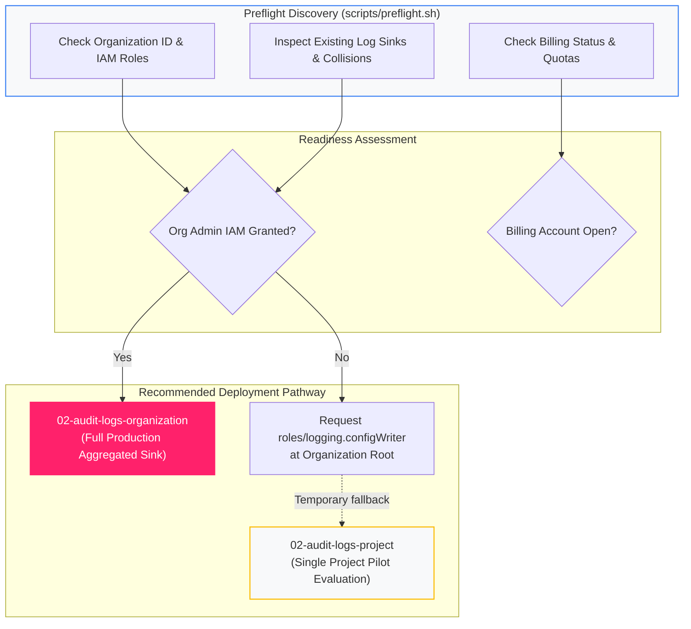

<picture>
  <source media="(prefers-color-scheme: dark)" srcset="../../brand/abstract-logo-white.svg">
  
</picture>

# Preflight Readiness Assessment

<a href="https://shell.cloud.google.com/cloudshell/editor?cloudshell_git_repo=https://github.com/IamABS3C/abstract-gcp-templates&cloudshell_git_branch=main&cloudshell_workspace=deployments/00-preflight&cloudshell_tutorial=TUTORIAL.md"></a>

Read-only environmental inspection assessing permissions, quotas, and organizational hierarchy readiness before deploying Abstract Security infrastructure.

---

## Why Preflight Readiness Matters

Terraform fails at **apply time** when permissions are missing—often *after* it has already provisioned topics or service accounts. The preflight check inspects your environment beforehand and is **100% read-only**, making it safe to execute in production or during live architecture reviews.

```
┌─────────────────────────────────────────────────────────────────────────────┐
│                          Preflight Inspection Phase                         │
│                                                                             │
│   • Organization & Folder Hierarchy Discovery                               │
│   • Caller Identity & IAM Role Evaluation at Org/Billing Scopes             │
│   • Billing Account Status & Cloud Build Readiness                          │
│   • Existing Log Sinks & Potential Collision Detection                      │
└──────────────────────────────────────┬──────────────────────────────────────┘
                                       │ Assessment Report
                                       ▼
┌─────────────────────────────────────────────────────────────────────────────┐
│                             Actionable Outcomes                             │
│                                                                             │
│   ✅ Ready for Organization-Wide Aggregated Sink (02-audit-logs-organization)│
│   ⚠️ Missing roles/logging.configWriter (Requires Org Admin grant)          │
│   ℹ️ Standalone project scope required (Sandbox / Pilot path)               │
└─────────────────────────────────────────────────────────────────────────────┘
```



---

## How to Run the Preflight Check

From the repository root:

```bash
./scripts/preflight.sh
```

Or pass explicit context:

```bash
./scripts/preflight.sh --org-id="123456789012" --project="acme-security-logging"
```

---

[← All scenarios](../../README.md) · [Architecture](../../docs/ARCHITECTURE.md) · [Bootstrap Logging Project](../01-logging-project/README.md)
