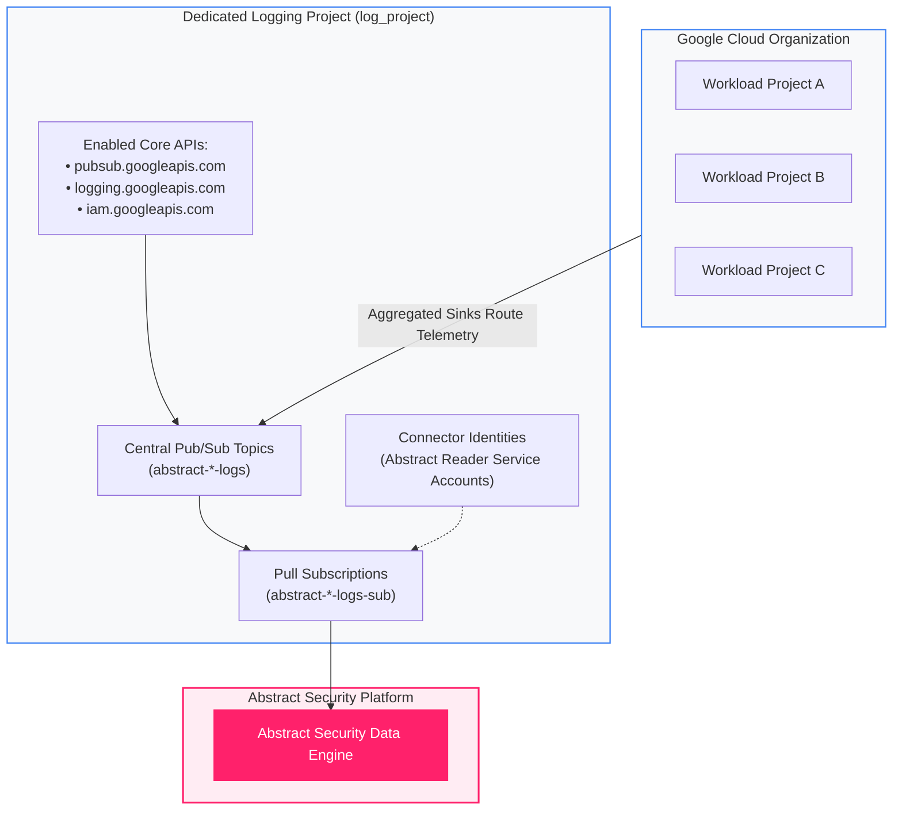
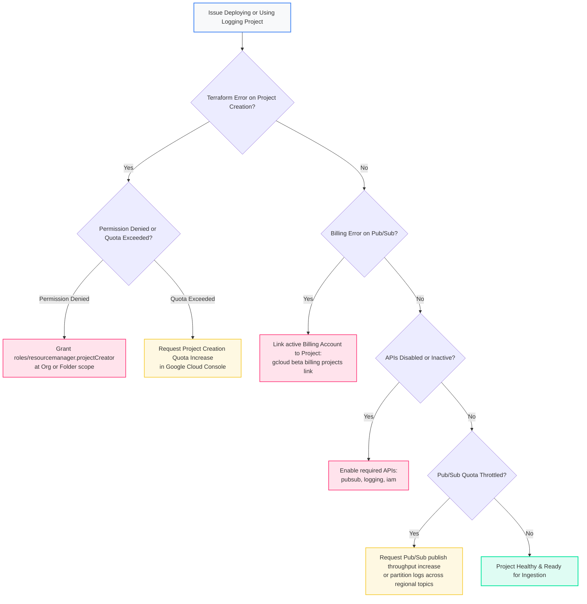

<picture>
  <source media="(prefers-color-scheme: dark)" srcset="../../brand/abstract-logo-white.svg">
  
</picture>

# Bootstrap the Security Logging Project

<a href="https://shell.cloud.google.com/cloudshell/editor?cloudshell_git_repo=https://github.com/IamABS3C/abstract-gcp-templates&cloudshell_git_branch=main&cloudshell_workspace=deployments/01-logging-project&cloudshell_tutorial=TUTORIAL.md"></a>

<p align="center"></p>

> **Interactive Architecture Diagram**  
> Open in Draw.io Desktop: `./scripts/open-diagram.sh 01-logging-project`  
> Open in diagrams.net Web: `./scripts/open-diagram.sh 01-logging-project --web`

Establishes a dedicated, centralized Google Cloud project for security logging, Cloud Pub/Sub pipelines, and Abstract Security ingestion.

---

## Why a Dedicated Logging Project is Essential

In enterprise Google Cloud architectures, security telemetry should **never** be routed into or hosted within a general workload project:

1. **Security Isolation & Tamper Resistance**: If telemetry pipelines sit in a workload project, workload owners with project `roles/editor` or `roles/owner` can inspect, tamper with, or accidentally delete security sinks, topics, and subscriptions.
2. **Quota & Billing Blast Radius**: Cloud Pub/Sub ingestion and pull quotas are consumed within the project hosting the Pub/Sub topics. High-throughput audit logging could throttle workload operations—or vice-versa.
3. **Auditing & Governance**: A dedicated logging project provides a centralized boundary for audit log archiving, retention management, and restricted security team access.

```
┌─────────────────────────────────────────────────────────────────────────────┐
│                       Dedicated Security Logging Project                    │
│                                                                             │
│  API Enablement:                                                            │
│   • pubsub.googleapis.com      (Message streaming)                          │
│   • logging.googleapis.com     (Log Router & Sink management)               │
│   • iam.googleapis.com         (Service accounts & access)                  │
│                                                                             │
│  Centralized Resources Hosted:                                              │
│   • Pub/Sub Topics & Pull Subscriptions for Abstract Security               │
│   • Dead-letter queues & alerting channels                                  │
│   • Connector Service Accounts                                              │
└──────────────────────────────────────┬──────────────────────────────────────┘
                                       │ Ingestion Pull
                                       ▼
┌─────────────────────────────────────────────────────────────────────────────┐
│                         Abstract Security Platform                          │
│                                                                             │
│   Continuous security analytics and detection engineering                   │
└─────────────────────────────────────────────────────────────────────────────┘
```



---

## Telemetry Dataflow & Ingestion Path

The Security Logging Project acts as the ingestion anchor and security trust boundary between your Google Cloud estate and the Abstract Security Data Lake.

### Protocols and Network Topology
* **Control Plane API Provisioning**: REST/HTTPS over TCP port 443 with TLS 1.3 to `cloudresourcemanager.googleapis.com`, `serviceusage.googleapis.com`, and `billingbudgets.googleapis.com`.
* **Telemetry Transit & Pub/Sub Ingestion**: Telemetry from organization-level and folder-level sinks routes internally over the Google Andromeda Software-Defined Network to `pubsub.googleapis.com:443` without crossing the public internet.
* **Abstract SIEM Ingestion Pull**: Abstract Security workers pull telemetry from Pub/Sub pull subscriptions using bi-directional streaming gRPC over HTTP/2 on TCP port 443, authenticated via short-lived OAuth 2.0 access tokens derived from the provisioned service account credentials.
* **VPC Service Controls & Private Access**: Compatible with Google Cloud VPC Service Controls (VPC-SC) perimeters. For isolated environments without internet egress, telemetry routes via Private Google Access (`private.googleapis.com` or `restricted.googleapis.com` VIPs `199.36.153.4/30`) or Private Service Connect (PSC).

### Latency Profile
* **API Enablement Propagation**: 15–45 seconds across Google's distributed regional API control planes.
* **Pub/Sub Internal Broker Ingestion**: P50 < 40 ms; P99 < 150 ms from sink write to topic acknowledgment.
* **Abstract Ingestion Stream**: Real-time continuous streaming pull with P95 end-to-end ingestion latency under 2.5 seconds from initial event emission to normalized availability in the Abstract SIEM lake.

### Throughput Guarantees & Capacity Limits
* **Default Regional Publish Throughput**: 200 MB/s per region (12 GB/min), auto-partitioned across Google Cloud Pub/Sub message clusters.
* **Default Subscribe Throughput**: 400 MB/s per region (24 GB/min).
* **Buffer & Retention Guarantees**: Pub/Sub retains all unacknowledged messages for 7 days (168 hours), providing a guaranteed resilient buffer against downstream consumer outages or network disconnects.
* **Dead-Letter Queue (DLQ)**: Configurable dead-letter topics catch malformed payloads or messages exceeding maximum redelivery attempts (default 5 attempts), preventing head-of-line blocking.

---

## What Gets Created

Depending on whether you are bootstrapping an existing project or creating a new greenfield project:

* **Project Creation (Optional)**: Creates a new Google Cloud project under your specified Organization or Folder (`create_project = true`).
* **Billing Account Linkage**: Associates the project with your billing account (mandatory for Pub/Sub quotas).
* **API Enablement**: Enables `pubsub.googleapis.com`, `logging.googleapis.com`, `iam.googleapis.com`, and optionally `admin.googleapis.com` (for Workspace reports) and `securitycenter.googleapis.com` (for SCC findings).
* **Labels**: Applies standard resource attribution labels (`environment`, `managed-by: abstract`).

---

## When to Run This Deployment

* **Greenfield environments**: You have no existing security logging project.
* **Workload isolation**: Your current candidate project is a production or application workload project.
* **Existing Project**: If you already have a designated centralized security or shared-services logging project, you can skip project creation and point subsequent deployments (such as `02-audit-logs-organization`) directly at your existing project ID.

---

## Diagnostic & Troubleshooting Decision Tree

Follow this decision tree when provisioning the security logging project or diagnosing API and quota issues:



### Failure Modes & Verification Runbook

#### 1. Billing Account Missing or Disabled
* **Symptom**: Terraform fails with `Project cannot be created without a billing account` or Pub/Sub API throws `FAILED_PRECONDITION: Billing account not configured`.
* **Verification Command**:
  ```bash
  gcloud beta billing projects describe acme-security-logging \
    --format="table(billingAccountName,billingEnabled)"
  ```
* **Remediation**:
  ```bash
  gcloud beta billing projects link acme-security-logging \
    --billing-account="012345-567890-ABCDEF"
  ```

#### 2. Project Creator Rights Missing
* **Symptom**: `tofu apply` fails with `googleapi: Error 403: The caller does not have permission` on `google_project`.
* **Verification Command**:
  ```bash
  gcloud organizations get-iam-policy "123456789012" \
    --flatten="bindings[].members" \
    --filter="bindings.role:roles/resourcemanager.projectCreator"
  ```
* **Remediation**:
  Ensure the deploying identity holds `roles/resourcemanager.projectCreator` on the parent Organization or Folder.

#### 3. Core APIs Not Enabled
* **Symptom**: Downstream deployments fail to create Pub/Sub topics or describe sinks with `SERVICE_DISABLED`.
* **Verification Command**:
  ```bash
  gcloud services list --project="acme-security-logging" --enabled \
    --filter="name:(pubsub.googleapis.com OR logging.googleapis.com OR iam.googleapis.com)"
  ```
* **Remediation**:
  ```bash
  gcloud services enable pubsub.googleapis.com logging.googleapis.com iam.googleapis.com \
    --project="acme-security-logging"
  ```

#### 4. Org Policy Constraints Blocking Project Creation
* **Symptom**: Error `Precondition check failed: constraints/gcp.resourceLocations` or `constraints/resourcemanager.allowedExportDestinations`.
* **Verification Command**:
  ```bash
  gcloud resource-manager org-policies describe constraints/gcp.resourceLocations \
    --organization="123456789012"
  ```
* **Remediation**:
  Adjust project location or request an exception from your Organization Policy Administrator.

---

## How to Plan and Apply

### Step 1 — Navigate to Deployment

```bash
cd deployments/01-logging-project
```

### Step 2 — Configure Variables

```bash
cat > terraform.tfvars <<EOF
create_project     = true
project_id         = "acme-security-logging"
project_name       = "Acme Security Logging"
org_id             = "123456789012"
billing_account_id = "012345-567890-ABCDEF"
labels = {
  environment = "production"
  managed-by  = "abstract"
}
EOF
```

### Step 3 — Deploy

```bash
tofu init
tofu plan
tofu apply
```

---

## Verification

Confirm that the project is provisioned, billing is linked, and APIs are active:

```bash
# 1. Verify project exists and billing is active
gcloud beta billing projects describe "acme-security-logging"

# 2. Verify all required services are enabled
gcloud services list --project="acme-security-logging" --enabled \
  --filter="name:(pubsub.googleapis.com OR logging.googleapis.com OR iam.googleapis.com)"
```

---

[← All scenarios](../../README.md) · [Architecture](../../docs/ARCHITECTURE.md) · [Next: Organization Audit Logs](../02-audit-logs-organization/README.md)

