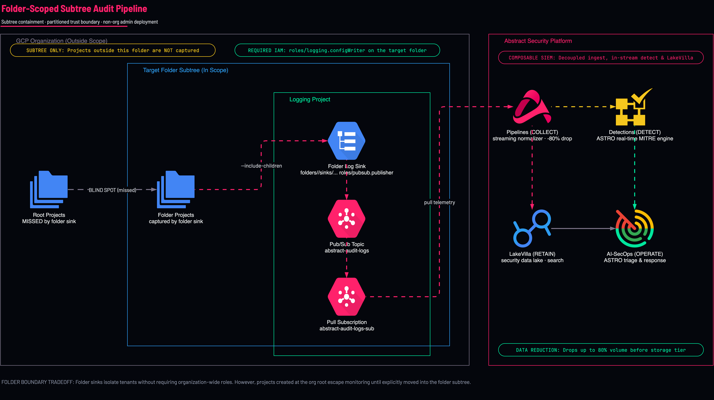
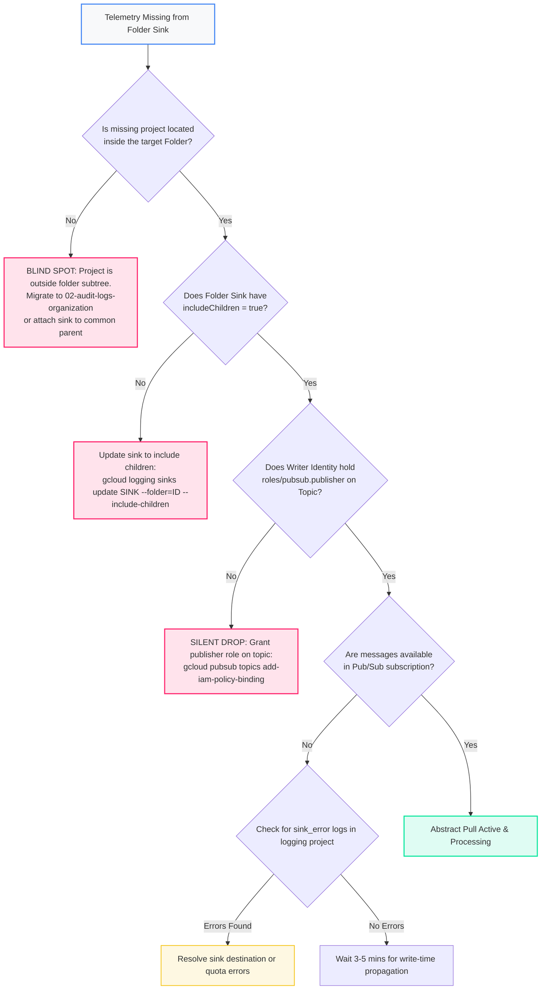

<picture>
  <source media="(prefers-color-scheme: dark)" srcset="../../brand/abstract-logo-white.svg">
  
</picture>

# Folder-Scoped Audit Log Export

<a href="https://shell.cloud.google.com/cloudshell/editor?cloudshell_git_repo=https://github.com/IamABS3C/abstract-gcp-templates&cloudshell_git_branch=main&cloudshell_workspace=deployments/02-audit-logs-folder&cloudshell_tutorial=TUTORIAL.md"></a>

<p align="center"></p>

> **Interactive Architecture Diagram**  
> Open in Draw.io Desktop: `./scripts/open-diagram.sh 02-audit-logs-folder`  
> Open in diagrams.net Web: `./scripts/open-diagram.sh 02-audit-logs-folder --web`

Provisions an aggregated Cloud Logging sink at the GCP **Folder** scope, routing audit logs from all projects contained within that folder subtree directly to **Abstract Security**.

---

## Architectural Trade-Offs: Folder Scope vs Organization Scope

Deploy at Folder scope when:
* **Organizational IAM is pending**: You do not yet hold `roles/logging.configWriter` at the Organization root, but have administrative control over a dedicated business unit or environment folder.
* **Strict Trust Boundary**: A legal, compliance, or regulatory division separates workloads (e.g., PCI-DSS cardholder data environment or acquired entity folder).

> [!WARNING]
> **Folder scope costs you visibility into root projects.** A folder sink misses every project outside that folder—including new projects created at the Organization root by default. Do not let folder scope become permanent by inertia; schedule the organization-wide deployment conversation.

```
┌─────────────────────────────────────────────────────────────────────────────┐
│                 Target Folder Subtree (folders/123456789012)                 │
│                                                                             │
│  [Child Folder: Production]         [Child Folder: Staging]                 │
│  Project A, Project B               Project C, Project D                    │
└──────────────────────────────────────┬──────────────────────────────────────┘
                                        │ Aggregated Folder Sink (include_children = true)
                                        ▼
┌─────────────────────────────────────────────────────────────────────────────┐
│                     Dedicated Logging Project (log_project)                 │
│                                                                             │
│   Pub/Sub Topic: abstract-audit-logs                                        │
│         │                                                                   │
│         ▼                                                                   │
│   Pub/Sub Pull Subscription: abstract-audit-logs-sub                        │
└──────────────────────────────────────┬──────────────────────────────────────┘
                                        │ Real-Time Pull
                                        ▼
┌─────────────────────────────────────────────────────────────────────────────┐
│                         Abstract Security Platform                          │
│                                                                             │
│   Centralized security event analytics and correlation                      │
└─────────────────────────────────────────────────────────────────────────────┘
```

```mermaid
flowchart TD
    subgraph FolderScope["GCP Folder Subtree (folders/...)"]
        F1["Production Sub-Folder<br/>(Projects A, B)"]
        F2["Staging Sub-Folder<br/>(Projects C, D)"]
        Sink["Aggregated Folder Log Sink<br/>(include_children = true)"]
        F1 --> Sink
        F2 --> Sink
    end

    subgraph LoggingProject["Dedicated Logging Project (log_project)"]
        Topic["Pub/Sub Topic<br/>abstract-audit-logs"]
        Sub["Pub/Sub Pull Subscription<br/>abstract-audit-logs-sub"]
        SA["Pull Service Account<br/>abstract-log-reader"]
        Sink -->|Writer Identity (roles/pubsub.publisher)| Topic
        Topic --> Sub
        SA -.->|Subscribes to| Sub
    end

    subgraph Abstract["Abstract Security Platform"]
        AbstractSIEM["Abstract Security SIEM"]
    end

    Sub --> AbstractSIEM

    style Abstract fill:#FF216B15,stroke:#FF216B,stroke-width:2px
    style AbstractSIEM fill:#FF216B,color:#ffffff,stroke:#FF216B,stroke-width:2px
    classDef gcpBox fill:#f8f9fa,stroke:#4285F4,stroke-width:1.5px;
    class FolderScope,LoggingProject gcpBox;
```

---

## Telemetry Dataflow & Ingestion Path

The folder-scoped aggregated sink captures all security audit streams emitted across projects and sub-folders within the designated folder hierarchy.

### Protocols and Transport Mechanics
* **Internal Log Routing**: Applications and GCP managed services in member projects generate audit log entries written to Cloud Logging. The managed Folder Log Router matches the sink filter and routes messages via Google internal RPC to `pubsub.googleapis.com:443`.
* **Abstract SIEM Subscriber Pull**: Ingestion uses authenticated gRPC streaming pull (`google.pubsub.v1.Subscriber`) over TCP port 443 with TLS 1.3 encryption.
* **Authentication**: Pull calls authenticate using an OAuth 2.0 token minted from the dedicated service account key generated during onboarding.

### Latency Profile
* **Log Inception to Sink Processing**: P50 < 400 ms from API invocation.
* **Pub/Sub Broker Ingestion**: P50 < 1.5s, P95 < 4.0s from log event to Pub/Sub message persistence.
* **Write-Time Sink Propagation**: Changes to the folder sink take 3–5 minutes to propagate across all regional Log Router workers.

### Throughput Guarantees & Reliability
* **Throughput**: Supports high-volume folder subtrees up to regional Pub/Sub project limits (200 MB/s publish / 400 MB/s subscribe).
* **Delivery Semantics**: Guaranteed at-least-once delivery with message deduplication handled in Abstract Security via Cloud Audit `insertId`.
* **Resilience**: 7-day retention backlog buffer protects telemetry during network maintenance.

---

## What Gets Created

* **Folder Aggregated Sink**: `google_logging_folder_sink` attached to `folders/FOLDER_ID` with `include_children = true`.
* **Pub/Sub Pipeline**: Dedicated topic (`abstract-audit-logs`) and subscription (`abstract-audit-logs-sub`) in `log_project`.
* **IAM Topic Publisher Binding**: Automatically assigns `roles/pubsub.publisher` on the topic to the unique folder sink writer identity.
* **Abstract Reader Service Account**: Project-scoped service account with `roles/pubsub.subscriber` on the subscription.

---

## Permissions Needed

* **On the Folder**: `roles/logging.configWriter` on the target folder.
* **In the Logging Project**: `roles/pubsub.admin`, `roles/iam.serviceAccountAdmin`, `roles/serviceusage.serviceUsageAdmin`.

---

## Diagnostic & Troubleshooting Decision Tree

Follow this decision tree when diagnosing folder-scoped telemetry gaps:



### Failure Modes & Remediation Runbook

#### 1. Project Exists Outside Folder Subtree
* **Symptom**: Sibling projects or newly created projects outside the folder emit no telemetry.
* **Verification Command**:
  ```bash
  # Check parent container of the unmonitored project
  gcloud projects describe "PROJECT_ID" --format="value(parent.id,parent.type)"
  ```
* **Remediation**:
  If `parent.id` is not equal to your `FOLDER_ID` (or one of its descendant folders), the project cannot be captured by this sink. Move the project under the folder hierarchy or upgrade to `02-audit-logs-organization`.

#### 2. Writer Identity Lacks Publisher Permission (The #1 Silent Trap)
* **Symptom**: Cloud Logging displays audit logs in project, but Pub/Sub topic receives 0 messages.
* **Verification Commands**:
  ```bash
  WRITER_SA=$(gcloud logging sinks describe abstract-folder-sink \
    --folder="$FOLDER_ID" --format="value(writerIdentity)")
  echo "Writer SA: $WRITER_SA"

  gcloud pubsub topics get-iam-policy abstract-audit-logs \
    --project="$LOG_PROJECT" \
    --flatten="bindings[].members" \
    --filter="bindings.role:roles/pubsub.publisher"
  ```
* **Remediation**:
  ```bash
  gcloud pubsub topics add-iam-policy-binding abstract-audit-logs \
    --project="$LOG_PROJECT" \
    --member="$WRITER_SA" \
    --role="roles/pubsub.publisher"
  ```

#### 3. Missing `includeChildren` Flag
* **Symptom**: Logs from nested sub-folders or member projects do not appear.
* **Verification Command**:
  ```bash
  gcloud logging sinks describe abstract-folder-sink \
    --folder="$FOLDER_ID" --format="value(includeChildren)"
  ```
* **Remediation**:
  ```bash
  gcloud logging sinks update abstract-folder-sink \
    --folder="$FOLDER_ID" --include-children
  ```

---

## How to Plan and Apply

```bash
cd deployments/02-audit-logs-folder

cat > terraform.tfvars <<EOF
folder_id   = "123456789012"
log_project = "acme-security-logging"
EOF

tofu init
tofu plan
tofu apply
```

Retrieve onboarding credentials for Abstract Security:
```bash
tofu output abstract_onboarding
export SA_EMAIL=$(tofu output -json abstract_onboarding | jq -r .service_account_email)

mkdir -p ~/abstract-keys && chmod 700 ~/abstract-keys   # outside the repo clone
gcloud iam service-accounts keys create ~/abstract-keys/abstract-pubsub-key.json \
  --iam-account="$SA_EMAIL" \
  --project="acme-security-logging"
chmod 600 ~/abstract-keys/abstract-pubsub-key.json
```

---

## Verification

```bash
# 1. Verify sink configuration and inheritance
gcloud logging sinks describe abstract-folder-sink \
  --folder="$FOLDER_ID" \
  --format="table(name,destination,writerIdentity,includeChildren)"

# 2. Prove delivery end to end
# Never pull from abstract-audit-logs-sub: with --auto-ack that deletes events before Abstract
# reads them, and without it hides them from Abstract for the ack deadline.
# Pull from a throwaway subscription on the same topic instead. Create it BEFORE the
# test event: a new subscription only receives messages published after it exists.
PROBE="abstract-probe-$(date +%s)"
gcloud pubsub subscriptions create "$PROBE" --topic=abstract-audit-logs \
  --project="acme-security-logging" --expiration-period=1d --message-retention-duration=10m
# Fire a fresh Admin Activity event inside the sink's scope, then wait for routing.
gcloud pubsub topics create "$PROBE" --project="A_PROJECT_INSIDE_THE_FOLDER" --quiet
gcloud pubsub topics delete "$PROBE" --project="A_PROJECT_INSIDE_THE_FOLDER" --quiet
sleep 75
gcloud pubsub subscriptions pull "$PROBE" --project="acme-security-logging" --limit=3 --auto-ack
gcloud pubsub subscriptions delete "$PROBE" --project="acme-security-logging" --quiet
```

---

[← All scenarios](../../README.md) · [Architecture](../../docs/ARCHITECTURE.md) · [Organization Audit Logs](../02-audit-logs-organization/README.md)

