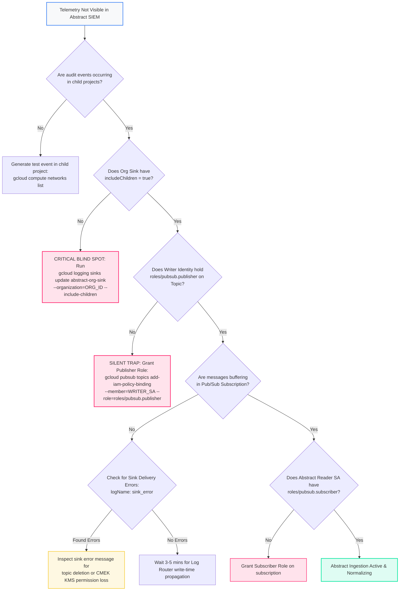

<picture>
  <source media="(prefers-color-scheme: dark)" srcset="../../brand/abstract-logo-white.svg">
  
</picture>

# Organization-Wide Audit Log Export to Abstract Security

<a href="https://shell.cloud.google.com/cloudshell/editor?cloudshell_git_repo=https://github.com/IamABS3C/abstract-gcp-templates&cloudshell_git_branch=main&cloudshell_workspace=deployments/02-audit-logs-organization&cloudshell_tutorial=TUTORIAL.md"></a>

<p align="center"></p>

> **Interactive Architecture Diagram**  
> Open in Draw.io Desktop: `./scripts/open-diagram.sh 02-audit-logs-organization`  
> Open in diagrams.net Web: `./scripts/open-diagram.sh 02-audit-logs-organization --web`

Provisions an enterprise aggregated Cloud Logging sink at the Google Cloud Organization level, routing security audit events from every project, folder, and native Google Workspace stream directly to **Abstract Security** via Cloud Pub/Sub.

---

## Architectural Overview

The organization aggregated log sink is the primary foundation of Google Cloud security monitoring. By binding the sink at the root Organization scope with `include_children = true`, it captures telemetry across:
* **All existing and future projects**: Projects inherit log collection by containment. As development teams spin up new projects, audit events are routed automatically without reconfiguring infrastructure.
* **All folders and nested folder trees**: Captures organizational changes, folder policy shifts, and folder-level IAM bindings.
* **Native Google Workspace Audit Logs**: When **Share audit logs with Google Cloud** is enabled in the Workspace Admin Console, Workspace identity and administrative events land in Cloud Logging at the Organization level and are routed seamlessly through this sink with **zero API polling**.

```
┌─────────────────────────────────────────────────────────────────────────────────────────┐
│                    Google Cloud Organization (organizations/123456789012)               │
│                                                                                         │
│  [Workspace Native Audit]    [Folder: Production]          [Folder: Staging]            │
│  Logins, SAML, Admin, Token   Project A, Project B          Project C, Project D        │
└───────────────────────────────────────────┬─────────────────────────────────────────────┘
                                            │ Aggregated Log Sink (include_children = true)
                                            ▼
┌─────────────────────────────────────────────────────────────────────────────────────────┐
│                     Dedicated Logging Project (acme-security-logging)                   │
│                                                                                         │
│   Pub/Sub Topic: abstract-audit-logs                                                    │
│         │                                                                               │
│         ▼                                                                               │
│   Pub/Sub Pull Subscription: abstract-audit-logs-sub                                    │
│         ▲                                                                               │
│         │ Authenticated Pull                                                            │
│   Abstract Security Reader Service Account                                              │
└───────────────────────────────────────────┬─────────────────────────────────────────────┘
                                            │ Real-Time Stream
                                            ▼
┌─────────────────────────────────────────────────────────────────────────────────────────┐
│                               Abstract Security Platform                                │
│                                                                                         │
│   High-performance correlation, SIEM analytics, and threat detection                    │
└─────────────────────────────────────────────────────────────────────────────────────────┘
```

```mermaid
flowchart TD
    subgraph OrgScope["Google Cloud Organization (organizations/...)"]
        WS["Native Google Workspace Audit<br/>(Login, Admin, SAML, Tokens)"]
        F1["Folder: Production<br/>(Projects A, B)"]
        F2["Folder: Development<br/>(Projects C, D)"]
        Sink["Aggregated Org Log Sink<br/>(include_children = true)"]
        WS --> Sink
        F1 --> Sink
        F2 --> Sink
    end

    subgraph LoggingProject["Dedicated Logging Project (log_project)"]
        Topic["Pub/Sub Topic<br/>abstract-audit-logs"]
        Sub["Pub/Sub Pull Subscription<br/>abstract-audit-logs-sub"]
        SA["Pull Service Account<br/>abstract-log-reader"]
        Sink -->|Writer Identity<br/>(roles/pubsub.publisher)| Topic
        Topic --> Sub
        SA -.->|Subscribes to| Sub
    end

    subgraph Abstract["Abstract Security Platform"]
        AbstractSIEM["Abstract Security SIEM"]
    end

    Sub --> AbstractSIEM

    style Abstract fill:#FF216B15,stroke:#FF216B,stroke-width:2px
    style AbstractSIEM fill:#FF216B,color:#ffffff,stroke:#FF216B,stroke-width:2px
    classDef gcpBox fill:#f8f9fa,stroke:#4285F4,stroke-width:1.5px;
    class OrgScope,LoggingProject gcpBox;
```

---

## Telemetry Dataflow & Ingestion Path

The organization aggregated sink creates an unbroken real-time security pipeline spanning all cloud containers into the Abstract SIEM platform.

### Telemetry Ingress & Transport Protocols
* **Source Service to Cloud Logging**: Internal Google RPC over Andromeda SDN fabrics. Google APIs write structured `AuditLog` JSON entries directly to the Cloud Logging Router at zero customer egress cost.
* **Log Router to Pub/Sub Delivery**: Managed Google Cloud Log Router forwards filtered audit payloads directly to the destination Pub/Sub topic via `pubsub.googleapis.com:443`. Delivery uses internal Google infrastructure with strict identity verification.
* **Abstract SIEM Ingestion Pull**: Abstract Security ingestion workers establish persistent authenticated gRPC HTTP/2 connections over TCP port 443 to `pubsub.googleapis.com`. StreamingPull API utilizes bi-directional streams for near-zero message dispatch delay.
* **Cryptographic Guarantees**: TLS 1.3 in-transit encryption with ALPN negotiation. Message payloads at rest in Pub/Sub are protected with AES-256 (or customer-managed CMEK via Cloud KMS).

### Latency Profile & Timing
* **Event Inception to Log Router**: 200–500 ms from API execution completion to Log Router ingestion.
* **Log Router Routing to Pub/Sub Topic**: P50 < 1.2s, P95 < 3.5s, P99 < 8.0s across all global Google Cloud regions.
* **Initial Sink Propagation Delay**: 3 to 5 minutes after initial creation or filter modification. Write-time evaluation ensures no retroactive backlog replay.
* **Abstract Streaming Processing**: Ingestion, tokenization, ECS/ACS normalization, and index availability completed within < 2.0 seconds from Pub/Sub pull receipt.

### Throughput Guarantees & Fault Tolerance
* **Scalability**: Pub/Sub automatically load-balances and distributes load across regional broker shards, supporting > 100,000 events/second without manual partition management.
* **At-Least-Once Delivery**: Every audit record is guaranteed delivery. Downstream duplicate elimination in Abstract Security uses the immutable Google Cloud `insertId` and `timestamp`.
* **Subscription Backlog Retention**: 7 days (168 hours) of unacked message retention. If downstream networks disconnect, the Pub/Sub buffer prevents data loss.
* **Dead-Letter Handling**: Configurable dead-letter queue (DLQ) isolates messages exceeding delivery limits or schema edge cases.

---

## What Gets Created

* **Cloud Logging Organization Sink**: `google_logging_organization_sink` at the Organization level with `include_children = true`.
* **Pub/Sub Topic & Subscription**: Dedicated topic (`abstract-audit-logs`) and pull subscription (`abstract-audit-logs-sub`) located in your dedicated logging project.
* **IAM Topic Publisher Binding**: Automatically assigns `roles/pubsub.publisher` on the topic to the unique writer identity of the organization sink.
* **Abstract Pull Service Account**: Creates a dedicated reader service account granted `roles/pubsub.subscriber` on the subscription only.
* **Dead-Letter Queue (Optional)**: Secondary Pub/Sub topic for messages that fail delivery after maximum retry attempts.

---

## Permissions Needed

Setting up an organization sink requires permissions across two scopes:

### 1. At the Organization Level
* **`roles/logging.configWriter` (Logs Configuration Writer)**: Required to create, update, and manage log sinks at the organization root.

```bash
gcloud organizations add-iam-policy-binding "123456789012" \
  --member="user:security-admin@example.com" \
  --role="roles/logging.configWriter"
```

### 2. In the Dedicated Logging Project
* `roles/pubsub.admin`: To provision topics and subscriptions.
* `roles/iam.serviceAccountAdmin`: To create and manage the pull identity.
* `roles/resourcemanager.projectIamAdmin`: To bind the sink's writer identity to the Pub/Sub topic.
* `roles/serviceusage.serviceUsageAdmin`: To enable necessary APIs (`pubsub.googleapis.com`, `logging.googleapis.com`).

---

## How to Plan and Apply

### Step 1 — Navigate to Deployment

```bash
cd deployments/02-audit-logs-organization
```

### Step 2 — Configure State Backend (Recommended)

```bash
cp backend.tf.example backend.tf
# Edit backend.tf to set your remote state GCS bucket
```

### Step 3 — Define Variables

```bash
export ORG_ID="123456789012"
export LOG_PROJECT="acme-security-logging"

cat > terraform.tfvars <<EOF
org_id               = "$ORG_ID"
log_project          = "$LOG_PROJECT"
log_categories       = ["admin_activity", "system_event", "policy_denied", "identity_access"]
data_access_services = ["bigquery.googleapis.com", "storage.googleapis.com", "cloudkms.googleapis.com"]
EOF
```

### Step 4 — Initialize and Apply

```bash
tofu init
tofu plan
tofu apply
```

### Step 5 — Retrieve Onboarding Outputs for Abstract

```bash
tofu output abstract_onboarding
```

Generate the credentials key file out of band:
```bash
export SA_EMAIL=$(tofu output -json abstract_onboarding | jq -r .service_account_email)

gcloud iam service-accounts keys create abstract-key.json \
  --iam-account="$SA_EMAIL" \
  --project="$LOG_PROJECT"
```

In the Abstract Security console:
1. Navigate to **Integrations** &rarr; **Google Cloud Pub/Sub**.
2. Provide `project_id`, `subscription_id`, and upload `abstract-key.json`.
3. Securely delete the local private key: `rm abstract-key.json`.

---

## Diagnostic & Troubleshooting Decision Tree

Use this systematic decision tree to diagnose telemetry loss, missing child project logs, or permission denials:



### Failure Modes & Remediation Runbook

#### 1. Sink Writer Identity Missing Topic Publisher Role (The #1 Silent Failure Trap)
* **Symptom**: Cloud Logging displays audit events, but zero messages arrive in Pub/Sub. No errors appear in Google Cloud Console.
* **Root Cause**: When an organization sink is created, Google Cloud automatically provisions a unique service account (`service-org-ORG_NUM@gcp-sa-logging.iam.gserviceaccount.com`). This service account holds **zero permissions by default**. Without `roles/pubsub.publisher` on the target topic, all audit logs are dropped silently at write time.
* **Verification Commands**:
  ```bash
  # 1. Extract the sink's unique writer identity
  WRITER_SA=$(gcloud logging sinks describe abstract-org-sink \
    --organization="$ORG_ID" \
    --format="value(writerIdentity)")
  echo "Writer SA: $WRITER_SA"

  # 2. Check if WRITER_SA is granted publisher role on destination topic
  gcloud pubsub topics get-iam-policy abstract-audit-logs \
    --project="$LOG_PROJECT" \
    --flatten="bindings[].members" \
    --filter="bindings.role:roles/pubsub.publisher"
  ```
* **Remediation**:
  ```bash
  gcloud pubsub topics add-iam-policy-binding abstract-audit-logs \
    --project="$LOG_PROJECT" \
    --member="$WRITER_SA" \
    --role="roles/pubsub.publisher"
  ```

#### 2. `include_children` Omitted or False
* **Symptom**: Only actions executed directly on the Organization resource appear; all child folders and projects are 100% blind.
* **Verification Command**:
  ```bash
  gcloud logging sinks describe abstract-org-sink \
    --organization="$ORG_ID" \
    --format="value(includeChildren)"
  ```
* **Remediation**:
  ```bash
  gcloud logging sinks update abstract-org-sink \
    --organization="$ORG_ID" \
    --include-children
  ```

#### 3. Log Router Sink Delivery Errors
* **Symptom**: Sink fails to deliver to Pub/Sub due to topic misconfiguration, CMEK key disablement, or quota exhaustion.
* **Verification Command**:
  ```bash
  gcloud logging read 'logName:"logging.googleapis.com%2Fsink_error"' \
    --project="$LOG_PROJECT" \
    --limit=10 \
    --format="table(timestamp,jsonPayload.status.message,jsonPayload.destination)"
  ```

#### 4. Abstract Reader Service Account Lacks Subscription Rights
* **Symptom**: Abstract Security console reports `PERMISSION_DENIED` on pull subscription.
* **Verification Command**:
  ```bash
  gcloud pubsub subscriptions get-iam-policy abstract-audit-logs-sub \
    --project="$LOG_PROJECT" \
    --flatten="bindings[].members" \
    --filter="bindings.role:roles/pubsub.subscriber"
  ```
* **Remediation**:
  ```bash
  gcloud pubsub subscriptions add-iam-policy-binding abstract-audit-logs-sub \
    --project="$LOG_PROJECT" \
    --member="serviceAccount:$SA_EMAIL" \
    --role="roles/pubsub.subscriber"
  ```

---

## Verification & Latency

> [!WARNING]
> **Routing is evaluated at WRITE TIME.** Newly created log sinks take 3 to 5 minutes to begin forwarding events. Historical logs generated prior to sink creation will not be delivered retroactively.

1. **Verify Sink Configuration**:
   ```bash
   gcloud logging sinks describe abstract-org-sink \
     --organization="$ORG_ID" \
     --format="table(name,destination,writerIdentity,includeChildren)"
   ```

2. **Verify Topic IAM Permissions**:
   ```bash
   gcloud pubsub topics get-iam-policy abstract-audit-logs --project="$LOG_PROJECT"
   ```

3. **Check for Sink Errors**:
   ```bash
   gcloud logging read 'logName:"logging.googleapis.com%2Fsink_error"' \
     --project="$LOG_PROJECT" --limit=10
   ```

4. **Pull Messages from Subscription**:
   ```bash
   gcloud pubsub subscriptions pull abstract-audit-logs-sub \
     --project="$LOG_PROJECT" --limit=5
   ```

---

[← All scenarios](../../README.md) · [Architecture](../../docs/ARCHITECTURE.md) · [Next: Data Access Audit Logs](../03-data-access/README.md)

