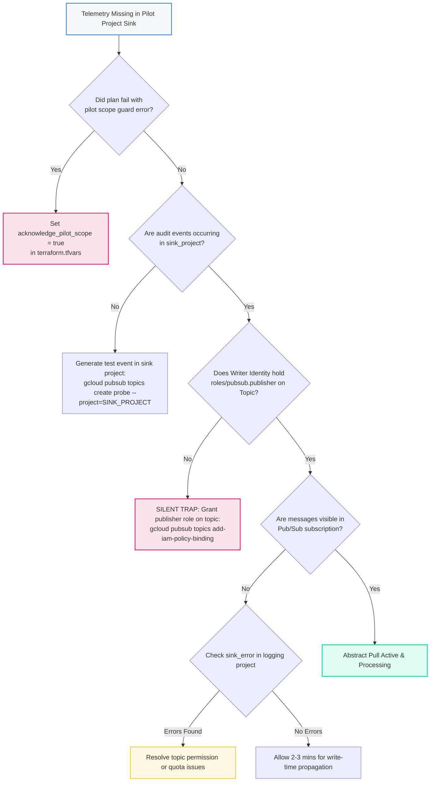

<picture>
  <source media="(prefers-color-scheme: dark)" srcset="../../brand/abstract-logo-white.svg">
  
</picture>

# Project-Scoped Audit Log Export (Pilot Deployment)

<a href="https://shell.cloud.google.com/cloudshell/editor?cloudshell_git_repo=https://github.com/IamABS3C/abstract-gcp-templates&cloudshell_git_branch=main&cloudshell_workspace=deployments/02-audit-logs-project&cloudshell_tutorial=TUTORIAL.md"></a>

<p align="center"></p>

> **Interactive Architecture Diagram**  
> Open in Draw.io Desktop: `./scripts/open-diagram.sh 02-audit-logs-project`  
> Open in diagrams.net Web: `./scripts/open-diagram.sh 02-audit-logs-project --web`

Exports Cloud Audit Logs from a single Google Cloud project to **Abstract Security** via Cloud Pub/Sub. Intended strictly for initial pilot evaluations and pipeline proofs-of-concept.

---

## Why Project Scope is for Pilots Only

> [!CAUTION]
> **A project-scoped sink does NOT cover future projects.**
> Unlike Organization and Folder sinks, a project sink has no concept of containment inheritance. When new projects are created, none of their audit logs will be routed to Abstract Security unless you deploy an individual sink for every project.
>
> The module enforces `acknowledge_pilot_scope = true` at plan time to ensure this scope is chosen deliberately. Use this deployment to validate the Pub/Sub pipeline and Abstract integration quickly, then transition to [02-audit-logs-organization](../02-audit-logs-organization/README.md).

```
┌─────────────────────────────────────────────────────────────────────────────┐
│                    Single Workload Project (sink_project)                   │
│                                                                             │
│   Project-level Cloud Logging Sink (covers this project ONLY)               │
└──────────────────────────────────────┬──────────────────────────────────────┘
                                       │ Writer Identity
                                       ▼
┌─────────────────────────────────────────────────────────────────────────────┐
│                     Dedicated Logging Project (log_project)                 │
│                                                                             │
│   Pub/Sub Topic: abstract-audit-logs                                        │
│         │                                                                   │
│         ▼                                                                   │
│   Pub/Sub Pull Subscription: abstract-audit-logs-sub                        │
└──────────────────────────────────────┬──────────────────────────────────────┘
                                       │ Real-Time Pull
                                       ▼
┌─────────────────────────────────────────────────────────────────────────────┐
│                         Abstract Security Platform                          │
│                                                                             │
│   Proof-of-concept and telemetry validation                                 │
└─────────────────────────────────────────────────────────────────────────────┘
```

```mermaid
flowchart TD
    subgraph PilotProject["Monitored Project (sink_project)"]
        Audit["Project Audit Logs<br/>(Admin Activity, Data Access)"]
        Sink["Project-Scoped Log Sink<br/>(Single Project Boundary)"]
        Audit --> Sink
    end

    subgraph LoggingProject["Dedicated Logging Project (log_project)"]
        Topic["Pub/Sub Topic<br/>abstract-audit-logs"]
        Sub["Pub/Sub Pull Subscription<br/>abstract-audit-logs-sub"]
        SA["Pull Service Account<br/>abstract-log-reader"]
        Sink -->|Writer Identity (roles/pubsub.publisher)| Topic
        Topic --> Sub
        SA -.->|Subscribes to| Sub
    end

    subgraph Abstract["Abstract Security Platform"]
        AbstractSIEM["Abstract Security SIEM"]
    end

    Sub --> AbstractSIEM

    style Abstract fill:#FF216B15,stroke:#FF216B,stroke-width:2px
    style AbstractSIEM fill:#FF216B,color:#ffffff,stroke:#FF216B,stroke-width:2px
    classDef gcpBox fill:#f8f9fa,stroke:#4285F4,stroke-width:1.5px;
    class PilotProject,LoggingProject gcpBox;
```

---

## Telemetry Dataflow & Ingestion Path

The project-scoped sink creates an isolated telemetry pipeline connecting a single monitored workload project to the Abstract Security ingestion endpoint.

### Protocols and Transport Architecture
* **Ingress from GCP Services**: Services within `sink_project` emit audit entries directly into the local project Log Router.
* **Cross-Project Sink Routing**: The project sink forwards matching audit entries across project boundaries to the central Pub/Sub topic in `log_project` via Google internal RPC.
* **Abstract SIEM Ingestion Pull**: Abstract Security workers pull batches from the subscription using authenticated gRPC streaming pull over TCP port 443 with TLS 1.3 encryption.
* **Payload Format**: Google Cloud Audit Log v1 JSON payload containing `protoPayload` metadata, identity credentials, caller IP, and requested resource descriptors.

### Latency Profile
* **Log Emission to Router**: P50 < 250 ms.
* **Cross-Project Pub/Sub Write**: P50 < 1.0s, P95 < 3.0s.
* **Sink Propagation Delay**: 1 to 3 minutes for initial project sink rule activation.

### Throughput Guarantees & Buffer
* **Throughput**: Inherits Google Cloud project-level Pub/Sub quotas (200 MB/s publish / 400 MB/s subscribe).
* **Buffer Guarantee**: Pub/Sub retains messages for 7 days (168 hours), insulating the pilot against connection interruptions.

---

## Diagnostic & Troubleshooting Decision Tree

Follow this decision tree when testing pilot project log exports:



### Failure Modes & Remediation Runbook

#### 1. Missing Pilot Acknowledgement Guard
* **Symptom**: Terraform plan fails with: `project scope needs acknowledgement`.
* **Remediation**: Set `acknowledge_pilot_scope = true` in `terraform.tfvars`.

#### 2. Project Sink Writer Identity Missing Topic Publisher Role (The #1 Silent Failure Trap)
* **Symptom**: Events in Cloud Logging in `sink_project` are never published to Pub/Sub topic.
* **Verification Commands**:
  ```bash
  WRITER_SA=$(gcloud logging sinks describe abstract-project-sink \
    --project="$SINK_PROJECT" --format="value(writerIdentity)")
  echo "Writer SA: $WRITER_SA"

  gcloud pubsub topics get-iam-policy abstract-audit-logs \
    --project="$LOG_PROJECT" \
    --flatten="bindings[].members" \
    --filter="bindings.role:roles/pubsub.publisher"
  ```
* **Remediation**:
  ```bash
  gcloud pubsub topics add-iam-policy-binding abstract-audit-logs \
    --project="$LOG_PROJECT" \
    --member="$WRITER_SA" \
    --role="roles/pubsub.publisher"
  ```

#### 3. New Workload Projects Silently Omitted
* **Symptom**: Pilot succeeds, but new projects in the GCP organization have 0 telemetry.
* **Remediation**: Project sinks do not inherit child resources. Once pilot validation is complete, deploy `deployments/02-audit-logs-organization` and destroy the project sink.

---

## How to Plan and Apply

```bash
cd deployments/02-audit-logs-project

cat > terraform.tfvars <<EOF
sink_project            = "workload-project-id"
log_project             = "acme-security-logging"
acknowledge_pilot_scope = true
EOF

tofu init
tofu plan
tofu apply
```

Retrieve onboarding credentials for Abstract Security:
```bash
tofu output abstract_onboarding
export SA_EMAIL=$(tofu output -json abstract_onboarding | jq -r .service_account_email)

mkdir -p ~/abstract-keys && chmod 700 ~/abstract-keys   # outside the repo clone
gcloud iam service-accounts keys create ~/abstract-keys/abstract-pubsub-key.json \
  --iam-account="$SA_EMAIL" \
  --project="acme-security-logging"
chmod 600 ~/abstract-keys/abstract-pubsub-key.json
```

---

## Verification

```bash
# 1. Verify project sink is active
gcloud logging sinks describe abstract-project-sink \
  --project="$SINK_PROJECT"

# 2. Prove delivery end to end
# Never pull from abstract-audit-logs-sub: with --auto-ack that deletes events before Abstract
# reads them, and without it hides them from Abstract for the ack deadline.
# Pull from a throwaway subscription on the same topic instead. Create it BEFORE the
# test event: a new subscription only receives messages published after it exists.
PROBE="abstract-probe-$(date +%s)"
gcloud pubsub subscriptions create "$PROBE" --topic=abstract-audit-logs \
  --project="acme-security-logging" --expiration-period=1d --message-retention-duration=10m
# Fire a fresh Admin Activity event inside the sink's scope, then wait for routing.
gcloud pubsub topics create "$PROBE" --project="$SINK_PROJECT" --quiet
gcloud pubsub topics delete "$PROBE" --project="$SINK_PROJECT" --quiet
sleep 75
gcloud pubsub subscriptions pull "$PROBE" --project="acme-security-logging" --limit=3 --auto-ack
gcloud pubsub subscriptions delete "$PROBE" --project="acme-security-logging" --quiet
```

---

[← All scenarios](../../README.md) · [Architecture](../../docs/ARCHITECTURE.md) · [Production: Organization Audit Logs](../02-audit-logs-organization/README.md)

