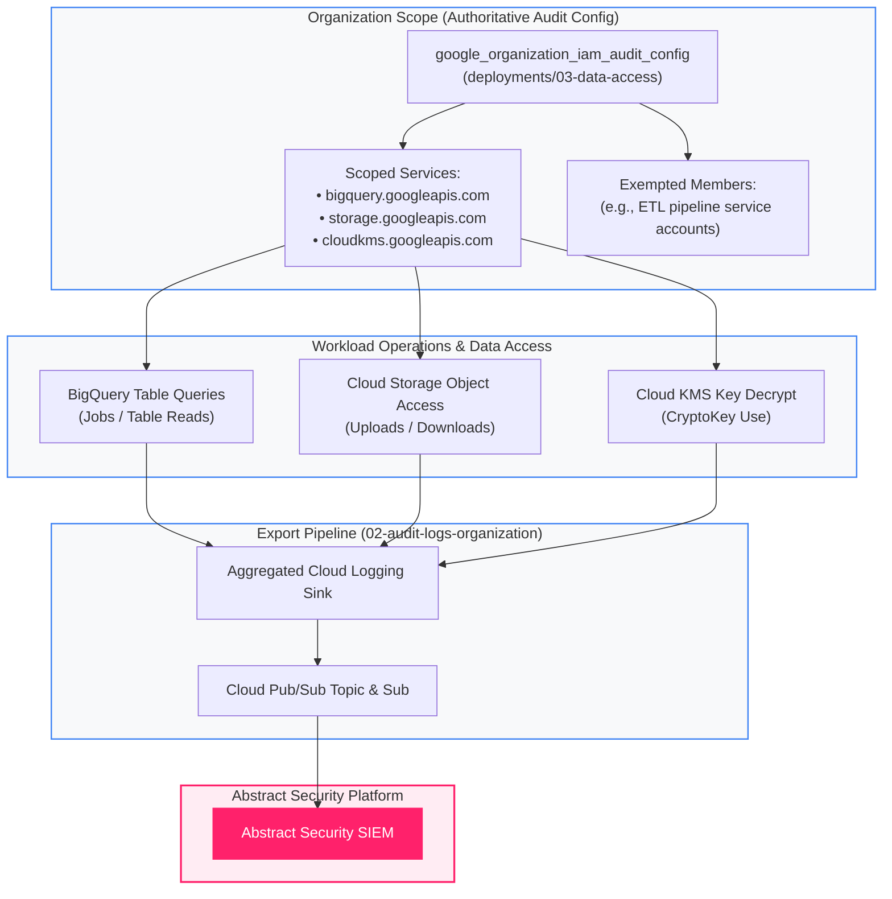
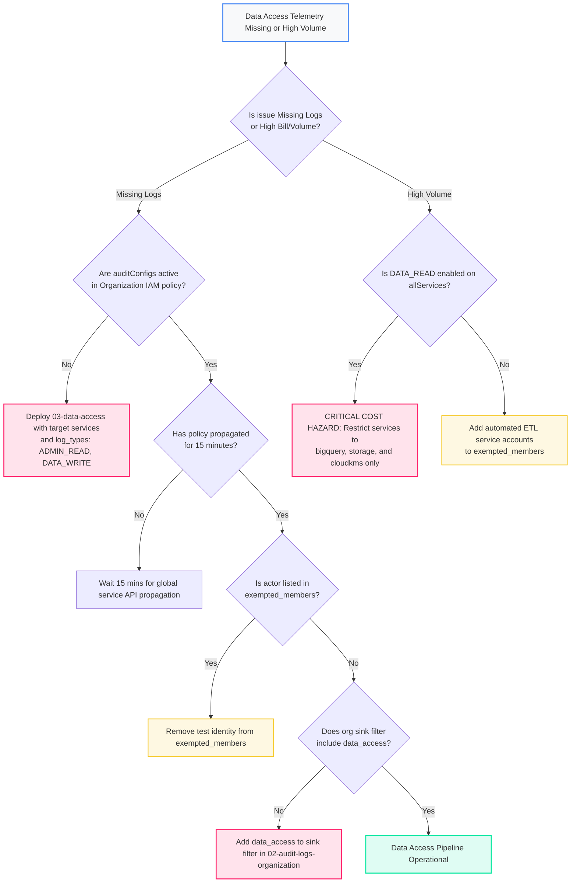

<picture>
  <source media="(prefers-color-scheme: dark)" srcset="../../brand/abstract-logo-white.svg">
  
</picture>

# Data Access Audit Logging Configuration

<a href="https://shell.cloud.google.com/cloudshell/editor?cloudshell_git_repo=https://github.com/IamABS3C/abstract-gcp-templates&cloudshell_git_branch=main&cloudshell_workspace=deployments/03-data-access&cloudshell_tutorial=TUTORIAL.md"></a>

<p align="center"></p>

> **Interactive Architecture Diagram**  
> Open in Draw.io Desktop: `./scripts/open-diagram.sh 03-data-access`  
> Open in diagrams.net Web: `./scripts/open-diagram.sh 03-data-access --web`

Configures authoritative organization-level Data Access audit logging policies for Google Cloud services, capturing data plane read/write telemetry for **Abstract Security**.

---

## Architectural Principles & Why This State is Isolated

In Google Cloud:
* **Admin Activity logs** (`cloudaudit.googleapis.com/activity`): Record management and metadata changes. They are **always on**, free to generate, and cannot be disabled.
* **Data Access logs** (`cloudaudit.googleapis.com/data_access`): Record API operations that read or write user-provided data (e.g., querying BigQuery tables, downloading Cloud Storage objects, decrypting keys with KMS). They are **off by default** because of their substantial volume.

This deployment is deliberately maintained in a **dedicated, isolated Terraform state** for two vital reasons:

1. **Destruction Safety**: Running `terraform destroy` on a log collector or Pub/Sub pipeline must **never** strip the organization's Data Access logging policy. Keeping audit policy state separate guarantees that collector lifecycle changes cannot blind the SOC.
2. **Authoritative Overwrite Protection**: `google_organization_iam_audit_config` is authoritative for the named services. If bundled with other resources, concurrent pipeline modifications can create silent race conditions.

```
┌─────────────────────────────────────────────────────────────────────────────┐
│                    Google Cloud Organization (organizations/...)            │
│                                                                             │
│   Authoritative Organization IAM Audit Config:                              │
│   • bigquery.googleapis.com   --> [DATA_WRITE, ADMIN_READ]                  │
│   • storage.googleapis.com    --> [DATA_WRITE, ADMIN_READ]                  │
│   • cloudkms.googleapis.com   --> [DATA_WRITE, ADMIN_READ]                  │
│   (Exempted: high-volume ETL service accounts)                              │
└──────────────────────────────────────┬──────────────────────────────────────┘
                                       │ Generates cloudaudit.googleapis.com/data_access
                                       ▼
┌─────────────────────────────────────────────────────────────────────────────┐
│              Aggregated Organization Sink (02-audit-logs-organization)      │
│                                                                             │
│   Filters for high-signal Data Access services and routes to Pub/Sub        │
└──────────────────────────────────────┬──────────────────────────────────────┘
                                       │ Writer Identity
                                       ▼
┌─────────────────────────────────────────────────────────────────────────────┐
│                         Abstract Security Platform                          │
│                                                                             │
│   Exfiltration detection, anomalous data reads, and cryptographic audits    │
└─────────────────────────────────────────────────────────────────────────────┘
```



---

## Telemetry Dataflow & Ingestion Path

Data Access logging captures high-fidelity data-plane interactions across sensitive storage and compute engines, routing them via the organization's aggregated log pipeline.

### Protocols and Transport Mechanics
* **Data Plane Invocation**: Workload actors invoke service APIs (e.g. `storage.objects.get`, `google.cloud.bigquery.v2.JobService.InsertJob`, `cloudkms.cryptoKeyVersions.useToDecrypt`) over HTTPS/REST or gRPC on TCP port 443.
* **Internal Audit Event Generation**: Upon API completion, the GCP service runtime checks the organization's IAM `auditConfig` for matching service and log type (`ADMIN_READ`, `DATA_WRITE`, `DATA_READ`). If enabled and actor is not in `exemptedMembers`, an event is emitted into the internal Cloud Logging broker.
* **Export via Aggregated Sink**: The organization sink (`02-audit-logs-organization`) matches `logName:"cloudaudit.googleapis.com/data_access"` and dispatches the payload to Cloud Pub/Sub via internal Google RPC.
* **Abstract SIEM Ingestion**: Abstract Security workers pull batches from the subscription via gRPC over HTTP/2 on TCP port 443 with TLS 1.3 encryption.

### Latency Profile
* **IAM Audit Config Propagation**: **5 to 15 minutes** for policy changes to propagate across global Google Cloud regional endpoints.
* **Runtime Event Generation**: < 500 ms from API request execution to Cloud Logging event ingestion.
* **End-to-End Delivery to SIEM**: P50 < 2.0s, P95 < 5.0s from data access operation to indexed event in Abstract Security.

### Throughput Guarantees & Volume Impact
* **High-Volume Telemetry Profile**: `DATA_READ` on BigQuery or Storage can generate 10x to 100x the volume of Admin Activity. Scoping to designated services and using exemptions maintains high security signal without billing runaway.
* **Pub/Sub Broker Auto-Scaling**: Pub/Sub scales horizontally to handle hundreds of thousands of data plane events per second.
* **Backlog Protection**: 7-day message retention on Pub/Sub subscriptions buffers bursts during heavy ETL operations or batch query cycles.

---

## Cost & Volume Controls

> [!WARNING]
> Enabling `DATA_READ` on `allServices` estate-wide can increase log ingestion volume by **one to two orders of magnitude** (10x–100x), largely dominated by routine BigQuery internal reads and Cloud Storage batch jobs.

To maximize security signal while preventing cost spikes:
1. **Target Specific Services**: Enable Data Access only for critical data-holding APIs (`bigquery.googleapis.com`, `storage.googleapis.com`, `cloudkms.googleapis.com`).
2. **Prioritize `ADMIN_READ` and `DATA_WRITE`**: Start with `ADMIN_READ` and `DATA_WRITE`. Add `DATA_READ` only when exfiltration monitoring is required for specific buckets or datasets.
3. **Exempt Routine ETL Identities**: Use `exempted_members` to exclude trusted high-frequency batch processes that generate massive noise with low detection value.

---

## Permissions Needed

Modifying the organization's audit configuration requires:
* **`roles/resourcemanager.organizationAdmin`** at the Organization root level.

```bash
export ORG_ID="123456789012"

gcloud organizations add-iam-policy-binding "$ORG_ID" \
  --member="user:security-admin@example.com" \
  --role="roles/resourcemanager.organizationAdmin"
```

---

## Diagnostic & Troubleshooting Decision Tree

Follow this decision tree when diagnosing missing Data Access events or billing surges:



### Failure Modes & Remediation Runbook

#### 1. Data Access Logs Disabled by Default
* **Symptom**: BigQuery queries and Storage object downloads generate no audit logs.
* **Verification Command**:
  ```bash
  gcloud organizations get-iam-policy "$ORG_ID" \
    --flatten="auditConfigs[].auditLogConfigs" \
    --format="table(auditConfigs.service,auditConfigs.auditLogConfigs.logType)"
  ```
* **Remediation**:
  Deploy `deployments/03-data-access` with `services = ["bigquery.googleapis.com", "storage.googleapis.com", "cloudkms.googleapis.com"]` and `log_types = ["ADMIN_READ", "DATA_WRITE"]`.

#### 2. Authoritative Policy Overwrite / Rollback
* **Symptom**: Audit configuration disappeared after an external IAM update.
* **Root Cause**: `google_organization_iam_audit_config` is authoritative for the named service. If another tool runs `set-iam-policy` without preserving `auditConfigs`, logging policies are stripped.
* **Verification Command**:
  ```bash
  gcloud organizations get-iam-policy "$ORG_ID" --format="json(auditConfigs)"
  ```
* **Remediation**: Re-run `tofu apply` in `deployments/03-data-access` to restore authoritative configuration.

#### 3. Exempted Service Accounts Silent Masking
* **Symptom**: An identity is performing actions but no audit logs appear.
* **Verification Command**:
  ```bash
  gcloud organizations get-iam-policy "$ORG_ID" \
    --flatten="auditConfigs[].auditLogConfigs" \
    --format="table(auditConfigs.service,auditConfigs.auditLogConfigs.exemptedMembers)"
  ```
* **Remediation**: Remove the identity from `exempted_members` in `terraform.tfvars`.

#### 4. Runaway Ingestion & Cost Spike
* **Symptom**: Sudden 50x spike in Cloud Logging volume and Pub/Sub bytes.
* **Root Cause**: `DATA_READ` enabled on `allServices` or noisy batch workloads without exemptions.
* **Remediation**:
  Update `terraform.tfvars`:
  ```hcl
  services  = ["bigquery.googleapis.com", "storage.googleapis.com", "cloudkms.googleapis.com"]
  log_types = ["ADMIN_READ", "DATA_WRITE"]
  ```

---

## How to Plan and Apply

### Step 1 — Navigate to Deployment

```bash
cd deployments/03-data-access
```

### Step 2 — Configure Variables

```bash
cat > terraform.tfvars <<EOF
scope                 = "organization"
org_id                = "123456789012"
log_types             = ["ADMIN_READ", "DATA_WRITE"]
services              = ["bigquery.googleapis.com", "storage.googleapis.com", "cloudkms.googleapis.com"]
exempted_members      = ["serviceAccount:batch-etl@workload-project.iam.gserviceaccount.com"]
acknowledge_data_read = false
EOF
```

### Step 3 — Deploy

```bash
tofu init
tofu plan
tofu apply
```

---

## Verification

Inspect the active organization IAM audit configuration:

```bash
gcloud organizations get-iam-policy "$ORG_ID" \
  --format="json(auditConfigs)"
```

Confirm that Data Access logs are being emitted for BigQuery:
```bash
gcloud logging read 'logName:"cloudaudit.googleapis.com%2Fdata_access" AND protoPayload.serviceName="bigquery.googleapis.com"' \
  --organization="$ORG_ID" \
  --limit=5
```

---

[← All scenarios](../../README.md) · [Architecture](../../docs/ARCHITECTURE.md) · [Workspace Identity Logs](../04-workspace/README.md)

