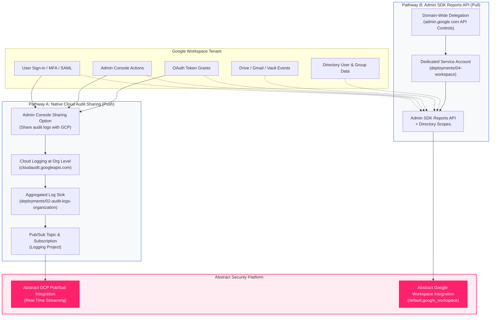
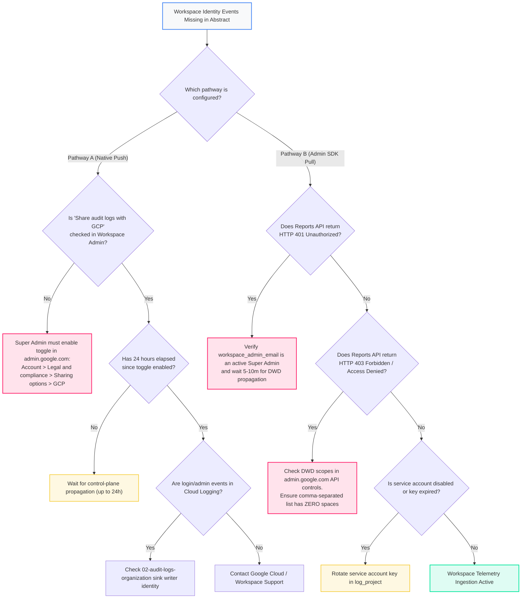

<picture>
  <source media="(prefers-color-scheme: dark)" srcset="../../brand/abstract-logo-white.svg">
  
</picture>

# Google Workspace Security Telemetry & Identity Logs

<a href="https://shell.cloud.google.com/cloudshell/editor?cloudshell_git_repo=https://github.com/IamABS3C/abstract-gcp-templates&cloudshell_git_branch=main&cloudshell_workspace=deployments/04-workspace&cloudshell_tutorial=TUTORIAL.md"></a>

<p align="center"></p>

> **Interactive Architecture Diagram**  
> Open in Draw.io Desktop: `./scripts/open-diagram.sh 04-workspace`  
> Open in diagrams.net Web: `./scripts/open-diagram.sh 04-workspace --web`

Export Google Workspace identity, administrative, and application audit telemetry directly to **Abstract Security**.

---

## The Identity Logging Landscape

When security teams ask for **"GCP identity logs"**, they are almost always looking for **Google Workspace sign-in and authentication telemetry** (user sign-ins, MFA challenges, SAML SSO assertions, OAuth app grants, and account suspensions).

In Google Cloud:
* **GCP Cloud Audit Logs** capture Google Cloud Platform management-plane API interactions (console logins, IAM policy modifications, VM lifecycles) via `cloudaudit.googleapis.com/activity`.
* **Google Workspace audit data** captures user identity and productivity suite actions across Google Workspace and Cloud Identity.

To ingest Google Workspace audit logs into Abstract Security, organizations can choose between **two distinct architectural pathways**, depending on latency requirements, security policies, and enrichment needs.

```
┌─────────────────────────────────────────────────────────────────────────────────────────┐
│                                Google Workspace Tenant                                  │
│                                                                                         │
│  [Identity]          [Admin Console]        [OAuth Tokens]         [Drive / Gmail]      │
│  Logins, MFA, SAML   User/Group lifecycle   Third-party app grants File sharing, Vault  │
└────────────────────────────┬──────────────────────────────────────────┬─────────────────┘
                             │                                          │
                 Pathway A:  │ Native Cloud Audit                       │ Pathway B: Admin SDK
                 Real-Time   │ Sharing (Zero Polling)                   │ Reports API (Pull)
                             ▼                                          │ + Domain-Wide Del.
┌────────────────────────────────────────────────────────┐              │
│       Google Cloud Organization (organizations/...)    │              │
│                                                        │              │
│   Cloud Logging: cloudaudit.googleapis.com             │              │
│   (serviceName: login.googleapis.com, admin, saml)     │              │
│                                                        │              │
│   Aggregated Log Sink (02-audit-logs-organization)     │              │
└────────────────────────────┬───────────────────────────┘              │
                             │ Writer Identity                          │
                             ▼                                          │
┌────────────────────────────────────────────────────────┐              │
│         Logging Project (acme-security-logging)        │              │
│                                                        │              │
│   Pub/Sub Topic: abstract-audit-logs                   │              │
│         │                                              │              │
│         ▼                                              │              │
│   Pub/Sub Pull Subscription: abstract-audit-logs-sub   │              │
└────────────────────────────┬───────────────────────────┘              │
                             │ Authenticated Pull                       │ Checkpoint Poll
                             │ (Service Account Key)                    │ (Admin Impersonation)
                             ▼                                          ▼
┌─────────────────────────────────────────────────────────────────────────────────────────┐
│                                Abstract Security Platform                               │
│                                                                                         │
│   GCP Pub/Sub Integration (Real-Time)   OR   Workspace Integration (default.workspace)  │
└─────────────────────────────────────────────────────────────────────────────────────────┘
```



---

## Telemetry Dataflow & Ingestion Path

Google Workspace telemetry flows across two distinct technical pipelines depending on whether Native Cloud Audit Sharing (Pathway A) or Admin SDK Reports API (Pathway B) is used.

### Ingestion Mechanics and Transport Protocols

#### Pathway A: Native Push Streaming
* **Transport**: Google internal RPC broker dispatch. Workspace control plane writes directly into Google Cloud Logging at Organization scope (`organizations/ORG_ID`).
* **Protocol & Port**: Intra-Google Andromeda network bus to `pubsub.googleapis.com:443`.
* **Consumer Interface**: Abstract Security pulls from Cloud Pub/Sub via bi-directional gRPC streaming pull over TCP 443 with TLS 1.3 encryption.
* **Network Boundary**: Zero public egress from Workspace to GCP; Pub/Sub pull uses project-scoped Service Account key.

#### Pathway B: Scheduled Reports API Pull
* **Transport**: Outbound HTTPS REST polling against `https://admin.googleapis.com/admin/reports/v1/activity/users/all/applications/{applicationName}` over TCP port 443 with TLS 1.3.
* **Authentication**: OAuth 2.0 JWTBearer token exchange against `https://oauth2.googleapis.com/token` using Domain-Wide Delegation (DWD) to impersonate `workspace_admin_email`.
* **Directory Context**: Outbound HTTPS calls to Google Admin SDK Directory API (`https://admin.googleapis.com/admin/directory/v1/users` and `/groups`) to resolve organizational units, managers, and group memberships.

### Latency Profile
* **Pathway A Latency**: **Sub-second to 5 seconds** from user authentication/MFA challenge to event availability in Abstract SIEM.
* **Pathway B Latency**: **5 to 15 minutes** (governed by scheduled API polling interval and Google Workspace backend event indexing latency).
* **Propagation Delay**: Initial toggle in Workspace Admin Console for Pathway A takes up to 24 hours to initialize; DWD authorization in Pathway B takes 5 to 10 minutes to propagate across Google OAuth servers.

### Throughput Guarantees & API Limits
* **Pathway A**: Backed by Google Cloud Pub/Sub regional quotas (200 MB/s publish / 400 MB/s subscribe). Zero API quota consumed on Workspace.
* **Pathway B**: Governed by Google Workspace Admin SDK Reports API rate limits (default: 250 requests/min/user).
* **Buffer & Reliability**: Pathway A buffers up to 7 days in Pub/Sub; Pathway B utilizes high-watermark stateful timestamps stored in Abstract Security to prevent duplicate polling and resume from outages.

---

## Architectural Comparison: Pathway A vs Pathway B

| Capability / Attribute | Pathway A: Native Cloud Audit Sharing | Pathway B: Admin SDK Reports API |
|---|---|---|
| **Primary Mechanism** | Real-time push stream into Google Cloud Logging | Scheduled API polling with per-application checkpoints |
| **Delivery Latency** | **Sub-second to 5 seconds** (instantaneous streaming) | **5 to 15 minutes** (polling cadence) |
| **GCP Terraform Deployment** | Uses `deployments/02-audit-logs-organization` | Uses `deployments/04-workspace` |
| **Abstract Integration** | Abstract **Google Cloud Pub/Sub** Integration | Abstract **Google Workspace** Integration (`default.google_workspace`) |
| **Authentication Model** | GCP Service Account pulling from Pub/Sub | GCP Service Account with **Domain-Wide Delegation** |
| **Workspace Super Admin Action** | Enable toggle in Admin Console (one click) | Add Client ID and paste OAuth scopes in API Controls |
| **Credential Held by SIEM** | Pub/Sub subscriber key (strictly project-scoped) | Domain-wide delegated key (tenant-wide read scope) |
| **Supported Telemetry** | Login, Admin, SAML, OAuth Token, Groups, Rules, CAA | All 23 Workspace apps (Drive, Gmail, Vault, Chrome, etc.) |
| **Directory Context Enrichment** | ❌ No directory enrichment (audit payload only) | ✅ **Yes** (`admin.directory.user.readonly` / `group.readonly`) |
| **API Rate Limits / Quotas** | **Zero quota consumption** (event-driven stream) | Subject to Admin SDK Reports API request quotas |
| **Best Used When** | Real-time detection of credential compromise & SAML hijacking | High-fidelity auditing, Drive/Gmail exfil, or UEBA user enrichment |

---

## Pathway A — Native Google Workspace Cloud Audit Logs Sharing

### Overview
Google Workspace provides a native feature that automatically streams Workspace audit logs directly into **Google Cloud Logging** at the **Organization** resource level (`organizations/ORG_ID`). 

Once enabled, Workspace writes:
* `cloudaudit.googleapis.com/activity` (Admin audit)
* `cloudaudit.googleapis.com/data_access` (Login, Token, SAML, and Groups audit)

Because these logs land natively in Cloud Logging under your Google Cloud Organization, an organization-level aggregated sink (`deployments/02-audit-logs-organization`) automatically captures them and delivers them to Pub/Sub with **zero API polling** and **zero domain-wide delegation**.

### How to Enable Native Sharing

1. Sign in to the **Google Workspace Admin Console** at [admin.google.com](https://admin.google.com) as a **Super Administrator**.
2. Navigate to: **Account** &rarr; **Account settings** &rarr; **Legal and compliance**.
3. Locate **Sharing options** and click **Google Cloud Platform**.
4. Check the box: **Share audit logs with Google Cloud**.
5. Click **Save**.

> [!NOTE]
> Propagation can take up to 24 hours in the Google Workspace control plane, though events typically begin flowing into Cloud Logging within 15–30 minutes.

### Cloud Logging Filter Coverage
When native sharing is active, the aggregated log sink in `deployments/02-audit-logs-organization` intercepts these events using its catalog categories:
* `admin_activity`: Intercepts `logName:"cloudaudit.googleapis.com%2Factivity"` from Workspace administrative actions.
* `identity_access`: Intercepts `protoPayload.serviceName=("login.googleapis.com" OR "saml.googleapis.com" OR "token.googleapis.com")`.

Verify that logs are arriving in GCP using `gcloud`:
```bash
export ORG_ID="123456789012"

gcloud logging read 'logName:"cloudaudit.googleapis.com" AND protoPayload.serviceName=("login.googleapis.com" OR "admin.googleapis.com")' \
  --organization="$ORG_ID" \
  --limit=5 \
  --format="json(timestamp,protoPayload.serviceName,protoPayload.methodName,protoPayload.authenticationInfo.principalEmail)"
```

---

## Pathway B — Admin SDK Reports API with Domain-Wide Delegation

### When is Pathway B Required?
Deploy `deployments/04-workspace` when:
1. **Native sharing is unavailable or disabled**: Organizational policies or multi-organization boundaries prevent linking Workspace audit logs to the GCP Org.
2. **Directory context enrichment is required**: You need user attributes (manager, job title, department, cost center, organizational unit) or group memberships via the Directory API for SIEM UEBA correlations.
3. **Application audit streams are needed**: You require granular file-level events from **Google Drive**, message metadata from **Gmail**, or eDiscovery queries from **Google Vault** that are not exported via native Cloud Audit Logs sharing.

---

## Setting up Pathway B with Terraform

This deployment (`deployments/04-workspace`) provisions:
* An enabled `admin.googleapis.com` (Admin SDK) service in your logging project.
* A dedicated GCP Service Account (`abstract-workspace-reader`) used strictly for Workspace reporting.
* Preconditions validating application groups and volume acknowledgements.
* Structured onboarding outputs containing the exact numeric Client ID and scopes.

### Step 1 — Configure `terraform.tfvars`

```bash
cd deployments/04-workspace

cat > terraform.tfvars <<EOF
log_project                         = "acme-security-logging"
workspace_admin_email               = "admin-audit@example.com"
workspace_app_groups                = ["identity", "admin"]
include_directory_enrichment_scopes = true
EOF
```

> [!IMPORTANT]
> `workspace_admin_email` must be an active Google Workspace account with administrative privileges (at minimum, access to audit reports). Domain-wide delegation operates by impersonating this user; without a valid subject, the Reports API returns HTTP `401 Unauthorized`.

### Step 2 — Deploy the Service Account

```bash
tofu init
tofu apply
```

### Step 3 — Grant Domain-Wide Delegation in Workspace

1. Copy the setup values from Terraform:
   ```bash
   tofu output workspace_onboarding
   ```
2. As a **Google Workspace Super Admin**, navigate to [admin.google.com](https://admin.google.com):
   **Security** &rarr; **Access and data control** &rarr; **API controls** &rarr; **Domain-wide delegation** &rarr; **Add new**.
3. In **Client ID**, paste the numeric `client_id` (from the Terraform output).
4. In **OAuth Scopes**, paste the comma-separated list of scopes (no spaces):
   ```
   https://www.googleapis.com/auth/admin.reports.audit.readonly,https://www.googleapis.com/auth/admin.reports.usage.readonly,https://www.googleapis.com/auth/admin.directory.user.readonly,https://www.googleapis.com/auth/admin.directory.group.readonly
   ```
5. Click **Authorize**.

### Step 4 — Generate Service Account Key & Connect Abstract

Generate the service account private key out of band:
```bash
export SA_EMAIL=$(tofu output -json workspace_onboarding | jq -r .service_account_email)

gcloud iam service-accounts keys create abstract-workspace-key.json \
  --iam-account="$SA_EMAIL" \
  --project="acme-security-logging"
```

In the Abstract Security console:
1. Navigate to **Integrations** &rarr; **Google Workspace** (`default.google_workspace`).
2. Enter **Admin Email**: `admin-audit@example.com`.
3. Upload **Credentials**: `abstract-workspace-key.json`.
4. Select **Application Names**: `login`, `saml`, `token`, `admin`, `groups`, `rules`.
5. Save the integration.
6. Delete the local JSON key file: `rm abstract-workspace-key.json`.

---

## Directory Enrichment Scopes Deep-Dive

When `include_directory_enrichment_scopes = true` is configured, Terraform includes:
* `https://www.googleapis.com/auth/admin.directory.user.readonly`
* `https://www.googleapis.com/auth/admin.directory.group.readonly`

### Why Directory Enrichment Matters to the SOC
Audit logs tell you *who took an action* (e.g., `user@example.com`). Directory enrichment provides the critical context:
1. **Blast Radius & Privilege**: Identifies whether the actor is an executive, systems administrator, contractor, or developer.
2. **Organizational Hierarchy**: Ingests user department, manager email, and title for anomaly detection (e.g., finance user accessing engineering repositories).
3. **Group Memberships**: Maps dynamic and nested group affiliations to detect privilege escalation or shadow group modifications.

---

## Supported Workspace Application Streams

The Abstract Google Workspace integration supports 23 distinct application activity streams:

| Category | Applications | Security Significance |
|---|---|---|
| **Identity** | `login`, `saml`, `token`, `user_accounts`, `context_aware_access` | Authentication successes/failures, MFA challenges, SAML lateral movement, consent-phishing OAuth grants. |
| **Admin** | `admin`, `groups`, `groups_enterprise`, `rules` | Admin Console policy changes, role grants, group membership modifications, DLP rule triggers. |
| **Data** | `drive`, `gmail`, `calendar`, `keep`, `vault` | File exfiltration, external sharing, eDiscovery searches in Vault. *(Requires `acknowledge_high_volume = true` for Drive/Gmail)*. |
| **Endpoint** | `chrome`, `mobile` | Managed browser events, extension installations, mobile device compliance, remote wipe. |
| **Collaboration** | `chat`, `meet`, `jamboard`, `gplus` | Meeting participation, external chat invites, compliance recording events. |
| **Platform** | `access_transparency`, `gcp`, `data_studio` | Google employee access justifications, Looker Studio sharing. |

---

## Diagnostic & Troubleshooting Decision Tree

Follow this decision tree when diagnosing Google Workspace identity telemetry across Pathway A and Pathway B:



### Failure Modes & Remediation Runbook

#### 1. HTTP 401 Unauthorized / Invalid Impersonation Subject (Pathway B)
* **Symptom**: Abstract Security console reports `401 Unauthorized: Invalid impersonation prn email address`.
* **Root Cause**: The `workspace_admin_email` variable specifies an address that does not exist, has been suspended, or lacks administrative privileges to view Reports in Google Workspace. Domain-wide delegation operates strictly by impersonating a live user; without a valid subject, OAuth token exchange succeeds but API calls fail with 401.
* **Verification Command**:
  ```bash
  # Verify service account token generation and impersonation capability
  SA_EMAIL=$(gcloud iam service-accounts list --project="$LOG_PROJECT" \
    --filter="displayName:'Abstract Security Workspace Reader'" --format="value(email)")
  echo "Workspace SA: $SA_EMAIL"
  ```
* **Remediation**:
  Ensure `workspace_admin_email` is an active Workspace Super Administrator or Delegated Administrator with the "Reports" privilege granted.

#### 2. HTTP 403 Forbidden / Not Authorized for Delegated Scope (Pathway B)
* **Symptom**: Abstract Security reports `403 Forbidden: Client is unauthorized to retrieve access tokens using this method, or client not authorized for requested scopes`.
* **Root Cause**:
  1. The numeric **Client ID** was entered incorrectly in Workspace Admin Console (often mistakenly using the alphanumeric service account email or name).
  2. The OAuth scopes string contains trailing spaces or is missing one of the required URLs.
* **Verification Command**:
  ```bash
  # Retrieve the exact numeric client ID
  gcloud iam service-accounts describe "$SA_EMAIL" --project="$LOG_PROJECT" \
    --format="value(uniqueId)"
  ```
* **Remediation**:
  Navigate to [admin.google.com](https://admin.google.com) &rarr; **Security** &rarr; **Access and data control** &rarr; **API controls** &rarr; **Domain-wide delegation**. Edit the entry, verify the numeric **Client ID** matches `uniqueId`, and ensure scopes are pasted without spaces:
  ```
  https://www.googleapis.com/auth/admin.reports.audit.readonly,https://www.googleapis.com/auth/admin.reports.usage.readonly,https://www.googleapis.com/auth/admin.directory.user.readonly,https://www.googleapis.com/auth/admin.directory.group.readonly
  ```

#### 3. Zero Logs in Pathway A (Native Audit Sharing)
* **Symptom**: No `login.googleapis.com` or `admin.googleapis.com` logs appear in GCP Cloud Logging.
* **Verification Command**:
  ```bash
  gcloud logging read 'logName:"cloudaudit.googleapis.com" AND protoPayload.serviceName=("login.googleapis.com" OR "admin.googleapis.com")' \
    --organization="$ORG_ID" \
    --limit=3
  ```
* **Remediation**:
  1. Verify the sharing toggle is enabled: `admin.google.com ➔ Account ➔ Account settings ➔ Legal and compliance ➔ Sharing options ➔ Google Cloud Platform ➔ Share audit logs with Google Cloud`.
  2. Confirm `deployments/02-audit-logs-organization` sink has `include_children = true` and writer identity has `roles/pubsub.publisher` on destination topic.

---

## Verification

### Pathway A Verification
```bash
# Query for native Workspace login events in Cloud Logging
gcloud logging read 'protoPayload.serviceName="login.googleapis.com"' \
  --organization="$ORG_ID" --limit=3 \
  --format="table(timestamp,protoPayload.methodName,protoPayload.authenticationInfo.principalEmail)"
```

### Pathway B Verification
```bash
# Verify Service Account existence and enabled Admin SDK API
gcloud services list --project="$LOG_PROJECT" --enabled --filter="name:admin.googleapis.com"
gcloud iam service-accounts describe "$SA_EMAIL" --project="$LOG_PROJECT"
```

---

[← All scenarios](../../README.md) · [Architecture](../../docs/ARCHITECTURE.md) · [Permissions](../../docs/PERMISSIONS.md) · [Workspace Deep-Dive](../../docs/WORKSPACE.md)

