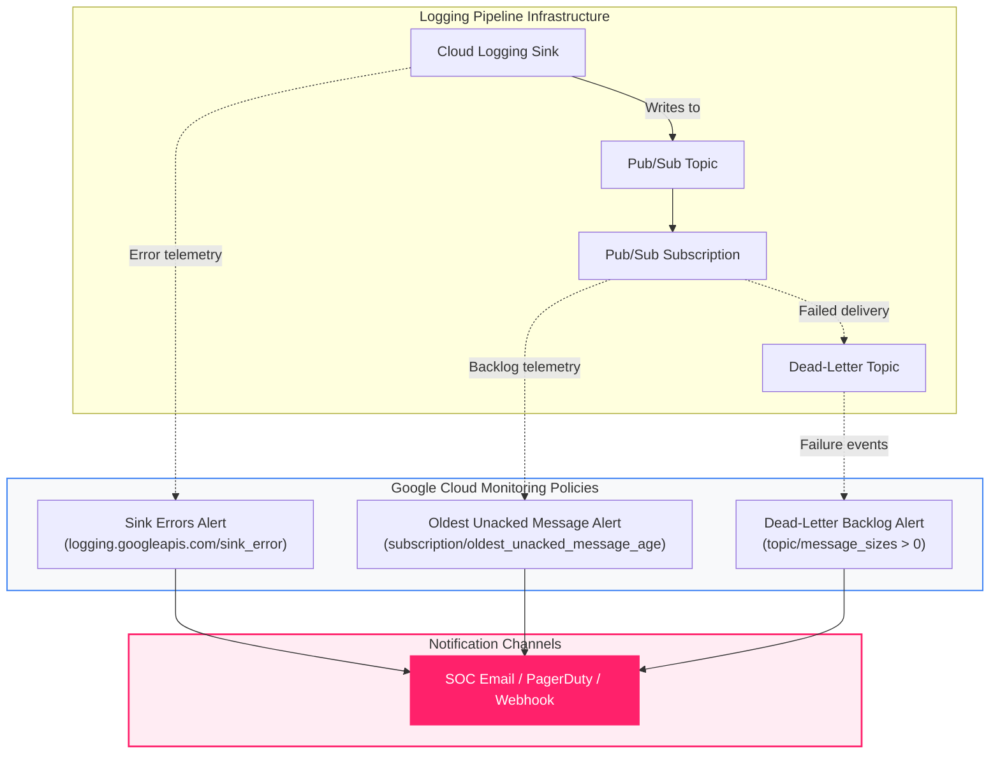

<picture>
  <source media="(prefers-color-scheme: dark)" srcset="../../brand/abstract-logo-white.svg">
  
</picture>

# Pipeline Health & Availability Alerting

<a href="https://shell.cloud.google.com/cloudshell/editor?cloudshell_git_repo=https://github.com/IamABS3C/abstract-gcp-templates&cloudshell_git_branch=main&cloudshell_workspace=deployments/05-health-alerts&cloudshell_tutorial=TUTORIAL.md"></a>

Provisions automated Google Cloud Monitoring alerting policies to catch silent failures, pipeline backlogs, and IAM permission revocations across your Abstract Security logging infrastructure.

<p align="center">
  
</p>

> [!TIP]
> **Interactive Architecture Diagram (Draw.io / diagrams.net)**:
> Edit, export, and customize this architecture directly on your machine or browser:
> ```bash
> ./scripts/open-diagram.sh 05-health-alerts          # Opens in macOS Draw.io Desktop
> ./scripts/open-diagram.sh 05-health-alerts --web    # Opens in diagrams.net
> ```

---

## Why Pipeline Health Alerting is Critical

Every other deployment in this repository gets security data flowing. **This deployment tells you when it stops.**

In Google Cloud, logging pipeline failures are **completely silent by default**:
* If an IAM permission on a Pub/Sub topic is accidentally removed, the Log Router drops events and writes an internal error to `logging.googleapis.com/sink_error`. Workload projects show no errors.
* If an ingestion service stops pulling, undelivered messages quietly accumulate in the Pub/Sub subscription until they exceed retention (default 7 days) and drop permanently without backfill.
* If a sink filter is misconfigured or an exclusion rule is added too broadly, no data flows, yet all GCP dashboards remain green.

```
┌─────────────────────────────────────────────────────────────────────────────┐
│                    Dedicated Logging Project (log_project)                  │
│                                                                             │
│   Pub/Sub Topics & Sinks ───> Cloud Monitoring Metrics Engine              │
│                                      │                                      │
│                                      ├──> Sink Errors (sink_error logs)     │
│                                      ├──> Oldest Unacked Message Age > 1hr  │
│                                      └──> Dead-Letter Queue Depth > 0       │
└──────────────────────────────────────┬──────────────────────────────────────┘
                                       │ Notification Channel
                                       ▼
┌─────────────────────────────────────────────────────────────────────────────┐
│                  Security Operations Center (SOC) / On-Call                 │
│                                                                             │
│   PagerDuty, Email, Slack, or Webhook notification                          │
└─────────────────────────────────────────────────────────────────────────────┘
```



---

## Telemetry Dataflow & Ingestion Path

The monitoring subsystem operates out-of-band relative to the live log stream, decoupling health supervision from log ingestion performance:

```
┌─────────────────────────────────────────────────────────────────────────────────────────────────────────┐
│                                 TELEMETRY DATAFLOW & SUPERVISION PATH                                    │
│                                                                                                         │
│   Log Router / Pub/Sub Engine                 Cloud Monitoring Engine               Notification Target │
│   ┌───────────────────────────┐               ┌──────────────────────────┐          ┌─────────────────┐ │
│   │ • sink_error metric       │  gRPC / TLS   │ • 60s Metric Aggregation │  HTTPS   │ • PagerDuty     │ │
│   │ • oldest_unacked_msg_age  ├──────────────►│ • Window Evaluation      ├─────────►│ • SOC Email     │ │
│   │ • subscription/backlog    │   Port 443    │ • Metric Absence Detect  │ Port 443 │ • Slack / Hook  │ │
│   └───────────────────────────┘               └──────────────────────────┘          └─────────────────┘ │
└─────────────────────────────────────────────────────────────────────────────────────────────────────────┘
```

### Technical Telemetry Parameters

| Dimension | Specification | Operational Note |
|---|---|---|
| **Monitoring Protocols** | HTTPS REST / gRPC v3 (`monitoring.googleapis.com`) | Internal metric scrapers feed Cloud Monitoring continuously |
| **Transport Port** | `443` (TLS 1.3 encrypted) | All egress to alerting channels is encrypted via TLS |
| **Sampling Window** | 60 seconds | Rolling alignment period prevents transient spikes from triggering false alarms |
| **Alert Latency Profile** | 60s – 180s from condition breach to notification dispatch | Metric absence condition triggers after 3,600s of absolute silence |
| **Throughput & Capacity** | Zero pipeline overhead | Metric collection is decoupled from Pub/Sub data plane |
| **Notification SLA** | 99.9% Google Cloud Monitoring availability SLA | Notification retries employ exponential backoff up to 24 hours |

---

## What Gets Monitored

1. **Sink Errors (`logging.googleapis.com/exports/error_count`)**: Triggers when Cloud Logging cannot deliver log entries to the destination Pub/Sub topic (e.g., deleted topic or revoked `roles/pubsub.publisher` permission on the sink's writer identity).
2. **Oldest Unacked Message Age (`pubsub.googleapis.com/subscription/oldest_unacked_message_age`)**: Triggers when messages remain unacknowledged in the subscription longer than the defined threshold (default: 1 hour / 3,600s), signaling a stalled or disconnected Abstract consumer before messages reach the 7-day retention cliff.
3. **Dead-Letter Message Count (`pubsub.googleapis.com/topic/message_sizes` on DLQ)**: Triggers immediately if any log message fails processing repeatedly (default: 5 delivery attempts) and drops into the dead-letter queue.
4. **Metric Absence / Feed Went Dark**: Alerts if zero audit logs are published across the entire estate for 60 consecutive minutes, catching disabled sinks or broken filter exclusions.

---

## Diagnostic & Troubleshooting Decision Tree

When monitoring alerts fire or telemetry ceases flowing, follow this systematic diagnostic decision tree:

```
Pipeline Health Alert Triggered
  │
  ├──► [Sink Errors Fired?]
  │      ├── YES ──► Check if Sink Writer Identity has roles/pubsub.publisher on topic
  │      │           Command: gcloud pubsub topics get-iam-policy TOPIC_NAME
  │      └── NO  ──► Check Pub/Sub subscription metrics
  │
  ├──► [Oldest Unacked Message Age > 3600s?]
  │      ├── YES ──► Ingestion consumer is disconnected, deadlocked, or rate-limited
  │      │           Command: gcloud pubsub subscriptions describe SUB_NAME
  │      │           Action: Check Abstract Security Platform Console connection status
  │      └── NO  ──► Check DLQ topic
  │
  ├──► [Dead-Letter Queue Backlog > 0?]
  │      ├── YES ──► Malformed message payloads exceeding max delivery attempts
  │      │           Command: gcloud pubsub subscriptions pull DLQ_SUB_NAME --limit=1
  │      └── NO  ──► Check Metric Absence
  │
  └──► [Metric Absence Alert (Feed Dark)?]
         └── YES ──► Sink disabled or filter narrowed to match 0 logs
                     Command: gcloud logging sinks describe SINK_NAME
```

### Verification & Remediation Commands

#### 1. Verify Alert Policy Deployment & State
```bash
gcloud alpha monitoring policies list --project="acme-security-logging" \
  --format="table(displayName,enabled,notificationChannels.len():label=CHANNELS)"
```

#### 2. Test Notification Channel Delivery
```bash
# List configured notification channels
gcloud beta monitoring channels list --project="acme-security-logging" \
  --format="table(name,type,displayName,verificationStatus)"

# Verify channel labels and enablement
gcloud beta monitoring channels describe CHANNEL_ID --project="acme-security-logging"
```

#### 3. Inspect Live Sink Error Logs
```bash
# Query the internal sink_error log stream
gcloud logging read 'logName:"logging.googleapis.com%2Fsink_error"' \
  --project="acme-security-logging" \
  --limit=20 \
  --format="yaml(timestamp,resource,jsonPayload)"
```

#### 4. Query Pub/Sub Unacked Message Age Metric Directly
```bash
TOKEN=$(gcloud auth print-access-token)
P="acme-security-logging"

curl -s -G "https://monitoring.googleapis.com/v3/projects/$P/timeSeries" \
  -H "Authorization: Bearer $TOKEN" \
  --data-urlencode 'filter=metric.type="pubsub.googleapis.com/subscription/oldest_unacked_message_age"' \
  --data-urlencode "interval.startTime=$(date -u -v-15M +%Y-%m-%dT%H:%M:%SZ 2>/dev/null || date -u -d '-15 minutes' +%Y-%m-%dT%H:%M:%SZ)" \
  --data-urlencode "interval.endTime=$(date -u +%Y-%m-%dT%H:%M:%SZ)"
```

---

## How to Plan and Apply

### Step 1 — Navigate to Deployment

```bash
cd deployments/05-health-alerts
```

### Step 2 — Identify Notification Channels

List existing monitoring notification channels in your logging project:
```bash
gcloud beta monitoring channels list --project="acme-security-logging"
```

If none exist, create one:
```bash
gcloud beta monitoring channels create \
  --project="acme-security-logging" \
  --type=email \
  --display-name="SOC Security Alerts" \
  --channel-labels=email_address="soc@example.com"
```

### Step 3 — Configure Variables

```bash
export CHANNEL_ID="projects/acme-security-logging/notificationChannels/12345678"

cat > terraform.tfvars <<EOF
log_project           = "acme-security-logging"
notification_channels = ["$CHANNEL_ID"]
EOF
```

### Step 4 — Deploy

```bash
tofu init
tofu plan
tofu apply
```

---

## Verification

Confirm the alert policies are created, enabled, and wired to your notification channels:

```bash
tofu output alert_policies
```

---

[← All scenarios](../../README.md) · [Architecture](../../docs/ARCHITECTURE.md) · [SCC Findings](../06-scc-findings/README.md)
