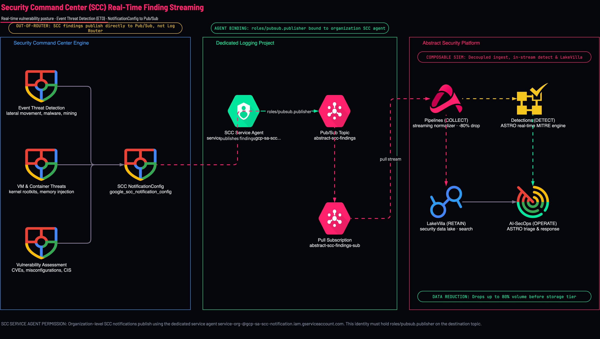
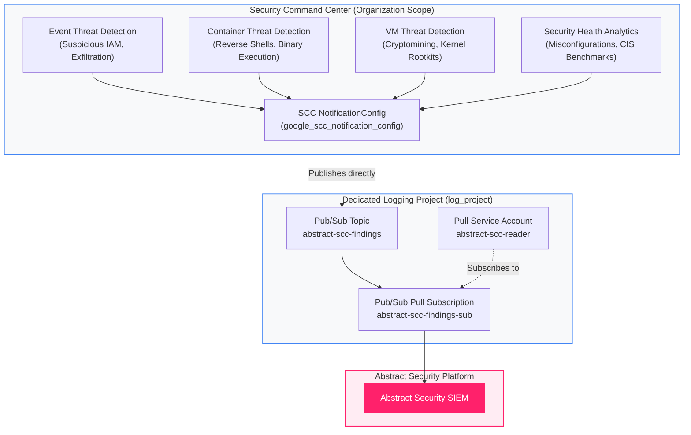

<picture>
  <source media="(prefers-color-scheme: dark)" srcset="../../brand/abstract-logo-white.svg">
  
</picture>

# Security Command Center (SCC) Findings Export

<a href="https://shell.cloud.google.com/cloudshell/editor?cloudshell_git_repo=https://github.com/IamABS3C/abstract-gcp-templates&cloudshell_git_branch=main&cloudshell_workspace=deployments/06-scc-findings&cloudshell_tutorial=TUTORIAL.md"></a>

Streams Google Cloud Security Command Center (SCC) vulnerability and threat findings directly to **Abstract Security** via Cloud Pub/Sub.

<p align="center">
  
</p>

> [!TIP]
> **Interactive Architecture Diagram (Draw.io / diagrams.net)**:
> Edit, export, and customize this architecture directly on your machine or browser:
> ```bash
> ./scripts/open-diagram.sh 06-scc-findings          # Opens in macOS Draw.io Desktop
> ./scripts/open-diagram.sh 06-scc-findings --web    # Opens in diagrams.net
> ```

---

## Why SCC Does Not Flow Through the Log Router

> [!IMPORTANT]
> **SCC findings do NOT pass through Cloud Logging.**
> Unlike audit logs and firewall events, SCC findings are published directly from the Security Command Center engine to Cloud Pub/Sub through an organization-level `google_scc_notification_config`. No filter on any Cloud Logging sink will ever capture SCC findings.

```
┌─────────────────────────────────────────────────────────────────────────────┐
│                 Google Cloud Security Command Center (SCC)                  │
│                                                                             │
│   • Threat Detections (Container Threat Detection, Event Threat Detection)  │
│   • Vulnerabilities (Web Security Scanner, Rapid Vulnerability Detection)   │
│   • Posture Misconfigurations (Security Health Analytics)                   │
└──────────────────────────────────────┬──────────────────────────────────────┘
                                       │ NotificationConfig (Streaming)
                                       ▼
┌─────────────────────────────────────────────────────────────────────────────┐
│                     Dedicated Logging Project (log_project)                 │
│                                                                             │
│   Pub/Sub Topic: abstract-scc-findings                                      │
│         │                                                                   │
│         ▼                                                                   │
│   Pub/Sub Pull Subscription: abstract-scc-findings-sub                      │
└──────────────────────────────────────┬──────────────────────────────────────┘
                                       │ Real-Time Pull
                                       ▼
┌─────────────────────────────────────────────────────────────────────────────┐
│                         Abstract Security Platform                          │
│                                                                             │
│   Automated triage, correlation, and posture management                     │
└─────────────────────────────────────────────────────────────────────────────┘
```



---

## Telemetry Dataflow & Ingestion Path

The SCC notification mechanism operates independently of the Cloud Logging infrastructure, delivering high-severity threat detections directly to a dedicated Pub/Sub pipeline:

```
┌─────────────────────────────────────────────────────────────────────────────────────────────────────────┐
│                                 TELEMETRY DATAFLOW & INGESTION PATH                                     │
│                                                                                                         │
│   SCC Threat Engine                    Pub/Sub Ingestion Topic               Abstract Security SIEM     │
│   ┌───────────────────────────┐        ┌───────────────────────────┐         ┌────────────────────────┐ │
│   │ • Event Threat Detection  │  gRPC  │ • Topic:                  │  gRPC   │ • OCSF / ECS Normalizer│ │
│   │ • Container Threat Detect ├───────►│   abstract-scc-findings   ├────────►│ • Incident Correlation │ │
│   │ • Security Health Analytics│ TLS 1.3│ • Sub: ...-findings-sub   │ TLS 1.3 │ • Risk Scoring Engine  │ │
│   └───────────────────────────┘        └───────────────────────────┘         └────────────────────────┘ │
└─────────────────────────────────────────────────────────────────────────────────────────────────────────┘
```

### Technical Telemetry Parameters

| Dimension | Specification | Operational Impact |
|---|---|---|
| **Ingestion Protocols** | Google Internal RPC ➔ Cloud Pub/Sub StreamingPull (gRPC / HTTPS over TLS 1.3) | Wire-level encryption with mutual certificate validation |
| **Transport Port** | `443` (Outbound TLS) | No firewall traversal exceptions required |
| **Event Latency Profile** | • ETD Findings: 15–60s<br/>• CTD/VMTD Findings: 1–3 min<br/>• SHA Scans: batch intervals (1–2 hrs) | Threat detections stream sub-minute; posture checks run on continuous schedule |
| **Pub/Sub Transport Latency** | < 100 milliseconds | From SCC emission to Pub/Sub availability |
| **Throughput & Capacity** | 10,000+ findings/second burst capacity | Decoupled from audit logs; network or audit surges cannot throttle threat alerts |
| **Durability & Guarantees** | At-least-once delivery, 7-day retention buffer | Unconsumed findings remain safe in Pub/Sub during maintenance windows |

---

## What Gets Created

* **SCC Notification Config**: `google_scc_notification_config` configured at the Organization scope.
* **Pub/Sub Topic & Subscription**: Dedicated topic (`abstract-scc-findings`) and pull subscription (`abstract-scc-findings-sub`) in `log_project`.
* **IAM Topic Publisher Binding**: Automatically grants `roles/pubsub.publisher` to the Organization's unique SCC Service Agent.
* **Abstract Pull Service Account (or Reused Identity)**: Dedicated reader identity granted `roles/pubsub.subscriber` on the subscription.

---

## Diagnostic & Troubleshooting Decision Tree

Follow this structured protocol to diagnose and isolate SCC finding export failures:

```
SCC Finding Export Issue
  │
  ├──► [Are Findings Visible in SCC Console?]
  │      ├── NO  ──► Check SCC Activation & Tier (Premium or Enterprise required)
  │      │           Command: gcloud scc findings list --organization=ORG_ID --limit=5
  │      └── YES ──► Check Notification Configuration
  │
  ├──► [Notification Config Active?]
  │      ├── NO  ──► Verify Notification Config exists at Organization scope
  │      │           Command: gcloud scc notifications list --organization=ORG_ID
  │      └── YES ──► Check Topic IAM Permissions
  │
  ├──► [SCC Service Agent Has roles/pubsub.publisher?]
  │      ├── NO  ──► Missing Publisher Role on Pub/Sub Topic (The #1 SCC Failure!)
  │      │           Identity: service-org-ORG_NUM@gcp-sa-scc-notification.iam.gserviceaccount.com
  │      │           Remediation: gcloud pubsub topics add-iam-policy-binding ...
  │      └── YES ──► Check Filter Expression
  │
  └──► [Filter Dropping Findings?]
         └── YES ──► Default filter: state="ACTIVE" AND NOT mute="MUTED"
                     Muted or closed findings will not export.
```

### Verification & Remediation Commands

#### 1. Verify SCC Notification Config State
```bash
export ORG_ID="123456789012"
gcloud scc notifications describe abstract-scc-findings-config \
  --organization="$ORG_ID" \
  --format="yaml(name,pubsubTopic,streamingConfig.filter)"
```

#### 2. Verify SCC Service Agent Topic Publisher Permissions
```bash
export LOG_PROJECT="acme-security-logging"
export ORG_NUM=$(gcloud organizations describe "$ORG_ID" --format="value(name.basename())")
export SCC_SA="service-org-${ORG_NUM}@gcp-sa-scc-notification.iam.gserviceaccount.com"

# Check if SCC service agent has pubsub.publisher
gcloud pubsub topics get-iam-policy abstract-scc-findings \
  --project="$LOG_PROJECT" \
  --flatten="bindings[].members" \
  --filter="bindings.role:roles/pubsub.publisher"
```

If missing, immediately grant publisher role:
```bash
gcloud pubsub topics add-iam-policy-binding abstract-scc-findings \
  --project="$LOG_PROJECT" \
  --member="serviceAccount:${SCC_SA}" \
  --role="roles/pubsub.publisher"
```

#### 3. Test Ingestion via Active Pull
```bash
# Pull test message without auto-ack
gcloud pubsub subscriptions pull abstract-scc-findings-sub \
  --project="$LOG_PROJECT" \
  --limit=2
```

---

## Permissions Needed

* **At the Organization**: `roles/securitycenter.notificationConfigEditor`
* **In the Logging Project**: `roles/pubsub.admin`, `roles/iam.serviceAccountAdmin`

---

## How to Plan and Apply

### Step 1 — Navigate to Deployment

```bash
cd deployments/06-scc-findings
```

### Step 2 — Configure Variables

```bash
cat > terraform.tfvars <<EOF
org_id                           = "123456789012"
log_project                      = "acme-security-logging"
subscriber_service_account_email = "abstract-pubsub-reader@acme-security-logging.iam.gserviceaccount.com"
filter                           = "state=\"ACTIVE\" AND NOT mute=\"MUTED\""
EOF
```

### Step 3 — Apply

```bash
tofu init
tofu plan
tofu apply
```

### Step 4 — Verify Outputs

```bash
tofu output scc_topic
tofu output scc_subscription
```

---

[← All scenarios](../../README.md) · [Architecture](../../docs/ARCHITECTURE.md) · [Asset Inventory](../07-asset-inventory/README.md)
