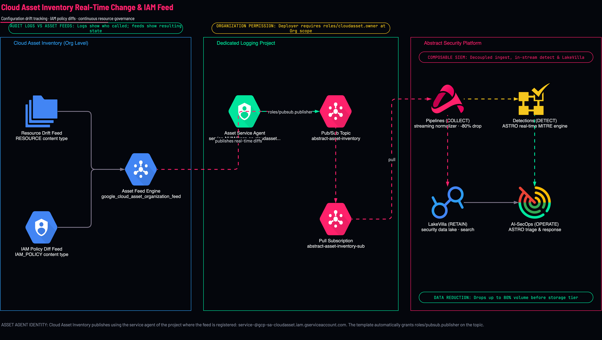
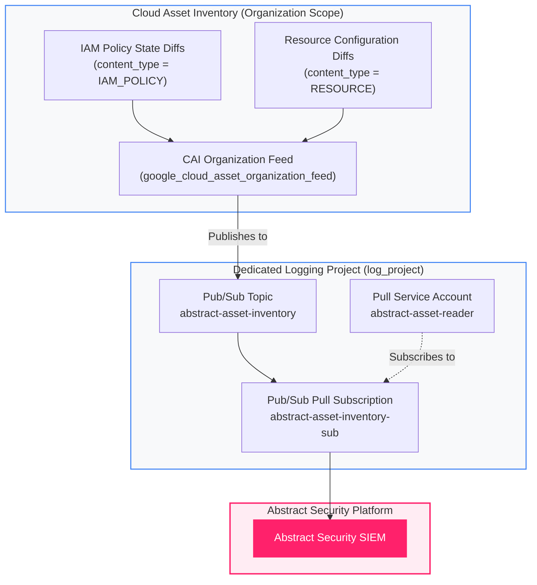

<picture>
  <source media="(prefers-color-scheme: dark)" srcset="../../brand/abstract-logo-white.svg">
  
</picture>

# Cloud Asset Inventory — Real-Time Resource & IAM Policy Feeds

<a href="https://shell.cloud.google.com/cloudshell/editor?cloudshell_git_repo=https://github.com/IamABS3C/abstract-gcp-templates&cloudshell_git_branch=main&cloudshell_workspace=deployments/07-asset-inventory&cloudshell_tutorial=TUTORIAL.md"></a>

Streams real-time Cloud Asset Inventory (CAI) state changes and IAM policy diffs directly to **Abstract Security** via Cloud Pub/Sub.

> [!IMPORTANT]
> Asset changes are stored only if the Abstract GCP Pub/Sub configuration for `abstract-asset-changes-sub` carries the configuration-level parser [`parsers/cloud-asset-inventory.yml`](../../parsers/cloud-asset-inventory.yml). The managed GCP parser keeps only audit logs and drops asset changes. Never put this parser on the audit-log configuration.

<p align="center">
  
</p>

> [!TIP]
> **Interactive Architecture Diagram (Draw.io / diagrams.net)**:
> Edit, export, and customize this architecture directly on your machine or browser:
> ```bash
> ./scripts/open-diagram.sh 07-asset-inventory          # Opens in macOS Draw.io Desktop
> ./scripts/open-diagram.sh 07-asset-inventory --web    # Opens in diagrams.net
> ```

---

## Why Asset Feeds Complement Audit Logs

Audit logs and Cloud Asset Inventory feeds answer complementary security questions:
* **Cloud Audit Logs (`admin_activity`)**: Answers **who executed an API call** (e.g., `SetIamPolicy`).
* **Cloud Asset Inventory (`IAM_POLICY`, `RESOURCE`)**: Answers **what the configuration now IS**, and what changed between prior and current states.

Multiple distinct API paths can alter an IAM binding (console, gcloud, direct REST, deployment managers). Each generates different audit log formats, but Cloud Asset Inventory generates a single, clean **state diff**. This makes CAI the ideal telemetry source for real-time asset discovery, drift detection, and posture modeling in Abstract Security.

```
┌─────────────────────────────────────────────────────────────────────────────┐
│                 Google Cloud Asset Inventory (CAI) Engine                   │
│                                                                             │
│   • IAM Policy State Changes (IAM_POLICY feeds)                             │
│   • Resource State Modifications (RESOURCE feeds)                           │
│   • Real-Time Drift and Asset Creation/Deletion                             │
└──────────────────────────────────────┬──────────────────────────────────────┘
                                       │ Real-Time Asset Feed (google_cloud_asset_organization_feed)
                                       ▼
┌─────────────────────────────────────────────────────────────────────────────┐
│                     Dedicated Logging Project (log_project)                 │
│                                                                             │
│   Pub/Sub Topic: abstract-asset-inventory                                   │
│         │                                                                   │
│         ▼                                                                   │
│   Pub/Sub Pull Subscription: abstract-asset-inventory-sub                   │
└──────────────────────────────────────┬──────────────────────────────────────┘
                                       │ Real-Time Pull
                                       ▼
┌─────────────────────────────────────────────────────────────────────────────┐
│                         Abstract Security Platform                          │
│                                                                             │
│   Continuous asset graph modeling, identity mapping, and drift analytics    │
└─────────────────────────────────────────────────────────────────────────────┘
```



---

## Telemetry Dataflow & Ingestion Path

Cloud Asset Inventory feeds stream continuous differential updates directly to Cloud Pub/Sub, decoupling asset graph construction from audit log parsing:

```
┌─────────────────────────────────────────────────────────────────────────────────────────────────────────┐
│                                 TELEMETRY DATAFLOW & INGESTION PATH                                     │
│                                                                                                         │
│   Cloud Asset Inventory Core           Pub/Sub Ingestion Topic               Abstract Security SIEM     │
│   ┌───────────────────────────┐        ┌───────────────────────────┐         ┌────────────────────────┐ │
│   │ • IAM Policy State Diffs  │  gRPC  │ • Topic:                  │  gRPC   │ • Asset Graph Engine   │ │
│   │ • Resource Configurations ├───────►│   abstract-asset-inventory├────────►│ • Identity Mapping     │ │
│   │ • Org & Access Policies   │ TLS 1.3│ • Sub: ...-inventory-sub  │ TLS 1.3 │ • Posture & Drift Mod. │ │
│   └───────────────────────────┘        └───────────────────────────┘         └────────────────────────┘ │
└─────────────────────────────────────────────────────────────────────────────────────────────────────────┘
```

### Technical Telemetry Parameters

| Dimension | Specification | Operational Impact |
|---|---|---|
| **Ingestion Protocols** | Google Internal Asset Pipeline ➔ Cloud Pub/Sub StreamingPull (gRPC / HTTPS over TLS 1.3) | Highly optimized differential state distribution |
| **Transport Port** | `443` (Outbound TLS) | Industry standard encrypted communications |
| **State Diff Latency** | 30 to 120 seconds post-mutation | Captures before/after delta within moments of API commit |
| **Pub/Sub Latency** | < 100 milliseconds | Real-time queue availability |
| **Throughput & Capacity** | 5,000+ asset mutations/second | Handles mass provisioning or reorganization waves without event loss |
| **Reliability & Guarantees** | At-least-once delivery, 7-day durable message retention | Full prior and current state objects embedded in diff payload |

---

## What Gets Created

* **Cloud Asset Organization Feed**: `google_cloud_asset_organization_feed` configured at the Organization scope.
* **Pub/Sub Topic & Subscription**: Dedicated topic (`abstract-asset-inventory`) and pull subscription (`abstract-asset-inventory-sub`) in `log_project`.
* **IAM Topic Publisher Binding**: Automatically assigns `roles/pubsub.publisher` to the Cloud Asset Inventory service agent.
* **Abstract Pull Identity**: Dedicated service account or shared identity granted `roles/pubsub.subscriber` on the subscription.

---

## Diagnostic & Troubleshooting Decision Tree

Follow this structured protocol to diagnose and isolate Cloud Asset Inventory feed issues:

```
Cloud Asset Inventory Feed Issue
  │
  ├──► [API Enabled & Service Agent Provisioned?]
  │      ├── NO  ──► Cloud Asset API not enabled or internal provisioning pending
  │      │           Command: gcloud services enable cloudasset.googleapis.com
  │      └── YES ──► Check Feed Configuration
  │
  ├──► [Feed Exists at Organization Scope?]
  │      ├── NO  ──► Verify Organization permissions (roles/cloudasset.owner)
  │      │           Command: gcloud asset feeds list --organization=ORG_ID
  │      └── YES ──► Check Topic IAM Permissions
  │
  ├──► [CAI Service Agent Has roles/pubsub.publisher?]
  │      ├── NO  ──► Missing Publisher Role on Pub/Sub Topic!
  │      │           Identity: service-PROJECT_NUM@gcp-sa-cloudasset.iam.gserviceaccount.com
  │      │           Remediation: gcloud pubsub topics add-iam-policy-binding ...
  │      └── YES ──► Check Content Type & Scoped Asset Types
  │
  └──► [Asset Change Not Exported?]
         └── YES ──► Check if resource type is listed in asset_types variable
                     Or verify content_type matches expected diff (IAM_POLICY vs RESOURCE)
```

### Verification & Remediation Commands

#### 1. Verify Cloud Asset API Activation
```bash
export LOG_PROJECT="acme-security-logging"
gcloud services list --enabled --project="$LOG_PROJECT" --filter="name:cloudasset.googleapis.com"
```

#### 2. Verify CAI Organization Feed Details
```bash
export ORG_ID="123456789012"
gcloud asset feeds describe abstract-asset-inventory-feed \
  --organization="$ORG_ID" \
  --format="yaml(name,assetTypes,contentType,feedOutputConfig)"
```

#### 3. Verify CAI Service Agent Topic Publisher Permissions
```bash
export LOG_PROJECT_NUM=$(gcloud projects describe "$LOG_PROJECT" --format="value(projectNumber)")
export CAI_SA="service-${LOG_PROJECT_NUM}@gcp-sa-cloudasset.iam.gserviceaccount.com"

# Check topic IAM bindings
gcloud pubsub topics get-iam-policy abstract-asset-inventory \
  --project="$LOG_PROJECT" \
  --flatten="bindings[].members" \
  --filter="bindings.role:roles/pubsub.publisher"
```

If missing, grant publisher permissions:
```bash
gcloud pubsub topics add-iam-policy-binding abstract-asset-inventory \
  --project="$LOG_PROJECT" \
  --member="serviceAccount:${CAI_SA}" \
  --role="roles/pubsub.publisher"
```

#### 4. Test Ingestion via a Probe Subscription
```bash
# Never pull from abstract-asset-changes-sub: with --auto-ack that deletes events before Abstract
# reads them, and without it hides them from Abstract for the ack deadline.
# Pull from a throwaway subscription on the same topic instead. Create it BEFORE the
# test event: a new subscription only receives messages published after it exists.
PROBE="abstract-probe-$(date +%s)"
gcloud pubsub subscriptions create "$PROBE" --topic=abstract-asset-changes \
  --project="$LOG_PROJECT" --expiration-period=1d --message-retention-duration=10m
# Make a benign change the feed covers (the default content type is IAM_POLICY, so
# add and remove an IAM binding on a test resource), then wait.
sleep 120
gcloud pubsub subscriptions pull "$PROBE" --project="$LOG_PROJECT" --limit=2 --auto-ack
gcloud pubsub subscriptions delete "$PROBE" --project="$LOG_PROJECT" --quiet
```

---

## Permissions Needed

* **At the Organization**: `roles/cloudasset.owner` or `roles/cloudasset.viewer` + permission to create feeds.
* **In the Logging Project**: `roles/pubsub.admin`, `roles/iam.serviceAccountAdmin`.

---

## How to Plan and Apply

### Step 1 — Navigate to Deployment

```bash
cd deployments/07-asset-inventory
```

### Step 2 — Configure Variables

```bash
cat > terraform.tfvars <<EOF
org_id       = "123456789012"
log_project  = "acme-security-logging"
content_type = "IAM_POLICY"
EOF
```

### Step 3 — Apply

```bash
tofu init
tofu plan
tofu apply
```

### Step 4 — Verify Outputs

```bash
tofu output abstract_onboarding
tofu output cai_service_agent
```

---

[← All scenarios](../../README.md) · [Architecture](../../docs/ARCHITECTURE.md) · [Bucket Notifications](../08-bucket-logs/README.md)
