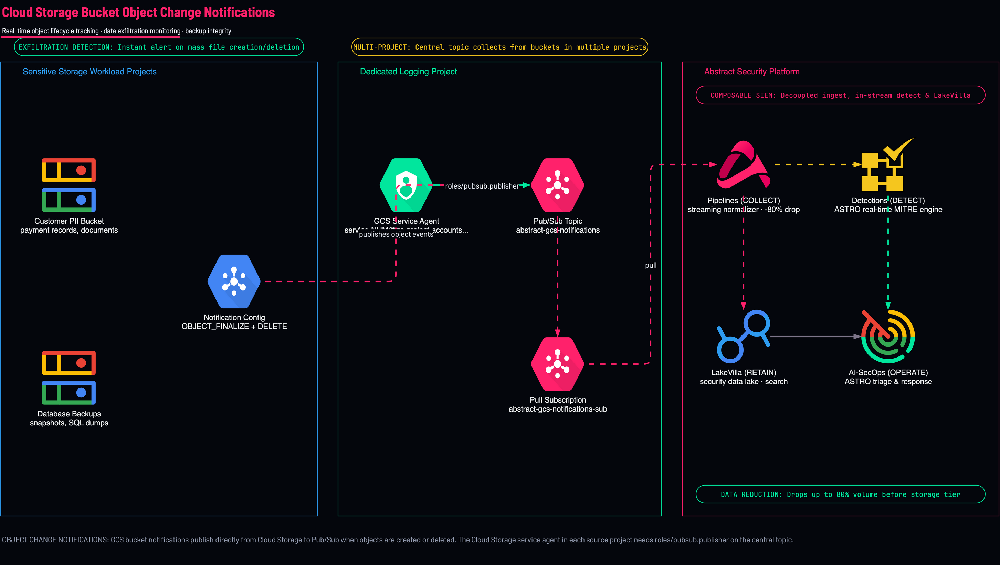

<picture>
  <source media="(prefers-color-scheme: dark)" srcset="../../brand/abstract-logo-white.svg">
  
</picture>

# Cloud Storage Bucket Log Notifications

<a href="https://shell.cloud.google.com/cloudshell/editor?cloudshell_git_repo=https://github.com/IamABS3C/abstract-gcp-templates&cloudshell_git_branch=main&cloudshell_workspace=deployments/08-bucket-logs&cloudshell_tutorial=TUTORIAL.md"></a>

Configures Cloud Storage bucket object notifications to ingest log files deposited into Google Cloud Storage (GCS) buckets directly into **Abstract Security**.

<p align="center">
  
</p>

> [!TIP]
> **Interactive Architecture Diagram (Draw.io / diagrams.net)**:
> Edit, export, and customize this architecture directly on your machine or browser:
> ```bash
> ./scripts/open-diagram.sh 08-bucket-logs          # Opens in macOS Draw.io Desktop
> ./scripts/open-diagram.sh 08-bucket-logs --web    # Opens in diagrams.net
> ```

---

## When to Ingest via Cloud Storage Notifications

Use this deployment when security data is written directly to Cloud Storage buckets rather than Cloud Logging:
* **Third-Party Security Appliances**: Firewalls, proxies, or edge appliances that deliver syslog or batch files directly to GCS.
* **SaaS & Cloud Provider Exports**: External feeds (e.g., CDN logs, Okta batch exports, Fastly) landing in storage buckets.
* **Legacy Archival Ingestion**: Replaying or ingesting archived log bundles into Abstract Security.

> [!NOTE]
> For native Google Cloud platform telemetry (Audit logs, VPC DNS, Firewall logs), use [02-audit-logs-organization](../02-audit-logs-organization/README.md) instead. Aggregated sinks stream events directly without per-bucket notification configuration or batch delays.

```
┌─────────────────────────────────────────────────────────────────────────────┐
│                 Target Google Cloud Storage (GCS) Buckets                   │
│                                                                             │
│   New object uploaded (OBJECT_FINALIZE event)                               │
└──────────────────────────────────────┬──────────────────────────────────────┘
                                       │ Pub/Sub Notification Config
                                       ▼
┌─────────────────────────────────────────────────────────────────────────────┐
│                     Dedicated Logging Project (log_project)                 │
│                                                                             │
│   Pub/Sub Topic: abstract-bucket-logs                                       │
│         │                                                                   │
│         ▼                                                                   │
│   Pub/Sub Pull Subscription: abstract-bucket-logs-sub                       │
└──────────────────────────────────────┬──────────────────────────────────────┘
                                       │ Authenticated Notification
                                       ▼
┌─────────────────────────────────────────────────────────────────────────────┐
│                         Abstract Security Platform                          │
│                                                                             │
│   Receives notification & fetches object content via Cloud Storage API      │
└─────────────────────────────────────────────────────────────────────────────┘
```

```mermaid
flowchart TD
    subgraph Storage["Cloud Storage Buckets"]
        Bucket["GCS Bucket<br/>(Appliance / SaaS Log Dumps)"]
        Event["Object Finalized<br/>(OBJECT_FINALIZE)"]
        Bucket --> Event
    end

    subgraph LoggingProject["Dedicated Logging Project (log_project)"]
        Topic["Pub/Sub Topic<br/>abstract-bucket-logs"]
        Sub["Pub/Sub Pull Subscription<br/>abstract-bucket-logs-sub"]
        SA["Pull Identity<br/>abstract-gcs-reader"]
        Event -->|Publishes notification| Topic
        Topic --> Sub
        SA -.->|Subscribes to| Sub
    end

    subgraph Abstract["Abstract Security Platform"]
        AbstractSIEM["Abstract Security Ingestion Engine"]
    end

    Sub --> AbstractSIEM
    AbstractSIEM -.->|Fetches object contents (HTTP/2)| Bucket

    style Abstract fill:#FF216B15,stroke:#FF216B,stroke-width:2px
    style AbstractSIEM fill:#FF216B,color:#ffffff,stroke:#FF216B,stroke-width:2px
    classDef gcpBox fill:#f8f9fa,stroke:#4285F4,stroke-width:1.5px;
    class Storage,LoggingProject gcpBox;
```

---

## Telemetry Dataflow & Ingestion Path

The GCS notification model is a two-phase decoupled ingestion pipeline:

```
┌─────────────────────────────────────────────────────────────────────────────────────────────────────────┐
│                                 TELEMETRY DATAFLOW & INGESTION PATH                                     │
│                                                                                                         │
│   1. Event Notification Phase                                                                           │
│   ┌───────────────────────────┐        ┌───────────────────────────┐         ┌────────────────────────┐ │
│   │ GCS Bucket Engine         │  gRPC  │ Pub/Sub Topic:            │  gRPC   │ Abstract Ingestion     │ │
│   │ • OBJECT_FINALIZE event   ├───────►│ abstract-bucket-logs      ├────────►│ • Receives Pointer     │ │
│   │ • Object metadata payload │ TLS 1.3│ Sub: ...-logs-sub         │ TLS 1.3 │ • Queues Fetch Job     │ │
│   └───────────────────────────┘        └───────────────────────────┘         └───────────┬────────────┘ │
│                                                                                          │              │
│   2. Object Retrieval Phase                                                              │              │
│   ┌───────────────────────────┐              Cloud Storage JSON API v1 (HTTPS)           │              │
│   │ GCS Object Data           │◄─────────────────────────────────────────────────────────┘              │
│   │ • Compressed logs (.gz)   │              GET /storage/v1/b/BUCKET/o/OBJECT (Port 443)               │
│   │ • JSONL / Syslog streams  │                                                                         │
│   └───────────────────────────┘                                                                         │
└─────────────────────────────────────────────────────────────────────────────────────────────────────────┘
```

### Technical Telemetry Parameters

| Dimension | Specification | Operational Impact |
|---|---|---|
| **Notification Protocol** | Cloud Pub/Sub StreamingPull (gRPC / HTTPS over TLS 1.3) | Delivers lightweight notification metadata |
| **Object Fetch Protocol** | Cloud Storage JSON API v1 / HTTP/2 over TLS 1.3 | Authenticated direct object streaming |
| **Transport Port** | `443` (Outbound TLS) | Fully encrypted in transit |
| **Event Latency Profile** | • `OBJECT_FINALIZE`: 500ms–2s<br/>• Pub/Sub Delivery: < 100ms<br/>• Abstract Fetch: 1–5s | Near real-time ingestion dependent on batch file creation frequency |
| **Throughput & Capacity** | Millions of objects/day across multi-region buckets | Highly parallelized fetching architecture |
| **Durability & Guarantees** | 99.99% GCS availability SLA, at-least-once notifications, 7-day retention buffer | Zero object loss during transient network partitions |

---

## What Gets Created

* **GCS Notification Configs**: Direct Pub/Sub notification bindings on specified buckets targeting `OBJECT_FINALIZE`.
* **Pub/Sub Topic & Subscription**: Centralized topic (`abstract-bucket-logs`) and subscription (`abstract-bucket-logs-sub`) in `log_project`.
* **IAM Topic Publisher Binding**: Grants `roles/pubsub.publisher` to the GCS service agent of every project owning a target bucket.
* **Abstract Pull & Read Identity**: Configures service account with `roles/pubsub.subscriber` on the subscription AND `roles/storage.objectViewer` on each monitored bucket.

---

## Diagnostic & Troubleshooting Decision Tree

Follow this structured protocol to diagnose and isolate bucket log notification failures:

```
Bucket Log Ingestion Issue
  │
  ├──► [Notification Config Active on Bucket?]
  │      ├── NO  ──► Check notification configuration using gsutil
  │      │           Command: gsutil notification list gs://BUCKET_NAME
  │      └── YES ──► Check GCS Service Agent Publisher Permissions
  │
  ├──► [GCS Service Agent Has roles/pubsub.publisher?]
  │      ├── NO  ──► Missing Publisher Binding on Destination Topic (The #1 GCS Failure!)
  │      │           Note: GCS Service Agent is scoped PER BUCKET-OWNING PROJECT!
  │      │           Identity: service-PROJECT_NUM@gs-project-accounts.iam.gserviceaccount.com
  │      │           Remediation: gcloud pubsub topics add-iam-policy-binding ...
  │      └── YES ──► Check Abstract Service Account Bucket Permissions
  │
  ├──► [Abstract SA Has roles/storage.objectViewer on Bucket?]
  │      ├── NO  ──► Abstract receives notification pointer but 403s on object fetch!
  │      │           Remediation: gcloud storage buckets add-iam-policy-binding ...
  │      └── YES ──► Check Object Prefix & Compression Format
  │
  └──► [Prefix or Format Mismatch?]
         └── YES ──► Verify object_name_prefix matches producer upload directory
                     Verify file format (.gz, .jsonl, .log) is supported by Abstract parser
```

### Verification & Remediation Commands

#### 1. Verify GCS Bucket Notification Configurations
```bash
gsutil notification list gs://acme-firewall-logs-bucket
```

#### 2. Verify GCS Service Agent Topic Publisher Permissions
```bash
export LOG_PROJECT="acme-security-logging"
export BUCKET_PROJECT="workload-project-id"

# Retrieve bucket project number
export BUCKET_PROJECT_NUM=$(gcloud projects describe "$BUCKET_PROJECT" --format="value(projectNumber)")
export GCS_SA="service-${BUCKET_PROJECT_NUM}@gs-project-accounts.iam.gserviceaccount.com"

# Check publisher binding on topic
gcloud pubsub topics get-iam-policy abstract-bucket-logs \
  --project="$LOG_PROJECT" \
  --flatten="bindings[].members" \
  --filter="bindings.role:roles/pubsub.publisher"
```

If missing, grant publisher role:
```bash
gcloud pubsub topics add-iam-policy-binding abstract-bucket-logs \
  --project="$LOG_PROJECT" \
  --member="serviceAccount:${GCS_SA}" \
  --role="roles/pubsub.publisher"
```

#### 3. Verify Abstract Reader Bucket Permissions
```bash
export SA_EMAIL="abstract-gcs-reader@acme-security-logging.iam.gserviceaccount.com"

gcloud storage buckets get-iam-policy gs://acme-firewall-logs-bucket \
  --filter="bindings.members:${SA_EMAIL}"
```

If missing, grant object viewer role:
```bash
gcloud storage buckets add-iam-policy-binding gs://acme-firewall-logs-bucket \
  --member="serviceAccount:${SA_EMAIL}" \
  --role="roles/storage.objectViewer"
```

#### 4. Test Notifications via a Probe Subscription
```bash
# Never pull from abstract-gcs-notifications-sub: with --auto-ack that deletes events before Abstract
# reads them, and without it hides them from Abstract for the ack deadline.
# Pull from a throwaway subscription on the same topic instead. Create it BEFORE the
# test event: a new subscription only receives messages published after it exists.
PROBE="abstract-probe-$(date +%s)"
gcloud pubsub subscriptions create "$PROBE" --topic=abstract-gcs-notifications \
  --project="$LOG_PROJECT" --expiration-period=1d --message-retention-duration=10m
# Upload a real log file under the configured prefix, then wait.
sleep 60
gcloud pubsub subscriptions pull "$PROBE" --project="$LOG_PROJECT" --limit=2 --auto-ack
gcloud pubsub subscriptions delete "$PROBE" --project="$LOG_PROJECT" --quiet
```

---

## How to Plan and Apply

### Step 1 — Navigate to Deployment

```bash
cd deployments/08-bucket-logs
```

### Step 2 — Configure Variables

```bash
cat > terraform.tfvars <<EOF
buckets            = ["acme-firewall-logs-bucket"]
bucket_project     = "workload-project-id"
log_project        = "acme-security-logging"
object_name_prefix = "logs/"
EOF
```

### Step 3 — Apply

```bash
tofu init
tofu plan
tofu apply
```

### Step 4 — Verify Outputs

```bash
tofu output abstract_onboarding
tofu output gcs_service_agents
```

---

[← All scenarios](../../README.md) · [Architecture](../../docs/ARCHITECTURE.md) · [Log Archive](../09-log-archive/README.md)
