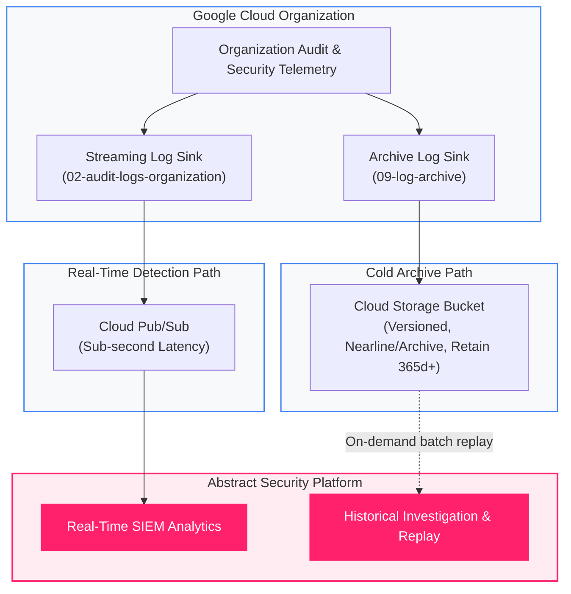

<picture>
  <source media="(prefers-color-scheme: dark)" srcset="../../brand/abstract-logo-white.svg">
  
</picture>

# Cold Log Archive & Compliance Storage

<a href="https://shell.cloud.google.com/cloudshell/editor?cloudshell_git_repo=https://github.com/IamABS3C/abstract-gcp-templates&cloudshell_git_branch=main&cloudshell_workspace=deployments/09-log-archive&cloudshell_tutorial=TUTORIAL.md"></a>

Provisions an immutable, cost-optimized Cloud Storage archive bucket and secondary organization log sink for regulatory compliance, long-term forensics, and historical replay.

<p align="center">
  
</p>

> [!TIP]
> **Interactive Architecture Diagram (Draw.io / diagrams.net)**:
> Edit, export, and customize this architecture directly on your machine or browser:
> ```bash
> ./scripts/open-diagram.sh 09-log-archive          # Opens in macOS Draw.io Desktop
> ./scripts/open-diagram.sh 09-log-archive --web    # Opens in diagrams.net
> ```

---

## Architectural Principles: Sinks Have One Destination

> [!IMPORTANT]
> In Google Cloud Logging, **a sink has exactly one destination**.
> You cannot route a single sink simultaneously to both Cloud Pub/Sub and Cloud Storage. To achieve both real-time SIEM detection and long-term compliance retention, organizations deploy **two parallel sinks**:
> 1. **Streaming Sink ([02-audit-logs-organization](../02-audit-logs-organization/README.md))**: Routes directly to Pub/Sub for sub-second threat detection in Abstract Security.
> 2. **Archival Sink (this deployment)**: Routes the identical filter to a hardened Cloud Storage bucket for multi-year retention.

```
┌─────────────────────────────────────────────────────────────────────────────┐
│                    Google Cloud Organization (organizations/...)            │
│                                                                             │
│   Audit Logs, Security Events, and Workspace Telemetry                      │
└───────────────────────┬─────────────────────────────────────┬───────────────┘
                        │                                     │
          Stream Sink   │ (Sub-second)           Archive Sink │ (Hourly batches)
                        ▼                                     ▼
┌──────────────────────────────────────┐  ┌───────────────────────────────────┐
│     Pub/Sub Topic & Subscription     │  │   Cloud Storage Compliance Bucket │
│     (acme-security-logging)          │  │   (Versioned, Object Hold, CMEK)  │
└───────────────────────┬──────────────┘  └───────────────────────────────────┘
                        │                                     ▲
                        ▼                                     │ Historical Replay
┌─────────────────────────────────────────────────────────────┴───────────────┐
│                         Abstract Security Platform                          │
│                                                                             │
│   Real-time detection engine & forensic investigation queries               │
└─────────────────────────────────────────────────────────────────────────────┘
```



---

## Telemetry Dataflow & Ingestion Path

The archival pipeline operates as a batch delivery path optimized for long-term storage economics and evidentiary immutability:

```
┌─────────────────────────────────────────────────────────────────────────────────────────────────────────┐
│                                 ARCHIVAL DATAFLOW & FORENSIC REPLAY PATH                                │
│                                                                                                         │
│   Log Router Engine                    Cloud Storage Compliance Bucket        Abstract Security SIEM    │
│   ┌───────────────────────────┐        ┌───────────────────────────┐          ┌───────────────────────┐ │
│   │ Aggregated Archive Sink   │ Internal│ Storage Bucket:           │  HTTPS   │ Abstract Ingestion    │ │
│   │ • includeChildren = true  ├───────►│ acme-audit-archive-us     ├─────────►│ • Forensic Search     │ │
│   │ • Hourly batch flush      │ Batch  │ • WORM Bucket Lock        │ Port 443 │ • Historical Replay   │ │
│   └───────────────────────────┘        └───────────────────────────┘          └───────────────────────┘ │
└─────────────────────────────────────────────────────────────────────────────────────────────────────────┘
```

### Technical Archival Parameters

| Dimension | Specification | Operational Note |
|---|---|---|
| **Ingestion Protocol** | Internal Google Log Router Storage Dispatcher | Direct delivery without intermediary compute |
| **Replay Protocol** | Cloud Storage JSON API v1 / HTTP/2 over TLS 1.3 | Authenticated forensic replay and backfill |
| **Transport Port** | `443` (TLS 1.3 encrypted) | Encrypted in transit and at rest (Google-managed or CMEK) |
| **Delivery Latency Profile** | 15 minutes to 2 hours (Hourly batch files) | Flushed into timestamped directory hierarchies: `YYYY/MM/DD/HH/` |
| **Durability SLA** | 99.999999999% (11 9's) annual durability | Multi-region or dual-region redundancy guarantees |
| **Compliance Immutability** | WORM Bucket Lock (SEC 17a-4, FINRA, HIPAA) | Irreversible retention policy prevents deletion or tampering |

---

## What Gets Created

* **Compliance Storage Bucket**: Hardened Cloud Storage bucket with Uniform Bucket-Level Access (UBLA), Object Versioning, and configurable Retention Policy.
* **Secondary Aggregated Log Sink**: `google_logging_organization_sink` bound to the organization, targeting the compliance bucket with `include_children = true`.
* **Sink Writer IAM Binding**: Automatically assigns `roles/storage.objectCreator` on the archive bucket to the sink's unique writer identity.
* **Lifecycle Rules**: Transitions objects from Standard to Nearline, Coldline, and Archive tiers over time.

---

## Diagnostic & Troubleshooting Decision Tree

Follow this structured protocol to diagnose and isolate log archive issues:

```
Archive Bucket / Sink Issue
  │
  ├──► [Bucket Empty After Deployment?]
  │      ├── YES ──► Remember: Cloud Storage sinks flush in HOURLY batches!
  │      │           Wait at least 60–120 minutes before concluding data is missing.
  │      └── NO  ──► Objects are arriving as expected.
  │
  ├──► [Writer Identity Has roles/storage.objectCreator?]
  │      ├── NO  ──► Sink Writer Identity lacks permission on the Bucket!
  │      │           Command: gcloud storage buckets get-iam-policy gs://BUCKET_NAME
  │      │           Remediation: Grant roles/storage.objectCreator to sink writer identity
  │      └── YES ──► Check Filter Alignment
  │
  ├──► [Filter Divergence Between Stream and Archive?]
  │      ├── YES ──► Filter string does not match 02-audit-logs-organization!
  │      │           Archive is capturing less or more than the detection pipeline.
  │      └── NO  ──► Check Retention Policy Lock
  │
  └──► [Bucket Lock Permanence Trap?]
         └── WARNING ──► If Bucket Lock is locked (isLocked = true), retention period
                         CANNOT be decreased and objects CANNOT be deleted before expiry!
```

### Verification & Remediation Commands

#### 1. Verify Archive Sink Configuration & Destination
```bash
export ORG_ID="123456789012"
gcloud logging sinks describe abstract-org-audit-archive-sink \
  --organization="$ORG_ID" \
  --format="yaml(name,destination,filter,includeChildren,writerIdentity)"
```

#### 2. Verify Archive Sink Writer Bucket Permissions
```bash
export ARCHIVE_BUCKET="acme-security-audit-archive-us"
export WRITER_SA=$(gcloud logging sinks describe abstract-org-audit-archive-sink \
  --organization="$ORG_ID" \
  --format="value(writerIdentity)")

echo "Archive Sink Writer Identity: $WRITER_SA"

# Check bucket IAM bindings
gcloud storage buckets get-iam-policy "gs://${ARCHIVE_BUCKET}" \
  --flatten="bindings[].members" \
  --filter="bindings.role:roles/storage.objectCreator"
```

If missing, grant object creator role:
```bash
gcloud storage buckets add-iam-policy-binding "gs://${ARCHIVE_BUCKET}" \
  --member="${WRITER_SA}" \
  --role="roles/storage.objectCreator"
```

#### 3. Inspect Bucket Retention Policy and Lock Status
```bash
gcloud storage buckets describe "gs://${ARCHIVE_BUCKET}" \
  --format="yaml(retentionPolicy)"
```

#### 4. List Archived Log Batches
```bash
gcloud storage ls --recursive "gs://${ARCHIVE_BUCKET}/**" | head -n 20
```

---

## How to Plan and Apply

### Step 1 — Navigate to Deployment

```bash
cd deployments/09-log-archive
```

### Step 2 — Configure Variables

```bash
cat > terraform.tfvars <<EOF
org_id         = "123456789012"
log_project    = "acme-security-logging"
archive_bucket = "acme-security-audit-archive-us"
retention_days = 365
EOF
```

### Step 3 — Apply

```bash
tofu init
tofu plan
tofu apply
```

### Step 4 — Verify Outputs

```bash
tofu output archive_bucket
```

---

[← All scenarios](../../README.md) · [Architecture](../../docs/ARCHITECTURE.md) · [Billing Logs](../10-billing-account/README.md)
