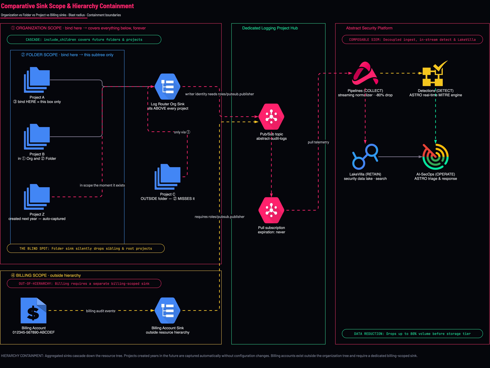
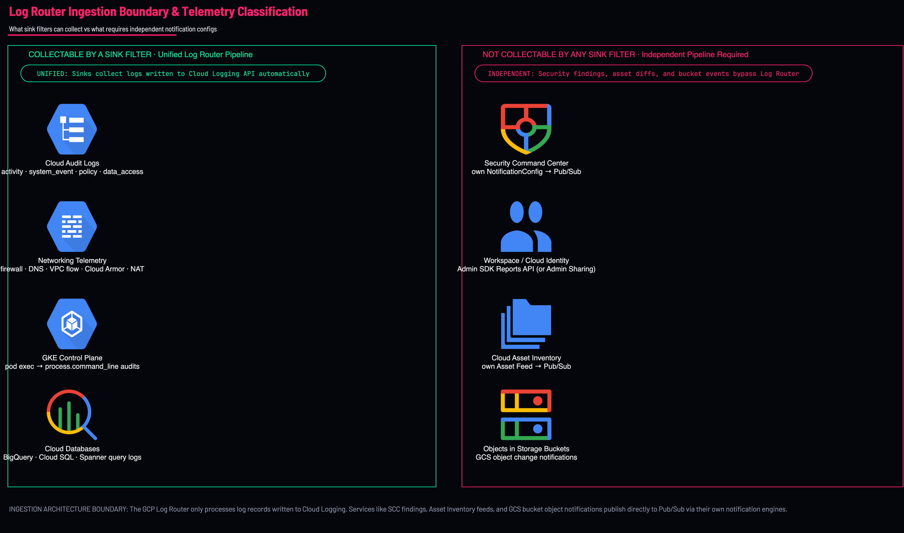

<picture>
  <source media="(prefers-color-scheme: dark)" srcset="../brand/abstract-logo-white.svg">
  
</picture>

# Design decisions, and the limits that force them

Read this before choosing a scope. Most of what goes wrong on this path is decided here,
not in Terraform.

---

## 1. Which scope?

<p align="center">
  
</p>

| Scope | Covers future projects | Use when |
|---|---|---|
| **Organization** | ✅ by containment | Almost always. One deployment, permanent |
| **Folder** | ✅ within that subtree | Org-scope IAM is not granted yet, or a genuine trust boundary splits the estate |
| **Project** | ❌ | Pilot only. Prove the pipeline, then replace it |
| **Billing account** | n/a | Billing logs, which live **outside** the resource hierarchy |

**The decision is rarely technical.** It is *who holds `roles/logging.configWriter` at
organization scope* — usually not the person who owns the project, and frequently not on
the call. Identify that human before scheduling anything else.

### Folder scope costs you something specific

A folder sink misses every project **outside** that folder — including projects created
later at the org root, which is where new projects land by default. If you deploy at folder
scope, write down which folder, and schedule the org conversation. Do not let it become
permanent by inertia.

### Billing account logs are not in the hierarchy

An organization sink does **not** capture them. This surprises people who reasonably read
"organization" as "everything." If you need them, that is a second deployment with
`sink_scope = "billing_account"`.

---

## 2. One logging project, or several?

**Default: one.** A single dedicated logging project for the whole organization.

Reach for more only when one of these is actually true:

| Reason to split | What it looks like |
|---|---|
| **Data residency** | EU logs must not transit or rest in the US. One logging project per region, one sink per region, filtered by `resource.location` |
| **Pub/Sub publish quota** | Publish quota is consumed in the **destination** project. One project cannot absorb the estate |
| **Separation of duties** | A regulated tenant where the SOC and the platform team must not share a project |
| **Blast radius** | You genuinely want an outage in one feed unable to affect another |
| **Distinct retention or CMEK** | Different keys or retention obligations per data class |

**Reasons that are NOT good enough**, and that produce sprawl:

- *"One per environment"* — prod/nonprod is a filter, not a project
- *"One per team"* — teams do not own the security pipeline
- *"One per source type"* — that is what topics are for
- *"It feels tidier"* — every extra project is another IAM surface, another quota pool, and another thing to notice has stopped

### The rule that actually decides it

> **Split when a constraint forces it — residency, quota, or a legal boundary. Never split
> for organisation-chart reasons.**

A second logging project doubles the number of places a silent failure can hide, and the
whole design here is about eliminating those.

### Sizing the single project

Publish quota is per-project and per-region. Admin Activity across 70+ projects is
genuinely small — it is `DATA_READ` and `vpc_flows` that threaten a quota. Check headroom
in the **destination** project (not the sources) before enabling either.

If you outgrow one project: split by **volume class** first — put the extreme-tier sources
on their own topic or project and leave the control plane where it is. That keeps the
high-signal, low-volume feed unaffected by the noisy one.

---

## 3. Known limitations & Log Router Boundary

<p align="center">
  
</p>

These are the ones that change designs. All verified against Google's published limits.

| Limit | Consequence |
|---|---|
| **200 sinks** per project/folder/org, raisable to 4,000 on request — **not hierarchical** | You will never approach this with an aggregated sink. You *will* approach it with per-project sinks, which is one more reason not to |
| **50 exclusion filters** per sink | Exclusions are precious. Prefer narrowing the inclusion filter over accumulating exclusions |
| **Filters capped at 20,000 characters** | A generated filter enumerating many services can hit this. Prefer `allServices` plus exclusions over a long explicit list |
| **Routing is evaluated at WRITE time. There is no backfill** | A filter that was too narrow leaves a permanent hole. Start broad, measure 7 days, then tighten |
| **Log entries timestamped >24 h in the future are discarded** | A source with a broken clock loses data silently |
| **Pub/Sub publish quota is consumed in the DESTINATION project** | Size the logging project, not the source projects |
| **No cross-organization sink** | A sink cannot route logs from one organization into another organization's project. A multi-org customer needs one deployment per org |
| **Workspace audit logs traverse Log Router only if Native Sharing is enabled** | When native sharing is on, logs stream directly through org sink. When off, pulled via Admin SDK Reports API. See [WORKSPACE.md](WORKSPACE.md) |
| **SCC findings do not traverse the Log Router** | Own NotificationConfig |

### Regions and residency

Cloud Logging is a global service, but **the sink destination is a real regional resource**.
Three things follow:

1. **The Pub/Sub topic has a message-storage policy.** If residency matters, set it — the
   default allows storage in any region.
2. **A single global sink cannot enforce residency.** To keep EU logs in the EU you need an
   EU logging project, an EU-constrained topic, and a sink filtered on
   `resource.location` — one deployment per region.
3. **Egress to Abstract is billed and crosses regions.** Confirm which Abstract region the
   tenant is in before quoting network cost.

Unlike Azure, GCP does **not** reject a sink whose destination is in a different region
from the source. It will happily route EU logs into a US topic and bill you for the egress.
**Nothing warns you.** That is a compliance problem, not a technical one, and it is on you
to design around.

### Cross-project and cross-org

- **Cross-project is normal and supported.** The sink lives at org scope; the topic lives
  in one project. That is the intended shape.
- **Cross-organization is not possible.** One deployment per organization.
- **Cross-project service-account usage** may be blocked by the
  `iam.disableCrossProjectServiceAccountUsage` org policy. Keep the identity in the logging
  project and the question does not arise.

---

## 4. VPC Service Controls

If the customer runs VPC-SC — common in regulated environments — Cloud Logging and Pub/Sub
are both restrictable services, and **Abstract pulls from outside the perimeter**.

You need either an **ingress/egress rule** permitting Abstract's service account to pull
from the subscription, or the logging project placed outside the perimeter.

Full detail, including the dry-run approach that turns this from an argument into a list:
**[VPC-SC.md](VPC-SC.md)**.

---

## 5. What to review after 7 days

Every design here assumes a measurement, not an estimate.

1. **Actual volume by `logName`** — the honest input to a cost conversation
2. **Pub/Sub `num_undelivered_messages`** — near zero means Abstract is keeping up
3. **`logging.googleapis.com/exports/error_count`** — should be flat zero
4. **The bill**, split by Cloud Logging ingestion, Pub/Sub throughput, and egress

Then tighten the filter. Starting broad and narrowing is safe; the reverse leaves a hole
you cannot fill, because routing is write-time and there is no backfill.

---

## 6. Architecture Diagrams & Visual Model Assets

All architectural topologies in this repository are maintained as source-controlled **Draw.io (`.drawio`) XML models**, accompanied by machine-readable `.spec.json` definitions, 2x Retina PNGs, and scalable SVGs.

### Diagram Directory Structure

| Deployment / Topic | Draw.io Source | Vector SVG | 2x Retina PNG |
|---|---|---|---|
| **01 Sink Scope** | [`diagrams/01-sink-scope.drawio`](../diagrams/01-sink-scope.drawio) | [`diagrams/01-sink-scope.svg`](../diagrams/01-sink-scope.svg) | [`diagrams/01-sink-scope.png`](../diagrams/01-sink-scope.png) |
| **02 Org-Wide Audit Sink** | [`diagrams/gcp-orgwide-audit-logs.drawio`](../diagrams/gcp-orgwide-audit-logs.drawio) | [`diagrams/gcp-orgwide-audit-logs.svg`](../diagrams/gcp-orgwide-audit-logs.svg) | [`diagrams/gcp-orgwide-audit-logs.png`](../diagrams/gcp-orgwide-audit-logs.png) |
| **02 Folder Scope Sink** | [`diagrams/gcp.org-sink.folder.drawio`](../diagrams/gcp.org-sink.folder.drawio) | [`diagrams/gcp.org-sink.folder.svg`](../diagrams/gcp.org-sink.folder.svg) | [`diagrams/gcp.org-sink.folder.png`](../diagrams/gcp.org-sink.folder.png) |
| **02 Project Pilot Scope** | [`diagrams/gcp.org-sink.project-pilot.drawio`](../diagrams/gcp.org-sink.project-pilot.drawio) | [`diagrams/gcp.org-sink.project-pilot.svg`](../diagrams/gcp.org-sink.project-pilot.svg) | [`diagrams/gcp.org-sink.project-pilot.png`](../diagrams/gcp.org-sink.project-pilot.png) |
| **03 Data Access Audit Config** | [`diagrams/gcp.audit-config.drawio`](../diagrams/gcp.audit-config.drawio) | [`diagrams/gcp.audit-config.svg`](../diagrams/gcp.audit-config.svg) | [`diagrams/gcp.audit-config.png`](../diagrams/gcp.audit-config.png) |
| **04 Workspace & Identity Auth** | [`diagrams/04-identity-auth-oneuptime.drawio`](../diagrams/04-identity-auth-oneuptime.drawio) | [`diagrams/04-identity-auth-oneuptime.svg`](../diagrams/04-identity-auth-oneuptime.svg) | [`diagrams/04-identity-auth-oneuptime.png`](../diagrams/04-identity-auth-oneuptime.png) |
| **05 Pipeline Monitoring** | [`diagrams/gcp.monitoring.drawio`](../diagrams/gcp.monitoring.drawio) | [`diagrams/gcp.monitoring.svg`](../diagrams/gcp.monitoring.svg) | [`diagrams/gcp.monitoring.png`](../diagrams/gcp.monitoring.png) |
| **06 SCC Finding Notifications** | [`diagrams/gcp.scc-findings.drawio`](../diagrams/gcp.scc-findings.drawio) | [`diagrams/gcp.scc-findings.svg`](../diagrams/gcp.scc-findings.svg) | [`diagrams/gcp.scc-findings.png`](../diagrams/gcp.scc-findings.png) |
| **07 Asset Inventory Feeds** | [`diagrams/gcp.asset-inventory.drawio`](../diagrams/gcp.asset-inventory.drawio) | [`diagrams/gcp.asset-inventory.svg`](../diagrams/gcp.asset-inventory.svg) | [`diagrams/gcp.asset-inventory.png`](../diagrams/gcp.asset-inventory.png) |
| **08 GCS Bucket Notifications** | [`diagrams/gcs-pubsub-notifications.drawio`](../diagrams/gcs-pubsub-notifications.drawio) | [`diagrams/gcs-pubsub-notifications.svg`](../diagrams/gcs-pubsub-notifications.svg) | [`diagrams/gcs-pubsub-notifications.png`](../diagrams/gcs-pubsub-notifications.png) |
| **09 Long-Term Compliance Archive** | [`diagrams/gcp.gcs-archive.drawio`](../diagrams/gcp.gcs-archive.drawio) | [`diagrams/gcp.gcs-archive.svg`](../diagrams/gcp.gcs-archive.svg) | [`diagrams/gcp.gcs-archive.png`](../diagrams/gcp.gcs-archive.png) |
| **10 Out-of-Hierarchy Billing** | [`diagrams/10-billing-account.drawio`](../diagrams/10-billing-account.drawio) | [`diagrams/10-billing-account.svg`](../diagrams/10-billing-account.svg) | [`diagrams/10-billing-account.png`](../diagrams/10-billing-account.png) |
| **11 Network Threat Telemetry** | [`diagrams/11-network-threats.drawio`](../diagrams/11-network-threats.drawio) | [`diagrams/11-network-threats.svg`](../diagrams/11-network-threats.svg) | [`diagrams/11-network-threats.png`](../diagrams/11-network-threats.png) |

### Multi-Page Draw.io Specifications

The Draw.io diagram models in this repository feature structured, multi-page specifications designed for both architecture review and operational incident response:

* **Page 1 — Enterprise System Topology**: Complete resource hierarchy visualization, VPC boundaries, IAM roles, service agents, and Pub/Sub streaming pipelines rendered with official GCP architectural iconography.
* **Page 2 — Diagnostic Verification & Decision Tree**: Interactive troubleshooting flowcharts, validation command nodes, and remediation steps mapped directly to [Troubleshooting Runbooks](TROUBLESHOOTING-GUIDE.md).
* **Page 3 — Event Payload & OCSF Normalization**: JSON event payload structures, Cloud Audit Log field extractions, and target Elastic Common Schema (ECS) / Open Cybersecurity Schema Framework (OCSF) normalizations.

Accompanying each `.drawio` file is a machine-readable `.spec.json` (e.g. `images/diagrams/02-audit-logs-organization.spec.json`) specifying diagram nodes, edge connections, colors, and layout metadata.

### Interactive Editing & CLI Tooling

You can inspect, edit, and re-export any diagram using your local Draw.io Desktop application (`/Applications/draw.io.app`) or via the web at `app.diagrams.net`:

```bash
# 1. Open any diagram directly in Draw.io Desktop on macOS
./scripts/open-diagram.sh 02-audit-logs-organization
./scripts/open-diagram.sh 11-network-threats
./scripts/open-diagram.sh 10-billing-account
./scripts/open-diagram.sh 04-identity-auth-oneuptime

# 2. Open directly in diagrams.net in your default web browser
./scripts/open-diagram.sh 02-audit-logs-organization --web

# 3. Explore interactively with pan/zoom in the web viewer
open docs/architecture-explorer.html
```

---

## 7. Deep Architecture & Diagnostic References

* 📘 **Comprehensive Dataflow**: [Master GCP Telemetry Dataflow Reference](DATAFLOW-AND-ARCHITECTURE-REFERENCE.md)
* 🛠️ **Diagnostic Runbook**: [Master Troubleshooting Guide](TROUBLESHOOTING-GUIDE.md)
* 🔐 **Identity & Authentication**: [Enterprise Identity Threat Detection & Auth Guide](IDENTITY-AND-AUTHENTICATION-GUIDE.md)
* 📋 **Permissions Matrix**: [Permissions Reference Across All Scopes](PERMISSIONS.md)
* 🎯 **Filters & Costs**: [Log Category Catalog & Exclusion Rules](FILTERS.md)
* 🏢 **Workspace Telemetry**: [Google Workspace & Identity Ingestion](WORKSPACE.md)
* 🛡️ **VPC Service Controls**: [VPC-SC Perimeter Design](VPC-SC.md)
