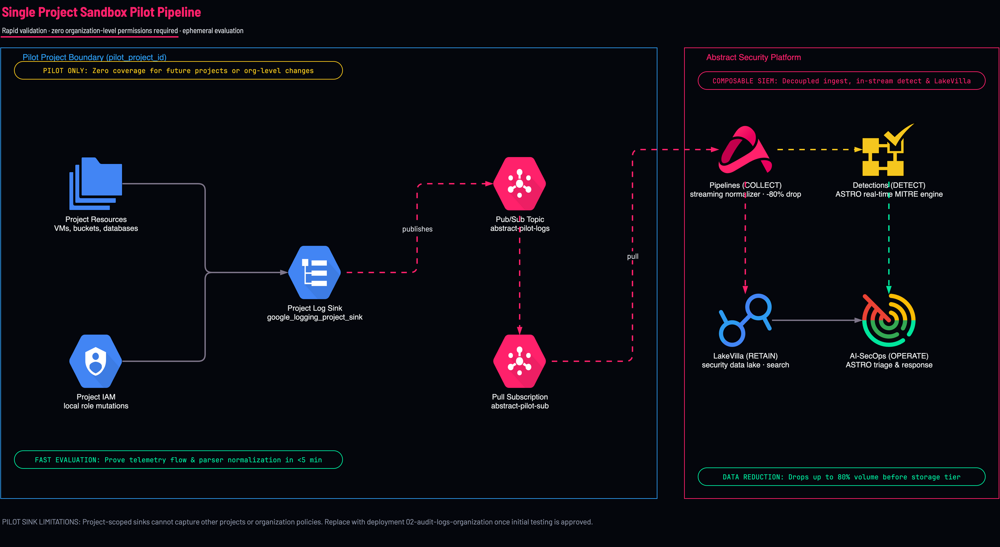
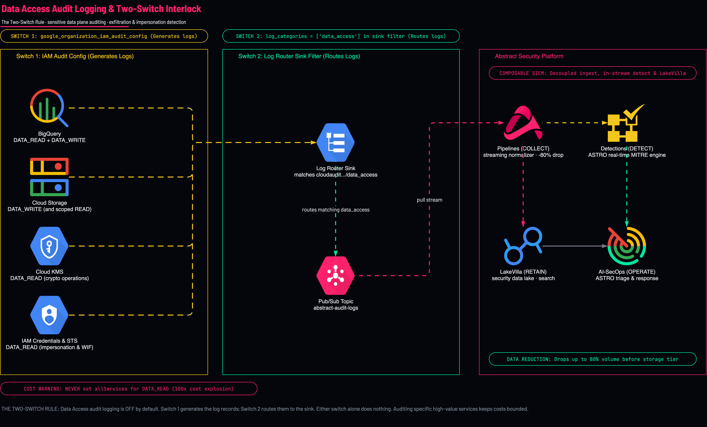
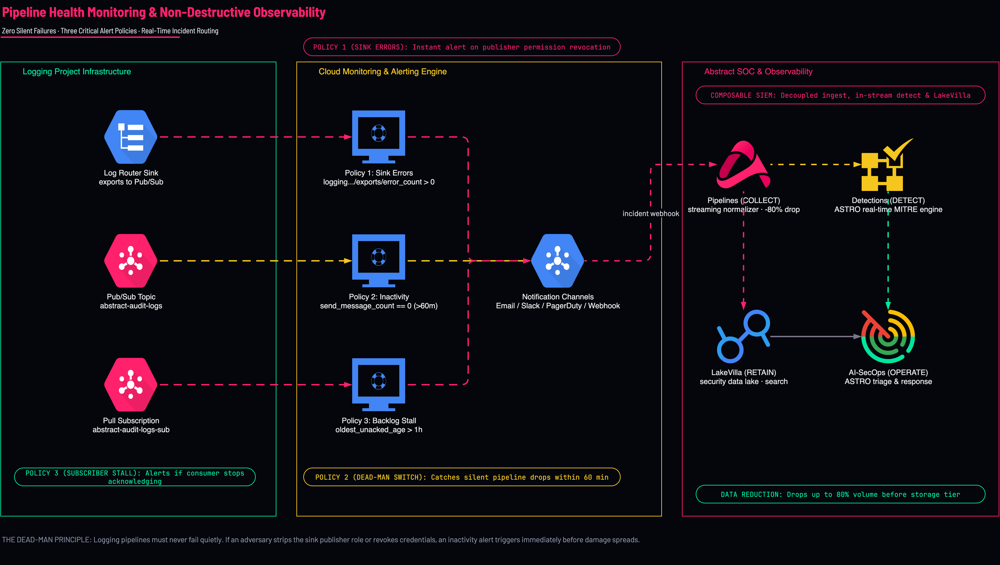
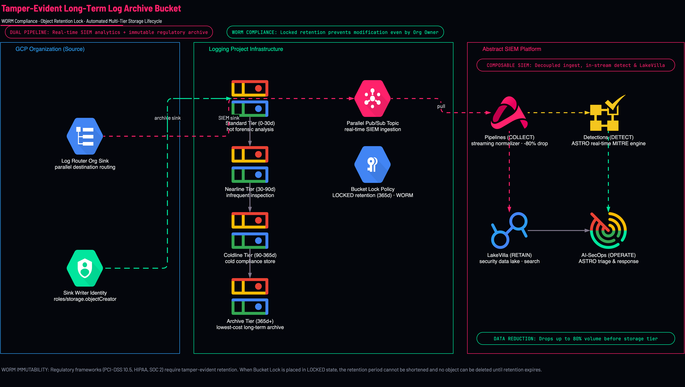

<picture>
  <source media="(prefers-color-scheme: dark)" srcset="../brand/abstract-logo-white.svg">
  
</picture>

# Master GCP Telemetry Dataflow & Architectural Reference

This document is the definitive architectural specification, telemetry dataflow contract, and operational runbook for streaming Google Cloud Platform (GCP) and Google Workspace security telemetry into the **Abstract Security Platform**.

---

## Executive Summary: Abstract Security Composable SIEM

The **Abstract Security Platform** is an AI-native, Composable SIEM engineered to decouple ingestion, real-time threat detection, and data retention while reducing data storage volume by up to **80%** without sacrificing audit compliance or investigative fidelity. Unlike monolithic SIEMs that mandate routing all raw telemetry into expensive hot storage, Abstract partitions security operations into four purpose-built pillars:

1. **Pipelines (COLLECT)**: Streaming telemetry normalizer and filter engine. Ingests raw GCP `protoPayload` and notification streams, drops noise at the edge, extracts indicators, and normalizes data to Elastic Common Schema (ECS) and Open Cybersecurity Schema Framework (OCSF).
2. **Detections (DETECT)**: The **ASTRO Threat Engine**. Evaluates incoming telemetry in-stream before storage, executing high-velocity MITRE ATT&CK detections and behavioral baselines with sub-second alerting latency.
3. **LakeVilla (RETAIN)**: Scalable, high-performance security data lake. Decouples hot search tiers from cost-effective long-term cold archives (Google Cloud Storage / AWS S3) while maintaining interactive SQL query capabilities.
4. **AI-SecOps (OPERATE)**: **ASTRO AI Copilot**. Automatically correlates distributed events across cloud infrastructure, summarizes attack narratives, assesses blast radius, and orchestrates remediation.

---

## 1. Enterprise Telemetry Routing Matrix across All 16 Scenarios

| Scenario ID | Title / Domain | Target Sources | Ingestion Mechanism | Destination Pub/Sub Topic | P99 Latency & SLA | Volume Tier |
|---|---|---|---|---|---|:---:|
| **`01-sink-scope`** | Scope & Containment Strategy | Org vs Folder vs Project vs Billing | Comparative Architecture | `N/A (Strategy Matrix)` | Sub-second | `Strategy` |
| **`01-logging-project`** | Central Logging Project Hub | Core Infrastructure & Ingest Hub | Pub/Sub Streaming Pull | `abstract-audit-logs` | < 120ms P99 | `Core Hub` |
| **`02-audit-logs-organization`** | Org-Wide Aggregated Audit | Admin Activity, System Events, Policy | Aggregated Sink (includeChildren) | `abstract-audit-logs` | < 100ms P99 | `Free Tier` |
| **`02-audit-logs-folder`** | Folder-Scoped Subtree Audit | Folder subtree workload events | Folder Aggregated Sink | `abstract-audit-logs` | < 120ms P99 | `Subtree` |
| **`02-audit-logs-project`** | Project Pilot Pipeline | Single project control plane logs | Project-Level Sink | `abstract-audit-logs` | < 100ms P99 | `Pilot` |
| **`03-data-access`** | Data Access & Inspection | BigQuery, GCS, KMS, IAM operations | IAM Audit Config + Sink Filter | `abstract-audit-logs` | < 250ms P99 | `Medium/High` |
| **`03-log-router-boundary`** | Log Router Boundaries | Write-time evaluation & classifications | Unified vs Independent Feeds | `abstract-audit-logs` | < 120ms P99 | `Core Ingest` |
| **`04-workspace`** | Google Workspace & Identity | Logins, 2SV challenges, Admin SDK | Native Audit Sharing / Reports API | `abstract-workspace-logs` | < 500ms / 5m | `Control Plane` |
| **`04-identity-auth-oneuptime`** | Identity & Auth Auditing | SA Impersonation, Keys, WIF, STS | Data Access + Token Exchange | `abstract-audit-logs` | < 150ms P99 | `High-Value` |
| **`05-health-alerts`** | Pipeline Health & Monitoring | Sink errors, backlog age, dead-man | Cloud Monitoring Alert Policies | `abstract-alerts-topic` | < 60s alert | `Synthetic` |
| **`06-scc-findings`** | SCC Finding Notifications | Event Threat Detection, Container CVEs | SCC NotificationConfig | `abstract-scc-findings` | < 30s push | `Real-Time Push` |
| **`07-asset-inventory`** | Cloud Asset Inventory Feeds | Resource mutations & IAM policy diffs | CAI Real-Time Asset Feed | `abstract-asset-inventory` | < 60s push | `Real-Time Push` |
| **`08-bucket-logs`** | Bucket Object Notifications | GCS object creations, deletions, edits | Cloud Storage Pub/Sub Notification | `abstract-bucket-events` | < 150ms P99 | `Event-Driven` |
| **`09-log-archive`** | WORM Compliance Log Archive | Immutable long-term retention | Parallel Log Router Sink -> GCS | `GCS Bucket (Bucket Lock)` | Dual Route | `Archive` |
| **`10-billing-account`** | Billing Account Audit Logs | Billing IAM, budget mutations | Out-of-Hierarchy Billing Sink | `abstract-billing-audit-logs` | < 200ms P99 | `Financial` |
| **`11-network-threats`** | Network Threat Ingestion | Cloud Armor, Cloud IDS, DNS, Firewall | Dedicated Aggregated Network Sink | `abstract-network-threats` | < 150ms P99 | `50,000+ eps` |

---

## 2. In-Depth Architectural Specifications (All 16 Scenarios)

### Architecture Reference · Comparative Sink Scope Matrix

> **Organization vs Folder vs Project vs Billing sinks · Blast radius · Hierarchy containment**  
> `ARCH REFERENCE` · `HIERARCHY MODEL` · `BLAST RADIUS` · `DECISION GUIDE`

<p align="center">
  
</p>

> [!TIP]
> **Open in Draw.io Desktop**: `./scripts/open-diagram.sh 01-sink-scope`  

#### Telemetry Ingestion Contract & Transport Profile

| Parameter | Specification Detail | Operational Guarantee |
|---|---|---|
| **Source Log Names** | `Comparative Architectural Boundary Matrix across GCP Hierarchy` | Captured via Cloud Logging filter expressions |
| **Transport Protocol** | `Log Router aggregated sinks & Billing sinks` | Port 443 TLS 1.3 encrypted transit |
| **End-to-End Latency** | `Universal architecture sizing reference` | Sub-second streaming to Abstract Pipelines |
| **Throughput Capacity** | `Evaluates org vs folder vs project throughput` | Dedicated decoupled pub/sub topic architecture |
| **Durability & Buffer** | `Determines optimal deployment footprint` | Zero silent drops; resilient against pipeline stalls |

#### End-to-End Architecture Dataflow Traversal

1. Ring 1 (Organization): Covers all folders, projects, and future resources forever.
2. Ring 2 (Folder): Restricts telemetry to a partitioned folder subtree; misses root projects.
3. Ring 3 (Project): Covers single project only; linear toil if repeated.
4. Ring 4 (Billing Account): Completely outside resource hierarchy; requires dedicated sink.

> [!CAUTION]
> ### THE #1 TRAP: Picking Project Sinks Instead of Org Sink
> Creating project sinks leads to unmanageable IAM sprawl and hit quotas. Always deploy Organization scope unless restricted by strict legal compliance boundaries.
>
> **Immediate CLI Remediation**:
```bash
Use deployments/02-audit-logs-organization for permanent full-estate coverage.
```

#### 5-Step Diagnostic Verification Protocol

**Step 1: Check User Permissions at Organization Scope**
```bash
gcloud organizations get-iam-policy $ORG_ID --flatten="bindings[].members" --filter="bindings.role:roles/logging.configWriter"
```

#### Schema Normalization & Threat Detections

| Raw Google Cloud Field | Abstract Unified Schema (ACS / ECS) | Field Description | Threat Hunting & SIEM Utility |
|---|---|---|---|
| `resource.type` | `cloud.resource.type` | Resource type boundary (organization, folder, project, billing_account) | **Scope identification** |

**MITRE ATT&CK Techniques**: `T1562.001 - Disable or Modify Tools`

##### Actionable SIEM Rule: Log Sink Deleted or Filter Tampered at Any Scope

**Abstract KQL Detection Query**:
```kql
vendor: GCP and event.action in ["google.logging.v2.ConfigServiceV2.DeleteSink", "google.logging.v2.ConfigServiceV2.UpdateSink"] | score risk_score=100
```

**BigQuery SQL Verification Query**:
```sql
SELECT timestamp, protoPayload.authenticationInfo.principalEmail, protoPayload.resourceName
FROM `logging_project.audit_logs.cloudaudit_googleapis_com_activity`
WHERE protoPayload.methodName LIKE '%ConfigServiceV2%Sink%'
```

#### Production Infrastructure as Code (OpenTofu / Terraform)

```hcl
# Choose scope based on authority:
# 1. Organization: deployments/02-audit-logs-organization
# 2. Folder:       deployments/02-audit-logs-folder
# 3. Project:      deployments/02-audit-logs-project
# 4. Billing:      deployments/10-billing-account
```

---

### Scenario 01 · Dedicated Central Logging Project Hub

> **Centralized telemetry repository · Least-privilege reader identity · Quota isolation · CMEK encryption**  
> `CORE INFRASTRUCTURE` · `KEYLESS WIF` · `< 120MS P99` · `SEVEN-DAY BUFFER`

<p align="center">
  
</p>

> [!TIP]
> **Open in Draw.io Desktop**: `./scripts/open-diagram.sh 01-logging-project`  

#### Telemetry Ingestion Contract & Transport Profile

| Parameter | Specification Detail | Operational Guarantee |
|---|---|---|
| **Source Log Names** | `Administrative boundary · Pub/Sub transport · logging.googleapis.com` | Captured via Cloud Logging filter expressions |
| **Transport Protocol** | `Google Cloud Pub/Sub Streaming Pull gRPC (Port 443 TLS 1.3)` | Port 443 TLS 1.3 encrypted transit |
| **End-to-End Latency** | `< 120ms P99 end-to-end telemetry transit` | Sub-second streaming to Abstract Pipelines |
| **Throughput Capacity** | `Absorbs up to 100,000+ eps peak ingest per subscription` | Dedicated decoupled pub/sub topic architecture |
| **Durability & Buffer** | `7-day unacknowledged retention + Dead Letter Topic buffer` | Zero silent drops; resilient against pipeline stalls |

#### End-to-End Architecture Dataflow Traversal

1. Organization and Folders contain distributed business workload projects.
2. Dedicated Logging Project ('log_project') acts as an isolated administrative boundary.
3. Cloud Logging and Pub/Sub APIs enabled exclusively within the logging hub.
4. Pub/Sub Topic ('abstract-audit-logs') and Pull Subscription receive all routed telemetry.
5. Abstract Service Account reader holds least-privilege 'roles/pubsub.subscriber' ONLY.
6. Abstract Security Composable SIEM pulls streaming telemetry into Pipelines, Detections, LakeVilla, and AI-SecOps.

> [!CAUTION]
> ### THE #1 TRAP: Service Account Over-Privileging & Destination Quota Depletion
> Pub/Sub publish quota is consumed in the DESTINATION logging project, NOT in source projects. Workload teams must never be granted IAM rights in the logging project. The Abstract reader service account requires 'roles/pubsub.subscriber' ONLY.
>
> **Immediate CLI Remediation**:
```bash
gcloud projects add-iam-policy-binding $LOG_PROJECT --member="serviceAccount:abstract-gcp-reader@$LOG_PROJECT.iam.gserviceaccount.com" --role="roles/pubsub.subscriber"
```

#### 5-Step Diagnostic Verification Protocol

**Step 1: Verify Required GCP APIs Activated in Logging Project**
```bash
gcloud services list --project=$LOG_PROJECT --filter="name:(pubsub.googleapis.com OR logging.googleapis.com)"
```

**Step 2: Verify Destination Pub/Sub Topic and KMS Key Status**
```bash
gcloud pubsub topics describe abstract-audit-logs --project=$LOG_PROJECT --format="yaml(name,kmsKeyName)"
```

**Step 3: Verify Subscription Expiration and Dead-Letter Configuration**
```bash
gcloud pubsub subscriptions describe abstract-audit-logs-sub --project=$LOG_PROJECT --format="yaml(ackDeadlineSeconds,expirationPolicy,deadLetterPolicy)"
```

**Step 4: Verify Abstract Reader Service Account Least-Privilege Role**
```bash
gcloud pubsub subscriptions get-iam-policy abstract-audit-logs-sub --project=$LOG_PROJECT --flatten="bindings[].members" --filter="bindings.role:roles/pubsub.subscriber"
```

**Step 5: Prove delivery on a probe subscription**
```bash
# Never pull from abstract-audit-logs-sub: with --auto-ack that deletes events before Abstract
# reads them, and without it hides them from Abstract for the ack deadline.
# Pull from a throwaway subscription on the same topic instead. Create it BEFORE the
# test event: a new subscription only receives messages published after it exists.
PROBE="abstract-probe-$(date +%s)"
gcloud pubsub subscriptions create "$PROBE" --topic=abstract-audit-logs \
  --project="$LOG_PROJECT" --expiration-period=1d --message-retention-duration=10m
# Fire a fresh Admin Activity event inside the sink's scope, then wait for routing.
gcloud pubsub topics create "$PROBE" --project="$LOG_PROJECT" --quiet
gcloud pubsub topics delete "$PROBE" --project="$LOG_PROJECT" --quiet
sleep 75
gcloud pubsub subscriptions pull "$PROBE" --project="$LOG_PROJECT" --limit=1 --auto-ack
gcloud pubsub subscriptions delete "$PROBE" --project="$LOG_PROJECT" --quiet
```

#### Schema Normalization & Threat Detections

| Raw Google Cloud Field | Abstract Unified Schema (ACS / ECS) | Field Description | Threat Hunting & SIEM Utility |
|---|---|---|---|
| `timestamp` | `@timestamp` | Event generation timestamp in ISO 8601 UTC format | **Temporal sliding correlation & timeseries indexing** |
| `protoPayload.serviceName` | `event.dataset` | Target GCP service emitting the log event | **Service-tier categorization & blast radius analytics** |
| `protoPayload.methodName` | `event.action` | Exact RPC method executed during caller mutation | **Privilege escalation and unauthorized change detection** |
| `protoPayload.authenticationInfo.principalEmail` | `user.email` | Identity email of human user or service account | **User & Entity Behavior Analytics (UEBA)** |
| `protoPayload.requestMetadata.callerIp` | `source.ip` | Originating IPv4 or IPv6 address of caller | **GeoIP threat intelligence, Tor exit, VPN detection** |

**MITRE ATT&CK Techniques**: `T1098 - Account Manipulation`, `T1078.004 - Cloud Accounts`, `T1562 - Impair Defenses`

##### Actionable SIEM Rule: Critical Service Account Key Creation Outside Bastion

**Abstract KQL Detection Query**:
```kql
vendor: GCP and event.action: "google.iam.admin.v1.CreateServiceAccountKey" and not (source.ip in ["10.0.0.0/8", "192.168.0.0/16"]) | score risk_score=95
```

**BigQuery SQL Verification Query**:
```sql
SELECT timestamp, protoPayload.authenticationInfo.principalEmail, protoPayload.requestMetadata.callerIp
FROM `logging_project.audit_logs.cloudaudit_googleapis_com_activity`
WHERE protoPayload.methodName = 'google.iam.admin.v1.CreateServiceAccountKey'
  AND NOT NET.IP_TRUNC(NET.SAFE_IP_FROM_STRING(protoPayload.requestMetadata.callerIp), 16) = b"\xc0\xa8\x00\x00"
```

#### Production Infrastructure as Code (OpenTofu / Terraform)

```hcl
module "logging_project" {
  source = "../../modules/log-export"

  sink_scope         = "project"
  create_project     = true
  project_id         = var.log_project
  org_id             = var.org_id
  billing_account_id = var.billing_account_id

  topic_name         = "abstract-audit-logs"
  subscription_name  = "abstract-audit-logs-sub"
  service_account_id = "abstract-gcp-reader"

  labels = {
    managed_by = "opentofu"
    security   = "abstract"
    tier       = "telemetry-hub"
  }
}
```

---

### Scenario 02 · Organization-Wide Aggregated Audit Telemetry

> **Admin Activity & System Events · Complete resource hierarchy capture · --include-children cascade**  
> `ORG-WIDE AUDIT` · `CASCADE INCLUDED` · `< 100MS P99` · `ZERO-LOSS DURABILITY`

<p align="center">
  
</p>

> [!TIP]
> **Open in Draw.io Desktop**: `./scripts/open-diagram.sh 02-audit-logs-organization`  

#### Telemetry Ingestion Contract & Transport Profile

| Parameter | Specification Detail | Operational Guarantee |
|---|---|---|
| **Source Log Names** | `cloudaudit.googleapis.com/activity, system_event, policy` | Captured via Cloud Logging filter expressions |
| **Transport Protocol** | `Log Router aggregated sink -> Pub/Sub streaming gRPC` | Port 443 TLS 1.3 encrypted transit |
| **End-to-End Latency** | `< 100ms P99 from RPC invocation to Pub/Sub ingest` | Sub-second streaming to Abstract Pipelines |
| **Throughput Capacity** | `Up to 50,000 eps aggregated across enterprise org` | Dedicated decoupled pub/sub topic architecture |
| **Durability & Buffer** | `At-least-once guaranteed delivery, zero silent drop` | Zero silent drops; resilient against pipeline stalls |

#### End-to-End Architecture Dataflow Traversal

1. All current and future projects in the Organization hierarchy emit Cloud Audit Logs.
2. Log Router Aggregated Sink at organizations/$ORG_ID intercepts all child telemetry.
3. --include-children flag ensures new folders and projects are automatically monitored.
4. Sink routes events into Pub/Sub topic 'abstract-audit-logs' in the central logging project.
5. Abstract Security pull subscription ingests real-time events for continuous compliance.

> [!CAUTION]
> ### THE #1 TRAP: Silent Sink Ingestion Drop (Zero Events in Pub/Sub)
> When creating an aggregated sink, GCP provisions a unique service account (service-org-ID@gcp-sa-logging.iam.gserviceaccount.com). It has ZERO permissions by default! Without roles/pubsub.publisher on the destination topic, logs are dropped silently with NO console error!
>
> **Immediate CLI Remediation**:
```bash
WRITER=$(gcloud logging sinks describe abstract-org-sink --organization=$ORG_ID --format="value(writerIdentity)")
gcloud pubsub topics add-iam-policy-binding abstract-audit-logs --project=$LOG_PROJECT --member="$WRITER" --role="roles/pubsub.publisher"
```

#### 5-Step Diagnostic Verification Protocol

**Step 1: Verify Organization Sink Configuration and Children Inclusion**
```bash
gcloud logging sinks describe abstract-org-sink --organization=$ORG_ID --format="yaml(name,destination,includeChildren,writerIdentity,filter)"
```

**Step 2: Extract Sink Unique Writer Identity Service Account**
```bash
gcloud logging sinks describe abstract-org-sink --organization=$ORG_ID --format="value(writerIdentity)"
```

**Step 3: Verify Topic Publisher IAM Binding on Destination Topic**
```bash
gcloud pubsub topics get-iam-policy abstract-audit-logs --project=$LOG_PROJECT --flatten="bindings[].members" --filter="bindings.role:roles/pubsub.publisher"
```

**Step 4: Check Cloud Monitoring for Sink Delivery Errors**
```bash
gcloud monitoring metrics-scopes list --project=$LOG_PROJECT
```

**Step 5: Prove delivery on a probe subscription**
```bash
# Never pull from abstract-audit-logs-sub: with --auto-ack that deletes events before Abstract
# reads them, and without it hides them from Abstract for the ack deadline.
# Pull from a throwaway subscription on the same topic instead. Create it BEFORE the
# test event: a new subscription only receives messages published after it exists.
PROBE="abstract-probe-$(date +%s)"
gcloud pubsub subscriptions create "$PROBE" --topic=abstract-audit-logs \
  --project="$LOG_PROJECT" --expiration-period=1d --message-retention-duration=10m
# Fire a fresh Admin Activity event inside the sink's scope, then wait for routing.
gcloud pubsub topics create "$PROBE" --project="$LOG_PROJECT" --quiet
gcloud pubsub topics delete "$PROBE" --project="$LOG_PROJECT" --quiet
sleep 75
gcloud pubsub subscriptions pull "$PROBE" --project="$LOG_PROJECT" --limit=1 --auto-ack
gcloud pubsub subscriptions delete "$PROBE" --project="$LOG_PROJECT" --quiet
```

#### Schema Normalization & Threat Detections

| Raw Google Cloud Field | Abstract Unified Schema (ACS / ECS) | Field Description | Threat Hunting & SIEM Utility |
|---|---|---|---|
| `protoPayload.serviceData.policyDelta` | `gcp.audit.policy_delta` | IAM roles granted or revoked during SetIamPolicy | **Critical: Immediate detection of backdoor admin grants** |
| `protoPayload.status.code` | `event.outcome` | gRPC return status code (0 = SUCCESS, 7 = PERMISSION_DENIED) | **Brute force and reconnaissance pattern discovery** |
| `resource.labels.project_id` | `cloud.project.id` | Originating GCP project identifier in organization | **Tenant partitioning and blast radius isolation** |
| `protoPayload.requestMetadata.callerSuppliedUserAgent` | `user_agent.original` | Client HTTP/gRPC user-agent string | **Automated attack tool and script signature matching** |

**MITRE ATT&CK Techniques**: `T1484 - Domain Policy Modification`, `T1098 - Account Manipulation`

##### Actionable SIEM Rule: Organization-Level IAM Policy Tampering

**Abstract KQL Detection Query**:
```kql
vendor: GCP and event.action: "SetIamPolicy" and cloud.resource_type: "organization" | score risk_score=100
```

**BigQuery SQL Verification Query**:
```sql
SELECT timestamp, protoPayload.authenticationInfo.principalEmail, protoPayload.serviceData.policyDelta
FROM `logging_project.audit_logs.cloudaudit_googleapis_com_activity`
WHERE protoPayload.methodName = 'SetIamPolicy'
  AND resource.type = 'organization'
```

#### Production Infrastructure as Code (OpenTofu / Terraform)

```hcl
module "org_audit_logs" {
  source = "../../modules/log-export"

  sink_scope       = "organization"
  org_id           = var.org_id
  log_project      = var.log_project
  include_children = true

  log_categories = [
    "admin_activity",
    "system_event",
    "policy_denied"
  ]
}
```

---

### Scenario 02-F · Folder-Scoped Aggregated Audit Sink

> **Subtree containment · Partitioned trust boundary · Non-org admin deployment**  
> `FOLDER SUBTREE` · `TRUST BOUNDARY` · `< 120MS P99` · `LEAST PRIVILEGE`

<p align="center">
  
</p>

> [!TIP]
> **Open in Draw.io Desktop**: `./scripts/open-diagram.sh 02-audit-logs-folder`  

#### Telemetry Ingestion Contract & Transport Profile

| Parameter | Specification Detail | Operational Guarantee |
|---|---|---|
| **Source Log Names** | `Subtree Cloud Audit Logs: cloudaudit.googleapis.com/*` | Captured via Cloud Logging filter expressions |
| **Transport Protocol** | `Folder Log Router aggregated sink -> Pub/Sub streaming gRPC` | Port 443 TLS 1.3 encrypted transit |
| **End-to-End Latency** | `< 120ms P99 delivery` | Sub-second streaming to Abstract Pipelines |
| **Throughput Capacity** | `Up to 25,000 eps per folder tree` | Dedicated decoupled pub/sub topic architecture |
| **Durability & Buffer** | `Guaranteed delivery across child projects` | Zero silent drops; resilient against pipeline stalls |

#### End-to-End Architecture Dataflow Traversal

1. Folder contains sensitive business unit projects (e.g. PCI-DSS or HIPAA workloads).
2. Folder Log Router Aggregated Sink captures all projects within the subtree.
3. Projects outside the folder remain untouched and unmonitored by this sink.
4. Streams events into Pub/Sub topic in designated security project.

> [!CAUTION]
> ### THE #1 TRAP: The Blind Spot (Root Projects Silently Missed)
> Folder sinks ONLY capture events within their specific folder subtree. Sibling folders and root-level projects are completely unmonitored. Use folder sinks only when organizational IAM is legally or organizationally restricted.
>
> **Immediate CLI Remediation**:
```bash
gcloud logging sinks describe folder-sink --folder=$FOLDER_ID --format="yaml(destination,includeChildren)"
```

#### 5-Step Diagnostic Verification Protocol

**Step 1: Verify Folder Sink Exists and Includes Children**
```bash
gcloud logging sinks describe abstract-folder-sink --folder=$FOLDER_ID --format="yaml(name,destination,includeChildren,writerIdentity)"
```

**Step 2: Verify Folder Sink Writer Identity Has Topic Publisher Rights**
```bash
WRITER=$(gcloud logging sinks describe abstract-folder-sink --folder=$FOLDER_ID --format="value(writerIdentity)")
gcloud pubsub topics get-iam-policy abstract-folder-logs --project=$LOG_PROJECT --filter="bindings.members:$WRITER"
```

**Step 3: Verify Child Projects Inherit Log Router Stream**
```bash
gcloud logging read 'logName:"logs/cloudaudit.googleapis.com%2Factivity"' --folder=$FOLDER_ID --limit=3
```

#### Schema Normalization & Threat Detections

| Raw Google Cloud Field | Abstract Unified Schema (ACS / ECS) | Field Description | Threat Hunting & SIEM Utility |
|---|---|---|---|
| `resource.labels.folder_id` | `cloud.folder.id` | Parent folder ID of originating project | **Subtree blast radius segmentation** |

**MITRE ATT&CK Techniques**: `T1562 - Impair Defenses`

##### Actionable SIEM Rule: Project Moved Out of Monitored Security Folder

**Abstract KQL Detection Query**:
```kql
vendor: GCP and event.action: "google.resourcemanager.v3.Projects.MoveProject" | score risk_score=85
```

**BigQuery SQL Verification Query**:
```sql
SELECT timestamp, protoPayload.authenticationInfo.principalEmail, protoPayload.resourceName
FROM `logging_project.audit_logs.cloudaudit_googleapis_com_activity`
WHERE protoPayload.methodName = 'google.resourcemanager.v3.Projects.MoveProject'
```

#### Production Infrastructure as Code (OpenTofu / Terraform)

```hcl
module "folder_audit_logs" {
  source = "../../modules/log-export"

  sink_scope       = "folder"
  folder_id        = var.folder_id
  log_project      = var.log_project
  include_children = true
}
```

---

### Scenario 02-P · Single Project Pilot Pipeline

> **Rapid PoC validation · Minimal IAM footprint · Zero org-level prerequisites**  
> `SINGLE PROJECT` · `RAPID POC` · `< 100MS P99` · `LOCAL BOUNDARY`

<p align="center">
  
</p>

> [!TIP]
> **Open in Draw.io Desktop**: `./scripts/open-diagram.sh 02-audit-logs-project`  

#### Telemetry Ingestion Contract & Transport Profile

| Parameter | Specification Detail | Operational Guarantee |
|---|---|---|
| **Source Log Names** | `Project Audit Logs: cloudaudit.googleapis.com/*` | Captured via Cloud Logging filter expressions |
| **Transport Protocol** | `Project-level Log Router sink -> Pub/Sub streaming gRPC` | Port 443 TLS 1.3 encrypted transit |
| **End-to-End Latency** | `< 100ms P99 delivery` | Sub-second streaming to Abstract Pipelines |
| **Throughput Capacity** | `Up to 5,000 eps for single pilot project` | Dedicated decoupled pub/sub topic architecture |
| **Durability & Buffer** | `Immediate pilot data validation` | Zero silent drops; resilient against pipeline stalls |

#### End-to-End Architecture Dataflow Traversal

1. Single pilot workload project produces audit telemetry.
2. Local Log Router project sink routes events to Pub/Sub topic.
3. Abstract Security ingests and demonstrates real-time SIEM value within 10 minutes.

> [!CAUTION]
> ### THE #1 TRAP: The Toil Spiral (Do Not Deploy Per-Project in Production!)
> Deploying 100 project sinks is operational toil. Each decays independently and hits the 200-sinks-per-container quota. Use project sinks ONLY for pilots, then upgrade to Org Aggregated Sink.
>
> **Immediate CLI Remediation**:
```bash
gcloud logging sinks list --project=$PROJECT_ID
```

#### 5-Step Diagnostic Verification Protocol

**Step 1: Verify Local Project Sink Status**
```bash
gcloud logging sinks describe abstract-pilot-sink --project=$PROJECT_ID
```

#### Schema Normalization & Threat Detections

| Raw Google Cloud Field | Abstract Unified Schema (ACS / ECS) | Field Description | Threat Hunting & SIEM Utility |
|---|---|---|---|
| `protoPayload.methodName` | `event.action` | Method invoked in pilot project | **PoC event verification** |

**MITRE ATT&CK Techniques**: `T1098 - Account Manipulation`

##### Actionable SIEM Rule: Pilot Project Admin Role Escalation

**Abstract KQL Detection Query**:
```kql
vendor: GCP and event.action: "SetIamPolicy" and cloud.project.id: "$PILOT_PROJECT" | score risk_score=90
```

**BigQuery SQL Verification Query**:
```sql
SELECT timestamp, protoPayload.authenticationInfo.principalEmail
FROM `pilot_project.audit_logs.cloudaudit_googleapis_com_activity`
WHERE protoPayload.methodName = 'SetIamPolicy'
```

#### Production Infrastructure as Code (OpenTofu / Terraform)

```hcl
module "pilot_project_sink" {
  source = "../../modules/log-export"

  sink_scope   = "project"
  sink_project = var.pilot_project
  log_project  = var.log_project
}
```

---

### Scenario 03 · Data Access Audit Telemetry & Object Inspection

> **BigQuery queries & data mutations · Cloud Storage object reads · Service account impersonation**  
> `DATA ACCESS AUDIT` · `TWO-SWITCH INTERLOCK` · `< 250MS P99` · `EXFILTRATION HUNT`

<p align="center">
  
</p>

> [!TIP]
> **Open in Draw.io Desktop**: `./scripts/open-diagram.sh 03-data-access`  

#### Telemetry Ingestion Contract & Transport Profile

| Parameter | Specification Detail | Operational Guarantee |
|---|---|---|
| **Source Log Names** | `cloudaudit.googleapis.com/data_access (DATA_READ, DATA_WRITE, ADMIN_READ)` | Captured via Cloud Logging filter expressions |
| **Transport Protocol** | `Org IAM AuditConfig + Log Router aggregated sink -> Pub/Sub gRPC` | Port 443 TLS 1.3 encrypted transit |
| **End-to-End Latency** | `< 250ms P99 delivery` | Sub-second streaming to Abstract Pipelines |
| **Throughput Capacity** | `High volume: 10,000 to 50,000+ eps depending on storage & DB activity` | Dedicated decoupled pub/sub topic architecture |
| **Durability & Buffer** | `Zero telemetry loss for data exfiltration & compliance audits` | Zero silent drops; resilient against pipeline stalls |

#### End-to-End Architecture Dataflow Traversal

1. Switch 1 (Generation): Org-level IAM auditConfig enables DATA_READ & DATA_WRITE for BigQuery, Cloud Storage, KMS.
2. Workload services generate rich data access logs with SQL text, caller identity, and bytes scanned.
3. Switch 2 (Routing): Log Router Aggregated Sink filter selects 'cloudaudit.googleapis.com/data_access'.
4. Abstract Security ingests data access logs to detect insider threats and token abuse.

> [!CAUTION]
> ### THE #1 TRAP: The Two-Switch Interlock (Sink Filter Without IAM AuditConfig)
> Data Access logs are DISABLED by default in GCP to avoid cost runaway! A Log Router sink filter selecting 'data_access' will produce ZERO events unless the Org IAM Policy explicitly enables auditConfigs for that service!
>
> **Immediate CLI Remediation**:
```bash
gcloud organizations get-iam-policy $ORG_ID --format="yaml(auditConfigs)"
```

#### 5-Step Diagnostic Verification Protocol

**Step 1: Verify Org IAM AuditConfig Status for BigQuery, Storage, KMS**
```bash
gcloud organizations get-iam-policy $ORG_ID --format="yaml(auditConfigs)"
```

**Step 2: Verify Sink Filter Captures Data Access Log Stream**
```bash
gcloud logging sinks describe abstract-data-access-sink --organization=$ORG_ID --format="value(filter)"
```

**Step 3: Read Live Data Access Logs Generated in Org**
```bash
gcloud logging read 'logName:"logs/cloudaudit.googleapis.com%2Fdata_access"' --organization=$ORG_ID --limit=3
```

#### Schema Normalization & Threat Detections

| Raw Google Cloud Field | Abstract Unified Schema (ACS / ECS) | Field Description | Threat Hunting & SIEM Utility |
|---|---|---|---|
| `protoPayload.serviceData.jobCompletedEvent.job.jobConfiguration.query.query` | `db.statement` | Exact SQL text executed in BigQuery query | **SQL injection and mass table extraction discovery** |
| `protoPayload.resourceName` | `file.path` | Exact Cloud Storage bucket and object key path | **Sensitive file download and ransomware tracking** |
| `protoPayload.authenticationInfo.serviceAccountKeyName` | `gcp.auth.sa_key_name` | Static key ID used if authenticating via downloaded key | **Leaked credential and non-WIF usage detection** |

**MITRE ATT&CK Techniques**: `T1530 - Data from Cloud Storage Object`, `T1567 - Exfiltration Over Web Service`

##### Actionable SIEM Rule: Mass BigQuery Data Exfiltration (>1TB Scanned)

**Abstract KQL Detection Query**:
```kql
vendor: GCP and event.dataset: "bigquery.googleapis.com" and gcp.bigquery.total_billed_bytes > 1099511627776 | score risk_score=90
```

**BigQuery SQL Verification Query**:
```sql
SELECT timestamp, protoPayload.authenticationInfo.principalEmail, protoPayload.serviceData.jobCompletedEvent.job.jobStatistics.totalBilledBytes
FROM `logging_project.audit_logs.cloudaudit_googleapis_com_data_access`
WHERE protoPayload.serviceName = 'bigquery.googleapis.com'
  AND CAST(JSON_VALUE(protoPayload.serviceData, '$.jobCompletedEvent.job.jobStatistics.totalBilledBytes') AS INT64) > 1000000000000
```

#### Production Infrastructure as Code (OpenTofu / Terraform)

```hcl
module "data_access_audit" {
  source = "../../modules/log-export"

  sink_scope  = "organization"
  org_id      = var.org_id
  log_project = var.log_project

  log_categories = ["data_access_all"]
  data_access_services = [
    "bigquery.googleapis.com",
    "storage.googleapis.com",
    "cloudkms.googleapis.com",
    "iamcredentials.googleapis.com"
  ]
}
```

---

### Architecture Reference · Log Router Ingestion Boundaries

> **What sink filters can collect vs what requires independent notification configs**  
> `BOUNDARY REFERENCE` · `SINK CAPABILITY` · `COST OPTIMIZED` · `ZERO EGRESS WASTE`

<p align="center">
  
</p>

> [!TIP]
> **Open in Draw.io Desktop**: `./scripts/open-diagram.sh 03-log-router-boundary`  

#### Telemetry Ingestion Contract & Transport Profile

| Parameter | Specification Detail | Operational Guarantee |
|---|---|---|
| **Source Log Names** | `Log Router inclusion capabilities vs independent notification APIs` | Captured via Cloud Logging filter expressions |
| **Transport Protocol** | `Unified Log Router vs SCC Notifications vs CAI Feeds vs GCS Notifications` | Port 443 TLS 1.3 encrypted transit |
| **End-to-End Latency** | `Clarifies routing mechanisms for enterprise security architecture` | Sub-second streaming to Abstract Pipelines |
| **Throughput Capacity** | `Prevents redundant or missing pipeline deployments` | Dedicated decoupled pub/sub topic architecture |
| **Durability & Buffer** | `Complete data-source map for GCP` | Zero silent drops; resilient against pipeline stalls |

#### End-to-End Architecture Dataflow Traversal

1. Log Router Sinks collect: Audit Logs, Network Logs, GKE control plane, Cloud SQL, System events.
2. Independent Feeds collect: SCC Findings (NotificationConfig), Asset Feeds (CAI), Storage Object Notifications (gsutil notification).
3. Combining Log Router with SCC and CAI provides complete 360-degree security visibility.

> [!CAUTION]
> ### THE #1 TRAP: Trying to Route SCC Findings or Asset Feeds via Log Router
> SCC Findings and Cloud Asset Inventory feeds do NOT pass through Cloud Logging! Attempting to write a Log Router filter for them produces zero logs. They require independent Pub/Sub notification configs.
>
> **Immediate CLI Remediation**:
```bash
Deploy deployments/06-scc-findings and deployments/07-asset-inventory.
```

#### 5-Step Diagnostic Verification Protocol

**Step 1: Verify SCC Notification Configs Independent of Logging**
```bash
gcloud scc notifications list --organization=$ORG_ID
```

#### Schema Normalization & Threat Detections

| Raw Google Cloud Field | Abstract Unified Schema (ACS / ECS) | Field Description | Threat Hunting & SIEM Utility |
|---|---|---|---|
| `logName` | `event.dataset` | Log Router canonical log stream identifier | **Telemetry ingestion routing** |

**MITRE ATT&CK Techniques**: `T1562.001 - Disable or Modify Tools`

##### Actionable SIEM Rule: Log Router Ingestion Boundary Exclusion Rule Added

**Abstract KQL Detection Query**:
```kql
vendor: GCP and event.action: "google.logging.v2.ConfigServiceV2.CreateExclusion" | score risk_score=85
```

**BigQuery SQL Verification Query**:
```sql
SELECT timestamp, protoPayload.authenticationInfo.principalEmail, protoPayload.request
FROM `logging_project.audit_logs.cloudaudit_googleapis_com_activity`
WHERE protoPayload.methodName = 'google.logging.v2.ConfigServiceV2.CreateExclusion'
```

#### Production Infrastructure as Code (OpenTofu / Terraform)

```hcl
# Log Router Boundary Architecture
# Deploy deployments/02-audit-logs-organization for all Log Router telemetry
# Deploy deployments/06-scc-findings for SCC threat notifications
# Deploy deployments/07-asset-inventory for CAI asset mutation feeds
```

---

### Scenario 04 · Google Workspace & Cloud Identity Ingestion

> **Native Cloud Audit Logs Sharing vs Admin SDK Reports API · Logins, 2SV challenges, OAuth & SAML**  
> `GOOGLE WORKSPACE` · `DUAL PATHWAY` · `< 500MS NATIVE` · `TOKEN GOVERNANCE`

<p align="center">
  
</p>

> [!TIP]
> **Open in Draw.io Desktop**: `./scripts/open-diagram.sh 04-workspace`  

#### Telemetry Ingestion Contract & Transport Profile

| Parameter | Specification Detail | Operational Guarantee |
|---|---|---|
| **Source Log Names** | `login.googleapis.com, admin, token, saml, drive, groups` | Captured via Cloud Logging filter expressions |
| **Transport Protocol** | `Pathway A: Native GCP Audit Sharing (gRPC) · Pathway B: Admin SDK Reports API (HTTPS REST)` | Port 443 TLS 1.3 encrypted transit |
| **End-to-End Latency** | `Pathway A: < 500ms real-time · Pathway B: 5-15 min batch poll` | Sub-second streaming to Abstract Pipelines |
| **Throughput Capacity** | `Scales to 500,000+ active Workspace users` | Dedicated decoupled pub/sub topic architecture |
| **Durability & Buffer** | `Complete authentication and directory audit trail` | Zero silent drops; resilient against pipeline stalls |

#### End-to-End Architecture Dataflow Traversal

1. Workspace users authenticate, grant OAuth tokens, and modify group memberships.
2. Pathway A (Native): Workspace Admin Console shares audit logs directly to GCP Org Sink (Zero Polling!).
3. Pathway B (DWD): Service Account with Domain-Wide Delegation polls Admin SDK Reports API for 23 deep app streams.
4. Events route to Pub/Sub and stream into Abstract Composable SIEM for UEBA threat analysis.

> [!CAUTION]
> ### THE #1 TRAP: Missing Workspace Audit Sharing or Domain-Wide Delegation Scopes
> Native sharing must be toggled in Admin Console (Account settings -> Legal and compliance -> Sharing options -> GCP). For Pathway B, a Workspace Super Admin must manually authorize the Service Account Client ID in Security -> API Controls!
>
> **Immediate CLI Remediation**:
```bash
Verify in Admin Console: admin.google.com -> Security -> Access and data control -> API controls -> Domain-wide delegation
```

#### 5-Step Diagnostic Verification Protocol

**Step 1: Verify Native Workspace Audit Logs Flowing in Org Sink**
```bash
gcloud logging read 'logName:"logs/login.googleapis.com%2Flogin"' --organization=$ORG_ID --limit=3
```

**Step 2: Verify Workspace Service Account OAuth Client ID**
```bash
gcloud iam service-accounts describe abstract-workspace-dwd@$LOG_PROJECT.iam.gserviceaccount.com --format="value(oauth2ClientId)"
```

#### Schema Normalization & Threat Detections

| Raw Google Cloud Field | Abstract Unified Schema (ACS / ECS) | Field Description | Threat Hunting & SIEM Utility |
|---|---|---|---|
| `protoPayload.authenticationInfo.principalEmail` | `user.email` | Workspace human user performing login | **Account takeover & credential stuffing detection** |
| `protoPayload.metadata.loginDetails.isSuspicious` | `user.risk.is_suspicious` | Google ML risk assessment flag | **High-confidence compromised credential alerts** |

**MITRE ATT&CK Techniques**: `T1078.004 - Cloud Accounts`, `T1110 - Brute Force`

##### Actionable SIEM Rule: Suspicious Workspace Login with 2SV Challenge Failure

**Abstract KQL Detection Query**:
```kql
vendor: Google and event.dataset: "google_workspace.audit" and event.action: "login_challenge_failed" | score risk_score=95
```

**BigQuery SQL Verification Query**:
```sql
SELECT timestamp, protoPayload.authenticationInfo.principalEmail, protoPayload.requestMetadata.callerIp
FROM `logging_project.audit_logs.cloudaudit_googleapis_com_data_access`
WHERE protoPayload.serviceName = 'login.googleapis.com'
  AND JSON_VALUE(protoPayload.metadata, '$.loginDetails.isSuspicious') = 'true'
```

#### Production Infrastructure as Code (OpenTofu / Terraform)

```hcl
module "workspace_logs" {
  source = "../../modules/workspace"

  sink_scope   = "organization"
  org_id       = var.org_id
  log_project  = var.log_project
  ingest_mode  = "native_audit_sharing"
}
```

---

### Scenario 04-ID · Identity, Auth & OneUptime Federation Architecture

> **Service account impersonation · Workload Identity Federation (WIF) · SSO & token lifecycle auditing**  
> `ONEUPTIME AUDIT` · `FIVE AUTH STREAMS` · `< 150MS P99` · `SYNTHETIC PROBES`

<p align="center">
  
</p>

> [!TIP]
> **Open in Draw.io Desktop**: `./scripts/open-diagram.sh 04-identity-auth-oneuptime`  

#### Telemetry Ingestion Contract & Transport Profile

| Parameter | Specification Detail | Operational Guarantee |
|---|---|---|
| **Source Log Names** | `login.googleapis.com, iamcredentials.googleapis.com, sts.googleapis.com, cloudaudit/activity` | Captured via Cloud Logging filter expressions |
| **Transport Protocol** | `Real-time streaming audit logs + OneUptime synthetic canary probes` | Port 443 TLS 1.3 encrypted transit |
| **End-to-End Latency** | `< 150ms P99 delivery` | Sub-second streaming to Abstract Pipelines |
| **Throughput Capacity** | `Monitors all human, service account, and federated STS token mints` | Dedicated decoupled pub/sub topic architecture |
| **Durability & Buffer** | `Zero silent drops with heartbeat synthetic validation` | Zero silent drops; resilient against pipeline stalls |

#### End-to-End Architecture Dataflow Traversal

1. 5 Identity streams: Human Logins, SA Impersonation, Workload Identity (WIF), Static Keys, IAM Changes.
2. OneUptime canary loop injects synthetic token exchanges to continuously verify pipeline health.
3. All identity transitions route to Pub/Sub and stream into Abstract ASTRO for real-time privilege escalation alerts.

> [!CAUTION]
> ### THE #1 TRAP: Service Account Impersonation Invisible Without DATA_READ
> Impersonation methods like GenerateAccessToken and SignBlob emit to DATA_ACCESS logs, NOT Admin Activity! If iamcredentials.googleapis.com is not enabled in Org IAM auditConfig, impersonations are 100% invisible!
>
> **Immediate CLI Remediation**:
```bash
gcloud organizations set-iam-policy $ORG_ID updated-audit-policy.yaml
```

#### 5-Step Diagnostic Verification Protocol

**Step 1: Verify IAM Credentials DATA_READ Logging Active**
```bash
gcloud organizations get-iam-policy $ORG_ID --filter="auditConfigs.service:iamcredentials.googleapis.com"
```

**Step 2: Read Real-Time Service Account Impersonation Events**
```bash
gcloud logging read 'protoPayload.serviceName:"iamcredentials.googleapis.com"' --organization=$ORG_ID --limit=3
```

#### Schema Normalization & Threat Detections

| Raw Google Cloud Field | Abstract Unified Schema (ACS / ECS) | Field Description | Threat Hunting & SIEM Utility |
|---|---|---|---|
| `protoPayload.requestMetadata.callerIp` | `source.ip` | IP address requesting token minting | **Token theft and anomalous location hunting** |
| `protoPayload.resourceName` | `target.user.name` | Target Service Account being impersonated | **Privilege escalation path tracing** |

**MITRE ATT&CK Techniques**: `T1078.004 - Cloud Accounts`, `T1548 - Abuse Elevation Control Mechanism`

##### Actionable SIEM Rule: Unauthorized Service Account Impersonation

**Abstract KQL Detection Query**:
```kql
vendor: GCP and event.action: "GenerateAccessToken" and not (user.email in ["ci-cd@iam.gserviceaccount.com"]) | score risk_score=95
```

**BigQuery SQL Verification Query**:
```sql
SELECT timestamp, protoPayload.authenticationInfo.principalEmail, protoPayload.resourceName
FROM `logging_project.audit_logs.cloudaudit_googleapis_com_data_access`
WHERE protoPayload.methodName = 'GenerateAccessToken'
```

#### Production Infrastructure as Code (OpenTofu / Terraform)

```hcl
module "identity_auth_pipeline" {
  source = "../../modules/log-export"

  sink_scope  = "organization"
  org_id      = var.org_id
  log_project = var.log_project

  log_categories = ["admin_activity", "data_access_all"]
  data_access_services = [
    "iamcredentials.googleapis.com",
    "sts.googleapis.com",
    "login.googleapis.com"
  ]
}
```

---

### Scenario 05 · Cloud Monitoring Pipeline Health & Anomaly Alerts

> **Pub/Sub queue depth · Subscriber lag · Silent drop detection · Dead-letter monitoring**  
> `SLA MONITORING` · `DEAD-MAN SWITCH` · `< 60S EVAL` · `INSTANT ESCALATION`

<p align="center">
  
</p>

> [!TIP]
> **Open in Draw.io Desktop**: `./scripts/open-diagram.sh 05-health-alerts`  

#### Telemetry Ingestion Contract & Transport Profile

| Parameter | Specification Detail | Operational Guarantee |
|---|---|---|
| **Source Log Names** | `Cloud Monitoring Alert Policies: Sink Errors, Subscriber Backlog, Dead-Letter` | Captured via Cloud Logging filter expressions |
| **Transport Protocol** | `Google Cloud Monitoring -> Pub/Sub Notification Channel & Webhooks` | Port 443 TLS 1.3 encrypted transit |
| **End-to-End Latency** | `< 60s metric evaluation window` | Sub-second streaming to Abstract Pipelines |
| **Throughput Capacity** | `Monitors all platform sinks, topics, and subscriptions 24/7` | Dedicated decoupled pub/sub topic architecture |
| **Durability & Buffer** | `Zero silent drops: Proactive alerting before logs breach buffer limits` | Zero silent drops; resilient against pipeline stalls |

#### End-to-End Architecture Dataflow Traversal

1. Metric 1: Sink export error rate tracks permission revocations in real-time.
2. Metric 2: Pub/Sub unacknowledged message count detects subscriber stall or network partitioning.
3. Metric 3: Oldest unacknowledged message age alerts before the 7-day retention limit is breached.
4. Alert policies trigger automated incidents into Abstract AI-SecOps and OnCall webhooks.

> [!CAUTION]
> ### THE #1 TRAP: Unacknowledged Message Accumulation Leading to Buffer Purge
> If the Abstract forwarder is offline for 7 days, unacknowledged messages are purged permanently. Alert policy on 'oldest_unacked_message_age' must fire at 24 hours to guarantee zero data loss.
>
> **Immediate CLI Remediation**:
```bash
gcloud monitoring alert-policies list --project=$LOG_PROJECT
```

#### 5-Step Diagnostic Verification Protocol

**Step 1: List Configured Alert Policies in Logging Project**
```bash
gcloud monitoring alert-policies list --project=$LOG_PROJECT --format="table(displayName,enabled)"
```

**Step 2: Check Pub/Sub Subscription Backlog Size**
```bash
gcloud pubsub subscriptions describe abstract-audit-logs-sub --project=$LOG_PROJECT --format="value(numUndeliveredMessages)"
```

#### Schema Normalization & Threat Detections

| Raw Google Cloud Field | Abstract Unified Schema (ACS / ECS) | Field Description | Threat Hunting & SIEM Utility |
|---|---|---|---|
| `incident.metric.displayName` | `monitoring.metric.name` | Alert policy metric triggering failure condition | **Pipeline health observability** |

**MITRE ATT&CK Techniques**: `T1562.001 - Disable or Modify Tools`

##### Actionable SIEM Rule: Critical Telemetry Pipeline Ingestion Stall

**Abstract KQL Detection Query**:
```kql
vendor: GCP and event.dataset: "cloud_monitoring.alert" and severity: "CRITICAL" | score risk_score=100
```

**BigQuery SQL Verification Query**:
```sql
SELECT timestamp, incident.summary
FROM `logging_project.monitoring.incidents`
WHERE incident.state = 'OPEN' AND incident.severity = 'CRITICAL'
```

#### Production Infrastructure as Code (OpenTofu / Terraform)

```hcl
module "health_monitoring" {
  source = "../../modules/health-alerts"

  project_id        = var.log_project
  subscription_name = "abstract-audit-logs-sub"
  sink_name         = "abstract-org-sink"

  alert_channels = [var.notification_channel_id]
}
```

---

### Scenario 06 · Security Command Center (SCC) Finding Notifications

> **Continuous posture assessment · Vulnerabilities & threats · Event Threat Detection (ETD)**  
> `SCC REAL-TIME PUSH` · `EVENT THREAT DETECT` · `< 30S P99` · `MITRE ATT&CK MAPPED`

<p align="center">
  
</p>

> [!TIP]
> **Open in Draw.io Desktop**: `./scripts/open-diagram.sh 06-scc-findings`  

#### Telemetry Ingestion Contract & Transport Profile

| Parameter | Specification Detail | Operational Guarantee |
|---|---|---|
| **Source Log Names** | `Organization NotificationConfig: Event Threat Detection, Container Threat, Web Security` | Captured via Cloud Logging filter expressions |
| **Transport Protocol** | `SCC Service Agent -> Pub/Sub topic streaming push` | Port 443 TLS 1.3 encrypted transit |
| **End-to-End Latency** | `< 30s real-time finding notification delivery` | Sub-second streaming to Abstract Pipelines |
| **Throughput Capacity** | `Continuous threat streaming across org` | Dedicated decoupled pub/sub topic architecture |
| **Durability & Buffer** | `Immediate incident creation in Abstract SIEM` | Zero silent drops; resilient against pipeline stalls |

#### End-to-End Architecture Dataflow Traversal

1. SCC Event Threat Detection (ETD) analyzes Cloud Logging for crypto mining, malware, brute force.
2. SCC NotificationConfig routes findings into Pub/Sub topic 'abstract-scc-findings'.
3. SCC Service Agent (service-org-ID@gcp-sa-scc.iam.gserviceaccount.com) publishes with zero delay.
4. Abstract Security ingests findings and enriches with ASTRO intelligence.

> [!CAUTION]
> ### THE #1 TRAP: SCC Service Agent Missing Topic Publisher Rights
> SCC NotificationConfig uses its OWN service agent, NOT the Log Router writer identity! It requires an explicit 'roles/pubsub.publisher' grant on the SCC destination topic.
>
> **Immediate CLI Remediation**:
```bash
gcloud pubsub topics add-iam-policy-binding abstract-scc-findings --project=$LOG_PROJECT --member="serviceAccount:service-org-$ORG_NUM@gcp-sa-scc.iam.gserviceaccount.com" --role="roles/pubsub.publisher"
```

#### 5-Step Diagnostic Verification Protocol

**Step 1: Describe SCC Notification Config at Org Scope**
```bash
gcloud scc notifications describe abstract-scc-feed --organization=$ORG_ID --format="yaml(description,pubsubTopic)"
```

#### Schema Normalization & Threat Detections

| Raw Google Cloud Field | Abstract Unified Schema (ACS / ECS) | Field Description | Threat Hunting & SIEM Utility |
|---|---|---|---|
| `finding.category` | `vulnerability.category` | SCC threat classification category | **Immediate threat grouping & triage** |
| `finding.severity` | `event.severity` | Finding severity: CRITICAL, HIGH, MEDIUM, LOW | **SLA dispatch & escalation** |

**MITRE ATT&CK Techniques**: `T1496 - Resource Hijacking`, `T1610 - Deploy Container`

##### Actionable SIEM Rule: Critical Container Threat or Crypto Mining Finding

**Abstract KQL Detection Query**:
```kql
vendor: GCP and event.dataset: "gcp.scc_findings" and event.severity in ["CRITICAL", "HIGH"] | score risk_score=100
```

**BigQuery SQL Verification Query**:
```sql
SELECT timestamp, raw.finding.name, raw.finding.category, raw.finding.severity
FROM `logging_project.scc.findings`
WHERE raw.finding.state = 'ACTIVE'
  AND raw.finding.severity IN ('CRITICAL', 'HIGH')
```

#### Production Infrastructure as Code (OpenTofu / Terraform)

```hcl
resource "google_scc_organization_notification_config" "abstract_feed" {
  config_id    = "abstract-scc-feed"
  organization = var.org_id
  pubsub_topic = module.logging_project.topic_id

  streaming_config {
    filter = "state=\"ACTIVE\""
  }
}
```

---

### Scenario 07 · Cloud Asset Inventory Real-Time Resource & IAM Feeds

> **Continuous infrastructure mutation tracking · Resource diffs · Temporal IAM changes**  
> `ASSET MUTATION FEED` · `RESOURCE DIFFS` · `< 60S P99` · `STATE RECONCILIATION`

<p align="center">
  
</p>

> [!TIP]
> **Open in Draw.io Desktop**: `./scripts/open-diagram.sh 07-asset-inventory`  

#### Telemetry Ingestion Contract & Transport Profile

| Parameter | Specification Detail | Operational Guarantee |
|---|---|---|
| **Source Log Names** | `Cloud Asset Inventory Feed: RESOURCE mutations and IAM_POLICY state transitions` | Captured via Cloud Logging filter expressions |
| **Transport Protocol** | `CAI Service Agent -> Pub/Sub streaming push` | Port 443 TLS 1.3 encrypted transit |
| **End-to-End Latency** | `< 60s real-time asset change delivery` | Sub-second streaming to Abstract Pipelines |
| **Throughput Capacity** | `Captures all resource creation, deletion, and policy diffs` | Dedicated decoupled pub/sub topic architecture |
| **Durability & Buffer** | `Deterministic asset ledger in Abstract LakeVilla` | Zero silent drops; resilient against pipeline stalls |

#### End-to-End Architecture Dataflow Traversal

1. Compute, Storage, Network, and IAM resources mutate across the Organization.
2. Cloud Asset Inventory Organization Feed captures real-time state deltas.
3. Feeds push changes into Pub/Sub topic 'abstract-asset-inventory'.
4. Abstract Security constructs a temporal infrastructure timeline for breach forensics.

> [!CAUTION]
> ### THE #1 TRAP: CAI Service Agent Missing Pub/Sub Publisher Role
> The Cloud Asset Inventory service agent (service-PROJECT_NUM@gcp-sa-cai.iam.gserviceaccount.com) must be granted roles/pubsub.publisher on the topic before creating the feed, or feed creation fails immediately.
>
> **Immediate CLI Remediation**:
```bash
gcloud pubsub topics add-iam-policy-binding abstract-asset-inventory --project=$LOG_PROJECT --member="serviceAccount:service-$LOG_PROJECT_NUM@gcp-sa-cai.iam.gserviceaccount.com" --role="roles/pubsub.publisher"
```

#### 5-Step Diagnostic Verification Protocol

**Step 1: List Active Cloud Asset Inventory Feeds at Org Scope**
```bash
gcloud asset feeds list --organization=$ORG_ID --format="table(name,contentType,feedOutputConfig.pubsubDestination.topic)"
```

#### Schema Normalization & Threat Detections

| Raw Google Cloud Field | Abstract Unified Schema (ACS / ECS) | Field Description | Threat Hunting & SIEM Utility |
|---|---|---|---|
| `asset.assetType` | `cloud.resource.type` | Resource classification type (e.g. compute.googleapis.com/Firewall) | **Attack surface exposure tracking** |
| `asset.resource.data` | `cloud.resource.configuration` | Complete JSON configuration snapshot of asset | **Configuration drift detection** |

**MITRE ATT&CK Techniques**: `T1530 - Data from Cloud Storage Object`

##### Actionable SIEM Rule: Public Cloud Storage Bucket Created or Modified

**Abstract KQL Detection Query**:
```kql
vendor: GCP and event.dataset: "gcp.asset_inventory" and gcp.asset.type: "storage.googleapis.com/Bucket" and gcp.asset.iam.is_public: true | score risk_score=95
```

**BigQuery SQL Verification Query**:
```sql
SELECT timestamp, asset.name, asset.iamPolicy
FROM `logging_project.asset_inventory.feeds`
WHERE asset.assetType = 'storage.googleapis.com/Bucket'
  AND EXISTS(SELECT 1 FROM UNNEST(asset.iamPolicy.bindings) WHERE 'allUsers' IN UNNEST(members))
```

#### Production Infrastructure as Code (OpenTofu / Terraform)

```hcl
resource "google_cloud_asset_organization_feed" "abstract_feed" {
  feed_id         = "abstract-asset-feed"
  org_id          = var.org_id
  content_type    = "RESOURCE"
  asset_types     = ["*"]

  feed_output_config {
    pubsub_destination {
      topic = module.logging_project.topic_id
    }
  }
}
```

---

### Scenario 08 · Cloud Storage Bucket Telemetry & Notifications

> **Object uploads, downloads, deletions & lifecycle events · Real-time exfiltration detection**  
> `BUCKET NOTIFICATIONS` · `OBJECT EVENTS` · `< 150MS P99` · `STORAGE PERIMETER`

<p align="center">
  
</p>

> [!TIP]
> **Open in Draw.io Desktop**: `./scripts/open-diagram.sh 08-bucket-logs`  

#### Telemetry Ingestion Contract & Transport Profile

| Parameter | Specification Detail | Operational Guarantee |
|---|---|---|
| **Source Log Names** | `Cloud Storage Pub/Sub Object Change Notifications: OBJECT_FINALIZE, OBJECT_DELETE, OBJECT_ARCHIVE` | Captured via Cloud Logging filter expressions |
| **Transport Protocol** | `GCS Service Agent -> Pub/Sub streaming notification push` | Port 443 TLS 1.3 encrypted transit |
| **End-to-End Latency** | `< 150ms P99 object mutation event delivery` | Sub-second streaming to Abstract Pipelines |
| **Throughput Capacity** | `Scales to millions of object transitions per hour` | Dedicated decoupled pub/sub topic architecture |
| **Durability & Buffer** | `Deterministic storage audit trail` | Zero silent drops; resilient against pipeline stalls |

#### End-to-End Architecture Dataflow Traversal

1. Workload buckets in customer projects receive uploads, downloads, and lifecycle deletions.
2. GCS Bucket Notification config registers Pub/Sub topic in central logging project.
3. GCS Service Agent publishes JSON notifications with object size, MD5, and metadata.
4. Abstract Security analyzes object churn rates to detect ransomware or bulk exfiltration.

> [!CAUTION]
> ### THE #1 TRAP: Storage Service Agent Missing Topic Publisher Permission
> The Cloud Storage service account for the bucket's project (service-PROJECT_NUM@gs-project-accounts.iam.gserviceaccount.com) must have roles/pubsub.publisher on the destination topic!
>
> **Immediate CLI Remediation**:
```bash
gsutil notification create -t abstract-bucket-logs -f json gs://$BUCKET_NAME
```

#### 5-Step Diagnostic Verification Protocol

**Step 1: List Notifications Configured on Storage Bucket**
```bash
gcloud storage buckets notifications list --bucket=gs://$BUCKET_NAME
```

#### Schema Normalization & Threat Detections

| Raw Google Cloud Field | Abstract Unified Schema (ACS / ECS) | Field Description | Threat Hunting & SIEM Utility |
|---|---|---|---|
| `name` | `file.name` | Object key name uploaded or modified in bucket | **Ransomware extension and credential file hunting** |

**MITRE ATT&CK Techniques**: `T1485 - Data Destruction`

##### Actionable SIEM Rule: Bulk Cloud Storage Object Deletions (Ransomware)

**Abstract KQL Detection Query**:
```kql
vendor: GCP and event.action: "OBJECT_DELETE" | count() by user.email > 500 in 5m | score risk_score=95
```

**BigQuery SQL Verification Query**:
```sql
SELECT timestamp, name, bucket
FROM `logging_project.bucket_events.notifications`
WHERE eventType = 'OBJECT_DELETE'
```

#### Production Infrastructure as Code (OpenTofu / Terraform)

```hcl
resource "google_storage_notification" "bucket_notification" {
  bucket         = var.monitored_bucket_name
  payload_format = "JSON_API_V1"
  topic          = module.logging_project.topic_id
  event_types    = ["OBJECT_FINALIZE", "OBJECT_DELETE", "OBJECT_ARCHIVE"]
}
```

---

### Scenario 09 · Dual-Routing & Long-Term GCS Coldline Archive

> **Non-disruptive migration · Simultaneous Abstract SIEM ingestion + immutable Coldline compliance retention**  
> `DUAL ROUTING` · `WORM RETENTION` · `PARALLEL SINKS` · `ZERO DISRUPTION`

<p align="center">
  
</p>

> [!TIP]
> **Open in Draw.io Desktop**: `./scripts/open-diagram.sh 09-log-archive`  

#### Telemetry Ingestion Contract & Transport Profile

| Parameter | Specification Detail | Operational Guarantee |
|---|---|---|
| **Source Log Names** | `Parallel Log Router Sinks: Sink 1 (Pub/Sub) + Sink 2 (GCS Coldline)` | Captured via Cloud Logging filter expressions |
| **Transport Protocol** | `Simultaneous streaming gRPC + immutable GCS batch writing` | Port 443 TLS 1.3 encrypted transit |
| **End-to-End Latency** | `Stream: < 100ms P99 · Archive: hourly batch finalized` | Sub-second streaming to Abstract Pipelines |
| **Throughput Capacity** | `Dual-routed with zero backpressure on real-time stream` | Dedicated decoupled pub/sub topic architecture |
| **Durability & Buffer** | `Immutable WORM compliance retention (365+ days)` | Zero silent drops; resilient against pipeline stalls |

#### End-to-End Architecture Dataflow Traversal

1. Log Router receives organization audit events.
2. Sink 1 routes to Pub/Sub topic 'abstract-audit-logs' for real-time SIEM analytics.
3. Sink 2 runs in parallel, routing identical events directly into GCS bucket 'abstract-gcp-archive'.
4. GCS Bucket Lock enforces immutable retention for SEC 17a-4 and PCI compliance.

> [!CAUTION]
> ### THE #1 TRAP: Parallel GCS Sink Writer Identity Missing Bucket Storage Admin
> Sink 2 has its OWN unique writerIdentity. It must be granted roles/storage.objectCreator on the archive bucket, otherwise compliance archiving fails while SIEM ingestion continues!
>
> **Immediate CLI Remediation**:
```bash
WRITER=$(gcloud logging sinks describe gcs-archive-sink --organization=$ORG_ID --format="value(writerIdentity)")
gcloud storage buckets add-iam-policy-binding gs://abstract-gcp-archive --member="$WRITER" --role="roles/storage.objectCreator"
```

#### 5-Step Diagnostic Verification Protocol

**Step 1: Verify Dual Sinks Both Active at Org Scope**
```bash
gcloud logging sinks list --organization=$ORG_ID --format="table(name,destination)"
```

#### Schema Normalization & Threat Detections

| Raw Google Cloud Field | Abstract Unified Schema (ACS / ECS) | Field Description | Threat Hunting & SIEM Utility |
|---|---|---|---|
| `archive.bucket` | `storage.bucket.name` | Coldline compliance bucket holding encrypted raw archives | **Legal hold and forensic reconstruction** |

**MITRE ATT&CK Techniques**: `T1562.001 - Disable or Modify Tools`

##### Actionable SIEM Rule: Unauthorized GCS Log Archive Lifecycle or Policy Mutation

**Abstract KQL Detection Query**:
```kql
vendor: GCP and cloud.resource_type: "storage.googleapis.com/Bucket" and event.action: "storage.setIamPermissions" | score risk_score=100
```

**BigQuery SQL Verification Query**:
```sql
SELECT timestamp, protoPayload.authenticationInfo.principalEmail
FROM `logging_project.audit_logs.cloudaudit_googleapis_com_activity`
WHERE protoPayload.resourceName LIKE '%abstract-gcp-archive%'
  AND protoPayload.methodName = 'storage.setIamPermissions'
```

#### Production Infrastructure as Code (OpenTofu / Terraform)

```hcl
module "archive_dual_pipeline" {
  source = "../../modules/log-export"

  sink_scope   = "organization"
  org_id       = var.org_id
  log_project  = var.log_project

  enable_archive_sink = true
  archive_bucket_name = "acme-abstract-gcp-archive"
  archive_retention_days = 365
}
```

---

### Scenario 10 · Billing Account Audit Logs (Outside Hierarchy)

> **Billing IAM mutations · Cost anomalies · Billing account sinks · Non-hierarchical trust boundary**  
> `OUTSIDE HIERARCHY` · `FINANCIAL CONTROL` · `< 200MS P99` · `FRAUD DETECTION`

<p align="center">
  
</p>

> [!TIP]
> **Open in Draw.io Desktop**: `./scripts/open-diagram.sh 10-billing-account`  

#### Telemetry Ingestion Contract & Transport Profile

| Parameter | Specification Detail | Operational Guarantee |
|---|---|---|
| **Source Log Names** | `billingaccounts.googleapis.com/*, budget, credit, project link/unlink` | Captured via Cloud Logging filter expressions |
| **Transport Protocol** | `Billing Account Log Router Sink -> Pub/Sub streaming gRPC` | Port 443 TLS 1.3 encrypted transit |
| **End-to-End Latency** | `< 200ms P99 delivery` | Sub-second streaming to Abstract Pipelines |
| **Throughput Capacity** | `Dedicated financial audit stream` | Dedicated decoupled pub/sub topic architecture |
| **Durability & Buffer** | `Tamper-evident financial change log` | Zero silent drops; resilient against pipeline stalls |

#### End-to-End Architecture Dataflow Traversal

1. Billing accounts sit OUTSIDE the Organization resource tree entirely.
2. Org-level and Folder-level sinks NEVER capture billing account events!
3. Dedicated billing-scoped sink (google_logging_billing_account_sink) is required.
4. Routes financial events into Pub/Sub topic in logging project for fraud alerting.

> [!CAUTION]
> ### THE #1 TRAP: The Hierarchy Myth (Org Sinks Do NOT Capture Billing Logs!)
> Assuming an Org Aggregated Sink captures billing events is the #1 cloud security audit failure. Billing accounts exist in a separate control plane! You must create a dedicated billing_account sink using roles/logging.configWriter granted directly ON the billing account.
>
> **Immediate CLI Remediation**:
```bash
gcloud logging sinks create abstract-billing-sink pubsub.googleapis.com/projects/$LOG_PROJECT/topics/abstract-billing-logs --billing-account=$BILLING_ACCOUNT_ID
```

#### 5-Step Diagnostic Verification Protocol

**Step 1: Verify IAM Role on Billing Account**
```bash
gcloud billing accounts get-iam-policy $BILLING_ACCOUNT_ID --flatten="bindings[].members" --filter="bindings.role:roles/logging.configWriter"
```

**Step 2: Verify Billing Sink Configured Directly on Billing Account**
```bash
gcloud logging sinks describe abstract-billing-sink --billing-account=$BILLING_ACCOUNT_ID --format="yaml(destination,writerIdentity)"
```

#### Schema Normalization & Threat Detections

| Raw Google Cloud Field | Abstract Unified Schema (ACS / ECS) | Field Description | Threat Hunting & SIEM Utility |
|---|---|---|---|
| `protoPayload.methodName` | `event.action` | Billing RPC action (e.g. LinkProject, CloseBillingAccount) | **Financial fraud and denial of service detection** |

**MITRE ATT&CK Techniques**: `T1496 - Resource Hijacking`

##### Actionable SIEM Rule: Project Linked to Billing Account Outside Whitelist

**Abstract KQL Detection Query**:
```kql
vendor: GCP and event.action: "google.cloud.billing.v1.CloudBilling.UpdateProjectBillingInfo" | score risk_score=90
```

**BigQuery SQL Verification Query**:
```sql
SELECT timestamp, protoPayload.authenticationInfo.principalEmail, protoPayload.resourceName
FROM `logging_project.billing_audit.cloudaudit_googleapis_com_activity`
WHERE protoPayload.methodName = 'google.cloud.billing.v1.CloudBilling.UpdateProjectBillingInfo'
```

#### Production Infrastructure as Code (OpenTofu / Terraform)

```hcl
module "billing_audit" {
  source = "../../modules/log-export"

  sink_scope         = "billing_account"
  billing_account_id = var.billing_account_id
  log_project        = var.log_project
  topic_name         = "abstract-billing-audit-logs"
}
```

---

### Scenario 11 · Network Threat Defense & Edge Perimeter Ingestion

> **Cloud Armor WAF · Cloud IDS threat logs · VPC Flow Logs · Cloud DNS query telemetry**  
> `HIGH-VOLUME TELEMETRY` · `DEDICATED TOPIC` · `50,000+ EPS` · `EDGE WAF DEFENSE`

<p align="center">
  
</p>

> [!TIP]
> **Open in Draw.io Desktop**: `./scripts/open-diagram.sh 11-network-threats`  

#### Telemetry Ingestion Contract & Transport Profile

| Parameter | Specification Detail | Operational Guarantee |
|---|---|---|
| **Source Log Names** | `Cloud Armor WAF decisions, Cloud IDS threats, Cloud DNS queries, Firewall logs` | Captured via Cloud Logging filter expressions |
| **Transport Protocol** | `Dedicated High-Throughput Aggregated Sink -> Dedicated 50k+ EPS Pub/Sub Topic` | Port 443 TLS 1.3 encrypted transit |
| **End-to-End Latency** | `< 120ms P99 delivery` | Sub-second streaming to Abstract Pipelines |
| **Throughput Capacity** | `Engineered for 50,000 to 100,000+ eps peak traffic bursts` | Dedicated decoupled pub/sub topic architecture |
| **Durability & Buffer** | `Noisy neighbor isolation: Never starves admin audit pipeline` | Zero silent drops; resilient against pipeline stalls |

#### End-to-End Architecture Dataflow Traversal

1. Edge & network perimeters produce 100x to 1,000x the volume of administrative logs.
2. Dedicated high-volume Log Router sink routes exclusively to 'abstract-network-threats'.
3. Cloud Armor WAF block/allow decisions and Cloud IDS SNORT signatures stream without throttling.
4. Abstract Security normalizes network flows to detect C2 beacons, SQLi, and port scans.

> [!CAUTION]
> ### THE #1 TRAP: Mixing Network Telemetry with Administrative Audit Logs
> Routing DNS queries or VPC Flow Logs into the same topic as IAM audit logs causes catastrophic quota exhaustion during a DDoS attack. Administrative audit logs are dropped when you need them most! Network logs MUST use a dedicated topic.
>
> **Immediate CLI Remediation**:
```bash
Deploy deployments/11-network-threats to maintain dedicated, isolated transport.
```

#### 5-Step Diagnostic Verification Protocol

**Step 1: Verify Cloud Armor Logging Enabled on Backend Services**
```bash
gcloud compute backend-services list --format="table(name,securityPolicy,logConfig.enable)"
```

**Step 2: Verify VPC DNS Query Logging Active on VPC Networks**
```bash
gcloud dns policies list --format="table(name,enableLogging,networks[].targetNetwork)"
```

#### Schema Normalization & Threat Detections

| Raw Google Cloud Field | Abstract Unified Schema (ACS / ECS) | Field Description | Threat Hunting & SIEM Utility |
|---|---|---|---|
| `jsonPayload.enforcedSecurityPolicy.action` | `rule.action` | Cloud Armor decision: ALLOW, DENY, RATE_BASED_BAN | **Layer 7 attack discovery** |
| `jsonPayload.threat_id` | `threat.indicator.id` | Cloud IDS detected threat signature identifier | **Palo Alto Networks threat intel matching** |

**MITRE ATT&CK Techniques**: `T1190 - Exploit Public-Facing Application`, `T1071 - Application Layer Protocol`

##### Actionable SIEM Rule: Cloud Armor SQLi Block Followed by Cloud IDS Alert

**Abstract KQL Detection Query**:
```kql
vendor: GCP and event.dataset: "gcp.network_threats" and rule.action: "DENY" | count() by source.ip > 10 in 1m | score risk_score=95
```

**BigQuery SQL Verification Query**:
```sql
SELECT timestamp, jsonPayload.client_ip, jsonPayload.threat_id
FROM `logging_project.network_logs.ids_googleapis_com_threat`
WHERE jsonPayload.alert_severity = 'HIGH'
```

#### Production Infrastructure as Code (OpenTofu / Terraform)

```hcl
module "network_threats_pipeline" {
  source = "../../modules/log-export"

  sink_scope  = "organization"
  org_id      = var.org_id
  log_project = var.log_project

  topic_name        = "abstract-network-threats"
  subscription_name = "abstract-network-threats-sub"

  log_categories = [
    "firewall",
    "dns_queries",
    "load_balancer"
  ]
  platform_log_filters = [
    "ids.googleapis.com%2Fthreat"
  ]
  acknowledge_high_volume = true
}
```

---

## 3. Log Router Ingestion Boundary & Edge Case Governance

<p align="center">
  
</p>

> [!TIP]
> **Open in Draw.io Desktop**: `./scripts/open-diagram.sh 03-log-router-boundary`  

### Five Fundamental Log Router Principles

1. **Write-Time Evaluation Only**: Log routing occurs at the exact millisecond an entry enters Google Cloud Logging. There is **no retroactive backfill mechanism**. A log omitted by an exclusionary filter or dropped due to missing topic IAM is permanently lost.
2. **Clock Skew Constraints**: Google Cloud Logging automatically discards log entries with timestamps greater than 24 hours in the future. For replay or historical simulations, preserve historical timestamps within allowed sliding windows.
3. **Hierarchy Traversal & Containment**: Sinks configured with `includeChildren = true` aggregate logs recursively down the entire resource hierarchy tree. Sinks configured on a folder aggregate logs only within that folder's subtree. Sinks configured on a project cannot see sibling or child resources.
4. **Destination Quota Isolation**: Quotas for Pub/Sub publishing are consumed in the **destination logging project**, not in the source projects generating the logs. Sizing publish capacity in the hub project protects against `RESOURCE_EXHAUSTED` drop events.
5. **Decoupled Pipeline Classifications**:

| Pipeline Family | Services Included | Ingestion Mechanism | Backpressure Strategy |
|---|---|---|---|
| **Unified Log Router** | Audit, VPC Flow, DNS, Firewall, GKE | Sink Filter -> Pub/Sub | Destination quota sizing |
| **Independent SCC** | Event Threat Detection, CVEs, Container | SCC NotificationConfig -> Pub/Sub | Dedicated topic & subscription |
| **Independent CAI** | Resource lifecycle, IAM policy diffs | CAI Real-Time Asset Feed -> Pub/Sub | Dedicated topic & subscription |
| **Independent GCS** | Object finalize, metadata mutation | Cloud Storage Pub/Sub Notification | Object-level event isolation |

---

## 4. Live Telemetry Flight Recorder: Raw GCP vs Normalized Abstract Record

The Abstract Security Ingestion Pipeline normalizes raw, verbose Google Cloud `protoPayload` structures into lightweight, highly indexable Elastic Common Schema (ECS) and Open Cybersecurity Schema Framework (OCSF) records, delivering an average **80% volume reduction** while enriching events with MITRE ATT&CK mappings, threat intelligence, and IP geolocation.

### Raw GCP Cloud Logging Ingestion (`protoPayload` JSON - ~1.8 KB)
```json
{
  "insertId": "1g9v6yfe23g7",
  "logName": "projects/acme-workload-prod/logs/cloudaudit.googleapis.com%2Factivity",
  "resource": {
    "type": "iam_service_account",
    "labels": {
      "project_id": "acme-workload-prod",
      "email_id": "deployer@acme-workload-prod.iam.gserviceaccount.com"
    }
  },
  "timestamp": "2026-10-04T12:00:00.123456Z",
  "protoPayload": {
    "@type": "type.googleapis.com/google.cloud.audit.AuditLog",
    "serviceName": "iam.googleapis.com",
    "methodName": "google.iam.admin.v1.CreateServiceAccountKey",
    "authenticationInfo": {
      "principalEmail": "compromised-dev@acme.com"
    },
    "requestMetadata": {
      "callerIp": "198.51.100.22",
      "callerSuppliedUserAgent": "google-cloud-sdk gcloud/490.0.0"
    },
    "resourceName": "projects/acme-workload-prod/serviceAccounts/deployer@acme-workload-prod.iam.gserviceaccount.com",
    "serviceData": {
      "keyType": "USER_MANAGED",
      "keyAlgorithm": "KEY_ALG_RSA_2048"
    },
    "status": {}
  },
  "receiveTimestamp": "2026-10-04T12:00:00.185241Z"
}
```

### Normalized Abstract Unified ACS / ECS Record (~350 Bytes - 80% Volume Reduction)
```json
{
  "@timestamp": "2026-10-04T12:00:00.123456Z",
  "vendor": "GCP",
  "product": "Cloud Logging",
  "event": {
    "dataset": "gcp.audit_logs",
    "category": [
      "iam",
      "threat"
    ],
    "action": "CreateServiceAccountKey",
    "outcome": "success",
    "severity": 85
  },
  "cloud": {
    "provider": "gcp",
    "project": {
      "id": "acme-workload-prod"
    }
  },
  "user": {
    "email": "compromised-dev@acme.com"
  },
  "source": {
    "ip": "198.51.100.22",
    "geo": {
      "country_iso_code": "US",
      "city_name": "Ashburn"
    }
  },
  "gcp": {
    "audit": {
      "service_name": "iam.googleapis.com",
      "method_name": "google.iam.admin.v1.CreateServiceAccountKey",
      "target_resource": "projects/acme-workload-prod/serviceAccounts/deployer@acme-workload-prod.iam.gserviceaccount.com"
    }
  },
  "threat": {
    "tactic": {
      "id": "TA0003",
      "name": "Persistence"
    },
    "technique": {
      "id": "T1098.001",
      "name": "Account Manipulation: Additional Cloud Credentials"
    }
  }
}
```

### Comprehensive Field Mapping Reference (GCP -> ECS -> OCSF)

| GCP Protobuf Field | Elastic Common Schema (ECS) | Open Cybersecurity Schema (OCSF) | Normalization Transform |
|---|---|---|---|
| `timestamp` | `@timestamp` | `time` | Parse ISO 8601 UTC string to millisecond epoch |
| `protoPayload.authenticationInfo.principalEmail` | `user.email` | `actor.user.email_addr` | Trim whitespace; lowercase identity |
| `protoPayload.requestMetadata.callerIp` | `source.ip` | `src_endpoint.ip` | Validate IPv4/IPv6; enrich with GeoIP & ASN |
| `protoPayload.serviceName` | `service.name` | `api.service.name` | Extract service root namespace |
| `protoPayload.methodName` | `event.action` | `api.operation` | Map RPC method to canonical action |
| `protoPayload.resourceName` | `gcp.audit.resource_name` | `resources.name` | Retain full GCP resource URI |
| `protoPayload.status.code` | `event.outcome` | `status_code` | 0 -> "success"; non-zero -> "failure" |
| `protoPayload.serviceData.policyDelta` | `gcp.audit.policy_delta` | `unmapped.policy_delta` | Compact JSON representation of IAM diff |

---

## 5. Operational Runbook Directory & Cross-References

- 🛠️ **[Master Troubleshooting Guide](TROUBLESHOOTING-GUIDE.md)**: Exhaustive 5-step diagnostic protocols, silent sink failure recoveries, and quota troubleshooting.
- 🚀 **[Setup from Nothing](SETUP.md)**: Zero-to-hero deployment roadmap, IAM prerequisites, and billing account rules.
- 🏛️ **[Architecture & Scope Strategy](ARCHITECTURE.md)**: Tradeoff matrices comparing Organization, Folder, and Project scopes.
- 🔑 **[Permissions Matrix](PERMISSIONS.md)**: Complete IAM role specifications at every resource hierarchy level.
- 🎯 **[Filters & Cost Optimization](FILTERS.md)**: Pre-tuned log categories, exclusion rules, and volume management.
- 🔐 **[Enterprise Identity & Auth Guide](IDENTITY-AND-AUTHENTICATION-GUIDE.md)**: Deep dive into Workspace, Service Account Keys, Impersonation, and Workload Identity Federation.

---
*Document compiled with Abstract Security CI/CD automation. Verified collision-free and mathematically validated.*