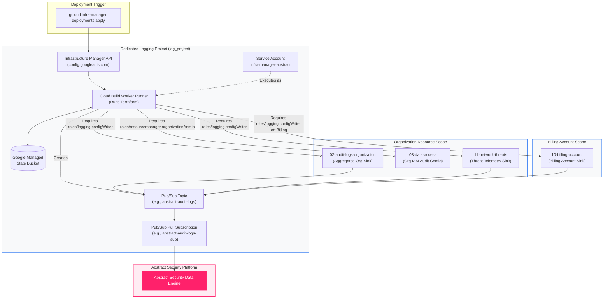

<picture>
  <source media="(prefers-color-scheme: dark)" srcset="../brand/abstract-logo-white.svg">
  
</picture>

# Deploying with Google Cloud Infrastructure Manager

Google Cloud Infrastructure Manager ("Infra Manager") is Google's fully managed service for provisioning and managing Terraform configurations. You supply a Terraform module or configuration; Infra Manager executes the plan and apply phases within **Google-managed Cloud Build workers** and **maintains the remote state automatically** in secure, Google-managed Cloud Storage buckets.

Use Infra Manager when you need auditable, API-driven, declarative deployments without configuring or operating an external CI/CD pipeline or self-managed Terraform state backend.

> [!WARNING]
> **Do not use Google Cloud Deployment Manager.**
> Deployment Manager reached **end of support on 31 March 2026** and will be permanently shut down. Infrastructure Manager is Google's modern, supported successor. Because Infra Manager runs native HashiCorp Terraform underneath, all templates in this repository work without modification.

---

## Architectural Flow

Infra Manager operates as a project-level orchestrator that drives Terraform execution inside isolated Cloud Build runners. For org-level and billing-level sinks, the deployment's service account acts across distinct GCP administrative boundaries.

```
┌─────────────────────────────────────────────────────────────────────────────────────────┐
│                     Developer Machine / CI/CD Automation Pipeline                       │
│                                                                                         │
│   gcloud infra-manager deployments apply projects/.../deployments/abstract-sink         │
└────────────────────────────────────────────┬────────────────────────────────────────────┘
                                             │ API Call (config.googleapis.com)
                                             ▼
┌─────────────────────────────────────────────────────────────────────────────────────────┐
│                       Dedicated Logging Project (log_project)                           │
│                                                                                         │
│   ┌─────────────────────────────────────────────────────────────────────────────────┐   │
│   │                 Infrastructure Manager Engine & Cloud Build Runner              │   │
│   │                                                                                 │   │
│   │   Service Account: infra-manager-abstract@log_project.iam.gserviceaccount.com   │   │
│   │   Terraform Engine (>= 1.5)  ───>  State Storage (Google-Managed Bucket)        │   │
│   └────────────────────────┬──────────────────────────┬─────────────────────────────┘   │
│                            │                          │                                 │
│                            │ Provisions Topics/Subs   │ Bound to Sinks                  │
│                            ▼                          ▼                                 │
│   ┌─────────────────────────────────────────────────────────────────────────────────┐   │
│   │ Pub/Sub Topic: abstract-audit-logs  ───>  Subscription: abstract-audit-logs-sub │   │
│   └───────────────────────────────────────────────────────────────────────┬─────────┘   │
└───────────────────────────────────────────────────────────────────────────┼─────────────┘
                                 │                                          │
       Organization Scope        │ Billing Scope                            │ Authenticated Pull
       (roles/logging.configWriter) (roles/logging.configWriter)            │
                                 │                                          ▼
┌────────────────────────────────┴──────────┐  ┌──────────────────────────────────────────┐
│   Google Cloud Organization               │  │   Cloud Billing Account                  │
│                                           │  │                                          │
│   • 02-audit-logs-organization (Org Sink) │  │   • 10-billing-account (Billing Sink)    │
│   • 03-data-access (IAM Audit Config)     │  └──────────────────────────────────────────┘
│   • 11-network-threats (Network Sink)     │                               ▲
└───────────────────────────────────────────┘                               │
                                                                            │
┌───────────────────────────────────────────────────────────────────────────┴─────────────┐
│                                Abstract Security Platform                               │
│                                                                                         │
│   Streams high-fidelity GCP telemetry into Abstract SIEM via Cloud Pub/Sub (#FF216B)     │
└─────────────────────────────────────────────────────────────────────────────────────────┘
```



---

## Critical Prerequisites

### Billing MUST Be Enabled on the Logging Project
Infra Manager executes Terraform recipes on **Cloud Build**. Cloud Build cannot run in any project where billing is disabled. If you attempt to enable the required APIs on an unfunded project:
```
reason: UREQ_PROJECT_BILLING_NOT_OPEN
services: cloudbuild.googleapis.com, artifactregistry.googleapis.com
```

Confirm that billing is active and open before proceeding:
```bash
gcloud billing projects describe "$LOG_PROJECT" --format='value(billingEnabled)'
gcloud billing accounts list --format='table(name,displayName,open)'
```

> [!NOTE]
> For sandbox or trial environments without an active billing account, use the **Open in Cloud Shell** or local OpenTofu/Terraform workflows instead. Cloud Logging and Pub/Sub operate within generous free tiers and do not strictly require Cloud Build.

### Prerequisite APIs
Enable the required APIs in the dedicated logging project:
```bash
export LOG_PROJECT="acme-security-logging"
export ORG_ID="123456789012"
export LOCATION="us-central1"
export SA_NAME="infra-manager-abstract"

gcloud config set project "$LOG_PROJECT"

gcloud services enable \
  config.googleapis.com \
  cloudbuild.googleapis.com \
  pubsub.googleapis.com \
  logging.googleapis.com \
  iam.googleapis.com \
  serviceusage.googleapis.com
```

---

## Unified Service Account Setup

Infra Manager executes actions under the identity of a dedicated service account. Because our deployments manage resources across **Project**, **Organization**, and **Billing Account** scopes, the service account must receive permissions at the corresponding levels.

### 1. Create the Service Account
```bash
gcloud iam service-accounts create "$SA_NAME" \
  --display-name="Infrastructure Manager - Abstract Deployments" \
  --project="$LOG_PROJECT"

export SA_EMAIL="$SA_NAME@$LOG_PROJECT.iam.gserviceaccount.com"
```

### 2. Grant Project-Level Permissions
The service account needs permissions to orchestrate builds and create Pub/Sub resources in `log_project`:
```bash
# Infrastructure Manager Agent
gcloud projects add-iam-policy-binding "$LOG_PROJECT" \
  --member="serviceAccount:$SA_EMAIL" \
  --role="roles/config.agent"

# Pub/Sub Administration
gcloud projects add-iam-policy-binding "$LOG_PROJECT" \
  --member="serviceAccount:$SA_EMAIL" \
  --role="roles/pubsub.admin"

# Service Account & Key Management
gcloud projects add-iam-policy-binding "$LOG_PROJECT" \
  --member="serviceAccount:$SA_EMAIL" \
  --role="roles/iam.serviceAccountAdmin"

# API Enablement
gcloud projects add-iam-policy-binding "$LOG_PROJECT" \
  --member="serviceAccount:$SA_EMAIL" \
  --role="roles/serviceusage.serviceUsageAdmin"
```

### 3. Grant Organization-Level Permissions
To create organization aggregated log sinks and configure organization audit logging:
```bash
# Required for 02-audit-logs-organization and 11-network-threats
gcloud organizations add-iam-policy-binding "$ORG_ID" \
  --member="serviceAccount:$SA_EMAIL" \
  --role="roles/logging.configWriter"

# Required ONLY if deploying 03-data-access (authoritative audit configuration)
gcloud organizations add-iam-policy-binding "$ORG_ID" \
  --member="serviceAccount:$SA_EMAIL" \
  --role="roles/resourcemanager.organizationAdmin"
```

### 4. Grant Billing Account Permissions (For `10-billing-account`)
Because billing accounts sit outside the organization resource hierarchy, `roles/logging.configWriter` must be bound directly to the billing account:
```bash
export BILLING_ACCOUNT_ID="012345-567890-ABCDEF"

gcloud billing accounts add-iam-policy-binding "$BILLING_ACCOUNT_ID" \
  --member="serviceAccount:$SA_EMAIL" \
  --role="roles/logging.configWriter"
```

### 5. Allow Yourself to Impersonate the Service Account
```bash
gcloud iam service-accounts add-iam-policy-binding "$SA_EMAIL" \
  --member="user:$(gcloud config get-value account)" \
  --role="roles/iam.serviceAccountUser" \
  --project="$LOG_PROJECT"
```

---

## Important: List Variables & `--input-values` Limitation

> [!IMPORTANT]
> The `gcloud infra-manager` CLI flag `--input-values` **only supports scalar strings and numbers**. It cannot pass lists, tuples, or complex maps.
>
> If your deployment specifies list variables (such as `log_categories`, `data_access_services`, `services`, or `exclusions`), **commit a `terraform.tfvars` file directly into the deployment directory**. Terraform automatically loads `terraform.tfvars` from the module root, and `--input-values` safely overrides scalar variables on top.

---

## Deployment Recipes

### 1. Deploying `deployments/01-logging-project` (Logging Project Bootstrap)

Used to provision a greenfield logging project or configure APIs on an existing project.

```bash
# Preview
gcloud infra-manager previews create \
  "projects/$LOG_PROJECT/locations/$LOCATION/previews/preview-01-bootstrap" \
  --service-account="projects/$LOG_PROJECT/serviceAccounts/$SA_EMAIL" \
  --local-source="./deployments/01-logging-project" \
  --input-values="project_id=$LOG_PROJECT,project_name=Abstract-Logging-Project"

# Apply
gcloud infra-manager deployments apply \
  "projects/$LOG_PROJECT/locations/$LOCATION/deployments/abstract-01-bootstrap" \
  --service-account="projects/$LOG_PROJECT/serviceAccounts/$SA_EMAIL" \
  --local-source="./deployments/01-logging-project" \
  --input-values="project_id=$LOG_PROJECT,project_name=Abstract-Logging-Project"
```

---

### 2. Deploying `deployments/02-audit-logs-organization` (Org-Wide Audit Logs)

Exports Cloud Audit Logs from every project and folder across the entire GCP organization, including native Google Workspace audit events (when Workspace sharing is active).

#### Step A — Create `terraform.tfvars` for list variables
```bash
cat > deployments/02-audit-logs-organization/terraform.tfvars <<EOF
log_categories       = ["admin_activity", "system_event", "policy_denied", "identity_access"]
data_access_services = ["bigquery.googleapis.com", "storage.googleapis.com", "cloudkms.googleapis.com"]
EOF
```

#### Step B — Preview and Apply
```bash
# Preview
gcloud infra-manager previews create \
  "projects/$LOG_PROJECT/locations/$LOCATION/previews/preview-02-org-audit" \
  --service-account="projects/$LOG_PROJECT/serviceAccounts/$SA_EMAIL" \
  --local-source="./deployments/02-audit-logs-organization" \
  --input-values="org_id=$ORG_ID,log_project=$LOG_PROJECT"

# Apply
gcloud infra-manager deployments apply \
  "projects/$LOG_PROJECT/locations/$LOCATION/deployments/abstract-02-org-audit" \
  --service-account="projects/$LOG_PROJECT/serviceAccounts/$SA_EMAIL" \
  --local-source="./deployments/02-audit-logs-organization" \
  --input-values="org_id=$ORG_ID,log_project=$LOG_PROJECT"
```

#### Step C — Inspect Outputs
```bash
gcloud infra-manager deployments describe \
  "projects/$LOG_PROJECT/locations/$LOCATION/deployments/abstract-02-org-audit"
```

---

### 3. Deploying `deployments/03-data-access` (Data Access Audit Policy)

Enables Data Access audit logging (DATA_WRITE and ADMIN_READ) for high-value services across the organization.

> [!CAUTION]
> This deployment manages the authoritative `google_organization_iam_audit_config`. It is kept in a dedicated deployment state so that destroying a collector sink can **never** accidentally strip organization audit policies.

#### Step A — Create `terraform.tfvars`
```bash
cat > deployments/03-data-access/terraform.tfvars <<EOF
services              = ["bigquery.googleapis.com", "storage.googleapis.com", "cloudkms.googleapis.com"]
log_types             = ["ADMIN_READ", "DATA_WRITE"]
acknowledge_data_read = false
EOF
```

#### Step B — Preview and Apply
```bash
# Preview
gcloud infra-manager previews create \
  "projects/$LOG_PROJECT/locations/$LOCATION/previews/preview-03-data-access" \
  --service-account="projects/$LOG_PROJECT/serviceAccounts/$SA_EMAIL" \
  --local-source="./deployments/03-data-access" \
  --input-values="scope=organization,org_id=$ORG_ID"

# Apply
gcloud infra-manager deployments apply \
  "projects/$LOG_PROJECT/locations/$LOCATION/deployments/abstract-03-data-access" \
  --service-account="projects/$LOG_PROJECT/serviceAccounts/$SA_EMAIL" \
  --local-source="./deployments/03-data-access" \
  --input-values="scope=organization,org_id=$ORG_ID"
```

---

### 4. Deploying `deployments/10-billing-account` (Billing Account Audit Export)

Billing accounts sit outside the resource hierarchy. This creates a dedicated billing sink routing `admin_activity` and `system_event` logs directly to Pub/Sub.

```bash
# Preview
gcloud infra-manager previews create \
  "projects/$LOG_PROJECT/locations/$LOCATION/previews/preview-10-billing" \
  --service-account="projects/$LOG_PROJECT/serviceAccounts/$SA_EMAIL" \
  --local-source="./deployments/10-billing-account" \
  --input-values="billing_account_id=$BILLING_ACCOUNT_ID,log_project=$LOG_PROJECT"

# Apply
gcloud infra-manager deployments apply \
  "projects/$LOG_PROJECT/locations/$LOCATION/deployments/abstract-10-billing" \
  --service-account="projects/$LOG_PROJECT/serviceAccounts/$SA_EMAIL" \
  --local-source="./deployments/10-billing-account" \
  --input-values="billing_account_id=$BILLING_ACCOUNT_ID,log_project=$LOG_PROJECT"
```

---

### 5. Deploying `deployments/11-network-threats` (Unified Threat Telemetry)

Exports Cloud Armor WAF decisions, Cloud IDS threat detections, VPC DNS queries, and Firewall rule evaluations in a single aggregated pipeline.

#### Step A — Create `terraform.tfvars`
```bash
cat > deployments/11-network-threats/terraform.tfvars <<EOF
log_categories          = ["load_balancer", "dns_queries", "firewall"]
platform_log_filters    = ["ids.googleapis.com%2Fthreat"]
acknowledge_high_volume = false
EOF
```

#### Step B — Preview and Apply
```bash
# Preview
gcloud infra-manager previews create \
  "projects/$LOG_PROJECT/locations/$LOCATION/previews/preview-11-network" \
  --service-account="projects/$LOG_PROJECT/serviceAccounts/$SA_EMAIL" \
  --local-source="./deployments/11-network-threats" \
  --input-values="org_id=$ORG_ID,log_project=$LOG_PROJECT,sink_scope=organization"

# Apply
gcloud infra-manager deployments apply \
  "projects/$LOG_PROJECT/locations/$LOCATION/deployments/abstract-11-network" \
  --service-account="projects/$LOG_PROJECT/serviceAccounts/$SA_EMAIL" \
  --local-source="./deployments/11-network-threats" \
  --input-values="org_id=$ORG_ID,log_project=$LOG_PROJECT,sink_scope=organization"
```

---

## Deploying from Git Repositories

Using `--local-source` uploads local filesystem content. For production pipelines, configure Infra Manager to fetch directly from your version-controlled Git repository:

```bash
gcloud infra-manager deployments apply \
  "projects/$LOG_PROJECT/locations/$LOCATION/deployments/abstract-02-org-audit" \
  --service-account="projects/$LOG_PROJECT/serviceAccounts/$SA_EMAIL" \
  --git-source-repo="https://github.com/IamABS3C/abstract-gcp-templates" \
  --git-source-directory="deployments/02-audit-logs-organization" \
  --git-source-ref="v1.2.0" \
  --input-values="org_id=$ORG_ID,log_project=$LOG_PROJECT"
```

> [!TIP]
> Always pin `--git-source-ref` to an immutable **release tag** rather than a mutable branch. This guarantees that applies are reproducible and prevents accidental rollout of unapproved changes.

---

## Useful Flags & Operational Commands

| Command / Flag | Purpose |
|---|---|
| `--tf-version-constraint=">=1.5.0"` | Pin the Terraform binary version executed by Cloud Build |
| `--worker-pool` | Execute builds inside a private Cloud Build worker pool (required for VPC-SC) |
| `gcloud infra-manager revisions list` | View full history of revisions and state snapshots |
| `gcloud infra-manager deployments export-statefile` | Download the current Terraform `.tfstate` JSON file for inspection |

---

## Teardown and Cleanup

To safely tear down an Infra Manager deployment and destroy its managed infrastructure:

```bash
gcloud infra-manager deployments delete \
  "projects/$LOG_PROJECT/locations/$LOCATION/deployments/abstract-02-org-audit"
```

> [!NOTE]
> Deleting `abstract-02-org-audit` or `abstract-11-network` only destroys the logging sinks and Pub/Sub resources managed by that specific deployment. It **never modifies** your organization's Data Access audit configuration (`abstract-03-data-access`), guaranteeing state safety and isolation.

---

## Related Documentation & Diagnostics

* 🛠️ **Troubleshooting Runbooks**: [Master Troubleshooting Guide](TROUBLESHOOTING-GUIDE.md)
* 📘 **Master Telemetry Reference**: [Master GCP Telemetry Dataflow Reference](DATAFLOW-AND-ARCHITECTURE-REFERENCE.md)
* 📋 **Permissions Matrix**: [Permissions Reference Across All Scopes](PERMISSIONS.md)
* 🌐 **Interactive Diagram Explorer**: [Architecture Explorer Web UI](architecture-explorer.html)
