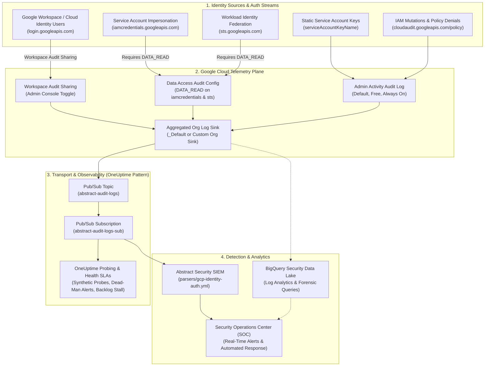
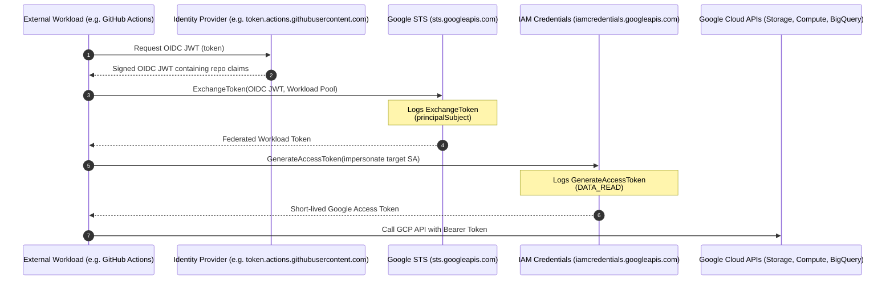

# Enterprise Identity Threat Detection & Authentication Auditing Guide

Definitive reference for Google Cloud Platform (GCP), Google Workspace, OneUptime auditing architecture, and Abstract Security SIEM normalization.

---

## Executive Summary & Architecture Overview

In modern cloud environments, **identity is the primary security perimeter**. Network firewalls and VPC boundaries cannot prevent compromise when an adversary possesses valid credentials, abuses service account impersonation, or leverages misconfigured Workload Identity Federation.

This guide provides an end-to-end architectural and operational reference for enterprise identity threat detection across Google Cloud and Google Workspace, integrating the **OneUptime Authentication Auditing Architecture** and the **Abstract Security SIEM Normalization Pipeline**.

<p align="center">
  
</p>

> [!TIP]
> **Interactive Architecture Diagram (Draw.io / diagrams.net)**:
> Edit, export, and customize this architecture directly on your machine or browser:
> ```bash
> ./scripts/open-diagram.sh 04-identity-auth-oneuptime          # Opens in macOS Draw.io Desktop
> ./scripts/open-diagram.sh 04-identity-auth-oneuptime --web    # Opens in diagrams.net
> ```



---

## The OneUptime Authentication Auditing Architecture

The **OneUptime Authentication Auditing Architecture** establishes five core principles for zero-trust cloud auditing:

1. **Zero Silent Failures (Dead-Man Switches)**: Logging pipelines must never fail quietly. If identity event flow drops to zero for >30 minutes in a production organization, an alert must fire immediately.
2. **Deterministic Mechanism Attribution**: Every authenticated request must explicitly identify its credential mechanism: interactive browser login, temporary OAuth2 bearer token, Workload Identity assertion, or static private key.
3. **Impersonation Chain Transparency**: Multi-hop delegation (`User -> SA-1 -> SA-2`) must retain full lineage in security event records to prevent privilege laundering.
4. **Continuous Synthetic Probing**: Autonomous canaries execute non-destructive credential exchanges at regular intervals to verify end-to-end pipeline latency and parser integrity.
5. **Authoritative State Isolation**: Audit configuration (`google_organization_iam_audit_config`) must be decoupled from log-routing pipelines to ensure teardowns never strip data-plane security logging.

---

## 1. Complete Breakdown of GCP & Workspace Authentication Streams

Understanding where identity events originate, which log streams carry them, and what permissions enable them is critical for total visibility.

| Authentication Stream | Service Name (`protoPayload.serviceName`) | Log Type / Stream | Default Ingestion State | Required Configuration |
|---|---|---|---|---|
| **Google Workspace Logins** | `login.googleapis.com` | `cloudaudit.googleapis.com/data_access` | **Disabled** in Cloud Logging | Admin Console: Share audit logs with Google Cloud |
| **Service Account Impersonation** | `iamcredentials.googleapis.com` | `cloudaudit.googleapis.com/data_access` | **Disabled** (Not in Admin Activity) | IAM Audit Config: `DATA_READ` on `iamcredentials.googleapis.com` |
| **Workload Identity Federation** | `sts.googleapis.com` | `cloudaudit.googleapis.com/data_access` | **Disabled** (Not in Admin Activity) | IAM Audit Config: `DATA_READ` on `sts.googleapis.com` |
| **Static SA Key Usage** | Any GCP API (e.g. `compute`, `storage`) | `cloudaudit.googleapis.com/activity` or `data_access` | Enabled on active API | Look for `serviceAccountKeyName` attribute |
| **IAM Mutations** | `iam.googleapis.com`, Resource Manager | `cloudaudit.googleapis.com/activity` | **Always On** (Free) | None (Admin Activity cannot be turned off) |
| **Policy Denials** | Multiple (`iam`, `vpcaccess`) | `cloudaudit.googleapis.com/policy` | **Always On** (Billed) | Included in organization-level sink |

---

### Stream 1: Google Workspace & Cloud Identity User Logins (`login.googleapis.com`)

Interactive user authentication into Google Cloud Console, Google Cloud CLI (`gcloud auth login`), Google Workspace apps, and third-party SaaS via Google SSO.

#### Dual Ingestion Pathways: API Pull vs. Streaming Cloud Audit Logs

Organizations have two ways to ingest user authentication events:

1. **Google Workspace Cloud Audit Logs Sharing (Streaming Push)**:
   - When enabled in `admin.google.com`, Workspace user login events stream directly into Google Cloud Logging under `organizations/$ORG_ID/logs/cloudaudit.googleapis.com%2Fdata_access`.
   - Traverses the organization aggregated log sink into Pub/Sub in real-time (<5 second latency).
2. **Google Admin SDK Reports API (Polling Pull)**:
   - Used by Abstract's `default.google_workspace` integration via domain-wide delegation.
   - Polls the `login` application at regular checkpoint intervals.

#### Method Names & Event Signatures

```json
{
  "protoPayload": {
    "@type": "type.googleapis.com/google.cloud.audit.AuditLog",
    "serviceName": "login.googleapis.com",
    "methodName": "google.login.LoginService.loginSuccess",
    "authenticationInfo": {
      "principalEmail": "engineer@example.com"
    },
    "requestMetadata": {
      "callerIp": "198.51.100.42",
      "callerSuppliedUserAgent": "Mozilla/5.0 (Macintosh; Intel Mac OS X 10_15_7)..."
    },
    "metadata": {
      "event": [
        {
          "event_name": "login",
          "parameter": [
            { "name": "login_type", "value": "google_password" },
            { "name": "login_challenge_method", "value": "security_key" },
            { "name": "login_challenge_status", "value": "success" },
            { "name": "is_suspicious", "boolValue": false }
          ]
        }
      ]
    }
  }
}
```

Key methods in this stream:
- `google.login.LoginService.loginSuccess`: Successful authentication.
- `google.login.LoginService.loginFailure`: Failed authentication (bad password, failed MFA, locked account).
- `google.login.LoginService.logoutEvent`: User session termination.
- `google.login.LoginService.suspiciousLogin`: Google Identity AI flagged the login as anomalous (novel IP, impossible velocity, unusual device fingerprint).

#### 2-Step Verification (2SV) & MFA Challenges

When a user triggers an MFA challenge, `protoPayload.metadata.event` contains parameters indicating the challenge outcome:
- `login_challenge_method`: `security_key` (WebAuthn/FIDO), `idp_challenge` (SAML), `authenticator` (TOTP), `sms` / `voice`, `prompt` (Google Prompt on mobile).
- `login_challenge_status`: `success` or `failure`. Repeated failures indicate MFA fatigue attacks or token interception.

---

### Stream 2: Service Account Impersonation (`iamcredentials.googleapis.com`)

Service account impersonation allows a principal (user or another service account) to assume the identity of a target service account dynamically without handling static keys.

#### Why Impersonation Requires Data Access Audit Logging (NOT in Admin Activity)

> [!CAUTION]
> **The #1 Blind Spot in Google Cloud Security**:
> GCP Admin Activity logs (`cloudaudit.googleapis.com/activity`) record **only control-plane configuration changes** (e.g. creating a service account, assigning an IAM role, updating a policy).
>
> Generating a short-lived token or signing a payload is a **data-plane cryptographic operation** against the IAM Credentials API. Therefore, calls to `iamcredentials.googleapis.com` generate **`DATA_READ` Data Access audit logs**.
>
> If your organization only collects Admin Activity (the default free tier), **100% of service account impersonation and credential minting is completely invisible to your SIEM**. An attacker abusing `roles/iam.serviceAccountTokenCreator` can move laterally across your entire cloud estate without leaving a single trace in Admin Activity logs!

#### API Methods in `iamcredentials.googleapis.com`

- `GenerateAccessToken`: Mints a short-lived OAuth2 bearer token (1 hour default, up to 12 hours via organization policy constraint `constraints/iam.allowServiceAccountCredentialLifetimeExtension`).
- `GenerateIdToken`: Mints an OpenID Connect (OIDC) JWT identity token (used to authenticate against Cloud Run, Cloud Functions, Identity-Aware Proxy, or external APIs).
- `SignBlob`: Uses the service account's private key to sign an arbitrary cryptographic payload.
- `SignJwt`: Computes a signed JWT claim set using the service account's Google-managed key.

#### Impersonation Delegation Chains

When impersonation occurs, Google Cloud records the full delegation path in `protoPayload.authenticationInfo`:

```json
{
  "protoPayload": {
    "serviceName": "iamcredentials.googleapis.com",
    "methodName": "GenerateAccessToken",
    "resourceName": "projects/-/serviceAccounts/prod-db-deployer@prod-core.iam.gserviceaccount.com",
    "authenticationInfo": {
      "principalEmail": "contractor@example.com",
      "serviceAccountDelegationInfo": [
        {
          "firstPartyPrincipal": {
            "principalEmail": "contractor@example.com"
          }
        }
      ]
    },
    "requestMetadata": {
      "callerIp": "203.0.113.15"
    }
  }
}
```

- **Direct Impersonation**: `contractor@example.com` directly calls `GenerateAccessToken` for `prod-db-deployer`.
- **Transitive / Chained Impersonation**: `contractor@example.com` calls `SA-Jump`, which calls `SA-Intermediate`, which mints a token for `SA-Prod`. The `serviceAccountDelegationInfo` array preserves each intermediate hop in order.

---

### Stream 3: Workload Identity Federation (`sts.googleapis.com`)

Workload Identity Federation (WIF) eliminates static service account keys for external workloads: GitHub Actions, GitLab CI/CD, AWS EC2/Lambda, Azure AD, and on-premises Kubernetes clusters.



#### STS Exchange Event Signature

When the external workload calls `sts.googleapis.com:ExchangeToken`, the event payload includes:

```json
{
  "protoPayload": {
    "serviceName": "sts.googleapis.com",
    "methodName": "google.identity.sts.v1.SecurityTokenService.ExchangeToken",
    "resourceName": "projects/1234567890/locations/global/workloadIdentityPools/github-pool/providers/github-provider",
    "authenticationInfo": {
      "principalSubject": "//iam.googleapis.com/projects/1234567890/locations/global/workloadIdentityPools/github-pool/subject/repo:acme-corp/api-service:ref:refs/heads/main"
    },
    "requestMetadata": {
      "callerIp": "140.82.115.1"
    }
  }
}
```

Key attributes to inspect:
- `principalSubject`: The exact federated subject identity. In GitHub Actions, this includes the organization, repository, and git ref.
- `resourceName`: The Workload Identity Pool and Provider evaluated.

---

### Stream 4: Static Service Account Key Usage & Leaked Key Exposure

Service account keys are 10-year unrotated RSA private keys packaged as JSON files (`service-account-key.json`). They represent the highest-risk credential type in Google Cloud.

#### The Forensic Smoking Gun: `serviceAccountKeyName`

When any GCP API is called, Cloud Audit Logs evaluate how the caller authenticated:

1. **Static JSON Key**: `protoPayload.authenticationInfo.serviceAccountKeyName` is populated with the full resource path of the private key:
   `projects/{PROJECT_ID}/serviceAccounts/{SA_EMAIL}/keys/{KEY_ID}`
2. **Metadata Server / ADC / Impersonation / WIF**: `serviceAccountKeyName` is **absent (null)**.

```json
{
  "protoPayload": {
    "serviceName": "storage.googleapis.com",
    "methodName": "storage.objects.get",
    "authenticationInfo": {
      "principalEmail": "backup-runner@acme-corp.iam.gserviceaccount.com",
      "serviceAccountKeyName": "projects/acme-corp/serviceAccounts/backup-runner@acme-corp.iam.gserviceaccount.com/keys/4f9b8c7d6e5a4b3c2d1e0f"
    },
    "requestMetadata": {
      "callerIp": "198.51.100.200"
    }
  }
}
```

#### Threat Analysis: Anomalous IP Detection

Because static keys can be executed from anywhere on the internet, cross-referencing `serviceAccountKeyName` against `protoPayload.requestMetadata.callerIp` is the primary mechanism to detect leaked or exfiltrated keys. An internal workload service account key invoked from a residential proxy, Tor node, or external cloud provider indicates immediate compromise.

---

### Stream 5: IAM Permission Mutations & Security Policy Denials

Control-plane modifications that establish persistence or elevate privileges.

- `google.iam.admin.v1.CreateServiceAccountKey`: Generating a new static backdoor key.
- `google.iam.v1.IAMPolicy.SetIamPolicy`: Modifying IAM bindings at Project, Folder, or Organization scope. Watch for grants of `roles/owner`, `roles/editor`, `roles/resourcemanager.organizationAdmin`, or `roles/iam.serviceAccountTokenCreator`.
- `google.iam.admin.v1.DeleteServiceAccountKey`: Destroying keys to erase evidence.
- `cloudaudit.googleapis.com/policy`: Logs emitted when access is denied by VPC Service Controls (`SECURITY_POLICY_VIOLATED`), IAM Conditions, or organizational policies.

---

## 2. Actionable Detection Queries & SIEM Rules

The following rules provide production-ready detection logic across three standard formats:
1. **Google Cloud Logging Filter**: For Log Router sinks, Log Analytics, and Log-Based Alerting policies.
2. **BigQuery SQL**: For scheduled analytical rules, Google SecOps, and retrospective threat hunting.
3. **Abstract Security Stream Rule**: For inline real-time detection on normalized ECS/OCSF streams (`parsers/gcp-identity-auth.yml`).

---

### Rule 1: Multiple Failed Logins / Brute Force Detection

- **MITRE ATT&CK**: T1110.001 (Password Guessing), T1110.003 (Password Spraying)
- **Severity**: High
- **Logic**: Trigger if an account records $\ge 5$ failed logins within 10 minutes, or a single IP triggers $\ge 15$ failed logins across any accounts within 5 minutes.

#### Cloud Logging Filter
```text
logName=~"logs/cloudaudit.googleapis.com%2Fdata_access"
protoPayload.serviceName="login.googleapis.com"
protoPayload.methodName="google.login.LoginService.loginFailure"
```

#### BigQuery SQL (SIEM Detection Window)
```sql
WITH failed_logins AS (
  SELECT
    timestamp,
    protopayload_auditlog.authenticationInfo.principalEmail AS principal_email,
    protopayload_auditlog.requestMetadata.callerIp AS caller_ip,
    protopayload_auditlog.requestMetadata.callerSuppliedUserAgent AS user_agent
  FROM
    `your_project.your_dataset.cloudaudit_googleapis_com_data_access`
  WHERE
    protopayload_auditlog.serviceName = 'login.googleapis.com'
    AND protopayload_auditlog.methodName = 'google.login.LoginService.loginFailure'
    AND timestamp >= TIMESTAMP_SUB(CURRENT_TIMESTAMP(), INTERVAL 1 HOUR)
)
SELECT
  principal_email,
  caller_ip,
  COUNT(*) AS failure_count,
  MIN(timestamp) AS first_attempt,
  MAX(timestamp) AS last_attempt,
  TIMESTAMP_DIFF(MAX(timestamp), MIN(timestamp), SECOND) AS duration_seconds
FROM
  failed_logins
GROUP BY
  principal_email,
  caller_ip
HAVING
  failure_count >= 5
ORDER BY
  failure_count DESC;
```

#### Abstract Security Rule Definition
```yaml
rule:
  name: "GCP Cloud Identity: Multiple Failed Logins (Brute Force)"
  severity: high
  condition:
    all:
      - equals: { event.dataset: "gcp.identity_auth" }
      - equals: { service.name: "login.googleapis.com" }
      - equals: { event.outcome: "failure" }
  aggregation:
    group_by: [user.email]
    window: 10m
    threshold: 5
  actions:
    - alert:
        title: "Potential Brute Force: 5+ Failed Logins for {{user.email}}"
        description: "Principal {{user.email}} experienced multiple failed authentications from IP {{source.ip}}."
```

---

### Rule 2: Service Account Key Creation Alert

- **MITRE ATT&CK**: T1098.004 (Account Manipulation: Additional Cloud Credentials), T1078.004 (Valid Accounts: Cloud Accounts)
- **Severity**: High (Critical if created by a non-automation principal)
- **Logic**: Any call to `CreateServiceAccountKey`. Static keys bypass SSO, 2SV, and IP conditional access.

#### Cloud Logging Filter
```text
logName=~"logs/cloudaudit.googleapis.com%2Factivity"
protoPayload.serviceName="iam.googleapis.com"
protoPayload.methodName=~"google.iam.admin.v1.CreateServiceAccountKey"
```

#### BigQuery SQL
```sql
SELECT
  timestamp,
  protopayload_auditlog.authenticationInfo.principalEmail AS creator_principal,
  protopayload_auditlog.resourceName AS target_service_account,
  protopayload_auditlog.requestMetadata.callerIp AS caller_ip,
  protopayload_auditlog.requestMetadata.callerSuppliedUserAgent AS user_agent,
  protopayload_auditlog.response.name AS created_key_name
FROM
  `your_project.your_dataset.cloudaudit_googleapis_com_activity`
  , UNNEST(protopayload_auditlog.authorizationInfo) AS auth
WHERE
  protopayload_auditlog.methodName LIKE '%CreateServiceAccountKey%'
  AND timestamp >= TIMESTAMP_SUB(CURRENT_TIMESTAMP(), INTERVAL 24 HOUR)
ORDER BY
  timestamp DESC;
```

#### Abstract Security Rule Definition
```yaml
rule:
  name: "GCP IAM: Static Service Account Key Created"
  severity: high
  condition:
    all:
      - equals: { event.dataset: "gcp.identity_auth" }
      - equals: { event.action: "google.iam.admin.v1.CreateServiceAccountKey" }
      - equals: { event.outcome: "success" }
  actions:
    - alert:
        title: "Security Risk: New Static Key Created for {{gcp.audit.resource_name}}"
        description: "Principal {{user.email}} generated a static private key from IP {{source.ip}}."
```

---

### Rule 3: Service Account Key Anomalous IP / Leaked Key Detection

- **MITRE ATT&CK**: T1552.001 (Unsecured Credentials: Credentials In Files), T1078.004 (Valid Accounts: Cloud Accounts)
- **Severity**: Critical
- **Logic**: Any API call authenticating with a static service account key where `callerIp` is NOT in approved corporate CIDRs or Cloud NAT egress ranges.

#### Cloud Logging Filter
```text
protoPayload.authenticationInfo.serviceAccountKeyName:*
NOT protoPayload.requestMetadata.callerIp =~ "^(10\.|172\.(1[6-9]|2[0-9]|3[01])\.|192\.168\.|35\.190\.|34\.120\.)"
NOT protoPayload.requestMetadata.callerIp = "private"
```

#### BigQuery SQL
```sql
SELECT
  timestamp,
  protopayload_auditlog.authenticationInfo.principalEmail AS service_account_email,
  protopayload_auditlog.authenticationInfo.serviceAccountKeyName AS key_resource_name,
  protopayload_auditlog.serviceName AS target_service,
  protopayload_auditlog.methodName AS api_method,
  protopayload_auditlog.requestMetadata.callerIp AS anomalous_ip,
  protopayload_auditlog.requestMetadata.callerSuppliedUserAgent AS user_agent
FROM
  `your_project.your_dataset.cloudaudit_googleapis_com_*`
WHERE
  protopayload_auditlog.authenticationInfo.serviceAccountKeyName IS NOT NULL
  -- Exclude internal RFC 1918 addresses and authorized corporate egress IP ranges
  AND NOT (
    NET.IP_TRUNC(NET.SAFE_IP_FROM_STRING(protopayload_auditlog.requestMetadata.callerIp), 8) = NET.IP_FROM_STRING('10.0.0.0')
    OR NET.IP_TRUNC(NET.SAFE_IP_FROM_STRING(protopayload_auditlog.requestMetadata.callerIp), 16) = NET.IP_FROM_STRING('192.168.0.0')
    -- Replace with your corporate egress CIDR:
    OR NET.IP_TRUNC(NET.SAFE_IP_FROM_STRING(protopayload_auditlog.requestMetadata.callerIp), 24) = NET.IP_FROM_STRING('203.0.113.0')
  )
  AND timestamp >= TIMESTAMP_SUB(CURRENT_TIMESTAMP(), INTERVAL 1 HOUR);
```

#### Abstract Security Rule Definition
```yaml
rule:
  name: "GCP IAM: Static Service Account Key Used from Untrusted IP"
  severity: critical
  condition:
    all:
      - equals: { gcp.iam.auth_mechanism: "static_service_account_key" }
      - not:
          cidr_match:
            source.ip:
              - "10.0.0.0/8"
              - "172.16.0.0/12"
              - "192.168.0.0/16"
              - "203.0.113.0/24" # Corporate Gateway
  actions:
    - alert:
        title: "CRITICAL: Leaked Key Suspected for {{user.email}} from {{source.ip}}"
        description: "Static key {{gcp.iam.service_account_key_name}} used outside authorized corporate CIDRs."
```

---

### Rule 4: Unauthorized Service Account Impersonation Detection

- **MITRE ATT&CK**: T1548 (Abuse Elevation Control Mechanism), T1550.001 (Application Access Token)
- **Severity**: High
- **Logic**: Detect calls to `GenerateAccessToken`, `SignJwt`, or `SignBlob` where the caller is not in an approved list of CI/CD or break-glass identities, or where the target is a Tier-0 service account.

#### Cloud Logging Filter
```text
logName=~"logs/cloudaudit.googleapis.com%2Fdata_access"
protoPayload.serviceName="iamcredentials.googleapis.com"
protoPayload.methodName=("GenerateAccessToken" OR "GenerateIdToken" OR "SignJwt" OR "SignBlob")
NOT protoPayload.authenticationInfo.principalEmail=~"(terraform|github-runner|security-scanner)@"
```

#### BigQuery SQL
```sql
SELECT
  timestamp,
  protopayload_auditlog.authenticationInfo.principalEmail AS calling_principal,
  protopayload_auditlog.resourceName AS target_impersonated_sa,
  protopayload_auditlog.methodName AS impersonation_method,
  protopayload_auditlog.requestMetadata.callerIp AS caller_ip,
  protopayload_auditlog.authenticationInfo.serviceAccountDelegationInfo
FROM
  `your_project.your_dataset.cloudaudit_googleapis_com_data_access`
WHERE
  protopayload_auditlog.serviceName = 'iamcredentials.googleapis.com'
  AND protopayload_auditlog.methodName IN ('GenerateAccessToken', 'GenerateIdToken', 'SignJwt')
  -- Focus on Tier-0 sensitive accounts:
  AND (
    protopayload_auditlog.resourceName LIKE '%admin%'
    OR protopayload_auditlog.resourceName LIKE '%deployer%'
    OR protopayload_auditlog.resourceName LIKE '%prod%'
  )
  -- Exclude approved bastion or automation accounts:
  AND protopayload_auditlog.authenticationInfo.principalEmail NOT IN (
    'ci-cd-orchestrator@management-prod.iam.gserviceaccount.com'
  )
  AND timestamp >= TIMESTAMP_SUB(CURRENT_TIMESTAMP(), INTERVAL 6 HOUR);
```

#### Abstract Security Rule Definition
```yaml
rule:
  name: "GCP IAM: Unauthorized Service Account Impersonation"
  severity: high
  condition:
    all:
      - equals: { service.name: "iamcredentials.googleapis.com" }
      - in: { event.action: ["GenerateAccessToken", "GenerateIdToken", "SignJwt"] }
      - not:
          wildcard:
            user.email: ["*ci-cd*", "*automation*"]
  actions:
    - alert:
        title: "Service Account Impersonation: {{user.email}} assumed {{gcp.audit.resource_name}}"
        description: "Caller {{user.email}} minted access tokens for privileged service account."
```

---

### Rule 5: Workload Identity Federation (WIF) Anomaly Tracking

- **MITRE ATT&CK**: T1078.004 (Valid Accounts: Cloud Accounts), T1199 (Trusted Relationship)
- **Severity**: High
- **Logic**: Alert when an STS token exchange occurs from an unknown or non-mainline Git branch, or an unapproved GitHub/GitLab repository.

#### Cloud Logging Filter
```text
logName=~"logs/cloudaudit.googleapis.com%2Fdata_access"
protoPayload.serviceName="sts.googleapis.com"
protoPayload.methodName="google.identity.sts.v1.SecurityTokenService.ExchangeToken"
NOT protoPayload.authenticationInfo.principalSubject=~"subject/repo:acme-corp/.*:ref:refs/heads/main"
```

#### BigQuery SQL
```sql
SELECT
  timestamp,
  protopayload_auditlog.authenticationInfo.principalSubject AS federated_subject,
  protopayload_auditlog.resourceName AS wif_provider,
  protopayload_auditlog.requestMetadata.callerIp AS caller_ip,
  REGEXP_EXTRACT(protopayload_auditlog.authenticationInfo.principalSubject, r'repo:([^:]+)') AS git_repo,
  REGEXP_EXTRACT(protopayload_auditlog.authenticationInfo.principalSubject, r'ref:([^:]+)') AS git_ref
FROM
  `your_project.your_dataset.cloudaudit_googleapis_com_data_access`
WHERE
  protopayload_auditlog.serviceName = 'sts.googleapis.com'
  AND protopayload_auditlog.methodName = 'google.identity.sts.v1.SecurityTokenService.ExchangeToken'
  -- Flag branches outside main/release or repositories outside approved organization
  AND (
    NOT protopayload_auditlog.authenticationInfo.principalSubject LIKE '%repo:acme-corp/%'
    OR (
      protopayload_auditlog.authenticationInfo.principalSubject LIKE '%:ref:refs/pull/%'
      AND protopayload_auditlog.resourceName LIKE '%production%'
    )
  )
  AND timestamp >= TIMESTAMP_SUB(CURRENT_TIMESTAMP(), INTERVAL 24 HOUR);
```

#### Abstract Security Rule Definition
```yaml
rule:
  name: "GCP STS: Anomalous Workload Identity Federation Subject"
  severity: high
  condition:
    all:
      - equals: { service.name: "sts.googleapis.com" }
      - equals: { event.action: "google.identity.sts.v1.SecurityTokenService.ExchangeToken" }
      - not:
          wildcard:
            gcp.iam.principal_subject: ["*//iam.googleapis.com/*repo:acme-corp/*:ref:refs/heads/main*"]
  actions:
    - alert:
        title: "Workload Identity Anomaly: Untrusted Subject {{gcp.iam.principal_subject}}"
        description: "Token exchange performed from non-approved repository or branch."
```

---

### Rule 6: Impossible Travel / Geographic Anomaly Detection

- **MITRE ATT&CK**: T1078 (Valid Accounts), T1535 (Unused/Unsupported Cloud Regions)
- **Severity**: High
- **Logic**: Calculate the physical distance between consecutive successful logins for the same principal. If the required velocity between login $A$ and login $B$ exceeds $800\text{ km/h}$, flag as impossible travel.

#### BigQuery SQL (Haversine Velocity Formula)
```sql
WITH user_logins AS (
  SELECT
    timestamp,
    protopayload_auditlog.authenticationInfo.principalEmail AS principal_email,
    protopayload_auditlog.requestMetadata.callerIp AS caller_ip,
    -- Assume IP geolocation table ip_geo_lookup(ip_range, country, city, latitude, longitude)
    geo.country,
    geo.city,
    geo.latitude,
    geo.longitude,
    LAG(timestamp) OVER (PARTITION BY protopayload_auditlog.authenticationInfo.principalEmail ORDER BY timestamp) AS prev_time,
    LAG(geo.latitude) OVER (PARTITION BY protopayload_auditlog.authenticationInfo.principalEmail ORDER BY timestamp) AS prev_lat,
    LAG(geo.longitude) OVER (PARTITION BY protopayload_auditlog.authenticationInfo.principalEmail ORDER BY timestamp) AS prev_lon,
    LAG(geo.city) OVER (PARTITION BY protopayload_auditlog.authenticationInfo.principalEmail ORDER BY timestamp) AS prev_city
  FROM
    `your_project.your_dataset.cloudaudit_googleapis_com_data_access` log
  LEFT JOIN
    `your_project.reference.ip_geo_lookup` geo
    ON NET.SAFE_IP_FROM_STRING(log.protopayload_auditlog.requestMetadata.callerIp) BETWEEN geo.start_ip AND geo.end_ip
  WHERE
    protopayload_auditlog.serviceName = 'login.googleapis.com'
    AND protopayload_auditlog.methodName = 'google.login.LoginService.loginSuccess'
    AND timestamp >= TIMESTAMP_SUB(CURRENT_TIMESTAMP(), INTERVAL 12 HOUR)
),
velocity_calc AS (
  SELECT
    principal_email,
    prev_time,
    timestamp AS curr_time,
    prev_city,
    city AS curr_city,
    TIMESTAMP_DIFF(timestamp, prev_time, SECOND) / 3600.0 AS hours_delta,
    -- Great-circle Haversine formula (Earth radius ~6371 km)
    6371 * 2 * ASIN(SQRT(
      POW(SIN((latitude - prev_lat) * ACOS(-1) / 360), 2) +
      COS(prev_lat * ACOS(-1) / 180) * COS(latitude * ACOS(-1) / 180) *
      POW(SIN((longitude - prev_lon) * ACOS(-1) / 360), 2)
    )) AS distance_km
  FROM
    user_logins
  WHERE
    prev_time IS NOT NULL
)
SELECT
  principal_email,
  prev_city,
  curr_city,
  ROUND(distance_km, 1) AS distance_km,
  ROUND(hours_delta, 2) AS hours_delta,
  ROUND(distance_km / hours_delta, 1) AS velocity_kmh
FROM
  velocity_calc
WHERE
  hours_delta > 0
  AND hours_delta < 4 -- Focus on logins within 4 hours
  AND (distance_km / hours_delta) > 800 -- Exceeds commercial flight speed
ORDER BY
  velocity_kmh DESC;
```

---

## 3. Step-by-Step Enablement Guide

Follow these steps in exact order to activate all identity authentication streams across Google Cloud and Google Workspace.

---

### Step 1: Enable Google Workspace Audit Logs Sharing in Admin Console

To stream Google Workspace login events directly into Google Cloud Logging at the organization level:

1. Log into the [Google Admin Console](https://admin.google.com) as a **Workspace Super Admin**.
2. Navigate to **Account** $\rightarrow$ **Account settings** $\rightarrow$ **Legal and compliance**.
3. Locate the **Sharing options** section and click **Google Workspace audit logs sharing with Google Cloud**.
4. Check the box: **"Share Google Workspace audit logs with Google Cloud"**.
5. Click **Save**.

```
Google Admin Console (admin.google.com)
  └─ Account
      └─ Account settings
          └─ Legal and compliance
              └─ Sharing options
                  └─ [x] Share Google Workspace audit logs with Google Cloud (ENABLED)
```

> [!NOTE]
> Propagation across Google infrastructure takes **up to 6 hours**. Once active, Workspace login events will appear in Google Cloud Logging under:
> `organizations/$ORG_ID/logs/cloudaudit.googleapis.com%2Fdata_access` with `protoPayload.serviceName="login.googleapis.com"`.

---

### Step 2: Enable Organization-Level Data Access Audit Config

To capture `iamcredentials.googleapis.com` and `sts.googleapis.com`, you must configure `DATA_READ` audit logging at the organization level.

#### Option A: OpenTofu / Terraform (Recommended)

Use the dedicated root module in `deployments/03-data-access`.

Create `deployments/03-data-access/terraform.tfvars`:

```hcl
scope                               = "organization"
org_id                              = "123456789012"
log_types                           = ["ADMIN_READ", "DATA_WRITE", "DATA_READ"]
acknowledge_data_read               = true
acknowledge_authoritative_overwrite = false

# Explicitly scope high-signal identity services
services = [
  "iamcredentials.googleapis.com", # Service Account Impersonation & Token Minting
  "sts.googleapis.com",            # Workload Identity Federation (WIF)
  "login.googleapis.com",          # Workspace & Cloud Identity Logins
  "cloudkms.googleapis.com",       # Cryptographic key operations
  "bigquery.googleapis.com"        # Exfiltration detection
]

# Exclude high-frequency batch runner service accounts if needed
exempted_members = []
```

Apply the configuration:

```bash
cd deployments/03-data-access
tofu init
tofu plan -out=tfplan
tofu apply tfplan
cd ../..
```

#### Option B: Google Cloud CLI (`gcloud`)

If deploying without Infrastructure-as-Code:

```bash
export ORG_ID="123456789012"

# 1. Fetch the current organization IAM policy to a temporary JSON file
gcloud organizations get-iam-policy "$ORG_ID" --format=json > /tmp/org_policy.json

# 2. Add Data Access audit configuration for iamcredentials and sts
cat << 'EOF' > /tmp/add_audit_config.py
import json

with open('/tmp/org_policy.json', 'r') as f:
    policy = json.load(f)

audit_configs = policy.get('auditConfigs', [])

services_to_add = [
    'iamcredentials.googleapis.com',
    'sts.googleapis.com',
    'login.googleapis.com'
]

for svc in services_to_add:
    # Remove existing entry if present
    audit_configs = [c for c in audit_configs if c.get('service') != svc]
    audit_configs.append({
        'service': svc,
        'auditLogConfigs': [
            {'logType': 'ADMIN_READ'},
            {'logType': 'DATA_READ'},
            {'logType': 'DATA_WRITE'}
        ]
    })

policy['auditConfigs'] = audit_configs

with open('/tmp/updated_policy.json', 'w') as f:
    json.dump(policy, f, indent=2)
EOF

python3 /tmp/add_audit_config.py

# 3. Apply the updated policy back to the organization
gcloud organizations set-iam-policy "$ORG_ID" /tmp/updated_policy.json
rm /tmp/org_policy.json /tmp/updated_policy.json /tmp/add_audit_config.py
```

---

### Step 3: Deploy Log Router Sinks & Pub/Sub Telemetry

Once audit logs are generating, route them to Abstract Security via `deployments/02-audit-logs-organization`:

#### OpenTofu / Terraform

```bash
cd deployments/02-audit-logs-organization
cp terraform.tfvars.example terraform.tfvars
# Update terraform.tfvars with your org_id and log_project
tofu init
tofu apply
```

#### Google Cloud Infrastructure Manager

For declarative GitOps deployments directly on Google Cloud:

```bash
export LOG_PROJECT="my-security-logging-prod"
export REGION="us-central1"

gcloud infra-manager deployments apply \
  projects/$LOG_PROJECT/locations/$REGION/deployments/abstract-audit-pipeline \
  --service-account="projects/$LOG_PROJECT/serviceAccounts/infra-manager-sa@$LOG_PROJECT.iam.gserviceaccount.com" \
  --git-source-repo="https://github.com/IamABS3C/abstract-gcp-templates.git" \
  --git-source-directory="deployments/02-audit-logs-organization" \
  --git-source-ref="main" \
  --input-values=org_id="$ORG_ID",log_project="$LOG_PROJECT"
```

---

## 4. End-to-End Pipeline Verification Probe

Run a synthetic impersonation test to verify that your identity audit pipeline captures events and delivers them to Pub/Sub. It reads the result from a throwaway probe subscription, never from Abstract's:

```bash
export LOG_PROJECT="my-security-logging-prod"
export TEST_SA="probe-identity-sa@${LOG_PROJECT}.iam.gserviceaccount.com"

# Never pull from abstract-audit-logs-sub: with --auto-ack that deletes events before Abstract
# reads them, and without it hides them from Abstract for the ack deadline.
# Create the probe subscription BEFORE the test event.
PROBE="abstract-probe-$(date +%s)"
gcloud pubsub subscriptions create "$PROBE" --topic=abstract-audit-logs \
  --project="$LOG_PROJECT" --expiration-period=1d --message-retention-duration=10m

# 1. Create a lightweight test service account
gcloud iam service-accounts create probe-identity-sa \
  --project="$LOG_PROJECT" \
  --description="Synthetic identity verification canary" \
  --display-name="Probe Identity SA"

# 2. Grant yourself token creation permissions on the test SA
CURRENT_USER=$(gcloud config get-value account)
gcloud iam service-accounts add-iam-policy-binding "$TEST_SA" \
  --project="$LOG_PROJECT" \
  --member="user:${CURRENT_USER}" \
  --role="roles/iam.serviceAccountTokenCreator"

# 3. Fire a synthetic impersonation token generation
echo "Firing synthetic impersonation..."
gcloud auth print-access-token --impersonate-service-account="$TEST_SA" > /dev/null

# 4. Wait 60 seconds for log router propagation
echo "Waiting 60 seconds for pipeline routing..."
sleep 60

# 5. Pull the message from the probe subscription (only you read it, so --auto-ack is safe)
echo "Verifying delivery on the probe subscription..."
gcloud pubsub subscriptions pull "$PROBE" \
  --project="$LOG_PROJECT" \
  --limit=10 \
  --auto-ack \
  --format="json" | grep -i "iamcredentials.googleapis.com"

# 6. Clean up the probe subscription and the test service account
gcloud pubsub subscriptions delete "$PROBE" --project="$LOG_PROJECT" --quiet
gcloud iam service-accounts delete "$TEST_SA" --project="$LOG_PROJECT" --quiet
```

If the `grep` command returns entries containing `iamcredentials.googleapis.com` and `GenerateAccessToken`, the events reach the topic Abstract reads from.

---

## 5. Summary Quick Reference Matrix

| Threat Category | API / Indicator | Ingestion Prerequisites | Detection Urgency |
|---|---|---|---|
| **Brute Force / Credential Stuffing** | `login.googleapis.com` (`loginFailure`) | Workspace Audit Sharing enabled | High ($\ge 5$ events in 10m) |
| **Lateral Movement (Impersonation)** | `iamcredentials.googleapis.com` (`GenerateAccessToken`) | Org Data Access `DATA_READ` | High (Unapproved callers) |
| **CI/CD Supply Chain Hijack (WIF)** | `sts.googleapis.com` (`ExchangeToken`) | Org Data Access `DATA_READ` | High (Unknown branch/repo) |
| **Leaked Private Key** | `serviceAccountKeyName` present | Log Router capturing Activity / Data Access | **Critical** (Non-corporate IP) |
| **Persistence Backdoor** | `iam.googleapis.com` (`CreateServiceAccountKey`) | Admin Activity (Always On) | High (New static key created) |
| **Privilege Escalation** | `SetIamPolicy` on Org/Folder/Project | Admin Activity (Always On) | High (`roles/owner` or `TokenCreator`) |
| **VPC-SC Perimeter Breach** | `cloudaudit.googleapis.com/policy` | Policy Denied category in Log Sink | Medium / High (Exfiltration attempt) |
