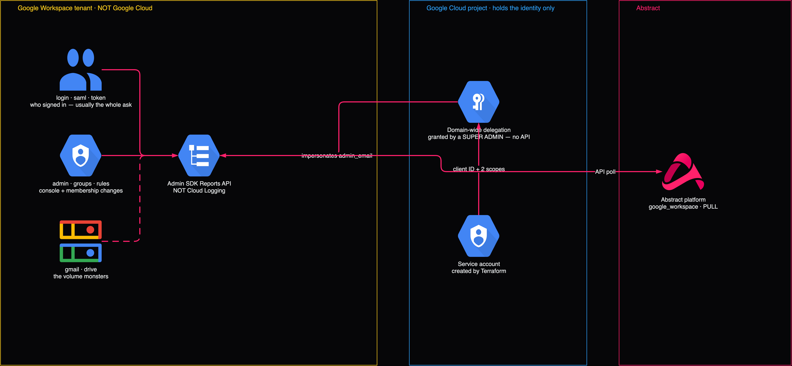

# Google Workspace and Cloud Identity



## Start here, because it decides the whole conversation

> A customer asking for **"GCP identity logs"** almost always means **Workspace sign-ins**.

GCP console and `gcloud` logins **do** appear in Cloud Audit `admin_activity`. Workspace
user authentication does **not**, and no sink filter at any scope will ever produce it.

Settle which they mean on the first call. Otherwise you deliver a working org-wide Pub/Sub
pipeline and they still cannot answer *"who logged in?"* — and that reads as a product
failure rather than a scoping one.

| They said | They probably mean | Path |
|---|---|---|
| "GCP identity logs" | Workspace sign-ins | **This document** |
| "who accessed our cloud console" | GCP console logins | `admin_activity` — already covered by `02-audit-logs-organization` |
| "service account activity" | GCP | `admin_activity` |
| "MFA / SSO / suspicious login" | Workspace | This document |
| "who has access to what" | Both, plus IAM policy state | `admin_activity` + Cloud Asset Inventory |

## Why it is a separate pipeline

Workspace audit data comes from the **Admin SDK Reports API**. It is a poll, not a stream,
and it never touches Cloud Logging. Abstract's `default.google_workspace` integration is
`PULL` with its own auth model.

```
Workspace tenant ── Admin SDK Reports API ──> Abstract (polls, per-application checkpoints)
                          ▲
                          │ impersonates admin_email
                   domain-wide delegation
                          ▲
                          │ client ID + 2 scopes
                   GCP service account   ← the only part Terraform can build
```

---

## The three fields Abstract needs

Verified against the live integration definition, `default.google_workspace.0_1_0`.

| Field | Type | What goes in it |
|---|---|---|
| `admin_email` | text | A Workspace **admin** the service account impersonates |
| `credentials` | file | Service-account JSON key, **under 1 MB** |
| `application_name` | multi-select | Which applications to collect — **each is polled on its own checkpoint** |

`admin_email` is not cosmetic. Domain-wide delegation impersonates a real user; without a
valid subject the Reports API returns **401**, not an empty result.

---

## The 23 applications you can collect

The Google Reports API exposes more streams than this integration collects. Configure only
from the supported list below:

| Surface | Streams | How to confirm |
|---|---|---|
| Google Reports API | **41** | `curl -s 'https://admin.googleapis.com/$discovery/rest?version=reports_v1'` |
| `default.google_workspace.0_1_0` | **23** | `POST /v2/configurations/validate` rejects the rest by name |

`application_name` accepts only these 23. `POST /v2/configurations/validate` returns a
**400** naming any unsupported value, so validate before you create:

```
Unsupported application name(s): 'takeout', 'admin_data_action', 'directory_sync'.
Supported applications are: Access Transparency (access_transparency), Admin (admin),
Calendar (calendar), Chat (chat), Drive (drive), GCP (gcp), Gmail (gmail),
Google+ (gplus), Groups (groups), Groups Enterprise (groups_enterprise),
Jamboard (jamboard), Login (login), Meet (meet), Mobile (mobile), Rules (rules),
SAML (saml), Token (token), User Accounts (user_accounts),
Context-Aware Access (context_aware_access), Chrome (chrome),
Data Studio (data_studio), Keep (keep), Vault (vault).
```

> **Always `/validate` before `create`** — it names the exact field at fault, immediately.


### `identity` — who signed in *(default)*

| App | Signal |
|---|---|
| `login` | **The one people mean.** Successful and failed sign-ins, suspicious-login flags, MFA challenges |
| `saml` | SAML SSO to third-party apps — the lateral path out of Workspace |
| `token` | OAuth token grants to third-party apps. **Consent-phishing lands here**, and nowhere else |
| `user_accounts` | Self-service actions: password change, 2SV enrolment, recovery-detail edits |
| `context_aware_access` | Context-Aware Access allow/deny decisions |

### `admin` — administrative change *(default)*

| App | Signal |
|---|---|
| `admin` | Every Admin console action: role grants, setting changes, user create/suspend/delete |
| `groups` / `groups_enterprise` | Membership change — a group is an access-control object |
| `rules` | Alert-rule and DLP-rule changes, plus rule triggers |

### `data` — high volume, opt in deliberately

| App | Signal | Volume |
|---|---|---|
| `drive` | File create/view/share/download, external-sharing events. Real exfil signal | **Very high** |
| `gmail` | Message events. Not message content | **Very high** |
| `calendar` | Event and sharing changes | Medium |
| `keep` | Notes | Low |
| `vault` | **eDiscovery activity — who searched what.** Very high value, very low volume | Low |

> `gmail` and `drive` dwarf every other application combined on a large tenant. The module
> refuses them without `acknowledge_high_volume = true`. `vault` is the sleeper: tiny
> volume, and an insider running eDiscovery against colleagues is exactly the thing you
> want to see.

### `endpoint`

| App | Signal |
|---|---|
| `chrome` | Managed-browser events, extension installs, unsafe-site warnings |
| `mobile` | Device enrolment, compromise detection, remote wipe |

### `collaboration`

`chat` · `meet` · `jamboard` · `gplus` — sharing and participation events. Usually
compliance rather than detection.

### `platform`

| App | Signal |
|---|---|
| `access_transparency` | **Google-employee access to your data.** Named control in most security questionnaires |
| `gcp` | *Workspace's* view of GCP activity. **Not** a substitute for Cloud Audit Logs |
| `data_studio` | Looker Studio asset access and sharing |

---

## Setup, end to end

### 1. Terraform creates the identity

```bash
cd deployments/04-workspace
cat > terraform.tfvars <<EOF
log_project           = "acme-security-logging"
workspace_admin_email = "admin@acme.com"
workspace_app_groups  = ["identity", "admin"]
EOF
terraform init && terraform apply
```

A **dedicated** service account, deliberately not the Pub/Sub one — domain-wide delegation
is a far broader trust than reading one subscription, and the two must be revocable
independently.

### 2. Read the delegation values

```bash
terraform output workspace_onboarding
```

### 3. Grant delegation — Workspace super admin only

**admin.google.com → Security → Access and data control → API controls →
Domain-wide delegation → Add new**

| Field | Value |
|---|---|
| Client ID | The **numeric** `unique_id` from the output — **not** the service-account email |
| OAuth scopes | `https://www.googleapis.com/auth/admin.reports.audit.readonly,https://www.googleapis.com/auth/admin.reports.usage.readonly` |

Comma-separated, **no spaces**. Both are read-only, and verified against Google's OAuth
scope registry.

> **A GCP Owner cannot do this step.** There is no API and no Terraform provider for
> domain-wide delegation. If the person on the call is a cloud admin rather than a
> Workspace super admin, this is where the deployment stops — find out before scheduling.

### 4. Create the key, out of band

```bash
gcloud iam service-accounts keys create ws-key.json \
  --iam-account="$(terraform output -json workspace_onboarding | jq -r .service_account_email)"
```

Deliberately **not** created by Terraform: it would put a private key in state.

Upload to Abstract with `admin_email` and the application list, then `rm ws-key.json`.

### 5. Verify

```bash
gcloud auth activate-service-account --key-file=ws-key.json
```

Or simply watch for events in Abstract. Delegation can take a few minutes to propagate.

---

## Permissions, precisely

| Who | Needs | Where | Why |
|---|---|---|---|
| Terraform runner | `roles/iam.serviceAccountAdmin` | logging project | Create the service account |
| Terraform runner | `roles/serviceusage.serviceUsageAdmin` | logging project | Enable `admin.googleapis.com` |
| **A human** | **Workspace super admin** | `admin.google.com` | Grant delegation. **No API exists** |
| `admin_email` | A Workspace **admin** role with reporting rights | Workspace | The impersonated subject |
| The service account | *(nothing in GCP IAM)* | — | Its power comes entirely from delegation |

> **The service account holds no Google Cloud permissions at all**, and that is the point
> to understand: its access is granted in Workspace, not in GCP IAM.
>
> The consequence is uncomfortable and worth saying to the customer — **the delegation is
> domain-wide and not project-scoped, so a leaked key reads the entire Workspace audit
> trail regardless of any GCP IAM control.** That changes how the key should be stored.

---

## Troubleshooting

| Symptom | Cause | Fix |
|---|---|---|
| **401 unauthorized** | Delegation not propagated, or `admin_email` is not an admin | Wait a few minutes; confirm the account holds an admin role |
| **403 forbidden** | Scopes in the Admin console do not exactly match | Re-paste both scopes, comma-separated, no spaces |
| **Empty results, no error** | Right auth, wrong applications selected | Check `application_name` |
| **Some apps return data, others nothing** | Normal — each is polled on its own checkpoint, and a quiet app is genuinely quiet | Confirm against the Admin console reports |
| **Volume far above estimate** | `gmail` or `drive` selected | Remove them; measure with `identity` + `admin` first |
| **Cannot find domain-wide delegation** | Signed in as a GCP admin, not a Workspace super admin | Different person |

---

## What this does *not* cover

| Not covered | Why | Path |
|---|---|---|
| **Workspace Alert Center** | Separate API (`alertcenter.googleapis.com`), scope `.../auth/apps.alerts` | Government-backed-attacker warnings, Gmail phishing/malware, DLP alerts. **Not reproducible from Reports API data** — it is a distinct API with its own scope, so it is collected separately from the Reports API streams described here |
| **Cloud Identity device inventory** | `cloudidentity.googleapis.com/v1/devices` | The `mobile`/`chrome` apps give *events*; this gives *inventory* |
| **Gmail message content** | Reports API carries events, never content | Gmail API, with a very different privacy conversation |
| **Vault exports** | Vault API | `vault` here gives eDiscovery *activity*, which is the security-relevant half |
