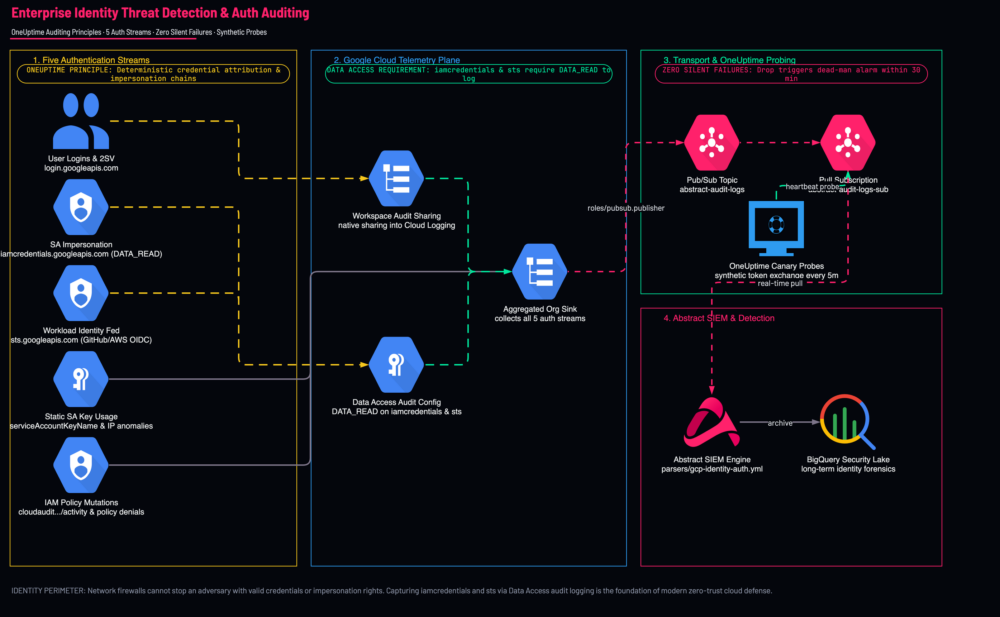
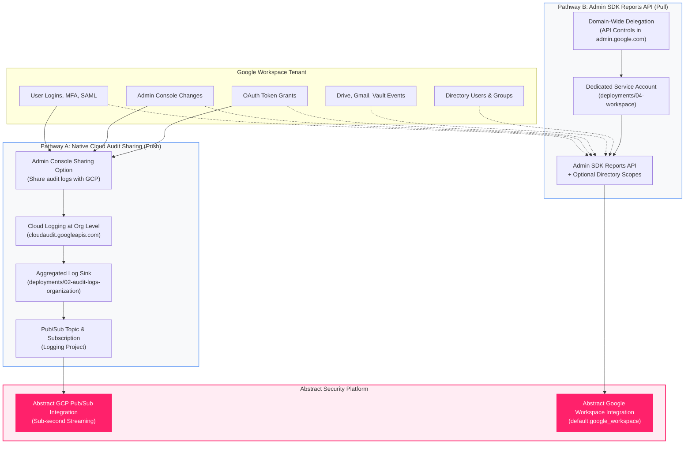

<picture>
  <source media="(prefers-color-scheme: dark)" srcset="../brand/abstract-logo-white.svg">
  
</picture>

# Google Workspace and Cloud Identity Telemetry

<p align="center">
  
</p>

## Start here, because it decides the whole architecture

> A customer asking for **"GCP identity logs"** almost always means **Google Workspace sign-ins**.

GCP console and `gcloud` logins appear in GCP Cloud Audit `admin_activity`. Google Workspace user authentication, however, originates in the Workspace identity control plane.

Google Workspace provides **two distinct ingestion architectures** to export identity and administrative audit telemetry to **Abstract Security**:

1. **Pathway A — Native Cloud Audit Logs Sharing (Real-Time Push Stream)**:
   Configured in `admin.google.com` &rarr; **Account Settings** &rarr; **Legal and compliance** &rarr; **Sharing options** &rarr; **Google Cloud Platform**. Workspace writes audit events directly to Cloud Logging at the Organization level (`organizations/ORG_ID`). From there, an organization-level aggregated sink (`deployments/02-audit-logs-organization`) streams them straight to Cloud Pub/Sub in real time with **zero API polling** and **no domain-wide delegation**.

2. **Pathway B — Admin SDK Reports API with Domain-Wide Delegation (Scheduled Pull Integration)**:
   Deployed via `deployments/04-workspace`. A dedicated GCP Service Account is granted Domain-Wide Delegation in Workspace to poll the Reports API. Use this when native sharing cannot be enabled, or when you need **directory identity enrichment scopes** (`admin.directory.user.readonly`, `admin.directory.group.readonly`) or specific productivity application streams (Drive, Gmail, Vault).

```
┌─────────────────────────────────────────────────────────────────────────────────────────┐
│                                Google Workspace Tenant                                  │
│                                                                                         │
│  [Identity]          [Admin Console]        [OAuth Tokens]         [Drive / Gmail]      │
│  Logins, MFA, SAML   User/Group lifecycle   Third-party app grants File sharing, Vault  │
└────────────────────────────┬──────────────────────────────────────────┬─────────────────┘
                             │                                          │
                 Pathway A:  │ Native Cloud Audit                       │ Pathway B: Admin SDK
                 Real-Time   │ Sharing (Zero Polling)                   │ Reports API (Pull)
                             ▼                                          │ + Domain-Wide Del.
┌────────────────────────────────────────────────────────┐              │
│       Google Cloud Organization (organizations/...)    │              │
│                                                        │              │
│   Cloud Logging: cloudaudit.googleapis.com             │              │
│   (serviceName: login.googleapis.com, admin, saml)     │              │
│                                                        │              │
│   Aggregated Log Sink (02-audit-logs-organization)     │              │
└────────────────────────────┬───────────────────────────┘              │
                             │ Writer Identity                          │
                             ▼                                          │
┌────────────────────────────────────────────────────────┐              │
│         Logging Project (acme-security-logging)        │              │
│                                                        │              │
│   Pub/Sub Topic: abstract-audit-logs                   │              │
│         │                                              │              │
│         ▼                                              │              │
│   Pub/Sub Pull Subscription: abstract-audit-logs-sub   │              │
└────────────────────────────┬───────────────────────────┘              │
                             │ Authenticated Pull                       │ Checkpoint Poll
                             │ (Service Account Key)                    │ (Admin Impersonation)
                             ▼                                          ▼
┌─────────────────────────────────────────────────────────────────────────────────────────┐
│                                Abstract Security Platform                               │
│                                                                                         │
│   GCP Pub/Sub Integration (Real-Time)   OR   Workspace Integration (default.workspace)  │
└─────────────────────────────────────────────────────────────────────────────────────────┘
```



---

## Architectural Comparison: Pathway A vs Pathway B

| Capability / Attribute | Pathway A: Native Cloud Audit Sharing | Pathway B: Admin SDK Reports API |
|---|---|---|
| **Mechanism** | Real-time push stream into Google Cloud Logging | Scheduled API polling with per-application checkpoints |
| **Delivery Latency** | **Sub-second to 5 seconds** | **5 to 15 minutes** (polling interval) |
| **GCP Terraform Deployment** | `deployments/02-audit-logs-organization` | `deployments/04-workspace` |
| **Abstract Integration** | Abstract **Google Cloud Pub/Sub** Integration | Abstract **Google Workspace** Integration (`default.google_workspace`) |
| **Authentication Model** | Project-scoped Service Account pulling from Pub/Sub | GCP Service Account with **Domain-Wide Delegation** |
| **Workspace Super Admin Action** | Enable toggle in Admin Console (one click) | Add Client ID and authorize OAuth scopes in API Controls |
| **Credential in SIEM** | Pub/Sub subscriber key (strictly project-scoped) | Delegated key (tenant-wide read scope across authorized APIs) |
| **Telemetry Covered** | Login, Admin, SAML, Token, Groups, Rules, CAA | All 23 Workspace apps (Drive, Gmail, Vault, Chrome, etc.) |
| **Directory Enrichment** | ❌ No directory enrichment (audit payload only) | ✅ **Yes** (`admin.directory.user.readonly` / `group.readonly`) |
| **Quota & Rate Limits** | **Zero quota consumption** | Subject to Reports API quota limits |

---

## The three fields Abstract needs for Pathway B

Verified against the live integration definition, `default.google_workspace.0_1_0`.

| Field | Type | What goes in it |
|---|---|---|
| `admin_email` | text | A Workspace **admin** the service account impersonates |
| `credentials` | file | Service-account JSON key, **under 1 MB** |
| `application_name` | multi-select | Which applications to collect — **each is polled on its own checkpoint** |

`admin_email` is not cosmetic. Domain-wide delegation impersonates a real user; without a
valid subject the Reports API returns **401**, not an empty result.

---

## Directory Enrichment Scopes (`include_directory_enrichment_scopes = true`)

When directory enrichment is enabled, the service account receives:
* `https://www.googleapis.com/auth/admin.directory.user.readonly`
* `https://www.googleapis.com/auth/admin.directory.group.readonly`

### Why Directory Enrichment Matters
* **User Identity Context**: Enriches events with department, job title, manager, employee ID, and organizational unit.
* **Risk & UEBA Scoring**: Enables detecting behavioral anomalies (e.g., finance user accessing developer infrastructure).
* **Group Affiliation**: Maps dynamic and nested group memberships to detect privilege escalation.

---

## The 23 applications you can collect via Pathway B

The Google Reports API exposes more streams than this integration collects. Configure only
from the supported list below:

| Surface | Streams | How to confirm |
|---|---|---|
| Google Reports API | **41** | `curl -s 'https://admin.googleapis.com/$discovery/rest?version=reports_v1'` |
| `default.google_workspace.0_1_0` | **23** | `POST /v2/configurations/validate` rejects the rest by name |

`application_name` accepts only these 23. `POST /v2/configurations/validate` returns a
**400** naming any unsupported value, so validate before you create:

```
Unsupported application name(s): 'takeout', 'admin_data_action', 'directory_sync'.
Supported applications are: Access Transparency (access_transparency), Admin (admin),
Calendar (calendar), Chat (chat), Drive (drive), GCP (gcp), Gmail (gmail),
Google+ (gplus), Groups (groups), Groups Enterprise (groups_enterprise),
Jamboard (jamboard), Login (login), Meet (meet), Mobile (mobile), Rules (rules),
SAML (saml), Token (token), User Accounts (user_accounts),
Context-Aware Access (context_aware_access), Chrome (chrome),
Data Studio (data_studio), Keep (keep), Vault (vault).
```

### `identity` — who signed in *(default)*

| App | Signal |
|---|---|
| `login` | **The one people mean.** Successful and failed sign-ins, suspicious-login flags, MFA challenges |
| `saml` | SAML SSO to third-party apps — the lateral path out of Workspace |
| `token` | OAuth token grants to third-party apps. **Consent-phishing lands here**, and nowhere else |
| `user_accounts` | Self-service actions: password change, 2SV enrolment, recovery-detail edits |
| `context_aware_access` | Context-Aware Access allow/deny decisions |

### `admin` — administrative change *(default)*

| App | Signal |
|---|---|
| `admin` | Every Admin console action: role grants, setting changes, user create/suspend/delete |
| `groups` / `groups_enterprise` | Membership change — a group is an access-control object |
| `rules` | Alert-rule and DLP-rule changes, plus rule triggers |

### `data` — high volume, opt in deliberately

| App | Signal | Volume |
|---|---|---|
| `drive` | File create/view/share/download, external-sharing events. Real exfil signal | **Very high** |
| `gmail` | Message events. Not message content | **Very high** |
| `calendar` | Event and sharing changes | Medium |
| `keep` | Notes | Low |
| `vault` | **eDiscovery activity — who searched what.** Very high value, very low volume | Low |

> `gmail` and `drive` dwarf every other application combined on a large tenant. The module
> refuses them without `acknowledge_high_volume = true`. `vault` is the sleeper: tiny
> volume, and an insider running eDiscovery against colleagues is exactly the thing you
> want to see.

### `endpoint`

| App | Signal |
|---|---|
| `chrome` | Managed-browser events, extension installs, unsafe-site warnings |
| `mobile` | Device enrolment, compromise detection, remote wipe |

### `collaboration`

`chat` · `meet` · `jamboard` · `gplus` — sharing and participation events. Usually
compliance rather than detection.

### `platform`

| App | Signal |
|---|---|
| `access_transparency` | **Google-employee access to your data.** Named control in most security questionnaires |
| `gcp` | *Workspace's* view of GCP activity. **Not** a substitute for Cloud Audit Logs |
| `data_studio` | Looker Studio asset access and sharing |

---

## Setup, end to end (Pathway B)

### 1. Terraform creates the identity

```bash
cd deployments/04-workspace
cat > terraform.tfvars <<EOF
log_project                         = "acme-security-logging"
workspace_admin_email               = "admin@acme.com"
workspace_app_groups                = ["identity", "admin"]
include_directory_enrichment_scopes = true
EOF
tofu init && tofu apply
```

A **dedicated** service account, deliberately not the Pub/Sub one — domain-wide delegation
is a far broader trust than reading one subscription, and the two must be revocable
independently.

### 2. Read the delegation values

```bash
tofu output workspace_onboarding
```

### 3. Grant delegation — Workspace super admin only

**admin.google.com → Security → Access and data control → API controls →
Domain-wide delegation → Add new**

| Field | Value |
|---|---|
| Client ID | The **numeric** `unique_id` from the output — **not** the service-account email |
| OAuth scopes | `https://www.googleapis.com/auth/admin.reports.audit.readonly,https://www.googleapis.com/auth/admin.reports.usage.readonly,https://www.googleapis.com/auth/admin.directory.user.readonly,https://www.googleapis.com/auth/admin.directory.group.readonly` |

Comma-separated, **no spaces**. All are read-only, and verified against Google's OAuth
scope registry.

> **A GCP Owner cannot do this step.** There is no API and no Terraform provider for
> domain-wide delegation. If the person on the call is a cloud admin rather than a
> Workspace super admin, this is where the deployment stops — find out before scheduling.

### 4. Create the key, out of band

```bash
gcloud iam service-accounts keys create ws-key.json \
  --iam-account="$(tofu output -json workspace_onboarding | jq -r .service_account_email)" \
  --project="acme-security-logging"
```

Deliberately **not** created by Terraform: it would put a private key in state.

Upload to Abstract with `admin_email` and the application list, then `rm ws-key.json`.

### 5. Verify

```bash
gcloud auth activate-service-account --key-file=ws-key.json
```

Or simply watch for events in Abstract. Delegation can take a few minutes to propagate.

---

## Permissions, precisely

| Who | Needs | Where | Why |
|---|---|---|---|
| Terraform runner | `roles/iam.serviceAccountAdmin` | logging project | Create the service account |
| Terraform runner | `roles/serviceusage.serviceUsageAdmin` | logging project | Enable `admin.googleapis.com` |
| **A human** | **Workspace super admin** | `admin.google.com` | Grant delegation. **No API exists** |
| `admin_email` | A Workspace **admin** role with reporting rights | Workspace | The impersonated subject |
| The service account | *(nothing in GCP IAM)* | — | Its power comes entirely from delegation |

> **The service account holds no Google Cloud permissions at all**, and that is the point
> to understand: its access is granted in Workspace, not in GCP IAM.
>
> The consequence is uncomfortable and worth saying to the customer — **the delegation is
> domain-wide and not project-scoped, so a leaked key reads the entire Workspace audit
> trail regardless of any GCP IAM control.** That changes how the key should be stored.

---

## Troubleshooting

| Symptom | Cause | Fix |
|---|---|---|
| **401 unauthorized** | Delegation not propagated, or `admin_email` is not an admin | Wait a few minutes; confirm the account holds an admin role |
| **403 forbidden** | Scopes in the Admin console do not exactly match | Re-paste all scopes, comma-separated, no spaces |
| **Empty results, no error** | Right auth, wrong applications selected | Check `application_name` |
| **Some apps return data, others nothing** | Normal — each is polled on its own checkpoint, and a quiet app is genuinely quiet | Confirm against the Admin console reports |
| **Volume far above estimate** | `gmail` or `drive` selected | Remove them; measure with `identity` + `admin` first |
| **Cannot find domain-wide delegation** | Signed in as a GCP admin, not a Workspace super admin | Coordinate with the Workspace Super Administrator |

> [!CAUTION]
> ### Deep Troubleshooting Callout: Pathway A Silent Drop
> If you selected Pathway A (Native Audit Sharing), logs route through the Organization Aggregated Sink (`02-audit-logs-organization`).
> If the destination topic is missing the IAM binding for the sink's `writerIdentity`, **Workspace login events are silently dropped by Google Cloud Logging**.
>
> **Verify in Cloud Logging**:
> ```bash
> gcloud logging read 'protoPayload.serviceName:"login.googleapis.com"' \
>   --organization="$ORG_ID" --limit=3 --freshness=1h \
>   --format="table(timestamp,protoPayload.authenticationInfo.principalEmail,protoPayload.methodName)"
> ```
> If logs exist in Cloud Logging but do not reach Abstract, check the topic's IAM policy for `roles/pubsub.publisher` bound to the sink writer identity. See [Troubleshooting Guide: Step 3](TROUBLESHOOTING-GUIDE.md#step-3-sink-writer-identity--pubsub-topic-permissions-the-1-silent-failure-trap).

> [!WARNING]
> ### Deep Troubleshooting Callout: Pathway B Quota Limits
> The Admin SDK Reports API enforces rate limits:
> - **1,500 requests per 100 seconds per project**
> - **250 requests per 100 seconds per user**
>
> If collecting high-frequency applications (`drive`, `gmail`) on a large tenant, API polling can exhaust quotas and return HTTP 429 Too Many Requests. Restrict collections to `identity` and `admin` app groups initially, and use exponential backoff on checkpoints.

---

## What this does *not* cover

| Not covered | Why | Path |
|---|---|---|
| **Workspace Alert Center** | Separate API (`alertcenter.googleapis.com`), scope `.../auth/apps.alerts` | Government-backed-attacker warnings, Gmail phishing/malware, DLP alerts. **Not reproducible from Reports API data** — it is a distinct API with its own scope, so it is collected separately from the Reports API streams described here |
| **Cloud Identity device inventory** | `cloudidentity.googleapis.com/v1/devices` | The `mobile`/`chrome` apps give *events*; this gives *inventory* |
| **Gmail message content** | Reports API carries events, never content | Gmail API, with a very different privacy conversation |
| **Vault exports** | Vault API | `vault` here gives eDiscovery *activity*, which is the security-relevant half |

---

## Related Documentation & Visual Models

* 📘 **Master Telemetry Reference**: [Master GCP Telemetry Dataflow Reference](DATAFLOW-AND-ARCHITECTURE-REFERENCE.md)
* 🛠️ **Troubleshooting Runbooks**: [Master Troubleshooting Guide](TROUBLESHOOTING-GUIDE.md)
* 🔐 **Identity Threat Detection**: [Enterprise Identity & Authentication Guide](IDENTITY-AND-AUTHENTICATION-GUIDE.md)
* 🌐 **Interactive Diagram Viewer**: [Architecture Explorer Web UI](architecture-explorer.html)
* 🎨 **Interactive Draw.io Launcher**: `./scripts/open-diagram.sh 04-identity-auth-oneuptime`
