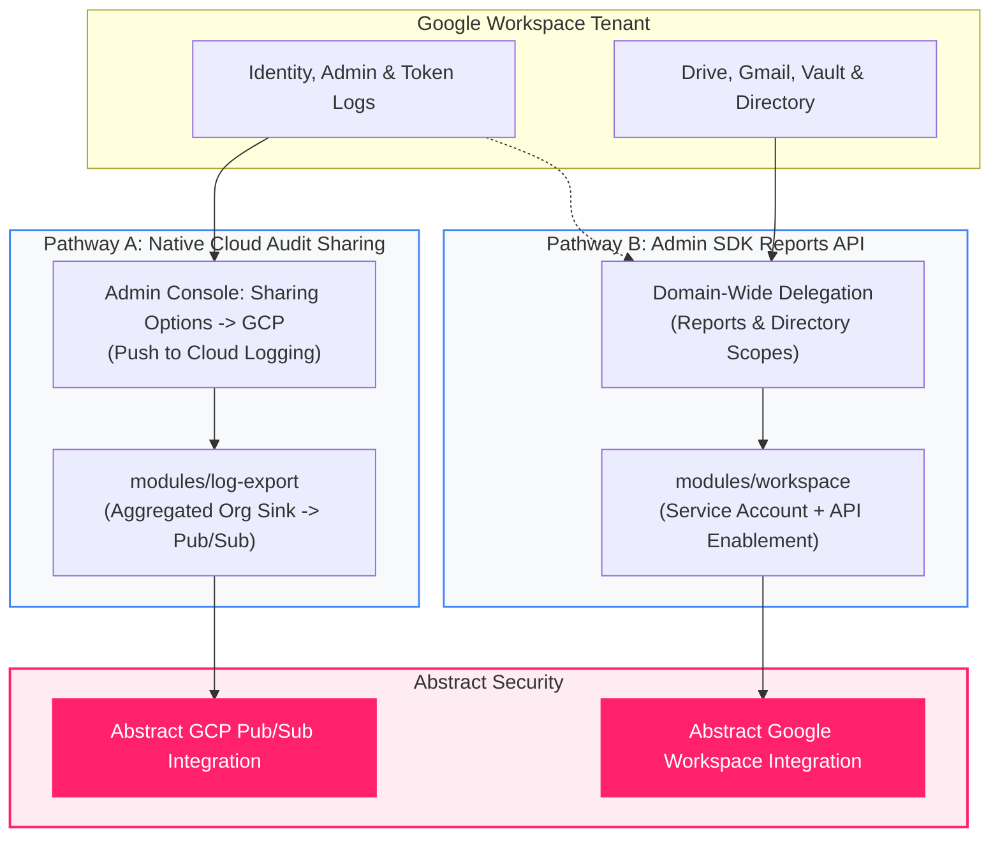

<picture>
  <source media="(prefers-color-scheme: dark)" srcset="../../brand/abstract-logo-white.svg">
  
</picture>

# `workspace`

Reference for this module.

You normally do not call these modules directly. Use a deployment root in
[`deployments/04-workspace`](../../deployments/04-workspace/), which wires the modules together and carries a Cloud
Shell button.

---

## Overview: Two Google Workspace Ingestion Pathways

Google Workspace security telemetry can be ingested into **Abstract Security** through two distinct pathways:

```
┌─────────────────────────────────────────────────────────────────────────────┐
│                            Google Workspace Tenant                          │
│                                                                             │
│  [Identity Events]    [Admin Audits]    [OAuth Tokens]    [Drive / Gmail]   │
└───────────────────────┬───────────────────────────────────┬─────────────────┘
                        │                                   │
          Pathway A:    │ Native Cloud Audit                │ Pathway B: Admin SDK
          Push Stream   │ Sharing (Zero Polling)            │ Reports API (Pull)
                        ▼                                   │ + Domain-Wide Del.
┌───────────────────────────────────────────────────┐       │
│  GCP Organization Cloud Logging                   │       │
│  (Aggregated Sink -> Pub/Sub -> Abstract)         │       │
│  * Handled via modules/log-export                 │       │
└───────────────────────────────────────────────────┘       │
                                                            ▼
                                        ┌─────────────────────────────────────┐
                                        │  Dedicated Connector Identity       │
                                        │  * Handled via modules/workspace    │
                                        │  (Service Account + DWD Scopes)     │
                                        │  -> Abstract default.google_workspace│
                                        └─────────────────────────────────────┘
```



### When to use this module (`modules/workspace`):
Use this module for **Pathway B (Admin SDK Reports API)**:
1. When **Native Sharing is disabled** or cannot be turned on across organizational boundaries.
2. When **Directory enrichment scopes** (`admin.directory.user.readonly`, `admin.directory.group.readonly`) are needed to correlate user identity metadata (department, title, manager, group memberships).
3. When **Application streams outside Cloud Audit Logs** (Google Drive file sharing, Gmail logs, Vault eDiscovery audits) are required.

For **Pathway A (Native Cloud Audit Sharing)**, audit logs are delivered directly to Cloud Logging at the Organization level and exported via `modules/log-export` (`deployments/02-audit-logs-organization`).

---

<!-- BEGIN_TF_DOCS -->
## Requirements

| Name | Version |
| ---- | ------- |
| <a name="requirement_terraform"></a> [terraform](#requirement\_terraform) | >= 1.5 |
| <a name="requirement_google"></a> [google](#requirement\_google) | ~> 6.0 |

## Providers

| Name | Version |
| ---- | ------- |
| <a name="provider_google"></a> [google](#provider\_google) | ~> 6.0 |
| <a name="provider_terraform"></a> [terraform](#provider\_terraform) | n/a |

## Modules

No modules.

## Resources

| Name | Type |
| ---- | ---- |
| [google_project_service.admin_sdk](https://registry.terraform.io/providers/hashicorp/google/latest/docs/resources/project_service) | resource |
| [google_service_account.workspace](https://registry.terraform.io/providers/hashicorp/google/latest/docs/resources/service_account) | resource |
| [terraform_data.validate_workspace](https://registry.terraform.io/providers/hashicorp/terraform/latest/docs/resources/data) | resource |

## Inputs

| Name | Description | Type | Default | Required |
| ---- | ----------- | ---- | ------- | :------: |
| <a name="input_acknowledge_high_volume"></a> [acknowledge\_high\_volume](#input\_acknowledge\_high\_volume) | Required to include gmail or drive — on a large tenant they dwarf every other application combined. | `bool` | `false` | no |
| <a name="input_enable_workspace"></a> [enable\_workspace](#input\_enable\_workspace) | Set up the Google Workspace Admin SDK Reports API integration (Pathway B).<br/><br/>Google Workspace supports two ingestion architectures:<br/>  Pathway A (Native Cloud Audit Sharing): Configured in admin.google.com -> Account Settings<br/>    -> Legal and compliance -> Sharing options -> Google Cloud Platform. Writes audit logs<br/>    directly to Cloud Logging at the Organization level, streaming real-time to Pub/Sub via<br/>    modules/log-export with zero polling.<br/>  Pathway B (Admin SDK Reports API): Used when native sharing is disabled, or when directory<br/>    enrichment scopes (admin.directory.user.readonly, admin.directory.group.readonly) or<br/>    application-specific streams (Drive, Gmail, Vault) are needed.<br/><br/>This module provisions the dedicated GCP service account for Pathway B and emits the exact<br/>client ID, OAuth scopes, and Abstract onboarding values. Domain-wide delegation itself must<br/>be granted by a Workspace SUPER ADMIN in admin.google.com -- there is no API for it. | `bool` | `false` | no |
| <a name="input_include_directory_enrichment_scopes"></a> [include\_directory\_enrichment\_scopes](#input\_include\_directory\_enrichment\_scopes) | Include Admin SDK Directory API scopes (admin.directory.user.readonly, admin.directory.group.readonly) for user identity and group enrichment (department, manager, org unit, group membership). | `bool` | `false` | no |
| <a name="input_log_project"></a> [log\_project](#input\_log\_project) | Project owning the connector service account and the Admin SDK API enablement. | `string` | n/a | yes |
| <a name="input_workspace_admin_email"></a> [workspace\_admin\_email](#input\_workspace\_admin\_email) | A Google Workspace ADMIN user the service account impersonates. Domain-wide delegation acts as a real user; without a subject the Reports API returns 401. Goes into Abstract's Admin Email field. | `string` | `""` | no |
| <a name="input_workspace_app_groups"></a> [workspace\_app\_groups](#input\_workspace\_app\_groups) | Which Workspace applications to collect, by group. Individual application names also<br/>work here.<br/><br/>  identity      login, saml, token, user\_accounts, context\_aware\_access<br/>                -- the answer to "who signed in", and what most customers actually mean<br/>  admin         admin, groups, groups\_enterprise, rules<br/>  data          drive, gmail, calendar, keep, vault  -- gmail and drive are the volume monsters<br/>  endpoint      chrome, mobile<br/>  collaboration chat, meet, jamboard, gplus<br/>  platform      access\_transparency, gcp, data\_studio<br/><br/>Default is identity + admin: the high-signal control-plane set. | `list(string)` | <pre>[<br/>  "identity",<br/>  "admin"<br/>]</pre> | no |
| <a name="input_workspace_applications"></a> [workspace\_applications](#input\_workspace\_applications) | Explicit application list, overriding workspace\_app\_groups. Valid: access\_transparency, admin, calendar, chat, chrome, context\_aware\_access, data\_studio, drive, gcp, gmail, gplus, groups, groups\_enterprise, jamboard, keep, login, meet, mobile, rules, saml, token, user\_accounts, vault | `list(string)` | `[]` | no |
| <a name="input_workspace_service_account_id"></a> [workspace\_service\_account\_id](#input\_workspace\_service\_account\_id) | Account ID for the Workspace connector service account. Deliberately separate from the Pub/Sub one -- domain-wide delegation is a much broader trust and should be revocable on its own. | `string` | `"abstract-workspace-reader"` | no |

## Outputs

| Name | Description |
| ---- | ----------- |
| <a name="output_workspace_applications_selected"></a> [workspace\_applications\_selected](#output\_workspace\_applications\_selected) | Resolved Workspace applications after group expansion. |
| <a name="output_workspace_onboarding"></a> [workspace\_onboarding](#output\_workspace\_onboarding) | Everything needed to finish the Google Workspace integration — the delegation values for the Admin console, and the field values for Abstract. |
<!-- END_TF_DOCS -->